# Turn the Workbench into a persistent app shell and fix the 2026-09-30 design review findings

This ExecPlan is a living document. The sections `Progress`, `Surprises & Discoveries`, `Decision Log`, and `Outcomes & Retrospective` must be kept up to date as work proceeds. It is maintained in accordance with `.agent/PLANS.md` at the repository root; read that file before changing this one.

This plan is long on purpose. It is written for a developer who has never seen this repository. Every milestone can be delivered, tested and committed on its own, and the milestones are ordered so that the least risky, most visible fixes land first and the architectural change (client-side navigation) lands on top of them.

## Purpose / Big Picture

The RDF4J Workbench is the browser user interface that ships with RDF4J Server. A user opens it at a URL such as `http://localhost:8080/rdf4j-workbench`, picks a server and a repository (a named RDF database on that server), and then runs SPARQL queries, browses resources, loads data, and administers repositories. On branch `GH-6071-workbench-redesign` the Workbench received a complete visual redesign. A design review on 2026-09-30 found that the redesign looks consistent but still has problems that users will feel every day: query results trap the mouse wheel inside a small inner scroll box, table columns break words in half, the Explore page is hard to read, there is no keyboard shortcut to run a query, destructive pages (Clear, Remove, Delete, Namespaces) are easy to misuse, two different navigation menus exist, and an unknown repository shows an unstyled server error page. The review also proposed turning the Workbench into a persistent application shell: the header and menu stay on screen while only the page area changes, new pages load in the background while the old page stays usable, and the swap happens in one step.

After this plan is complete a user can do the following, none of which works today. They can scroll a long query result with the normal page scroll while the column headings stay pinned. They can press Cmd+Enter (macOS) or Ctrl+Enter (other systems) in the query editor to run the query. They can read Explore output with prefixed names such as `rdf:type` instead of wrapped full IRIs, split into outgoing and incoming statements. They can switch repository from a compact context bar at the top of every page. They get a confirmation dialog that names the number of statements before anything is cleared or removed. They see a styled "Repository not found" page for a bad repository id. And they can click between Workbench pages without the browser reloading the document: the header and menu never flash, the previous page stays visible until the next one is ready, the address bar shows normal URLs, and Back/Forward work.

To see it working, build and start the Workbench as described in `Concrete Steps`, open `http://127.0.0.1:18090/rdf4j-workbench/repositories/bsbm/query`, run a query with Cmd/Ctrl+Enter, scroll the results with the page, click "Explore" in the menu and observe in the browser developer tools Network panel that no new HTML document was requested.

## Progress

Each item below is small enough to finish and commit on its own. Keep exactly one item marked `(in progress)` while working. Add a UTC timestamp when an item is completed.

- [x] (2026-09-30 21:00Z) Design review performed against a local build; findings recorded in `Surprises & Discoveries`.
- [x] (2026-09-30 23:55Z) Plan, mockups and helper scripts written (`design/workbench-app-shell-plan-20260930/`).
- [x] (2026-10-01) Plan revised after an independent review of its references against the code.
- [x] (2026-10-01 04:36Z) M0.1 Start a preview server on port 18090 and seed the `bsbm` review repository (a second development preview runs on 18091; see `Surprises & Discoveries`).
- [x] (2026-10-01 04:42Z) M0.2 Record the baseline of the unit tests, the coverage gate and the Java tests (completed; the full Chromium browser-suite baseline is recorded separately below).
- [x] (2026-10-01 04:45Z) M0.3 Confirm the in-flight column-width and dark-mode plans are committed, and have this plan and its design folder committed.
- [x] (2026-10-01 05:52Z) M0.4 Record the full Chromium browser-suite baseline: 159 passed, 139 failed, 1 skipped in 1.2 hours (list in `initial-evidence.txt` and `logs/m0-browser-baseline-failures.txt`).
- [x] (2026-10-01 04:45Z) M1.1 Result headings show variable names exactly.
- [x] (2026-10-01 04:59Z) M1.2 Stop loading `styles/default/screen.css`.
- [x] (2026-10-01 05:05Z) M1.3 Four button variants (plus `--danger-outline`; see the Decision Log).
- [x] (2026-10-01 05:08Z) M1.4 One heading scale and a key/value component.
- [x] (2026-10-01 05:12Z) M1.5 One content width and flatter containers (the Remove and Clear warnings now sit inside their form card).
- [x] (2026-10-01 05:15Z) M1.6 One form layout (Remove and Clear use `.workbench-field-stack`; the create forms keep their stacked `table.dataentry` markup, which `create.ts` reads).
- [x] (2026-10-01 05:17Z) M1.7 Callouts (Lit helper `callout()` in `workbenchViews.ts`, DOM helper `workbench.createCallout(document, kind, body, title?)`; page error messages on Remove, Clear, Add, Explore and Namespaces use the error variant).
- [x] (2026-10-01 05:21Z) M1.8 Visible editor overlay icons and formatted numbers.
- [x] (2026-10-01 05:26Z) M2.1 One navigation model everywhere.
- [x] (2026-10-01 05:36Z) M2.2 Split the shell from the page outlet (behavior-neutral refactor).
- [x] (2026-10-01 05:47Z) M2.3 A compact context bar with switchers (mockups 01 and 04).
- [x] (2026-10-01 05:58Z) M2.4 Regroup the menu and make it sticky.
- [x] (2026-10-01 06:00Z) M2.5 Dark-mode logo (`design/workbench-app-shell-plan-20260930/make-dark-logos.cjs` recolored 2,026 and 2,213 pixels).
- [x] (2026-10-01 06:03Z) M2.6 Page titles.
- [x] (2026-10-01 06:10Z) M2.7 An in-shell "not found" page (mockup 13).
- [x] (2026-10-01 06:18Z) M2.8 A compact mobile header and a menu sheet (mockup 14).
- [x] (2026-10-01 09:57Z) M2.9 (added after the end-of-M2 suite run) Fix the regressions that run found and update the specs that assert removed designs.
- [x] (2026-10-01 06:27Z) M3.1 Cmd/Ctrl+Enter runs the query.
- [x] (2026-10-01 06:41Z) M3.2 The editor grows with its content, can be resized, and results come into view (the 12-visible-rows check moved to M4.2; see the Decision Log).
- [x] (2026-10-01 09:30Z) M3.3 Results and Explanation become tabs of one card; the Execute row never moves (controls of the active tab sit in the first row of its panel; see the Decision Log).
- [x] (2026-10-01 10:15Z) M3.4 Clear names, units, and no silent "Clear".
- [x] (2026-10-01 10:37Z) M3.5 One status line and designed result states (mockup 02).
- [x] (2026-10-01 06:41Z) M3.6 The Update editor fills its box (done together with M3.2, because removing the generic 300px editor minimum exposed it).
- [x] (2026-10-01 10:56Z) M4.1 Results scroll with the page, with a pinned header; full screen fills the screen.
- [x] (2026-10-01 12:07Z) M4.2 Column sizing without mid-word breaks (includes the "12 rows visible" check moved from M3.2).
- [x] (2026-10-01 13:25Z) M4.3 Literal, IRI and heading rendering.
- [x] (2026-10-01 13:25Z) M4.4 Mobile records do not clip and use the same labels.
- [x] (2026-10-01 13:47Z) M5.1 Explore (mockup 05).
- [x] (2026-10-01 15:47Z) M5.2 Types and Graphs (mockup 06).
- [x] (2026-10-01 15:47Z) M5.3 Repository list (mockup 12, right).
- [x] (2026-10-01 15:47Z) M5.4 Summary and Information (mockup 12, left).
- [x] (2026-10-01 15:47Z) M5.5 Add RDF and Export.
- [x] (2026-10-01 15:47Z) M5.6 Saved queries details.
- [x] (2026-10-01 15:51Z) M6.1 Show server-side errors on Clear, Remove and Update.
- [x] (2026-10-01 16:00Z) M6.2 A confirmation dialog component.
- [x] (2026-10-01 16:14Z) M6.3 Namespaces (mockup 07).
- [ ] M6.4 (in progress) Clear (mockup 08).
- [ ] M6.5 Remove with a live match count (mockup 09, left).
- [ ] M6.6 Delete repository (mockup 09, right).
- [ ] M7.1 The lifecycle contract and route registry.
- [ ] M7.2 Convert the simple routes.
- [ ] M8.1 Link interception, preload, abort and commit.
- [ ] M8.2 Scroll, focus and announcements.
- [ ] M8.3 Shell refresh on context changes.
- [ ] M9.1 Make Query, Update and Saved queries disposable.
- [ ] M9.2 Leaving while a query is running.
- [ ] M10.1 Submit forms without reloading the document.
- [ ] M10.2 Saved-query Edit opens the Query page in place.
- [ ] M11.1 Load the graph renderer only when needed.
- [ ] M11.2 Prefetch route code.
- [ ] M11.3 Keep the Query route alive.
- [ ] M12.1 Migrate tests that assumed full page loads.
- [ ] M12.2 Final review and retrospective.

## Surprises & Discoveries

These observations come from the 2026-09-30 review of a local build (`tools/server-boot` jar started on port 18090 with a memory repository `bsbm` holding 43,685 statements from `testsuites/sparql/src/main/resources/testcases-sparql-1.1/bsbm/bsbm-100.ttl` and `core/spin/src/main/resources/schema/spl.spin.ttl`). Add new observations below them as implementation proceeds.

- Observation: query results render inside an inner scroll container with a fixed height, and the container starts below the fold. Scrolling with the mouse over the visible part scrolls the inner box, not the page.
  Evidence: at 1440x900 after running `SELECT * WHERE { ?s ?p ?o } LIMIT 400`, the element `div.query-result-table-wrap` measured `clientHeight=630`, `scrollHeight=15104`, its table started at `y=782`, and after a 2000px wheel event over it `window.scrollY` stayed `0` while the rows moved.
- Observation: full-screen result mode keeps the same 630px table height and leaves empty space below it.
  Evidence: in full screen, `wrapCH=630`, 13 rendered rows each 76px tall, blank area under the last row.
- Observation: short variable names produce very narrow columns and words break in the middle.
  Evidence: `SELECT * WHERE { ?s ?p ?o }` rendered `rdfs:labe` / `l` on two lines; Explore rendered the header `Context` as `Conte` / `xt` and subject IRIs over seven lines.
- Observation: result column headings are title-cased by an old stylesheet rule, so `?num1` is shown as `Num1` and `?x_y` as `X_y`.
  Evidence: computed style of `table.data th` is `text-transform: capitalize`, coming from `tools/workbench/src/main/webapp/styles/default/screen.css` rule `.data th`.
- Observation: Explore shows full IRIs while query results show prefixed names such as `rdf:type` and `bsbm-inst:ProductType1`.
  Evidence: screenshots of `/repositories/bsbm/explore?resource=<...Product1>` versus `/repositories/bsbm/query` results with the same data.
- Observation: neither Cmd+Enter nor Ctrl+Enter in the query editor starts a query.
  Evidence: a Playwright probe focused the editor, pressed both chords, and saw no request and no result.
- Observation: `/repositories/NONE/server` renders a different menu (groups "Browse" and "Query", labels "SPARQL Update", "Create", "Delete") and its header shows `Server: None` while a server is connected; every other page shows groups "Explore"/"Modify".
  Evidence: `defaultMenu` in `tools/workbench/src/main/webapp/scripts/ts/workbenchViews.ts` contains exactly the "Browse"/"Query" grouping.
- Observation: an unknown repository id returns Spring Boot's unstyled "Whitelabel Error Page" with HTTP 500.
  Evidence: `GET /rdf4j-workbench/repositories/nope/summary` logged `BadRequestException: No such repository: nope` and returned the whitelabel page (Spring Boot runner; a servlet container would show its own unstyled page).
- Observation: every tab title is "RDF4J Workbench".
  Evidence: `document.title` on query, summary, types and repositories pages.
- Observation: the server returns an 839-byte HTML "shell" for every Workbench URL; all visible content is rendered in the browser from a streamed page model. This is why client-side navigation is cheap to add.
  Evidence: `curl -H 'Accept: text/html' .../repositories/bsbm/summary` returns only `
` plus stylesheet and script tags.
- Observation: the Query page loads twelve classic scripts in sequence, including `scripts/viz/full.render.js` (1,979,770 bytes), which is only needed when an explanation is shown as a graph.
  Evidence: `routeScripts('query')` in `scripts/ts/workbenchApp.ts`; `ls -la tools/workbench/src/main/webapp/scripts/viz/`.
- Observation: two other ExecPlans were in progress on 2026-09-30 and touch the same files: `.agent/execplans/workbench-query-column-widths-20260930.md` (locks result column widths from the first ten rows in `QueryResultRenderer` in `queryStream.ts`) and `.agent/execplans/workbench-dark-mode-refresh-flash.md` (early theme script in `WorkbenchHtmlShell.java`).
  Evidence: `git status` showed uncommitted edits to `queryStream.ts`, `workbenchApp.ts`, `WorkbenchHtmlShell.java`, `query.css` and `workbench-refresh.css`.
- Observation: YASQE's default key map binds Ctrl-Enter and Cmd-Enter to `YASQE.executeQuery`, and its `sparql.endpoint` option still has the library default `http://dbpedia.org/sparql`; Ctrl/Cmd-S is bound to `YASQE.storeQuery`. No request was observed when pressing the chords, but the configuration must not point at a third-party endpoint.
  Evidence: `cm.options.sparql.endpoint` read in the page returned `http://dbpedia.org/sparql`; `scripts/yasqe.js` default key map around lines 7412 to 7445.
- Observation: the query result table's 70vh cap is an inline style set by `QueryResultRenderer`'s constructor (`tableWrap.style.maxHeight = '70vh'`), and the same applies to the mobile records container; full screen does not remove it.
  Evidence: `scripts/ts/queryStream.ts`, constructor of `QueryResultRenderer`.
- Observation: the Query page's "Clear" button only empties the editor: its confirmation text lacks a space ("replaceit") and the namespace reload looks for an element no template renders.
  Evidence: `resetNamespaces()` and `loadNamespaces()` in `scripts/ts/query.ts`.
- Observation: Explore's "Show datatypes" checkbox has no effect, and its label/comment heading can come from rows where the explored resource is the object.
  Evidence: `scripts/ts/paging.ts` looks for `div.resource[data-longform]`, which the renderer never emits; `consumeExploreRows()` does not check the subject.
- Observation: the Namespaces form is pre-filled from the first table row, its buttons have no `name`, and `NamespacesServlet.doPost` throws a `NullPointerException` when `namespace` is missing.
  Evidence: `pageValue()` falls back to `firstRecord(model)` in `workbenchViews.ts`; `NamespacesServlet.java` `doPost`.
- Observation: `create.ts` `checkOverwrite()` treats HTTP 500 from `../<id>/info` as "repository id is free", so changing the unknown-repository status to 404 must update it.
  Evidence: the `statusCode: { 500: ... }` handler in `scripts/ts/create.ts`.
- Observation: the Saved queries "Show" button never changes its visible text to "Hide".
  Evidence: `toggle()` in `scripts/ts/saved-queries.ts` changes only the `value` attribute.
- Observation: on the Query page, query cancellation uses `postCancellationWithRetry`, a jQuery `$.ajax` POST with retries that is not `keepalive`, so browsers may drop it during unload; `cancelServerRequest()` in `queryStream.ts` uses a `keepalive` fetch only when that helper is absent.
  Evidence: `scripts/ts/query.ts` around lines 2987 to 2999; `scripts/ts/queryStream.ts` around lines 3712 to 3735.
- Observation: the unit-test coverage runner `e2e/tests-unit/run-workbench-unit-coverage.js` requires 100% line, branch and function coverage for the scripts it lists; new scripts added to that list must meet it.
  Evidence: the runner's script list (lines 13 to 30) and thresholds.
- Observation: during the review the running preview failed with `NoClassDefFoundError: org/eclipse/rdf4j/common/io/FileUtil` after another session rebuilt `tools/server-boot` in place.
  Evidence: `DELETE /rdf4j-server/repositories/bsbm` answered `Handler dispatch failed: java.lang.NoClassDefFoundError`; restarting the preview after every rebuild avoids it.

- Observation (plan review, 2026-10-01): an independent read-only review checked about 60 references in this plan against the code and found 46 issues (unreachable not-found client path, menu group id constraints, the Execute shortcut bypassing the form's click handler, compressed result scrolling, ordering problems between tasks, missing guards in the router, and command details). This revision addresses them; see the revision note at the end.
  Evidence: review report kept with the planning session; the fixes are visible in tasks M1.1, M1.2, M2.3, M2.4, M2.7, M3.1, M3.2, M4.1, M4.3, M6, M7.1, M8.1, M8.3, M9.2, M10, M11 and the working rules.

- Observation (implementation, 2026-10-01): the M0.2 baseline is not fully green. `cd e2e && npm run test:unit` reports 278 tests with 4 failures (`query-compact-stream.test.js` "compact terms stay packed ..." and "directed compact language literals ...", both `Cannot read properties of null (reading 'children')`; `query-stream-contract.test.js` "a bound execution form requests the default million-row batch ..." and "large batched results stay in worker storage and bound table DOM", the latter asserting that the scroll window can seek near the end of a large batch). The coverage gate `npm run test:unit:coverage` is far from 100%: all files 79.50% lines, 77.90% branches, 85.08% functions (for example `query.js` 83.90% lines, `template.js` 55.20% lines, `create.js` 36.40% lines). The 100% requirement in `Working rules for every task` is therefore applied as "do not lower the coverage of the files you edit, and keep new files (`workbenchRoutes.js`, `workbenchRouter.js`) at 100%". The Java tests of `tools/workbench` are green: `mvnf tools/workbench` reported tests=738, failures=0, errors=0.
  Evidence: `initial-evidence.txt`, heading "M0 baseline".
- Observation (implementation, 2026-10-01): a running preview is replaced in place by every rebuild of `tools/server-boot`. The implementation copies the jar to a scratch directory before starting it, so rebuilds never break a running preview, and runs a second development preview on port 18091 while long browser-suite runs use 18090. Memory repositories are not persisted (`config:mem.persist` defaults to false), so the review repository must be re-seeded after every restart.
  Evidence: `curl .../repositories/bsbm/size` returned `0` after a restart.
- Observation (implementation, 2026-10-01): many existing browser specs do not create their own repository; they expect repositories such as `testrepo1`, `query-refresh-layout`, `query-final-live`, `query-refinement-baseline-20260923-2365` or `embeddedrepo` to exist, and several default to port 8080 or 8091. A full-suite run against a fresh preview therefore fails those specs for environmental reasons; the browser baseline (M0.4) separates those from real failures.
  Evidence: `grep -L beforeAll e2e/tests/*.spec.js`.
- Observation (M1.2): `rg -l "default/screen.css"` outside build output finds the Workbench shell and its test, `e2e/tests/workbench-theme-first-paint.spec.js`, `tools/server/src/main/webapp/WEB-INF/includes/stylesheets.html.jspf` (the RDF4J Server's own pages link their own copy under `tools/server`), `tools/server-boot/.../Rdf4jServerWorkbenchApplicationTest.java` (asserts that `/rdf4j-workbench/styles/default/screen.css` is still served, so the file stays), and old logs. A computed-style probe (inject the legacy sheet into a page rendered without it and diff every element) showed what the redesign still inherited: header and simple-table `border-collapse`/left-aligned `th`, the label colons, `h2` nowrap and padding, `form { margin: 1.12em 0 }` from `w3-html40-recommended.css` (the Query card lost about 16px of bottom space), white `table.data td` backgrounds (visible as white cells in dark mode before the change), `vertical-align: middle` on inputs, and the capitalized page-table headers (`readable`, `id`, `subject` came out lower-case without it).
  Evidence: probe output summarized in `Artifacts and Notes` ("M1.2 reviewed differences").
- Observation (M1.2): with `workbench-refresh.css` as the first stylesheet, Chromium's preload scanner can request it before the parser has executed the blocking `workbench-theme.js`, so the first-paint spec's "before first stylesheet" probe read `data-theme = null` in 3 of 4 runs. The probe now waits until the parser has inserted the held `<link>` (which proves the earlier theme script ran) while the stylesheet response is still held.
  Evidence: the unchanged spec passed 4/4 against the old build and failed 3/4 against the new one; after the probe change it passed 15/15.
- Observation (M1.3): `e2e/tests/query-result-toolbar-geometry.spec.js` was already failing in the M0.4 baseline run (`justify-self` of the Download toggle is `auto`, expected `start`, in its synthetic markup); it is unrelated to the button component.
  Evidence: baseline log entry 25 at `query-result-toolbar-geometry.spec.js:60`.
- Observation (M1.8): the editor overlay icons were nearly invisible because YASQE draws them in 100-unit view boxes and the redesign stroked them with `stroke-width: 1.75px` in view-box units, which renders at 0.3px when the icon is 18px wide. `vector-effect: non-scaling-stroke` on the icon paths fixes it.
  Evidence: probe before the change: `scale 0.18, stroke-width 1.75px, vector-effect none` (effective 0.315px).
- Observation (M2.1): `e2e/tests/workbench-navigation-selection.spec.js` is stale beyond this plan: it reads `svg.query-nav-icon` (the menu icons are `svg.workbench-action-icon`) and waits for rows in `#query-results-frame`, the iframe that the streamed renderer replaced. It failed in the baseline at the server-page assertion, which M2.1 updated to the new rule (the server page selects its own menu item); the remaining stale selectors are left for M12.1.
  Evidence: baseline failure 73 at `workbench-navigation-selection.spec.js:182`; after M2.1 the spec fails in `readSelectedLink` (`icon` is null).
- Observation (M2.2): `e2e/tests/workbench-live-route-parity.spec.js` fails before and after the split at "representative query outcomes" (its query step waits for a response pattern of the retired result iframe). Its JSON coverage record was used as the Routine B evidence instead: the route, create-variant, UI-check, mutation and navigation records of the run before and after the split are identical after normalizing the disposable repository id and screenshot paths (17 of 17 routes acceptable in both).
  Evidence: `initial-evidence.txt`, heading "M2.2 Routine B parity".
- Observation (M2.2): unit harnesses that inspect `mount.template` for owned row-region nodes (`workbench-explore-regressions.test.js`) now find the regions in the outlet's template; a `routeTemplate(workbench, mount)` helper reads `workbench.views.outletOf(mount).template`. Fake mounts without `ownerDocument.createElement` still receive the complete page template, so the bootstrap unit tests are unchanged.
  Evidence: three explore regression tests failed with "independent owned roots" until they read the outlet template.
- Observation (M2.3): `explore.ts` removed duplicate list items from every `<ul>` in the document and crashed on the context bar's initially empty repository list (`items[0]` undefined), which aborted the Explore page's legacy load handlers; it would also have removed the popover. It now only scans lists inside `#workbench-page-surface`; `list-pages.test.js` pins that a shell list outside the surface stays mounted.
  Evidence: `TypeError: Cannot read properties of undefined (reading 'innerText') at removeDuplicates (explore.js)` on `/explore?resource=<http://example.org/alice>`.
- Observation (M2.3): the server user is no longer patched into `#selected-user` by a `template.ts` load handler; `workbench.views.contextBarState(context)` decodes the `server-user-password` cookie and the shell renders it as a text binding (the old XSS regression test moved to `workbench-page-rendering.test.js`). Below 900px the bar hides the product wordmark, switcher keys and repository title; below 600px the server switcher and the user name are hidden, and the server stays reachable through the menu until M2.8 adds the menu sheet.
  Evidence: `e2e/tests/workbench-shell.spec.js` (3 tests) and the updated header specs pass.
- Observation (M2.7): an error record after the `view` record now stays on the model as `model.error = { status, code, message }` and `loadModel()` resolves; `bootstrapAfterRecovery()` keeps rejecting for every code other than `repository-not-found` (so the earlier "terminal error" unit test is unchanged), and `linkedModels()` rejects when a linked model carries an error. For `repository-not-found` the Info model is loaded from `repositories/NONE/info` through `linkedModels(fetcher, <basePath>/repositories/NONE/, model, ['info'])`, the context bar shows "No repository", and the missing id comes from the URL (`context.missingRepositoryId`). `renderFailure()` renders into `#workbench-outlet` once the shell exists.
  Evidence: `WorkbenchServletTest.unknownRepositoryAnswersNotFoundForEveryKindOfRequest`, the unit test "an unknown repository renders the in-shell not-found view with the server menu", and `workbench-shell.spec.js` "an unknown repository shows a not-found page inside the shell with status 404".
- Observation (end of M2, full Chromium run on the M2 jar): 154 failed, 159 passed, 1 skipped (M0: 139 failed). By test name, 4 baseline failures now pass and 19 tests newly fail. Six assert design changes this plan made on purpose (result headers no longer capitalized, form cards 760px instead of 720px, collapsible menu groups and the fallback menu removed, the Add validation error is now a callout). The rest are real regressions: the sticky context bar (z-index 30) covers the YASQE fullscreen editor (z-index 9 in `yasqe.min.css`) and intercepts clicks on its "normal size" button; elements scrolled into view (the YASQE share button) end up under the sticky bar; `#limit_export` is 302px wide; the Remove examples disclosure overflows by 34px at 320px; plus animation/overflow checks in the spacing audit. `server.spec.js` needs a server on localhost:8080 and is environmental. Task M2.9 was added to fix them.
  Evidence: `logs/m2-browser-chromium-new-failures.txt`.
- Observation (M3.3): the button component from M1.3 sets `display: inline-flex` at specificity (0,3,2), which overrode the class-based resting state of the Cancel buttons (`.query-cancel`, `.query-explain-cancel` without their `--visible` class), so disabled Cancel buttons were always shown next to Execute and Explain again since M1. A rule at higher specificity in `query.css` restores the resting state; `workbench-query-workflow.spec.js` "Cancel buttons stay out of sight until their request runs" pins it.
  Evidence: the M3.3 RED/GREEN entries in `initial-evidence.txt`.
- Observation (M3.3): the explanation's code theme (`--query-code-*` variables: surface, border, ink, connector colors for the plan pipes) was defined on `.query-form`; moving the explanation out of the form into the output card silently dropped its surface, border and pipe colors. The variables are now defined on `.query-form, .query-output`; a computed-style comparison against the M2 jar shows identical values in both themes and `workbench-query-workflow.spec.js` "the explanation keeps its code theme and the pipes that connect plan nodes" pins it.
  Evidence: before/after probe: background, border, ink, connector colors and 95 connector tokens identical for a join query.
- Observation (M3.3): the plan's progress timestamps written before M3.3 did not match the commits; they were corrected to the UTC commit times (`git log --date=format-local` with `TZ=UTC`).
- Observation (M3.3): with the Config disclosure rendered inline in the Explanation toolbar, opening it made its group taller and wider, so the action group (Copy, Download, Compare, Explain again) dropped to the middle of the panel (`workbench-spacing-system.spec.js` S8: Copy moved from y=545 to y=657 at 1440px). Config now uses `workbench.detailDisclosure.renderSeparated`: the toggle stays in the toolbar and the panel opens in `.query-explanation-settings-track` below the toolbar row, the same pattern as Save query and Options; the outside-click handler in `query.ts` also treats clicks inside `#explanation-settings-panel` as inside. S8's "peers at or above the Config row" assertion encoded the old order (Copy before Config); it now asserts that opening Config moves no peer.
  Evidence: S8 and S9 pass in Chromium, Firefox and WebKit.
- Observation (M3.3 affected-spec run on Chromium, 160 tests in 18 spec files): 97 failed, 1 skipped, 62 passed; by test name every failure is in the M0 baseline or the end-of-M2 list except three, all resolved (the "flat hierarchy" spec now measures the card border on `#query-output`; S8 above; "compare navigation follows the responsive menu" timed out once under load and passes on rerun). `workbench.spec.js` and `server.spec.js` hard-code `localhost:8080` and fail in this environment.
- Observation (M2.9): of the 19 tests that newly failed after M2, two pass on the M3.3 build without changes ("one responsive code font token" and "route and creation controls 1440 dark", which had timed out). The real regressions and their causes: (1) YASQE's full-screen editor has `z-index: 9` in `yasqe.min.css`, below the sticky context bar (30), so the bar covered the editor's top edge and intercepted clicks on its "normal size" and share buttons (three specs); the full-screen editor now has `z-index: 1000`. (2) The M1.6 rule that stretches every control in a form card also stretched selects inside option panels (`#limit_export` 302px); disclosure fields are now excluded. (3) The Remove page's example `"Hello"^^<http://bar.com/foo>` could not wrap and overflowed the card by 34px at 320px; `tt` and `code` in form cards wrap anywhere. (4) Inputs and selects switch to the 44px touch height at `max-width: 900px`, but the M1.3 button component switched at 600px, so between 601px and 900px a Download button was 8px shorter than the selects in its row (S13); the component now uses the same breakpoint. Specs that asserted removed designs were updated: capitalized result headers (and the 900px viewports that relied on their width), 720px form cards, collapsible menu groups and the fallback menu, and the Add validation error as a `.error` element instead of an error callout.
  Evidence: the M2.9 RED and GREEN entries in `initial-evidence.txt`.
- Observation (M3.4): the query page never rendered the `#SPARQL-namespaces` / `#SERQL-namespaces` elements that `loadNamespaces()` read, so "Clear" only emptied the editor (after a confirm whose text lacked a space). `loadNamespaces()`, `resetNamespaces()` and the `currentQueryLn` bookkeeping were removed; `insertPrefixes()` reads `window.sparqlNamespaces` (keys end with ":"), skips prefixes already declared by a `PREFIX` line, and inserts the rest, sorted, through `getDoc().replaceRange()` so Cmd/Ctrl+Z undoes it. The timeout's unit and helper use a `div`/`p`, because `.workbench-disclosure__field > span` styles every direct span as a field label. The unit test lives in `query-template-parity.test.js` (it has the template helper) rather than `query-page.test.js`; the renderer label test is in `query-stream-refinements.test.js`.
  Evidence: the M3.4 RED/GREEN entries in `initial-evidence.txt`.
- Observation (end of M3, full Chromium run on the M3 jar): 189 passed, 138 failed, 1 skipped (M0: 159 passed, 139 failed). By name, 23 baseline failures now pass and three are new: two lifecycle tests that still matched the old status wording (fixed in the M4.1 commit) and "compare navigation follows the responsive menu after crossing its breakpoint", which times out waiting for an explanation only inside larger runs and passes alone (investigated in M4.3's first step). A full run on the M4.2 build (201 passed, 133 failed) has no failure outside the M0/M2 lists.
- Observation (M4.2): measuring a cell's height cannot show whether its text wrapped, because a table cell is as tall as its row (the longest literal in the row sets it), so the M4.2 checks look at line boxes: the label link's text rects (ignoring the zero-width rect Firefox reports for `<wbr>`) and the character before each line break of long IRIs in narrow columns. With `overflow-wrap: anywhere` IRIs broke inside words ("l", "j", "t"); with `overflow-wrap: break-word; word-break: normal`, `<wbr>` after `/ # : ? & =` and nowrap headers they break only at those characters. The "12 rows visible at 1440x900" check moved here from M3.2 passes because rows now scroll with the page: scrolled into the table, 14 rows fit below the pinned header. The readable column minimum stays the column-width plan's 16 characters (above the 10ch floor named in the task); the 40-character cap on sampled widths applies only while values wrap, so no-wrap columns keep their full width.
  Evidence: `workbench-result-scrolling.spec.js` (7 tests) in Chromium, Firefox and WebKit.
- Observation (M2.8): the sidebar container `#workbench-navigation-disclosure` is now a plain `<nav>` (no summary, no `open` state); below 900px it is hidden and the same policy menu renders a second time inside the modal `<dialog id="workbench-menu-sheet">` (ids prefixed `workbench-sheet-nav-` so they stay unique; the menu entries are computed once per shell render so the "menu unavailable" error logs once). Only one copy is ever visible, so the accessibility tree has one menu. `query.ts` compare mode only manipulates the old disclosure when a `details#workbench-navigation-disclosure` exists. Specs that opened the old "Menu" summary now open the sheet with `#workbench-menu-button`.
  Evidence: `workbench-shell.spec.js` "on a phone the header is one compact bar and the menu opens as a sheet" (title top 72px at 390 and 320 wide).
- Observation (M5.2): every full re-render rebuilt the DOM it should have updated. `tsc` compiles the views to ES5, where each evaluation of a tagged template calls `__makeTemplateObject(...)` and creates a new strings array, and Lit identifies a template by that array. The symptom on Types was the "Scripting is not enabled" notice reappearing (it is hidden by an inline style set once at load) and text typed into the filter disappearing when the counts arrived. The fix is in `scripts/workbench-lit-html.mjs`: its `html` reuses one strings array per distinct template text, so renders now update in place on every page (red: `workbench-browsing.spec.js` "Counts that arrive later update the Types page in place" lost the typed filter text).
- Observation (M5.3): once renders updated rows in place (M5.2), a windowed route list jumped to its end on the first wheel step (Chromium and Firefox; on Types a 400 px wheel moved the page to about 2,300 px). The row window reuses its row elements for other rows as it moves, and the browser's scroll anchoring held a reused row in place while the spacer above it grew. Windowed route tables and lists now have `overflow-anchor: none` (red: `workbench-browsing.spec.js` "A long windowed list scrolls by the distance the wheel moves"). The M3 build does not jump but, in Firefox at phone width, never moves its window past the first rows. Clicking right after a scroll can still land on a row element that the next window render gives to another row; the browsing spec waits for the window to settle before it clicks.
- Observation (M5, full suite): the page model's ordinary (non-compact) rows dropped a literal's base direction, which only the compact rows carried, so Explore showed `"مرحبا"@ar` for `"مرحبا"@ar--rtl` and its links named a different literal. `WorkbenchPageResultWriter.term()` now writes `direction` (red: `WorkbenchPageResultWriterTest.ordinaryRowsKeepTheBaseDirectionOfLanguageLiterals`). The same run showed that two older checks still expected Explore's flat table (M5.1 groups rows by role and writes prefixed names), and that the repository list's actions cell lacked the `data-label` the M4.4 record check expects for every header.
- Observation (M6.1): the suspicion was right. Submitting Remove with every field empty answered with the "No values" `error-message` row, but `prepareInitialRows()` did not read rows for Remove, so the page showed nothing (red: `workbench-destructive-actions.spec.js` "Remove with every field empty ..."). Clear, Remove and Update now read all their rows; Clear and Remove already rendered `error-message` as an error callout, and Update now does too (the callout keeps the id `updateString.errors`).

## Decision Log

- Decision: keep the current technology (TypeScript compiled by `tsc` into classic scripts inside the global `workbench` namespace, and the vendored `lit-html` 3.3.3 renderer). Do not add LitElement, `@lit-labs/router`, `@lit/task`, a bundler, or any new npm or Maven dependency.
  Rationale: every benefit requested (persistent shell, preload before swap, abort of stale navigation, normal URLs, Back/Forward, prefetch, keep-alive) can be built with a small router on top of the existing page-model loader. New third-party code requires maintainer approval and an Eclipse IP (license) review, and converting about 17,000 lines of namespace-style TypeScript to ES modules would be a rewrite without user-visible benefit. This can be revisited after milestone M12.
  Date/Author: 2026-09-30 / plan author.
- Decision: the router fetches page data from the same URL as the page, using the existing `Accept: application/vnd.rdf4j.workbench+ndjson` content negotiation, rather than introducing `/api/...` URLs.
  Rationale: the server already serves the HTML shell for every Workbench URL (so deep links and reloads already work) and already answers the same URL with the page model when that `Accept` header is present, with `Vary: Accept` and `Cache-Control: no-cache, no-store`.
  Date/Author: 2026-09-30 / plan author.
- Decision: navigation keeps the current page visible and interactive until the next page's code and data are fully loaded, then swaps in one step ("atomic commit"). A navigation started later always wins; an older one is aborted and its resources released.
  Rationale: this is the behavior requested in the review and it avoids flashes of empty content and spinners for normal navigation.
  Date/Author: 2026-09-30 / plan author.
- Decision: routes that are not yet converted to the lifecycle contract are reached by a normal full page load (the router falls back to `window.location.assign`).
  Rationale: this lets milestones M7 to M10 ship one route at a time without breaking anything.
  Date/Author: 2026-09-30 / plan author.
- Decision: the design fixes (M1 to M6) come before the router (M7 to M11).
  Rationale: they are independent, lower risk, and immediately visible; and M2 already splits the shell from the page area, which the router needs.
  Date/Author: 2026-09-30 / plan author.
- Decision: destructive confirmations ask the user to type the repository id (Clear entire repository, Delete repository) and state the number of affected statements (Clear, Remove).
  Rationale: the current pages allow clearing an entire repository with a button labeled "Clear context" and an empty field.
  Date/Author: 2026-09-30 / plan author.
- Decision: only the Query route is kept alive when navigating away (M11.3), and at most one kept-alive instance exists.
  Rationale: it is the only route whose state is expensive to rebuild (editor, streamed result store, scroll position); keeping more routes alive costs memory.
  Date/Author: 2026-09-30 / plan author.
- Decision: the default menu shows the groups "Repository" (Query, Saved queries, Explore, Summary, Namespaces, Graphs, Types), "Data" (Add RDF, Export, SPARQL Update, Remove, Clear), "Server" (Repositories, Create repository, Delete repository, Connection) and "System" (Information). The existing group ids are kept (`explore`, `modify`, `repositories`, `system`; `server` stays declared but empty by default); only default labels, membership and order change. Every group renders the same way, including single-item groups.
  Rationale: Query is the most used page and was sixth under "Explore"; every item now sits in a labeled group. `WorkbenchPolicy` rejects unknown group ids in administrator configurations and uses the ids `server` and `repositories` to classify landing pages, so renaming ids would break existing configurations and landing behavior. "Contexts" is labeled "Graphs" because that is the term users know; the URL stays `/contexts`. Mockup 14 shows a shortened Server group; the plan text wins.
  Date/Author: 2026-10-01 / plan author, after review.
- Decision: statement counts use a 2,000 ms budget (the same budget `SummaryServlet` uses for the repository size). Types and Graphs render their lists first and fetch counts afterwards; Clear and Remove compute counts within the budget and show "—" when it is exceeded.
  Rationale: counting can be slow on large native or LMDB stores, and a destructive page must still work when counts are unavailable.
  Date/Author: 2026-09-30 / plan author.
- Decision: the destructive-action confirmations are a browser-side safeguard only; the POST parameters of Clear, Remove and Delete do not change.
  Rationale: scripts and older clients post to these servlets directly; changing their contract would break them without making the Workbench UI safer than the dialog does.
  Date/Author: 2026-09-30 / plan author.
- Decision: changing the server or the server user always performs a full page load; the router never intercepts the server form.
  Rationale: the server URL and credentials live in cookies read by every later request; a clean document avoids mixing state from two servers.
  Date/Author: 2026-09-30 / plan author.
- Decision: the repository switcher lists id and title only; statement counts shown in mockup 04 are a possible follow-up.
  Rationale: the repository list page model has no sizes, and computing them for every repository on every open would be slow.
  Date/Author: 2026-09-30 / plan author.
- Decision: the unused iframe result path in the Query page is deleted before the Query route is made disposable (M9.1).
  Rationale: it is not reached by the current page (the streamed renderer owns `#query-form`; `queryResult.js` is never loaded) but it installs a global `message` listener and resize handlers that would otherwise need lifecycle handling.
  Date/Author: 2026-09-30 / plan author.
- Decision: the router honors `?router=off` on the first page load and then starts no router.
  Rationale: it keeps the server-side inline-model path testable (M12.1) and gives developers a quick comparison while debugging. It disables no validation.
  Date/Author: 2026-09-30 / plan author.
- Decision: the page title (`h1`) becomes 24px instead of 28px.
  Rationale: together with the 56px context bar it returns about 60 pixels of vertical space to the Query page, where results were starting below the fold.
  Date/Author: 2026-09-30 / plan author.

- Decision: builds in this plan never run `mvn clean`, although `AGENTS.md` suggests a root clean install.
  Rationale: the maintainer asked on 2026-09-30 not to clean before building, because other work in the same tree relies on existing build output; the quick install without `clean` is sufficient because Maven rebuilds changed modules.
  Date/Author: 2026-09-30 / plan author.
- Decision: Saved queries "Execute" keeps showing results under the saved query; only "Edit" is routed to the Query page (M10.2).
  Rationale: Execute already runs in the page; moving its results to the Query page would change behavior users rely on and contradict the M4.1 and M9.1 acceptance.
  Date/Author: 2026-10-01 / plan author, after review.
- Decision: very large results (when `ResultScrollCoordinates` compresses the scroll range) keep an inner scroller that fills the viewport; all other results scroll with the page (M4.1).
  Rationale: browsers cap element heights, and the compressed mode depends on handling wheel events inside the scroller.
  Date/Author: 2026-10-01 / plan author, after review.

- Decision: the coverage gate is applied as "no regression for edited files, 100% for new router files" instead of "100% for every listed file".
  Rationale: the M0.2 baseline measured 79.50% lines overall with several listed files far below 100% before any change of this plan; reaching 100% for `query.js` or `template.js` would be a separate project. New files introduced by this plan are still held to 100%.
  Date/Author: 2026-10-01 / implementer.
- Decision: browser specs written for this plan run against a development preview on port 18091 started from a copy of the server-boot jar; long full-suite runs use port 18090.
  Rationale: rebuilding replaces the jar in place; copying it keeps a running preview healthy, and two ports let a long baseline run continue while tasks are implemented.
  Date/Author: 2026-10-01 / implementer.

- Decision (M1.3): the button component is applied by putting `.workbench-action` plus a variant class directly on `<button>`, `<a>` and `<input type="button|submit">`; the existing wrapper spans (`span.workbench-action` around a label hit area) keep the same variant names. Element variants use selectors of the form `:is(body.workbench-body, body.query-result-embedded-body) :is(button, a, input[type=button], input[type=submit]).workbench-action--primary`, because a generic `body.workbench-body .workbench-page-surface button` rule (specificity 0,2,2) otherwise wins over a plain variant class. Page-level danger buttons were renamed from `--danger` to `--danger-outline`; `--danger` is now the filled variant reserved for the confirm button of dialogs (M6.2). New tokens `--workbench-danger-hover` and `--workbench-on-danger` exist in both themes.
  Rationale: one set of classes for every button without rewriting the wrapper markup that legacy scripts and tests rely on.
  Date/Author: 2026-10-01 / implementer.

- Decision (M1.8): `workbench.format.count` formats integers only (digit strings or numbers within the safe integer range) and returns any other value unchanged. Summary's repository size uses it now; the query status line and the result badges adopt it in M3.5, which rewrites those strings anyway, so their tests change only once.
  Rationale: avoids changing the same status-line assertions twice.
  Date/Author: 2026-10-01 / implementer.

- Decision (M2.4): the declared-but-empty `server` group is labeled "Connection" by default (it was "Server"), so that an administrator who moves items into it does not get two groups labeled "Server" next to the new `repositories` group label. `WorkbenchPolicyLoaderTest` now checks the "Server" label on the `repositories` group, and `WorkbenchFrontendSecurityTest` checks that the server user reaches the DOM only through the Lit text binding in `workbenchViews.ts` (the DOM patching in `template.ts` was removed in M2.3).
  Rationale: avoids a duplicate label in custom menus; both test changes follow behavior moved by this plan.
  Date/Author: 2026-10-01 / implementer.

- Decision (M3.2): the result card is revealed when its top edge is below 40% of the viewport (not 60%), once per execution, after the first rows, boolean answer or error have rendered (not at submit). With the editor capped at half the viewport the card's top sits between about 53% and 60% of a 900px viewport, so the 60% rule almost never fired; revealing at submit time scrolled a page that was still too short. The "at least 12 result rows visible after a 400-row query at 1440x900" check is moved to M4.2, because it also needs single-line rows and the page-scrolling table: today BSBM rows wrap to 56px and the table is a 630px inner scroller.
  Rationale: keeps the M3.2 tests deterministic and still delivers the intent (results come into view).
  Date/Author: 2026-10-01 / implementer.
- Decision (M3.2/M3.6): `workbench.editorSizing` lives in `yasqeHelper.ts`, stores the Query editor height under `rdf4j.workbench.editor-height.v1` and the Update editor height under `rdf4j.workbench.update-editor-height.v1`, and marks a fixed height with `data-workbench-editor-height` on the CodeMirror wrapper so CSS can switch the scroll element from the 142px..50vh automatic range to filling the wrapper.
  Rationale: one helper for both editors; separate keys so a tall Query editor does not resize the Update editor.
  Date/Author: 2026-10-01 / implementer.

- Decision (M3.3): the controls of the active tab live in the first row of its panel instead of in the tab row. The Results panel's first row is the toolbar the result renderer already draws (title, status, Download, Options, Full screen); the Explanation panel's first row is one toolbar (level, format, Config, Copy and Download icon buttons, Compare, Explain again, and in compare mode Swap, Diff and Refresh explanations). In compare mode the plans are two columns of the Explanation panel that share their rows (subgrid); each column header holds its own Copy icon button (`#query-compare-copy` for the primary plan, `#copy-explanation-compare`), and the toolbar's `#copy-explanation` is hidden there. The "show navigation" toggle that compare mode needs moved from the removed compare toolbar to the start of the primary editor header. The renderer's "Query result" heading stays for now; M3.5 redesigns the result states and decides on it. The Results tab badge is fed by a bubbling `workbench:query-result-summary` event that `QueryResultRenderer` dispatches on its target.
  Rationale: keeps the renderer, which also serves saved queries, unaware of the tabs; avoids moving controls between the tab row and the panels whenever the tab changes.
  Date/Author: 2026-10-01 / implementer.
- Decision (M3.3, user direction 2026-10-01): the look of the query explanation must not change. It keeps the code theme that matches the query editor (surface, border, monospace ink, syntax colors) and the pipes that connect the plan nodes. Any later task that moves or restyles the explanation must keep `workbench-query-workflow.spec.js` "the explanation keeps its code theme and the pipes that connect plan nodes" green.
  Rationale: explicit user requirement.
  Date/Author: 2026-10-01 / user.

- Decision (M2.9): the button component's touch size (44px high, icon buttons 44px wide) applies at `(pointer: coarse), (max-width: 900px)`, the breakpoint the inputs, selects and the mobile header already use.
  Rationale: one control height per row; 600px left buttons 8px shorter than the fields next to them on tablets.
  Date/Author: 2026-10-01 / implementer.

- Decision (M3.5): status wording beyond the plan's examples: a complete result without timing reads "N rows · complete"; a Yes/No answer reads "Answer · complete in X ms"; while rows stream with server progress the line keeps the progress numbers ("Receiving… 2 rows · 1,000,000 processed · 3,000 ms elapsed") because they are the only sign of life for a slow query that has not produced rows yet. The total in "N rows" is the server's exact `total-result-count` when present. The loaded-of label ("1,000 of 12,345 loaded", or "10 loaded" when the total is unknown) shows only while more rows exist than are loaded. Full screen, Display and Download are hidden whenever no rows are on screen (a failure without retained rows, an empty result, a Yes/No answer); after a timeout or a failed Load more the retained rows keep them, which is a narrowing of "fail() hides Full screen and Display" so partial results stay readable. Error callouts: a parser message with a position is titled "Syntax error on line L, column C"; other unclassified failures are titled "The query failed"; timeouts, cancellations, server stops, incomplete streams and failed Load more keep their message without a title (their wording was already designed); an empty query is an info callout. The renderer reports a parser position with a bubbling `workbench:query-error-location` event (`reveal` true when "Go to line" is pressed), and `query.ts` marks the editor line (`query-editor-error-marker` in the `gutterErrorBar` gutter, `query-editor-error-line` background) until the next edit. In the output card the renderer's "Query result" heading is visually hidden (it still names the region and returns in full screen), which resolves the M3.3 note.
  Rationale: follows mockup 02 while keeping existing information and readable partial results.
  Date/Author: 2026-10-01 / implementer.

- Decision (M4.1): in page mode the renderer never scrolls the page to keep rows in place. Its anchor compensation (requested rows and reflow anchors, computed before an asynchronous row read) scrolled the page back after the user had wheeled further, so page mode follows the live page position and leaves anchoring to the browser's scroll anchoring (`overflow-anchor`, which Chromium and Firefox implement; WebKit may shift by a row while rows above the viewport are measured). The one exception is End (or Cmd/Ctrl+ArrowDown) outside an editable element: row heights are estimates until rendered, so the table grows while its last rows are measured, and the renderer keeps scrolling to the new bottom until the last row is on screen or other scroll input arrives. The pinned header copy (`.query-result-floating-head`) is a zero-height sticky element so that showing it never moves the table. Not implemented from the task text: scrolling the page to put a compressed result's card under the context bar on the first scroll into it; the compressed table's own height (`100vh - context bar - 96px`) already fills the screen.
  Rationale: native page scrolling must never be fought; the End behavior keeps the "last row is reachable" acceptance.
  Date/Author: 2026-10-01 / implementer.

- Decision (M4.3): `formatRdfTerm()` now returns literal labels as their lexical values for every datatype (the "lexically displayed" exception list is gone), with `numeric` and `ntriples` added; `title` of a literal is its N-Triples form, and plain strings omit `^^xsd:string` there too. The renderer adds `span.rdf-language` for language-tagged strings (always) and `span.rdf-datatype` (the abbreviated datatype) for other non-numeric, non-string datatypes while "Show datatypes" is on; numeric literals get `td.rdf-numeric` (right-aligned, tabular figures), and a column header is right-aligned when every sampled value of the column is numeric. Literal links use body ink and are underlined on hover; IRIs keep the link color. Tuple headers and record labels show `?variable` in monospace; graph results (CONSTRUCT) keep their positional names (subject, predicate, object, context) without a question mark, because they are not variables. A string with a newline now renders preformatted even when the server sends `xsd:string` (before, only datatype-less strings did).
  Rationale: mockup 01; the server always sends a datatype, so string handling must not depend on its absence.
  Date/Author: 2026-10-01 / implementer.
- Decision (M4.4): page tables label their mobile records with the same `columnLabel()` text as their headers. The query result records keep their own `dl.query-result-record__fields` grid instead of adopting `dl.workbench-kv`, whose row wrappers would change the record markup that the load-more and records specs drive; the grid already gives every row the same spacing.
  Rationale: same outcome for the reader with less churn.
  Date/Author: 2026-10-01 / implementer.

- Decision (M5.1): Explore groups rows by role only for pages of at most 80 rows (one row window) where every row has a role; larger pages and pages with rows the client cannot place keep the windowed table, because existing specs require 100-row and "All" pages to stay virtualized. Grouped rows keep `data-workbench-row-index` (their position on the page). A row that matches several roles goes to the first in the server's pass order (subject, predicate, object, context). The resource card shows the server's resolved resource (`explore-resource` metadata, N-Triples), because the page model carries no `resource` value of its own. "Show datatypes" now toggles `body.workbench-hide-datatypes`, which hides `span.rdf-datatype`; the `data-longform` path is gone. Display opens its panel in a track below the form row, like Save query and Config. The count reads "Rows 1–44 of 44" ("No rows" for an empty page). Unchanged pre-existing behavior: `workbench-explore-navigation.spec.js` "invalid and empty resources ..." fails in Firefox on the M3 build too, because Firefox does not report the expected console error. Coverage gate: `paging.js` keeps exactly the uncovered lines it had at M3.5 (its percentages fall from 92.45% to 92.41% only because covered code was removed); `query.js` was not edited and measures 84.34% to 84.53% between identical runs, so its run-to-run variation is not a regression.
  Rationale: keeps the windowing guarantees while giving typical resources the mockup 05 layout.
  Date/Author: 2026-10-01 / implementer.
- Decision (M5.2): the Java tests are a new class `TypesAndGraphsPageDataTest` (a real `MemoryStore` and the page protocol) instead of additions to the mock-based `CommandServletCoverageTest`, because ordering, filtering and the time budget are store behavior. `TupleServlet` gained `variables(WorkbenchRequest)` so `counts=true` can answer different columns. Counts run in `commands/BrowseList` on their own connection in a daemon thread and are abandoned after 2,000 ms (`Future.get` with a timeout, then `cancel(true)`; the type count query also gets `setMaxExecutionTime(2)`), so an abandoned count never holds the page's connection or response open; the answer is then metadata `counts-timed-out=true` and no rows, and an exception while counting becomes the page's error (the client shows "—" for both). The type counts answer is sorted on the server (instances descending, then name) and the client shows its rows in place of the name-ordered ones; Graphs keep their name-ordered rows and look counts up by N-Triples key. The default graph is listed after the named graphs only without a filter (it has no name to match; the server leaves it out too), and an empty list requests no counts. A non-empty filter is echoed as metadata `filter` so the field shows it. Types show prefixed names and Graphs full IRIs, as in mockup 06. Only the contexts title changed ("Graphs"); "Types In Repository" stays because the task renames only contexts.
- Decision (M5.3): the repository list is a card like Types and Graphs (title, count, and a primary "Create" link at the end of the header). Rows link to `/repositories/<id>/summary` with absolute paths, Access lists "Read" and "Write" badges ("None" when neither applies), and the Title cell's `title` holds the location. The actions menu is the existing `workbench.popover` (Escape and outside clicks close it), so it is a disclosure of links rather than an ARIA menu, which would need arrow-key handling. Its button is bound per rendered row in `bindRowWindows`, and one click listener on `#repositories-results` forwards clicks that are not on a control (and not text selections) to the row's Id link. Delete links to `/repositories/NONE/delete?id=<id>`.
- Decision (M5.4): Summary is one card (`#workbench-summary`) with "Repository" (ID, Location and Server in monospace, Title) and "Size" (Statements and Named graphs, both through `workbench.format.count` with the view's locale) and the closed "Configuration (Turtle)" disclosure (still `#summary-config-model`). `ViewContext.locale` already existed (M1), so only its use is new. The Information page already used the key/value component and is unchanged. Specs that waited for the "Repository Location" heading after creating a repository now wait for the card's "Repository" heading.
- Decision (M5.5): the "Override parsed contexts" checkbox is gone. `AddServlet` never read `overrideContext`; it puts every statement into `context` whenever that parameter is non-empty, and the checkbox only enabled the field. With the field moved next to Data format as "Target graph" (placeholder "Default graph"), an empty value keeps the graphs named in the data and a graph IRI overrides them, which is exactly what the server does, so a second control would only disable the first. `workbench.add.handleContextOverride` was removed with it. The source choice is now a joined segmented control (the page-surface `fieldset` rule outranked the old selector, so the box stayed until the selector named `fieldset.workbench-source-tabs`). The drop zone keeps the real file input (visually hidden, still focusable) and a "choose a file" label, assigns dropped files with `input.files = dataTransfer.files` and fires `change`, so the existing base-URI handling runs. Export's timeout helper reads days, hours, minutes and seconds ("12 hours", "1 minute 30 seconds", "No limit").
- Decision (M5.6): the saved-query details are the key/value list (`.saved-query-metadata`, still `id=<urn>-metadata` and toggled by `style.display`), with "Include inferred statements" and "Shared" as Yes/No and the query language only when it is not SPARQL. The toggle is a `button` with `aria-expanded` and `aria-controls` whose text switches between "Show details" and "Hide details"; the old `value` attribute is gone, and the specs that read it or the metadata table were updated.
- Decision (M6.2): `workbench.confirmDialog.open()` builds its dialog with DOM calls (a string body is a paragraph; a Lit template is rendered with the page's Lit runtime), appends it to `body`, removes it on `close` and resolves on close, so Escape, Cancel and confirm share one path. The callers became promise chains: Create asks "Replace repository configuration?" and then "Use this repository id?", the proxied-repository Delete asks once, saved-query Delete and the Query page's existing-name save ask "Delete saved query?" and "Replace saved query?". The unit harness answers these dialogs from `confirmResponses` (recording their text in `confirms`), so the existing tests keep their meaning and only wait for the promise. In WebKit on macOS, Tab skips buttons (Option+Tab reaches them); the keyboard test uses that key there.
- Decision (M6.3): `NamespacesServlet` answers `action=save` and `action=delete` with a redirect to `namespaces`, and a rejected request (an invalid prefix, a relative namespace, a missing parameter, an unknown action) with status 400 and the listing plus `error-message` metadata, so a form post shows the list with an error callout rather than an empty error page. The Java tests are a new `NamespacesServletPageDataTest` (a real store, like M5.2). The page loads all namespace rows (`prepareInitialRows`), filters them in the page, and keeps its edit state (`editing`, `adding`, `filter`) on the model; a click re-renders the outlet, which now updates in place (M5.2). Save and Delete post a hidden form, so the result is a normal page load until the router (M10.1) takes over form posts. Edit and Delete appear on hover or focus on wide screens and always on narrow ones. `scripts/ts/namespaces.ts` is gone with `#prefix-select`; the specs that measured or clicked the old form now use the row editor or Remove's outlined danger button.

## Outcomes & Retrospective

At the end of each milestone, add a short paragraph here: what was delivered, which acceptance checks passed, what was deferred, and what you would do differently.

M1 (2026-10-01): the shell no longer links `styles/default/screen.css`; result headings show variable names as written; one button component (primary, secondary, ghost, danger, danger-outline, icon) replaces the per-id rules on the Query page and in the result renderer; one heading scale; key/value lists replace `table.simple` on Summary and Information; browsing cards share one width (surface capped at 1200px) and form cards are 760px; Remove and Clear use stacked fields; callouts (info, warning, error) replace the gray notes and page error paragraphs; the editor overlay icons are visible 28px ghost buttons; `workbench.format.count` formats the repository size. `e2e/tests/workbench-design-system.spec.js` (5 tests) passes; the unit suite has only the 4 failures recorded in the baseline. Lesson: a computed-style probe that injects the retired stylesheet into the page is a much faster way to find what the redesign silently inherited than comparing screenshots.

M3 (2026-10-01): the query page keeps the user's place. Cmd/Ctrl+Enter runs queries and updates; editors grow with their content and keep a resized height; results and explanations are tabs of one output card below the editor, so the Execute row never moves; "Query settings" and "Display" replace the two "Options"; the timeout states its unit; "Insert prefixes" replaces the destructive "Clear"; the status line, empty state, Yes/No answer and syntax-error callout follow mockup 02, and a server syntax error marks its editor line. The end-of-M2 suite run surfaced regressions from M1 and M2 (fixed in the added task M2.9), and the M3.3 run found that moving the explanation out of the form dropped its code theme, which the user then made an explicit requirement. `workbench-query-workflow.spec.js` (14 tests) passes in Chromium, Firefox and WebKit; the unit suite has only the 4 baseline failures; coverage of `query.js` rose from 83.90% to 84.79%. Deferred: the "12 rows visible" check (M4.2). Lesson: run the full browser suite at the end of every milestone, not only the specs a task names; the cheap targeted runs missed regressions in neighboring specs for a whole milestone.

M4 (2026-10-01): results read like a table. Rows scroll with the page under a pinned copy of the header row, full screen fills the screen, and only results taller than the browser's scroll capacity keep an inner scroller; End reaches the last row even while row heights are still being measured. Cells wrap at word boundaries and after `/ # : ? & =` in IRIs, headers stay on one line, headers and record labels show `?variable` in monospace, literals read as values with language badges, datatype tags and right-aligned numbers, and mobile records of page tables use the header labels. `workbench-result-scrolling.spec.js` (9 tests) passes in Chromium, Firefox and WebKit; full Chromium runs after M4.2 and M4.3 found nothing outside the baseline lists beyond assertions of the old text, which were updated. Deferred: auto-scrolling a compressed result's card into view, and moving query records onto the `workbench-kv` component (see the Decision Log). Lesson: in page mode the browser must own scrolling; any compensation computed before an asynchronous step fights the user.

## Context and Orientation

This section explains how the Workbench works today. Read it fully before starting; later sections assume these terms.

The Workbench is a Java web application in the Maven module `tools/workbench`. Its Java code (servlets, which are Java classes that answer HTTP requests) lives in `tools/workbench/src/main/java/org/eclipse/rdf4j/workbench/`, split into `base/` (shared servlet infrastructure), `commands/` (one servlet per page, for example `SummaryServlet.java`, `QueryServlet.java`, `ClearServlet.java`), `proxy/` (URL dispatching, server selection and cookies, for example `WorkbenchServlet.java`, `WorkbenchGateway.java`, `RedirectFilter.java`) and `util/` (protocol helpers such as `WorkbenchPageProtocol.java` and `WorkbenchPageResultWriter.java`). Its browser code lives in `tools/workbench/src/main/webapp/`: TypeScript sources in `scripts/ts/*.ts`, the compiled JavaScript next to them in `scripts/*.js` (both are committed to git), stylesheets in `styles/`, and images in `images/`. For local use the Workbench and RDF4J Server are packaged together into one runnable jar by the module `tools/server-boot`.

Every Workbench URL has the shape `/rdf4j-workbench/repositories/<repositoryId>/<view>`, for example `/rdf4j-workbench/repositories/bsbm/query`. When no repository is selected the id is the literal `NONE`, for example `/rdf4j-workbench/repositories/NONE/repositories`. The last path segment is the "view id" (also called route id in this plan): `server`, `repositories`, `create`, `delete`, `summary`, `namespaces`, `contexts`, `types`, `explore`, `query`, `saved-queries`, `export`, `update`, `add`, `remove`, `clear`, `information`. The selected server URL and server user are stored in browser cookies by `WorkbenchGateway.java`; the selected repository is the path segment.

When a browser asks for a Workbench URL with a normal HTML `Accept` header, the server does not render the page. It returns a tiny HTML document, called the shell in this plan, written by `tools/workbench/src/main/java/org/eclipse/rdf4j/workbench/base/WorkbenchHtmlShell.java`. The shell contains stylesheet links, one empty element `
`, and a script tag for `scripts/workbenchApp.js`. That script then requests the same URL again with the header `Accept: application/vnd.rdf4j.workbench+ndjson`. The server answers with the page model: a stream of JSON records, one per line (this format is called NDJSON, newline-delimited JSON), describing the view id, variable names, rows (for example the repositories in a list), links to related models, and metadata. The constant for that media type is `WorkbenchPageProtocol.ACCEPT` in Java and `ACCEPT` in `scripts/ts/workbenchApp.ts`. Rows are not kept in page memory: they are written into a row store, which is a Web Worker (a background JavaScript thread, code in `scripts/ts/queryStreamWorker.ts`) backed by IndexedDB (the browser's built-in database), created by `createRowStore()` in `scripts/ts/queryStream.ts`. The page reads only the window of rows it currently displays.

`scripts/ts/workbenchApp.ts` drives this sequence in `bootstrap()` and `bootstrapAfterRecovery()`: load the page model (`loadModel()`), load linked models such as the `info` model (server settings and the menu) and the namespace list (`linkedModels()`), load the lit-html renderer (`runtimeFor()`, which imports `scripts/workbench-lit-html.mjs`, which re-exports `scripts/vendor/lit-html-3.3.3/lit-html.js`), load legacy helpers (`installLegacyHelpers()`: `template.js` and jQuery 1.11), render the whole page with `workbench.views.render()` from `scripts/ts/workbenchViews.ts`, then load the page's own scripts in order (`routeScripts()` and `installRouteRuntime()`, which call `loadClassicScript()`), and finally run the old-style load handlers registered with `workbench.addLoad` (defined in `scripts/ts/template.ts`). lit-html is a small library that turns tagged template strings such as `h\`
${value}
\`` into DOM and, when called again with new values, updates only what changed. In `workbenchViews.ts` the tag is named `h`.

`workbench.views.render()` currently renders everything inside `#workbench-app`: the header with the server/repository/user table (`contextTable()`), the logo, the menu (`navigation()`, fed by `menuEntries()`), the `<main id="content">` element with the page title, and the page body. The function `shell()` in `workbenchViews.ts` assembles these parts. Each page body has its own template function in the same file.

Page cleanup happens only when the browser leaves the document: `releaseRowStore()` in `workbenchApp.ts` disposes the row store on the `pagehide` event, and scroll positions are saved to `sessionStorage` on `pagehide`. Page scripts start once per document through `window.onload` or `workbench.addLoad`. This is the main reason client-side navigation needs work: today no page knows how to stop itself.

Forms are plain HTML forms rendered in `workbenchViews.ts`. Mutating forms (create, delete, clear, remove, update, add, namespaces, server) POST to the servlet, which does the work and answers with an HTTP redirect (for example `ClearServlet` calls `resp.sendRedirect("summary")`), so the browser loads a new document. This pattern is called Post/Redirect/Get.

The Query page is the largest part: `scripts/ts/query.ts` (about 5,100 lines: editor setup using CodeMirror 4 and YASQE, a SPARQL editor built on CodeMirror; execution; explanation; compare; saving), `scripts/ts/queryStream.ts` (about 4,000 lines: streaming results, the row store, the virtualized table renderer `QueryResultRenderer`, full screen), `scripts/ts/queryExplanationHighlighter.ts` and `scripts/ts/paging.ts`. Query execution already happens inside the page with `fetch`; running a query never reloads the document.

Stylesheets are linked by `WorkbenchHtmlShell.java` in this order: `styles/default/screen.css` (the pre-redesign stylesheet, still loaded), `styles/workbench-refresh.css` (the redesign, about 3,200 lines, defines the design tokens such as `--workbench-primary` in `:root` and `html[data-theme="dark"]`), `styles/query.css`, and `styles/yasqe.min.css`. Design tokens are CSS custom properties; always use them instead of literal colors.

Tests come in three kinds. Browser tests are Playwright specs in `e2e/tests/*.spec.js`; they run against a running Workbench whose URL is given by the environment variables `RDF4J_WORKBENCH_BASE_URL` and `RDF4J_SERVER_BASE_URL`, and many create a disposable repository in `test.beforeAll` and delete it in `test.afterAll` (see `e2e/tests/workbench-query-load-more.spec.js` for the pattern). Unit tests are Node test files in `e2e/tests-unit/*.test.js`, run with `node --test`, which load the compiled Workbench scripts into fake browser objects (`e2e/tests-unit/browser-fakes.js`, `script-harness.js`, and the `*-harness.js` files). Java tests are in `tools/workbench/src/test/java/` and run with the repository's `mvnf` helper.

Terms used in this plan: a route is one Workbench view id and its URL pattern. The outlet is the element inside `<main>` whose content changes when the route changes; everything outside it (context bar, menu, footer) is the persistent shell. Preload means loading a route's scripts and page model before showing it. Commit means updating the address bar with `history.pushState` and rendering the preloaded route into the outlet in one step. Dispose means stopping everything a route started: fetches, workers, timers, event listeners on `window` or `document`, editors, and row stores. Keep-alive means hiding a route's DOM instead of disposing it, so it can be shown again unchanged. The back/forward cache is the browser's in-memory snapshot of a page that Back can restore without reloading; a page restored from it receives `pageshow` with `persisted === true`. A view transition is an optional browser animation between an old and a new DOM (`document.startViewTransition()`), used only when available. The `inert` attribute makes the browser ignore clicks and keyboard focus inside an element. A TemplateResult is the value returned by lit-html's `html` tag (in `workbenchViews.ts` the tag is called `h`).

## Mockups

The mockups are static HTML pages using the real Workbench colors, spacing and icons, rendered to PNG. Source: `design/workbench-app-shell-plan-20260930/mockups.html`. To re-render after editing, run from the repository root:

    node design/workbench-app-shell-plan-20260930/render-mockups.cjs

The numbered purple pins in each image correspond to the numbered notes printed under that image. The mockups show intent, spacing and hierarchy; where a mockup and this text disagree, this text wins. Sample data is from the `bsbm` review repository; repository names such as `wikidata-slice` and `shapes` in the switcher mockup are illustrative.

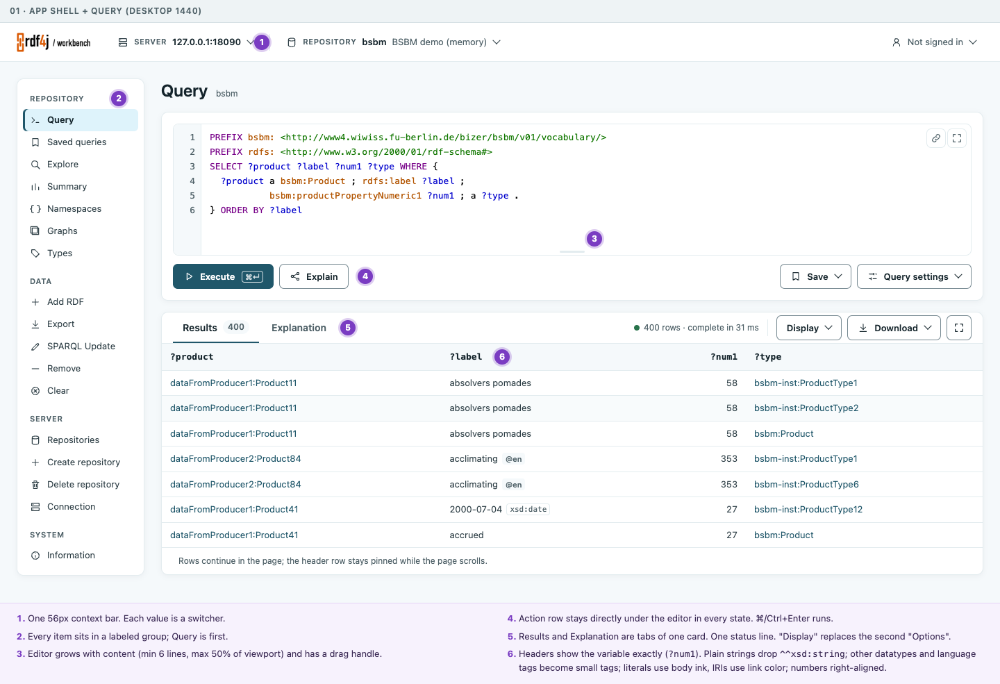

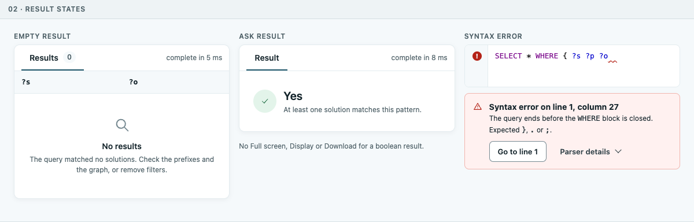

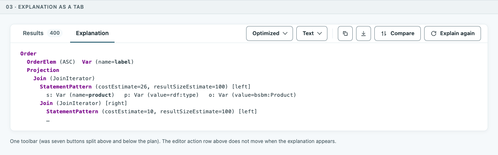

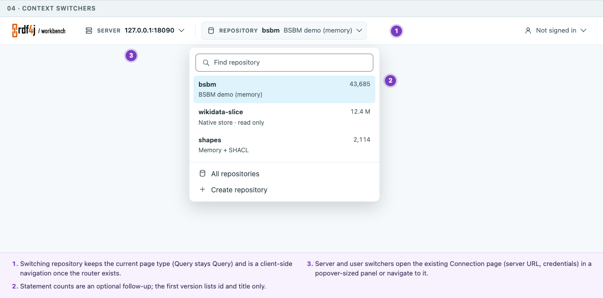

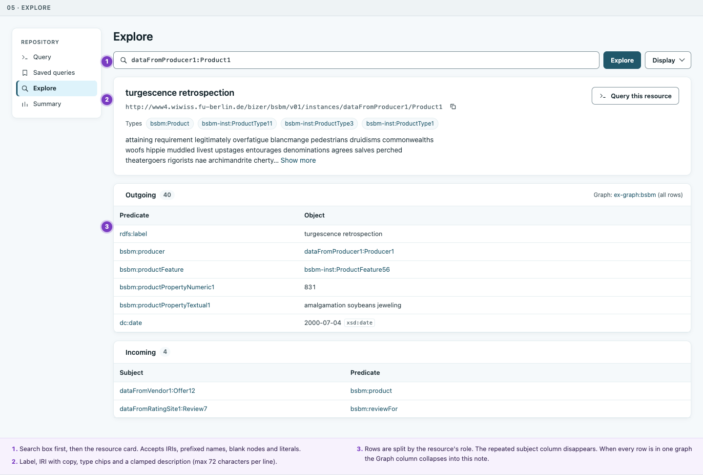

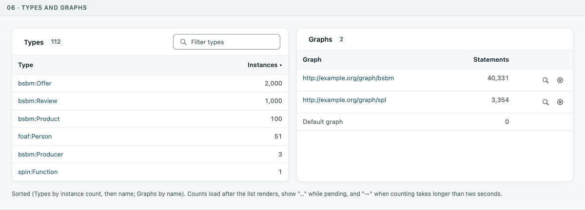

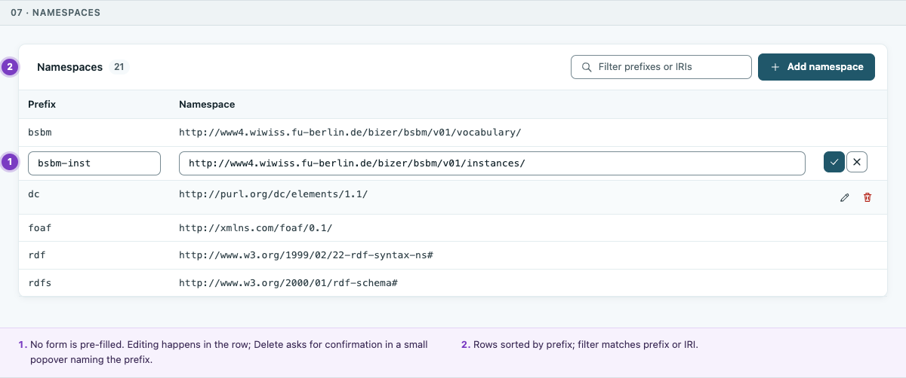

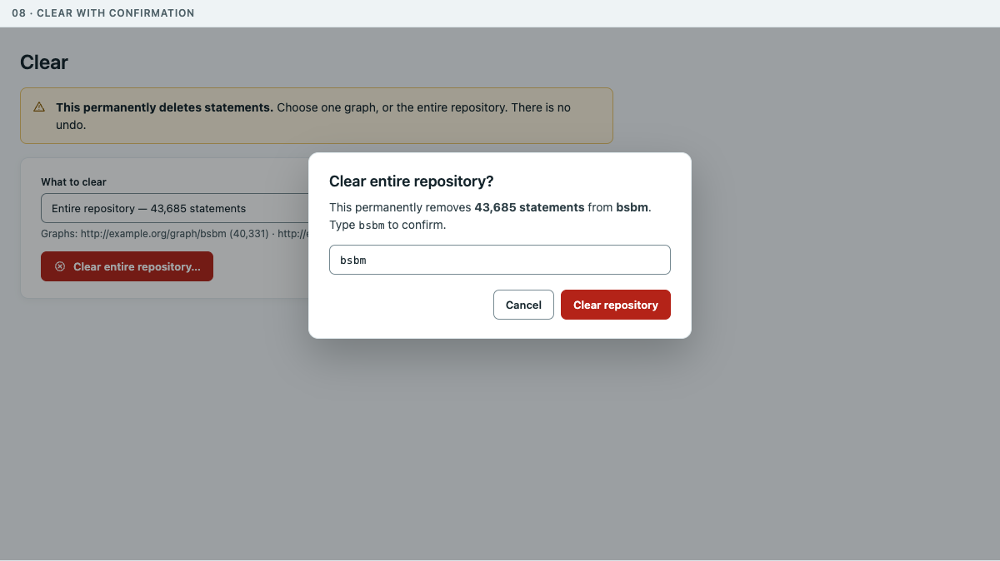

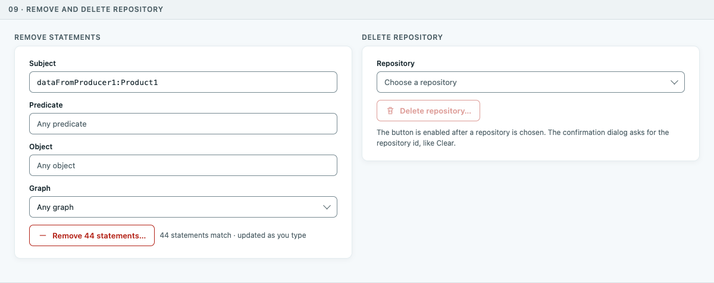

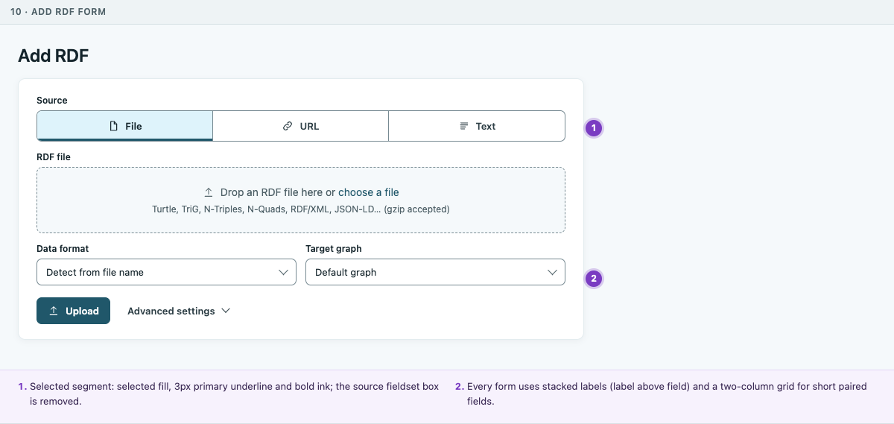

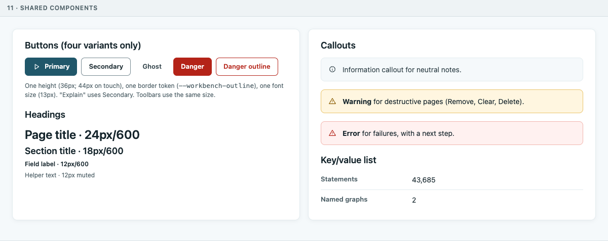

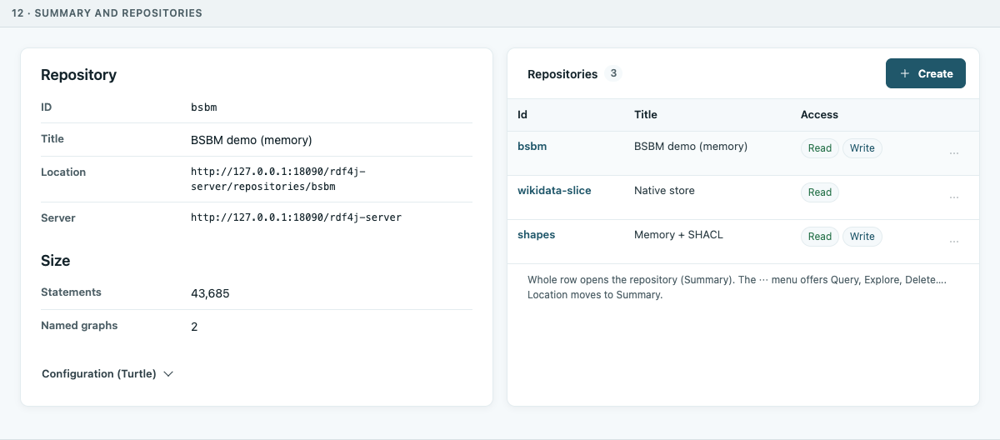

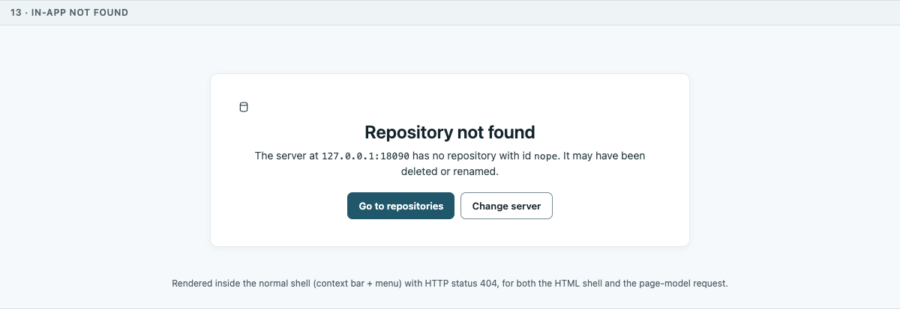

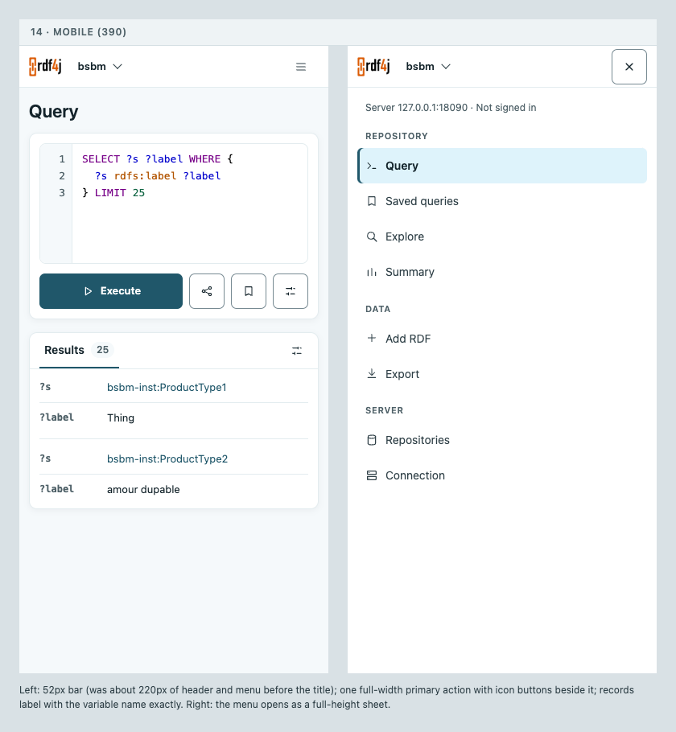

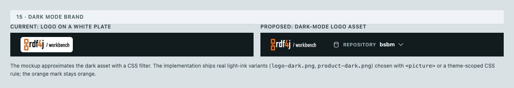

## Working rules for every task

These rules come from `AGENTS.md` at the repository root and apply to every task in this plan. Read `AGENTS.md` once in full; the essentials are repeated here.

Every task that changes what a user sees or can do is test-first. Before editing production code, add the smallest automated test that fails because of the problem, run it, and save its failing report. Copy the first failing output of each task into the root file `initial-evidence.txt` (append; never delete earlier entries) using `python3 scripts/agent-evidence.py` as shown in `Concrete Steps`. Then make the fix, rerun the same test, and see it pass. Pure refactors that keep behavior identical may instead show the same test selection passing before and after. Never run Maven tests with `-am` or `-q`. Always pass `-Dmaven.repo.local=.m2_repo` to Maven. Never delete untracked files that you did not create.

Every new source file needs the license header from `AGENTS.md` ("Copyright (c) 2026 Eclipse RDF4J contributors" with the EDL text and `SPDX-License-Identifier: BSD-3-Clause`; never change the year in existing headers). Directly below the header, every new file and every Java file you touch carries the agent signature comment for the tool that generated the change (for example `// Some portions generated by Codex`). Run `cd scripts && ./checkCopyrightPresent.sh` after creating files.

The unit-test coverage gate `e2e/tests-unit/run-workbench-unit-coverage.js` (run with `cd e2e && npm run test:unit:coverage`) requires 100% line, branch and function coverage for `template.js`, `query.js`, `yasqeHelper.js`, `update.js`, `create.js`, `delete.js`, `saved-queries.js` and `paging.js`, and later for `workbenchRoutes.js` and `workbenchRouter.js`. Any task that edits the TypeScript source of one of these files must run the gate and add unit tests until it passes.

Browser specs must not depend on the hand-seeded `bsbm` repository, which exists only for manual review and screenshots. In task M1.1 add a helper `createSeededRepository(request, serverBaseUrl, repositoryId)` to `e2e/tests/workbench-test-helpers.js`: it creates a memory repository with the configuration used in `design/workbench-app-shell-plan-20260930/seed-review-repository.sh` and loads `testsuites/sparql/src/main/resources/testcases-sparql-1.1/bsbm/bsbm-100.ttl` into the graph `http://example.org/graph/bsbm` (and `core/spin/src/main/resources/schema/spl.spin.ttl` into `http://example.org/graph/spl` when a test needs two graphs). Specs call it in `test.beforeAll` with a unique id and delete the repository in `test.afterAll`. Wherever a test below mentions `bsbm`, use the spec's seeded repository; resource IRIs such as `.../dataFromProducer1/Product1` are the same.

TypeScript is the source of truth. After editing any `tools/workbench/src/main/webapp/scripts/ts/*.ts` file, regenerate the committed JavaScript by running `tools/workbench/compileTypescript.sh` from the repository root (it needs TypeScript 5.9 as `tsc` on the `PATH`; `npm install -g typescript@5.9` if it is missing) and commit the `.ts`, `.js` and `.js.map` files together. Never edit the generated `.js` files by hand.

Design tokens live in `tools/workbench/src/main/webapp/styles/workbench-refresh.css` (light values in `:root`, dark values in `html[data-theme="dark"]`). Use `var(--workbench-...)` everywhere; never add literal colors outside those two blocks. Every visual change must be checked in light and dark mode and at 1440, 768 and 390 pixel widths with `design/workbench-app-shell-plan-20260930/capture-routes.cjs`.

Commit only when the maintainer has asked you to implement this plan (`AGENTS.md`: do not commit or push unless asked); then commit after each finished task with a message starting with the branch's issue label, for example `GH-6071 Show result headings as variable names`, without co-author trailers. Stage only the files of your task (`git add <path> ...`) and read `git diff --cached` before committing. Never use `git add -A`: the working tree may contain other people's uncommitted work and untracked artifacts. Update this plan (`Progress`, and any `Surprises & Discoveries` or `Decision Log` entries) in the same commit.

The `mvnf` test helper runs a root quick install first, which rebuilds `tools/server-boot/target/rdf4j-server-boot-6.2.0-SNAPSHOT.jar` in place; restart the preview after every `mvnf` run and every rebuild, or it may fail with `NoClassDefFoundError`.

## Plan of Work

The work is split into thirteen milestones. Milestone M0 prepares the environment. M1 to M6 fix the design review findings, page by page, on the current architecture. M7 to M11 introduce client-side navigation in small steps, each of which keeps the Workbench fully working. M12 migrates tests and closes the plan. Each milestone starts with a short story (goal, work, result, proof) and then lists its tasks. Each task says what is wrong today, what to build, where, which test to write first, and how to accept it.

### Milestone M0: a reproducible review environment

At the end of this milestone you have a Workbench running on port 18090 with the same data used in the review, a green baseline of the tests this plan touches, and certainty that no other in-flight work collides with yours.

Task M0.1. Build and start the preview. From the repository root run the root quick install (it skips tests and takes about a minute), then start the packaged server with its own data directory so it never touches your real Workbench data. The commands are in `Concrete Steps` under "Build and start the preview". Port 8080 is often taken by a developer's IDE; this plan always uses 18090. Then run `design/workbench-app-shell-plan-20260930/seed-review-repository.sh`, which creates the memory repository `bsbm` (or empties it if it exists) and loads the BSBM sample (about 40,000 statements, graph `http://example.org/graph/bsbm`) and the SPIN library schema (graph `http://example.org/graph/spl`). Expect the last line `bsbm size: 43685 statements`. The script empties the `bsbm` repository on whatever server URL it is given (first argument, default `http://127.0.0.1:18090/rdf4j-server`); never point it at a server whose `bsbm` repository you care about. Acceptance: `http://127.0.0.1:18090/rdf4j-workbench/repositories/bsbm/summary` shows "Repository size 43685".

Important: every time you rebuild `tools/server-boot`, the jar file is replaced in place and the running Java process can fail later with errors such as `NoClassDefFoundError: org/eclipse/rdf4j/common/io/FileUtil`. Always stop and restart the preview after a rebuild. This happened during the review.

Task M0.2. Record a baseline. Run the unit tests (`cd e2e && npm run test:unit`), the coverage gate (`cd e2e && npm run test:unit:coverage`), the Java tests of the Workbench module (`python3 .codex/skills/mvnf/scripts/mvnf.py tools/workbench`), and the browser specs listed in each milestone you are about to start. Save the summary lines in `initial-evidence.txt` under a heading "M0 baseline". If something is already red, note it in `Surprises & Discoveries` and do not try to fix it inside this plan unless a task below covers it.

Task M0.3. Check for collisions. On 2026-09-30 two other plans were being implemented in the same working tree: `.agent/execplans/workbench-query-column-widths-20260930.md` (result column widths in `QueryResultRenderer`, file `scripts/ts/queryStream.ts`) and `.agent/execplans/workbench-dark-mode-refresh-flash.md` (early theme script, file `base/WorkbenchHtmlShell.java`). Run `git status --short` and `git log --oneline -10`. If those files show uncommitted changes that are not yours, stop and ask the owner to commit first. Task M4.2 builds on the column-width plan; read that plan before starting M4 (its essentials are repeated in the M4 introduction). This plan and its design folder (`design/workbench-app-shell-plan-20260930/`: mockups, rendering script, seed script and capture script) were untracked when written; ask the maintainer to commit them (paths only, see `Working rules for every task`) before implementation starts, so every contributor works from the same version.

### Milestone M1: one visual system, with the legacy stylesheet removed

Most inconsistencies found in the review have one root cause: the redesign is layered on top of the pre-redesign stylesheet `styles/default/screen.css` (which also imports `styles/w3-html40-recommended.css`), and a large override sheet `styles/workbench-refresh.css` (about 3,200 lines with 31 `!important` declarations) fights it rule by rule. Some legacy rules still leak through: `.data th { text-transform: capitalize }` capitalizes every result heading, `html { overflow: scroll }` forces scrollbars, `.simple th:after { content: ':' }` adds colons to Summary and Information labels, `h1, h2, h3, h4 { white-space: nowrap }` stops headings from wrapping, and `a.resourceURL` hover rules drive the small external-link arrow in results. There are also three different secondary button styles on the Query page, several heading sizes for the same role, different card widths per page, two form layouts and boxes inside boxes. At the end of this milestone the shell links only the redesign stylesheets, shared components exist for buttons, headings, key/value lists, callouts and forms (mockup 11), and every page uses them. Proof: `capture-routes.cjs` screenshots before and after show only the intended differences, and the new checks in `e2e/tests/workbench-design-system.spec.js` pass.

#### Task M1.1: result headings show variable names exactly

What is wrong: the legacy rule `.data th { text-transform: capitalize }` in `styles/default/screen.css` (around lines 492 to 495) still applies, because the redesign's `table.data th` rule in `workbench-refresh.css` (around lines 2121 to 2128) never resets `text-transform`. `?num1` is shown as "Num1".

What to build: add `text-transform: none` to the redesign's `table.data th` rule. Do this before task M1.2 (which removes the legacy stylesheet) so that this task's failing test is observable.

Test first: create `e2e/tests/workbench-design-system.spec.js` (license header, and a disposable repository created in `beforeAll` with the helper described in `Working rules for every task`). Run `SELECT ?num1 ?x_y WHERE { BIND(1 AS ?num1) BIND(2 AS ?x_y) }` and expect the computed `text-transform` of every `#query-results th` to be `none` and their `innerText` to be exactly `num1` and `x_y` (task M4.3 later adds the question mark; update the expectation then). Fails today (`Num1`, `X_y`).

Acceptance: test passes.

#### Task M1.2: stop loading `styles/default/screen.css`

What to build: in `tools/workbench/src/main/java/org/eclipse/rdf4j/workbench/base/WorkbenchHtmlShell.java` (method `write`, stylesheet links around lines 76 to 78) remove the link to `styles/default/screen.css`. Before removing it, capture every route in light and dark mode at desktop and mobile widths with `capture-routes.cjs` into a "before" folder. After removing it, capture again into an "after" folder and compare each pair. Re-create in `workbench-refresh.css` only the rules you actually need, as explicit component rules (not element-wide rules): the hover behavior of `a.resourceURL` (move it to `styles/query.css` next to the result cell styles), and any spacing that visibly collapsed. Do not re-create `html { overflow: scroll }`; use `html { scrollbar-gutter: stable }` instead so the page does not jump when a scrollbar appears. Do not re-create the capitalize rule, the label colons, or the heading `nowrap`. Do not delete `screen.css` itself in this task (other RDF4J web applications might link it; search the whole repository with `rg -l "default/screen.css"` first and record the result in `Surprises & Discoveries`). The files `styles/default/print.css` and `styles/basic/all.css` are not referenced by the Workbench shell; leave them alone.

Test first: in `tools/workbench/src/test/java/org/eclipse/rdf4j/workbench/base/WorkbenchHtmlShellTest.java` add a test that the shell HTML does not contain `styles/default/screen.css`. It fails today. Existing assertions change in the same task: `WorkbenchHtmlShellTest` (around lines 65 to 66 and 95 to 96) asserts that the theme script appears before `/styles/default/screen.css`, which would become `-1`; compare against `/styles/workbench-refresh.css` instead. `e2e/tests/workbench-theme-first-paint.spec.js` (around lines 169 to 170) holds back the `screen.css` request to test the first paint; hold back `workbench-refresh.css` instead. Both files belong to the dark-mode plan named in task M0.3, so do this task only after that plan is committed. Run it with `python3 .codex/skills/mvnf/scripts/mvnf.py WorkbenchHtmlShellTest --module tools/workbench`.

Acceptance: the test passes; the before/after screenshots differ only where a legacy rule was intentionally dropped (capital letters in result headings, label colons, forced scrollbars); record the reviewed differences in `Artifacts and Notes`.

#### Task M1.3: four button variants

What is wrong: the Query page Execute is styled by `.query-page #exec` in `query.css`, Explain by `.query-page #explain-trigger` with the lighter border `--query-rule` (equal to `--workbench-soft-rule`), Save and Options by the general `.query-page button` rules with the stronger `--workbench-rule` border, and the explanation toolbar's bare `<button>` elements get smaller padding (`0.35rem 0.65rem`) than inputs (`0.45rem 0.75rem`). Page forms use `.workbench-action` with modifiers `--primary`, `--secondary`, `--danger`.

What to build: one set of classes, all 36px high (44px when `@media (pointer: coarse)` or width ≤ 600px), 13px semibold text, 7px radius, 8px icon gap: `.workbench-action--primary` (filled `--workbench-primary`), `.workbench-action--secondary` (surface fill, 1px `--workbench-rule` border), `.workbench-action--ghost` (no border, used for icon-only toolbar buttons and disclosure toggles inside toolbars), `.workbench-action--danger` (filled `--workbench-danger`, used only for the final confirm button in dialogs) and `.workbench-action--danger-outline` (danger text and border, used for page-level Delete, Remove, Clear buttons). Icon-only buttons add `.workbench-action--icon` (36px square) and must have `aria-label` and `title`. Apply the classes to every button rendered in `workbenchViews.ts` and in the renderer in `queryStream.ts`, and delete the special rules for `#explain-trigger`, `.query-page button` padding and similar one-off selectors in `query.css`, `query-explanation.css` and `query-compare.css`. Keep element ids.

Test first (in `workbench-design-system.spec.js`): on `/query`, collect the computed `height` and `border-top-color` of `#exec`, `#explain-trigger`, `#save-query-toggle` and `#query-options-toggle`; expect all heights equal and the last three border colors equal. Fails today (Explain's border differs).

Acceptance: test passes; a screenshot of the Query page shows Explain with the same border as Save.

#### Task M1.4: one heading scale and a key/value component

What to build: page title (`h1#title_heading`) 24px/600 (was 28px; the context bar in M2 and this change together save vertical space), section title (`h2` inside a card) 18px/600, card sub-section (`h3`) 14px/600, field label 12px/600, helper text 12px muted, body 14px/1.5. Remove card rules that add large top padding before the first heading (the Summary cards had about 45px above the heading and 20px on the sides): the first child of a card has no top margin. Replace `simpleSection()` in `workbenchViews.ts` (around lines 635 to 646, which renders `<table class="simple">`) with a key/value list: `<dl class="workbench-kv">
<dt>Label</dt><dd>Value</dd>
...</dl>`, styled as a two-column grid (180px label column on desktop, stacked label above value below 600px), with a `--workbench-soft-rule` line between rows and no colons. Keep the element ids that tests use.

Test first: in `e2e/tests-unit/workbench-page-rendering.test.js` add a case rendering the summary view and expecting `dl.workbench-kv` and no `table.simple`. Fails today.

Acceptance: Summary and Information look like mockup 12 and mockup 11's key/value list; Information keeps its three sections in one card.

#### Task M1.5: one content width and flatter containers

What is wrong: `workbench-refresh.css` (around lines 102 to 113) limits only direct children of `#workbench-page-surface` to 960px, and other rules make some forms `fit-content` (around lines 144 to 147 and 224 to 227). The result: the Query card is full width, list cards stop at about 960px, and forms range from 380 to 830px; on Explore the description paragraph is wider than the cards. Several places draw a box inside a box: the "Source" fieldset on Add RDF, the gray empty-state box inside the Repositories and Export cards, and record cards inside the result card on mobile.

What to build: a single rule. `#workbench-page-surface` gets `max-width: var(--workbench-content-max, 1200px)` and every card inside it fills that width. Pages whose main content is a form (server, create, delete, add, remove, clear, export, update's settings) wrap their form card in `.workbench-form-card`, which is `max-width: 760px`. Long prose (the Explore description) gets `max-width: 72ch`. Remove the 960px direct-child rule and the `fit-content` rules. Empty states render directly inside their card (icon, heading, one sentence; see mockup 02), never in an inset box. The Add RDF source picker loses its fieldset border (keep a `<fieldset>` for accessibility with a visually styled `<legend>` that looks like a field label).

Test first (in `workbench-design-system.spec.js`): at 1440x900, on `/summary`, `/namespaces`, `/types`, `/query` and `/explore?...`, the right edge of the first card inside `#workbench-page-surface` is the same on every page (within 1px); on `/add`, `/remove`, `/clear`, `/export`, `/NONE/create`, `/NONE/delete` and `/NONE/server` the form card width is 760px (or the surface width if smaller). Fails today.

Acceptance: test passes; screenshots show aligned right edges.

#### Task M1.6: one form layout

What is wrong: Add, Export and Create use labels above fields; Remove and Clear use labels to the left with a wide gap, and Remove's Object textarea is wider than its other fields.

What to build: every form uses `.workbench-field` (label, control, helper, in a column with 4px gaps and 12px between fields). Short paired fields may sit in `.workbench-field-grid` (two equal columns on desktop, one column below 600px). All text controls in a form card have the same width (100% of the card's content box). The label-left layout on Remove and Clear comes from their markup, not from CSS: `removePage()` and `clearPage()` in `workbenchViews.ts` render `<table class="dataentry">` rows (around lines 1538 and 1557); replace those tables with `.workbench-field` elements and delete CSS rules that only style `table.dataentry` once nothing renders it.

Test first: in `workbench-design-system.spec.js`, on `/remove` and `/clear`, for every `label` with a `for` attribute expect `label.bottom <= control.top` and expect all text inputs and textareas in the form to have equal widths. Fails today.

Acceptance: test passes; Remove matches mockup 09 (left).

#### Task M1.7: callouts

What to build: a callout component `div.workbench-callout.workbench-callout--info|--warning|--error` with an icon, an optional bold title and a body, colors from new tokens `--workbench-warning`, `--workbench-warning-surface`, `--workbench-warning-rule` (light: `#8a5a00`, `#fff6e0`, `#e9c46a`; dark: `#f3c969`, `#2e2512`, `#6b5420`; add both sets next to the existing tokens) and the existing danger tokens for errors. Warnings use `role="note"`; errors use `role="alert"`. Replace the neutral gray bold notes on Remove and Clear (rendered in `removePage()` and `clearPage()` in `workbenchViews.ts`) and the plain paragraph rendered by `renderFailure()` in `workbenchApp.ts` with callouts. Task M3.5 uses the error variant for query errors.

Test first: unit test in `e2e/tests-unit/form-pages.test.js` (or `workbench-page-rendering.test.js`, whichever renders Remove and Clear today) expecting `.workbench-callout--warning` on both pages. Fails today.

Acceptance: test passes; Clear matches mockup 08's warning.

#### Task M1.8: visible editor overlay icons and formatted numbers

What to build: the YASQE overlay buttons (share link and full screen, top right of the editor) are drawn almost invisible. Style them as 28px square ghost buttons with a `--workbench-soft-rule` border and `--workbench-muted` icon color, `--workbench-ink` on hover and focus (mockup 01). Add a helper `workbench.format.count(value, locale?)` in `scripts/ts/template.ts` that formats integers with `Intl.NumberFormat(locale)` (the browser locale when `locale` is omitted) and leaves non-numeric strings unchanged. Use it for the repository size on Summary and the row counts in the status line and badges; the counts added later in M5.2 and M6 use it too.

Test first: unit test for `workbench.format.count('43685', 'en-US')` returning `'43,685'` (always pass the locale in tests, because Node's default locale depends on the machine) and returning `'Timed out while requesting repository size.'` unchanged; browser test that the icon color of `.yasqe_share` differs from the editor background by a contrast ratio of at least 3:1 (compute from computed colors in the test).

Acceptance: tests pass.

### Milestone M2: a persistent shell with one menu and a compact context bar

Today the header is a floating card about 100 pixels tall whose "Change" links sit more than 300 pixels from the values they change, the menu mixes plain items with uppercase group headers and buries Query sixth under "Explore", the sidebar scrolls away on long pages, the server page shows a different menu and claims "Server: None", dark mode puts the logo on a white plate, every tab is titled "RDF4J Workbench", and an unknown repository shows an unstyled error. At the end of this milestone the shell matches mockups 01, 04, 13, 14 and 15. Proof: the specs listed per task pass and the navigation specs pass after their updates.

Orientation. `shell()` in `workbenchViews.ts` (around lines 526 to 555) renders, in order: `#header.workbench-header` (containing `contextTable()` and the logo images), a `
` whose summary is the mobile "Menu" button and whose body is `#navigation` with the menu from `navigation()`, `main#content` with `h1#title_heading` and `#workbench-page-surface`, and `#footer`. `render()` (around lines 2059 to 2079) renders the whole thing into `#workbench-app` on every call. The menu comes from the `info` page model: `commands/InfoServlet.java` writes one row per visible menu item (columns `menu-group-id`, `menu-group-label`, `menu-item-id`, `menu-item-label`, `menu-item-href`, ...) using the policy in `proxy/config/WorkbenchPolicy.java` (`builtInGroups()`, `builtInPages()`) and the defaults file `tools/workbench/src/main/resources/org/eclipse/rdf4j/common/app/config/defaults/workbench.properties` (lines 2 to 25). On the client, `normalizeWorkbench()` and `menuEntries()` read it; only when a model has no menu at all does `menuEntries()` fall back to `defaultMenu` (around lines 147 to 165). `template.ts` has a second, DOM-based step (`installWorkbenchNavigation`, around lines 1081 to 1139) that re-marks the current menu item and opens its group; it runs once per document. The page layout is a CSS grid on `body.workbench-body` (`workbench-refresh.css`, around lines 1064 to 1081) with areas "header header", "nav main", ". footer"; the main breakpoint is `@media (max-width: 900px)`.

#### Task M2.1: one navigation model everywhere

What is wrong: `/repositories/NONE/server` is served by `proxy/WorkbenchGateway.java`. Its page-data response is written in `changeServer()` (around lines 185 to 206, and the invalid-server branch around 218 to 221) with `builder.start("server")` but without `builder.link(List.of("info"))`, unlike every other page. Without the linked `info` model, `menuEntries()` falls back to the hard-coded `defaultMenu` (groups "Browse" and "Query", labels "SPARQL Update", "Create", "Delete", and no policy filtering), and `contextTable()` shows "None" for the server.

What to build: add `builder.link(List.of("info"))` in both page-data branches of `changeServer()` (the native POST path `writeServerPageModel` already does it). Then delete `defaultMenu` and the fallback branch in `menuEntries()`; when a model truly has no menu (for example if `info` fails to load), render the menu area empty and log `console.error('Workbench menu is unavailable')`. `navigation()` already renders `aria-current="page"` and the `current` class. What `template.ts installWorkbenchNavigation` (around lines 1081 to 1139) adds on top is opening the active group's `
` and keeping the mobile "Menu" disclosure in sync with the 900px breakpoint. Move the open state into rendering (render the active group's `
` with `open`) and delete the DOM re-marking; the router in M8 depends on rendering being the only source of truth. Keep the mobile disclosure sync until M2.8 replaces the mobile menu.

Test first: in `tools/workbench/src/test/java/org/eclipse/rdf4j/workbench/proxy/WorkbenchGatewayTest.java` add a test that a page-data request (`Accept: application/vnd.rdf4j.workbench+ndjson`) for `/NONE/server` contains a `links` record with `info`. Fails today. In `e2e/tests/workbench-navigation.spec.js` add a test that the list of menu group labels on `/repositories/NONE/server` equals the list on `/repositories/NONE/repositories`, and that the header shows the server URL. Fails today.

Acceptance: both pass; `e2e/tests-unit/workbench-page-rendering.test.js` cases about menu fallback (around lines 969 and 984) are updated to the new rule.

#### Task M2.2: split the shell from the page outlet (behavior-neutral refactor)

What to build: split `render()` into `renderShell(appMount, shellState, runtime)` and `renderOutlet(outletMount, model, context, runtime)`. The shell renders once per document (and again only when its state changes: repository, view id for the active menu item, server, user, menu). The outlet is a new element `
` inside `main#content`; it contains `h1#title_heading` and `#workbench-page-surface`. Keep every existing id and class. `bindRowWindows()` and the row-region map (`rowRegionsByMount`) must key on the outlet element. In this task the page must look and behave exactly as before; this is the one task in the plan that uses the "change without new tests" route from `AGENTS.md` (Routine B): record a passing run of `e2e/tests-unit/workbench-page-rendering.test.js` and of `e2e/tests/workbench-live-route-parity.spec.js` before the change, make the change, and record the same selection passing after it. Also prove the new code is exercised by adding one assertion to an existing rendering test that `#workbench-outlet` exists.

Acceptance: the before and after runs are identical and green.

#### Task M2.3: a compact context bar with switchers (mockups 01 and 04)

What to build: replace `contextTable()` and the header card with a full-width bar `<header id="workbench-contextbar">`, 56px tall, `position: sticky; top: 0`, surface background with a bottom `--workbench-soft-rule` border, and a new token `--workbench-contextbar-height: 56px`. Contents from left to right: the logo (28px tall), a Server switcher button (icon, uppercase 11px key "Server", value `host:port` from the server URL), a divider, a Repository switcher button (key "Repository", value = repository id in 600 weight, title in muted text; "No repository" when the id is `NONE`), flexible space, and a user button ("Not signed in" or the user name). Each switcher is a button with `aria-haspopup="dialog"` and `aria-expanded` that opens a popover panel anchored under it; Escape or a click outside closes it and returns focus to the button. The Server popover shows the full server URL, the user, and a link "Change server or user…" to `repositories/NONE/server`. The Repository popover shows a filter input and the repositories of the current server (load them when the popover first opens by fetching the page model of `repositories/NONE/repositories` with `loadModel()`, which this task exports from `workbench.app` together with `prepareInitialRows()`; read all rows with `model.rowStore.read(0, model.rowCount)` and then call `model.rowStore.dispose()`, because every loaded model owns a worker-backed row store), one row each with id and title (the mockup's statement counts are optional and not part of this task, because the repository list model has no sizes), and links "All repositories" and "Create repository". Choosing a repository navigates to the same view for that repository when the current view is repository-scoped (for example `/bsbm/query` to `/shapes/query`), otherwise to its Summary. The user name comes from the `server-user-password` cookie that `template.ts` currently decodes (around lines 1050 to 1072); move that decoding into the shell state. Put the popover behavior in `scripts/ts/template.ts` as `workbench.popover.bind(button, panel)`.

Test first (new spec `e2e/tests/workbench-shell.spec.js`): at 1440x900 the header element's height is at most 60px (today about 90px including margins); opening the Repository switcher lists `bsbm`; typing "bs" keeps it and hides others; choosing it from `/NONE/repositories` lands on `/bsbm/summary`; from `/bsbm/query` choosing the disposable repository created by the spec lands on `/<id>/query`. Fails today.

Acceptance: test passes; keyboard only (Tab, Enter, arrows, Escape) can open, filter, choose and close. Many existing specs and unit harnesses select the old header markup (`#contentheader`, `#selected-user`, `.workbench-context`, `#workbench-navigation-disclosure`): `e2e/tests/workbench-page-shell-grid.spec.js`, `workbench-consistency-contract.spec.js`, `workbench-refresh-all-pages-red.spec.js`, `workbench-spacing-audit.spec.js`, `workbench-final-closure-red.spec.js`, `workbench-review-corrections-red.spec.js`, `workbench-navigation-selection.spec.js`, `workbench-motion.spec.js`, `query-refinement-new-requirements-red.spec.js`, `query-refresh-layout.spec.js`, and the harnesses `e2e/tests-unit/list-browser-harness.js`, `form-browser-harness.js` and `query-browser-harness.js`. Update them in the task that changes the markup they depend on (M2.3, M2.4 or M2.8), and run the whole browser suite at the end of M2.

#### Task M2.4: regroup the menu and make it sticky

What is wrong: the menu mixes plain items ("Server", "Information", rendered from single-item groups) with uppercase group headers that are collapsible `
` elements, Query is sixth under "Explore", and the sidebar scrolls away on long pages.

Constraints you must respect: the menu is defined by the policy in `proxy/config/WorkbenchPolicy.java`. Group ids are validated: an item assigned to an unknown group throws "Workbench menu item group is not built in or declared" (around lines 160 to 175), and an administrator's `menu.group.<id>.*` property for an unknown id throws "Unknown or undeclared Workbench property" (around lines 405 to 415). `isPageVisibleInContext()` (around lines 572 to 577) treats pages whose group id is `server` or `repositories` as server-level pages when choosing landing pages. Therefore do not rename or remove any group id; change only default labels, default membership and default order, and keep every existing id declared in `DEFAULT_GROUP_IDS` and `BUILT_IN_GROUP_IDS`.

What to build: change the built-in defaults (in `builtInGroups()`/`builtInPages()` and the same values in `tools/workbench/src/main/resources/org/eclipse/rdf4j/common/app/config/defaults/workbench.properties`) to this order and labeling. Group `explore`, label "Repository": Query, Saved queries, Explore, Summary, Namespaces, Graphs (page id `contexts`), Types. Group `modify`, label "Data": Add RDF (`add`), Export (`export`, moved from `explore`), SPARQL Update (`update`), Remove, Clear. Group `repositories`, label "Server": Repositories, Create repository, Delete repository, Connection (page id `server`, moved from group `server`; both groups count as server-level pages, so landing behavior does not change). Group `system`, label "System": Information. Group `server` stays declared (administrators may reference it) but has no default items; empty groups are not rendered. Page ids and URLs do not change. In `navigation()` render every group the same way: an uppercase 11px label that is not interactive, followed by its items, including groups with a single item (today those render as a bare link). Remove the per-group `
` disclosures on desktop (keep them only when a group has more than twelve items). Make the sidebar sticky: `position: sticky; top: calc(var(--workbench-contextbar-height) + 24px); max-height: calc(100vh - var(--workbench-contextbar-height) - 48px); overflow: auto`.

Test first: Java: in `proxy/config/WorkbenchPagePolicyTest.java` assert the default visible groups in order (`explore` "Repository", `modify` "Data", `repositories` "Server", `system` "System") and their item ids; assert that a configuration that sets `menu.group.explore.label=Browse` and `menu.item.export.group=explore` still loads (compatibility); and keep the existing landing tests green. Fails today. Browser: in `workbench-shell.spec.js`, on the Types page of the spec's disposable repository scroll the window to the bottom and expect the "Query" menu link to still be inside the viewport (fails today). Update `e2e/tests/workbench-navigation.spec.js` ("opens the active group and keeps other groups collapsed", near line 7) to the new rule that all groups are expanded on desktop, and the label assertions in `workbench-navigation-selection.spec.js`.

Acceptance: tests pass; `InfoServletTest` still sees one menu row per visible item; record the label changes in the release-note draft in `Artifacts and Notes`.

#### Task M2.5: dark-mode logo

What is wrong: `workbench-refresh.css` (around lines 2936 to 2941) puts `.workbench-brand` on a white plate (`--workbench-logo-plate: #ffffff`) in dark mode because the logo artwork has black text.

What to build: add `images/logo-dark.png` and `images/product-dark.png`, identical to the originals except that near-black pixels become `#e8f0f3` (the dark ink token) with alpha preserved; the orange mark stays unchanged. Produce them with a small one-off Node script under `design/workbench-app-shell-plan-20260930/` that draws each PNG on a canvas in Playwright's Chromium and rewrites pixels whose lightness is below 50% and saturation below 20%; commit the script and the images. Render both image pairs in the brand; show `.workbench-brand__light` in light mode and `.workbench-brand__dark` when `html[data-theme="dark"]`. Delete the plate rule and the `--workbench-logo-plate` token.

Test first: in `workbench-shell.spec.js`, with `colorScheme: 'dark'`, expect the visible brand image `src` to end with `logo-dark.png` and the brand's computed background to be transparent. Update `e2e/tests/workbench-navigation.spec.js` (the "mobile logo plate fits its artwork" test near line 75). Fails today.

Acceptance: mockup 15's right-hand state.

#### Task M2.6: page titles

What to build: `WorkbenchHtmlShell.write()` writes `<title>` as `<Page> · <repository id> — RDF4J Workbench` (omit the repository part when it is `NONE`), using the same page names as `titles` in `workbenchViews.ts` but shortened (for example "Namespaces", not "Namespaces In Repository"; add a `shortTitles` map on both sides). `renderShell()` sets `document.title` to the same string on every render.

Test first: Java test in `WorkbenchHtmlShellTest` for the summary title; browser test that `page.title()` on `/bsbm/query` is `Query · bsbm — RDF4J Workbench`. Fails today.

Acceptance: tests pass.

#### Task M2.7: an in-shell "not found" page (mockup 13)

What is wrong: `proxy/WorkbenchServlet.java` (around lines 285 to 291) throws `BadRequestException("No such repository: " + repoID)` before any Workbench page code runs; nothing catches it and the servlet container shows its default error page with status 500 (Spring Boot's "Whitelabel Error Page" in `tools/server-boot`). The client could not show a styled page even if the server sent one: `loadModel()` in `workbenchApp.ts` throws on any non-OK response before reading its body (around lines 481 to 485), `acceptPageRecord()` turns an `error` record into a plain `Error` and drops its `code` (around lines 461 to 464), and `linkedModels()` would request `/nope/info`, which also fails, so there would be no menu. Beware also: `scripts/ts/create.ts` `checkOverwrite()` (around lines 28 to 52) calls `../<id>/info` with jQuery (`Accept: */*`) and relies on the 500 status to decide that a repository id is still free.

What to build, server side: in `WorkbenchServlet`, when the repository is unknown and the id is not `NONE`, set status 404 and answer according to the request. For a page-data request (`WorkbenchPageProtocol.requestsPageData(req)`), write an NDJSON page model with the requested view id and a terminal error record `{"type":"error","status":404,"code":"repository-not-found","message":"No such repository: <id>"}` using `WorkbenchPageResultWriter.error(404, "repository-not-found", message)` (look at how `getTupleResultBuilder()` in `base/AbstractServlet.java` creates the page writer). For an HTML navigation (`WorkbenchPageProtocol.requestsHtmlNavigation(req)`), write the shell with that same model inline (`WorkbenchHtmlShell.writeInitialPageModel(...)`). For any other request, write a `text/plain` body "No such repository: <id>". `writeUnauthorizedPageModel()` (around lines 237 to 258) shows how to write a shell with an inline model; do not copy its `error-message` row, use the error record.

What to build, client side: in `loadModel()`, when the response status is not OK but its `Content-Type` is the page protocol media type, read the NDJSON body instead of throwing; in `acceptPageRecord()` keep `status` and `code` on the model as `model.error = { status, code, message }` (and keep throwing for errors without a model). In `bootstrapAfterRecovery()` (and later in the router), when `model.error.code === 'repository-not-found'`, load the linked `info` model from `<basePath>/repositories/NONE/info` instead of the failing repository path, render the shell normally, and render the not-found view into the outlet: heading "Repository not found", a sentence naming the server and the id, a primary "Go to repositories" link and a secondary "Change server" link (mockup 13). `renderFailure()` also renders into the outlet (never replacing the shell) using the error callout from M1.7. Update `checkOverwrite()` to treat both 404 and 500 as "does not exist" (500 keeps compatibility with older servers). Update `WorkbenchServletTest` assertions near lines 170 and 346.

Test first: Java tests in `WorkbenchServletTest`: an HTML GET of `/nope/summary` returns 404 and HTML containing `data-workbench-initial-model`; a page-data GET returns 404 with an error record whose code is `repository-not-found`; a GET with `Accept: */*` returns 404 `text/plain`. Unit test in `e2e/tests-unit/workbench-page-rendering.test.js`: bootstrapping a view whose fake fetch answers 404 with that NDJSON renders "Repository not found" inside the outlet and keeps the menu. Browser test: visiting `/repositories/nope/summary` shows the heading and the context bar. `e2e/tests/workbench-create-contract.spec.js` must stay green. All new tests fail today.

Acceptance: tests pass; the create flow still refuses to overwrite an existing id and still allows a new id.

#### Task M2.8: a compact mobile header and a menu sheet (mockup 14)

What to build: below 900px the context bar is 52px tall and contains the small logo mark, the repository switcher (id only) and a 44px menu button (`aria-haspopup="dialog"`). The menu opens as a full-height sheet (a native `<dialog>` element opened with `showModal()`, which traps focus) listing the server/user line and the three menu groups with 44px rows; choosing an item closes the sheet. Remove the "Menu" disclosure bar and the stacked context table on mobile.

Test first: in `workbench-shell.spec.js` at 390x844, the top of `h1#title_heading` is at most 110px from the top of the page (today about 220px); the menu button opens a dialog containing "Query", Escape closes it. Update `e2e/tests/workbench-visual-refinement-followup.spec.js` (menu tests near lines 649 to 697) to the new sheet.

Acceptance: tests pass at 390 and 320 pixels wide.

### Milestone M3: a query page that keeps the user's place

Today the Query page has a fixed 300-pixel editor, no keyboard shortcut, an explanation panel that pushes the Execute button 500 pixels down, two different buttons both labeled "Options", a "Clear" button that silently empties the editor, a duplicated row-count line, no empty-result message, and syntax errors that are shown as a wall of red text without pointing at the editor. At the end of this milestone the page matches mockups 01, 02 and 03: the editor grows with its content, Cmd/Ctrl+Enter runs, results and explanation are two tabs of one card, controls have clear names, and every result state (rows, empty, boolean, error) has a deliberate design. Proof: the new browser spec `e2e/tests/workbench-query-workflow.spec.js` passes, and the existing query specs pass after the updates listed below.

Orientation for this milestone. The Query page template is `queryPage()` in `tools/workbench/src/main/webapp/scripts/ts/workbenchViews.ts` (around lines 1860 to 2028) and the per-editor pane template `queryPane()` (around lines 1669 to 1858). In compare mode there are two panes side by side. The editor is created in `scripts/ts/query.ts` by `initPaneYasqe(paneKey)` (around line 4504), which calls `YASQE.fromTextArea(textarea, { consumeShareLink: null, persistent: null })`. YASQE is a SPARQL editor built on CodeMirror 4; `scripts/yasqe.min.js` is the file that actually loads. Query execution belongs to the streamed result code in `scripts/ts/queryStream.ts`: the object `workbench.queryStream.queryPage` has `renderInto()` (binds the `#query-form` submit) and `submitExecution()`, and the class `QueryResultRenderer` draws the result card (status line, toolbar, table or records, boolean result, errors). Line numbers in these files move often; always search for the function name.

#### Task M3.1: Cmd/Ctrl+Enter runs the query

What is wrong: pressing Cmd+Enter or Ctrl+Enter in the editor does nothing visible. YASQE's own default key map binds these chords to `YASQE.executeQuery`, which would send the query to `options.sparql.endpoint`, and that option still has YASQE's built-in default `http://dbpedia.org/sparql`. During the review no request was observed, but the configuration is wrong and must be neutralized. Cmd/Ctrl+S is bound to `YASQE.storeQuery` by the same defaults.

What to build: in `initPaneYasqe(paneKey)` (which creates both the primary editor and, through `ensureCompareYasqe`, the compare editor with `paneKey === 'compare'`), pass `sparql: { endpoint: '', showQueryButton: false }` and `extraKeys` that depend on `paneKey`. In the primary editor, `Ctrl-Enter` and `Cmd-Enter` call `document.getElementById('exec').click()`. Do not call `submitExecution()` directly: the `#exec` click handler (in `query.ts`, around lines 4993 to 5004) sets the hidden `action` field to `exec` and clears the explain fields, and `doSubmit()` (around lines 4131 to 4148) calls `yasqe.save()` to copy the editor text into the form; skipping them would send stale text or a leftover explain request. `Shift-Ctrl-Enter` and `Shift-Cmd-Enter` click `#explain-trigger`. `Ctrl-S` and `Cmd-S` open the Save disclosure and focus `#query-name` (return nothing so the browser's own save dialog does not open). In the compare editor, Cmd/Ctrl+Enter clicks `#explain-compare-trigger` ("Refresh explanations"). If a query is already running (the `#exec` button is disabled or `#query-cancel` is visible), ignore the shortcut. In `scripts/ts/update.ts` (`initYasqe`, around lines 18 to 65) bind Cmd/Ctrl+Enter to `form.requestSubmit()` on `#update-form`. Show the shortcut on the Execute button as a small keyboard hint: `⌘↵` when `navigator.platform` or `(navigator as any).userAgentData?.platform` contains "Mac" (the `as any` cast is needed because TypeScript 5.9's DOM types do not declare `userAgentData`), otherwise `Ctrl+↵`, and add it to the button's `title` ("Execute (Ctrl+Enter)").

Test first: create `e2e/tests/workbench-query-workflow.spec.js` (copy the license header and the disposable-repository `beforeAll`/`afterAll` pattern from `e2e/tests/workbench-query-load-more.spec.js`). First test: open the query page, click into `.CodeMirror`, type `ASK { ?s ?p ?o }`, press `ControlOrMeta+Enter`, and expect exactly one request to the Workbench query URL carrying `action=exec` and the text "Yes" in `#query-results`; also record every request with `page.on('request')` and expect none whose origin differs from the Workbench origin. Second test: on `/update` type `INSERT DATA { <urn:a> <urn:b> <urn:c> }`, press `ControlOrMeta+Enter`, and expect navigation to `/summary`. Both fail today.

Acceptance: both tests pass on Chromium, Firefox and WebKit (`--project=chromium --project=firefox --project=webkit`).

#### Task M3.2: the editor grows with its content, can be resized, and results come into view

What is wrong: `styles/yasqe.min.css` (loaded last) sets `.yasqe .CodeMirror { height: 300px }`, which beats `query.css`'s `height: auto` because both rules have the same specificity. The editor is always 300 pixels, and after Execute at 1440x900 only about three result rows are visible without scrolling.

What to build: in `styles/query.css`, add rules with higher specificity (prefix them with `.query-page`) so the query editor's `.CodeMirror` is `height: auto`, and its `.CodeMirror-scroll` has `min-height` equal to six lines (6 × 21px line height + 16px padding = 142px) and `max-height: 50vh` with `overflow-y: auto`. Remove the conflicting rules: `query.css` (around lines 175 to 181) sets `.yasqe .CodeMirror-scroll { min-height: 300px; max-height: 55vh }` and (around lines 409 to 411) `.query-page .yasqe .CodeMirror-scroll { min-height: 240px }`. After changing the size call `cm.refresh()`. Add a resize handle element directly under each editor (`
`), rendered by `queryPane()`. Dragging it with the pointer sets a fixed height with `cm.setSize(null, heightPx)` (clamped between the six-line minimum and 80% of the viewport); ArrowUp/ArrowDown change it by 21px; double-click or Escape returns to automatic height. Remember the chosen height in `localStorage` under `rdf4j.workbench.editor-height.v1` inside `try/catch` (storage can throw in private windows). Put the sizing code in a small shared helper, `workbench.editorSizing.install(cm, handleElement, storageKey)`, in `scripts/ts/yasqeHelper.ts`, so the Update page (task M3.6) can use it too.

After the user starts an execution (button, shortcut, or saved-query Execute), scroll the result card into view if its top edge is below 60% of the viewport height: `resultsCard.scrollIntoView({ block: 'start', behavior: reducedMotion ? 'auto' : 'smooth' })`, where `reducedMotion` is `matchMedia('(prefers-reduced-motion: reduce)').matches`, with a top offset equal to the sticky context bar height (use CSS `scroll-margin-top: calc(var(--workbench-contextbar-height, 56px) + 16px)` on the card). Do this once per execution, when the first status update is rendered, in `workbench.queryStream.queryPage.submitExecution()`. Do not scroll on page load.

Test first (add to `workbench-query-workflow.spec.js`): at viewport 1440x900 set a one-line query and measure the `.CodeMirror` height; it must be at most 160px (fails today: 300). Set a 40-line query; the height must be greater than 300px and at most 452px (50% of 900 plus CodeMirror's 1px top and bottom borders). Run a 400-row query with the Execute button; after the first rows appear, count rows of `#query-results table.data tbody tr` whose bounding box lies fully inside the viewport; expect at least 12 (fails today: about 3).

Acceptance: the tests pass; dragging the handle changes the height and the height survives a reload.

#### Task M3.3: Results and Explanation become tabs of one card; the Execute row never moves

What is wrong: in `queryPane()` the explanation row (`#query-explanation-row`, with toolbar `.query-explanation-toolbar` holding "Copy explanation", the format select `#explain-format`, the level select `#explain-level` and the "Config" disclosure, and a second row `#query-explanation-controls-row` holding "Explain again", Cancel, "Download explanation" and "Compare") is rendered between the editor and the action row, so the Execute/Explain buttons move down when an explanation appears. The explanation has seven buttons on two rows. In compare mode a separate toolbar `#query-compare-toolbar` ("Copy", "Swap", "Refresh explanations", Cancel, "Diff") sits above both panes.

What to build (mockups 01 and 03): the editor card contains only the editor pane(s) and the action row (`.query-actions-toolbar`: Execute, Cancel, Explain on the left; Save and Query settings on the right). Below it, one output card with a tab list: "Results" (with a row count badge) and "Explanation". The result card rendered by `QueryResultRenderer` becomes the "Results" tab panel; the existing explanation surface (`#query-explanation`, the DOT and JSON views) becomes the "Explanation" tab panel. The tab header row holds the controls for the active tab: for Results the status line, "Display", "Download" and full screen (task M3.4 renames "Options" to "Display"); for Explanation one toolbar with the level select ("Optimized"), the format select ("Text"), the "Config" disclosure, icon buttons Copy and Download (with `aria-label` and `title`), "Compare" and "Explain again". In compare mode the Explanation panel shows the two explanations side by side and its toolbar gains "Swap", "Diff" and "Refresh explanations"; `#query-compare-toolbar` is removed from above the panes. Keep every existing element id (`#copy-explanation`, `#explain-format`, `#explain-level`, `#explanation-settings-toggle`, `#rerun-explanation`, `#download-explanation`, `#compare-toggle`, `#query-compare-copy`, `#query-compare-swap`, `#explain-compare-trigger`, `#query-diff-trigger`) because `query.ts` binds to them (around lines 5009 to 5039); only move them. Clicking Explain selects the Explanation tab; clicking Execute selects the Results tab. Follow the standard accessible tabs pattern: the list has `role="tablist"`, each tab is a `<button role="tab" aria-selected aria-controls>`, panels have `role="tabpanel" aria-labelledby`, Left/Right arrow keys move between tabs, and only the selected tab is in the Tab order. Put the reusable tab behavior in `scripts/ts/template.ts` as `workbench.tabs.bind(tablistElement)`.

Test first: in `workbench-query-workflow.spec.js`, record the bounding box of `#exec`, click `#explain-trigger`, wait for `#query-explanation` to have text, and expect `#exec` to be at the same position (within 1px) and `#query-explanation` to be inside an element with `role="tabpanel"`. Fails today. Then update the specs that assume the old layout: `e2e/tests/workbench-explain.spec.js`, `e2e/tests/query-explanation-alignment.spec.js`, `e2e/tests/query-explanation-visual.spec.js` and `e2e/tests/query-refresh-layout.spec.js`; and the unit tests in `e2e/tests-unit/query-page.test.js` and `e2e/tests-unit/query-template-parity.test.js` that assert the template order. Change only assertions about position and order, never assertions about behavior.

Acceptance: Explain, Compare, Diff, Swap, Copy and Download still work (existing specs green) and the Execute button no longer moves.

#### Task M3.4: clear names, units, and no silent "Clear"

What is wrong: the query options disclosure (`#query-options-toggle`, label "Options", in `queryPage()` around lines 1892 to 1914) and the result options disclosure (created in `queryStream.ts` with id `query-result-options-toggle-<suffix>`, label "Options") share a label. The timeout field `#query-timeout` has no unit (the server reads it as seconds in `QueryServlet.java`), and its `?hidden` binding hides the input but not its label. The "Clear" button `#query-reset-namespaces` calls `resetNamespaces()` in `query.ts` (around line 1078), whose `confirm()` text is missing a space ("replaceit") and whose namespace reload finds no element, so it only empties the editor.

What to build: rename the query disclosure's visible label to "Query settings" (with the sliders icon from mockup 01) and the result disclosure's visible label to "Display" (keep ids and keep the accessible name "Result display options"). Label the timeout "Timeout" with a unit suffix "seconds" inside the field and helper text "0 means no limit" (this is the server rule: `util/QueryEvaluator.java` `prepareQuery()` calls `setMaxExecutionTime` only when the value is greater than 0). The server and client messages that tell users to "Increase Query timeout in Options" must follow the rename: `queryTimeoutMessage()` and `incompleteQueryMessage()` in `commands/QueryServlet.java` and the same sentence in `scripts/ts/queryStream.ts` (search "in Options") become "Increase the timeout in Query settings and run it again."; update `e2e/tests/query-timeout-after-partial-results.spec.js` (it matches the old sentence) and any Java test that asserts it. Wrap label and input in one `.workbench-field` element and hide that element when the feature is off. Replace "Clear" with "Insert prefixes": it inserts `PREFIX` lines for every repository namespace (the map is `window.sparqlNamespaces`, set by `configureNamespaces()` in `workbenchApp.ts`) that is not already declared, at the top of the editor, without a confirmation (the change is undoable with Cmd/Ctrl+Z). Keep the feature flag `editor-namespaces` controlling this button. Delete `resetNamespaces()` and `loadNamespaces()` if nothing else calls them (search the TypeScript and the unit tests first).

Test first: a unit test in `e2e/tests-unit/query-page.test.js` that renders the query page template and expects the two disclosure labels to differ ("Query settings" and "Display"), the timeout label to contain "seconds", and no element with the text "Clear" in the query settings panel. A browser test: with an empty editor, click "Insert prefixes" and expect the editor text to start with `PREFIX bsbm-inst:` or another repository prefix, and pressing it twice not to duplicate lines.

Acceptance: tests pass; `e2e/tests/query-result-options-anchor.spec.js` still passes (it uses ids).

#### Task M3.5: one status line and designed result states (mockup 02)

What is wrong: `QueryResultRenderer.render()` writes "400 loaded rows of 400 results. Complete query: 31 ms." into `div.query-result-status`, and a second element `span.query-result-navigation__label` repeats "400 loaded rows of 400". An empty result shows only the header row, and the text "No results." is unreachable because a previous branch matches first. A boolean (ASK) result still shows the Full screen button. After an error, Full screen and Options keep whatever the previous result had set, and the parser message ("Encountered "<EOF>" at line 1, column 27. Was expecting one of: …") is shown verbatim in a red `pre.ERROR` without pointing at the editor.

What to build: the status line reads "400 rows · complete in 31 ms" (numbers formatted with `Intl.NumberFormat`), "Receiving… 1,200 rows" while streaming, and keeps the existing wording for timeouts, cancellation and partial results (search `render()` for those branches and keep their meaning). Show `span.query-result-navigation__label` only when fewer rows are loaded than exist (for example "1,000 of 12,345 loaded"), because the in-flight load-more work uses it; coordinate with `.agent/execplans/workbench-query-column-widths-20260930.md` and the load-more spec before changing its markup. For zero rows, render inside the Results panel under the header row an empty state: a muted search icon, the heading "No results", and the text "The query matched no solutions. Check the prefixes and the graph, or remove filters." For a boolean result (`renderBooleanResult()`), render the mockup's larger state (icon in a tinted circle, "Yes"/"No" as 20px text, a one-line explanation "At least one solution matches this pattern." or "No solution matches this pattern.") and hide Full screen, Display and Download. In `fail()`, hide Full screen and Display in addition to Download. For errors, parse `line (\d+), column (\d+)` from the message; if present, render an error callout (component from task M1.7) titled "Syntax error on line L, column C", with the first sentence of the message as the body, a "Go to line L" button, and a "Parser details" disclosure containing the full original message in a `pre`. "Go to line L" focuses the editor, calls `cm.setCursor({ line: L - 1, ch: C - 1 })` and `cm.scrollIntoView(null, 80)`. Also place a marker in the editor gutter: YASQE already registers the gutter `gutterErrorBar`; call `cm.setGutterMarker(L - 1, 'gutterErrorBar', markerElement)` and `cm.addLineClass(L - 1, 'background', 'query-editor-error-line')`, and clear both on the next editor change. Errors without a line and column use the same callout with the title "The query failed" and the message as body.

Test first: unit tests in `e2e/tests-unit/query-stream-refinements.test.js` (it already fakes the renderer; follow its existing cases) for: status text "400 rows · complete in 31 ms"; empty state text; boolean state hides Full screen; failure after a tuple result hides Full screen and Display; syntax error title parsed from the sample message above. These fail today. Update the existing assertions in `e2e/tests-unit/query-stream-contract.test.js`, `query-result-lifecycle.test.js` and `query-load-more.test.js` that pin the old status strings. Browser test: run `SELECT * WHERE { ?s ?p ?o` (missing brace), expect the callout title "Syntax error on line 1, column 27" (adjust the column if the parser reports a different one; the test must read it from the server message) and a gutter marker element on line 1.

Acceptance: tests pass; screenshots of the four states match mockup 02 in light and dark mode.

#### Task M3.6: the Update editor fills its box

What is wrong: on `/update` the editor's gray line-number gutter stops about 135 pixels above the bottom of the editor frame. `update.ts` (`initYasqe`, around lines 44 to 53) sets inline `height: auto` on `.CodeMirror` and `.CodeMirror-scroll`, and `styles/workbench-refresh.css` (around lines 501 to 504) forces `#update-editor .CodeMirror { height: min(45vh, 28rem) !important; min-height: 240px }`. CodeMirror sizes the gutter from the scroll element, which stays at its content height, so the frame is taller than the gutter.

What to build: remove the inline size assignments in `update.ts` and the forced height rules in `workbench-refresh.css` (desktop and the mobile override around lines 961 to 964), and install the shared sizing helper from task M3.2 on the Update editor with the same automatic height, minimum and maximum. Give the Update page the same editor frame, label size (12px field label) and action row as the Query page.

Test first: in a new test in `workbench-query-workflow.spec.js`, on `/update` compare the bounding box heights of `#update-editor .CodeMirror` and `#update-editor .CodeMirror-gutters`; they must differ by at most 2px. Fails today.

Acceptance: the test passes at 1440x900 and 390x844.

### Milestone M4: results that read like a table

This milestone makes the result table behave like the rest of the page and makes each cell easy to read. Today the table is capped at 70% of the viewport by an inline style and scrolls inside itself, columns can shrink to one character, headings are capitalized, plain strings carry `^^xsd:string`, and literals and IRIs have the same color. At the end, results scroll with the page with a pinned header row, words break only at natural boundaries, headings are the exact variable names, and literals look different from IRIs (mockup 01). Read `.agent/execplans/workbench-query-column-widths-20260930.md` before starting: that plan (finished or in progress) gives the table a `<colgroup>` whose widths are measured once from the header and the first ten rows and switches it to `table-layout: fixed`. This milestone builds on those fixed widths.

Orientation. `QueryResultRenderer` in `scripts/ts/queryStream.ts` creates, in its constructor, `this.tableWrap` (class `query-result-table-wrap`) and sets inline `style.maxHeight = '70vh'` and `style.overflow = 'auto'`; it does the same for the mobile records container `this.records`. Virtual scrolling (rendering only the rows near the visible area and replacing the others with spacer rows) listens to `scroll` on those two elements and uses `MeasuredRowHeights` to map scroll positions to row indexes; the method that computes the visible range is `prepareWindow`, and `renderRows` draws it. `installPreciseScrolling` adds `wheel` and `keydown` handlers for smooth row stepping. Full screen is `workbench.resultFullscreen` at the top of the same file; it sets `data-fullscreen="true"` and the class `query-results--fullscreen` on the results section, which `styles/query.css` turns into a fixed overlay. Cell text comes from `formatRdfTerm()` (about lines 1693 to 1757), which abbreviates IRIs with the repository namespaces through `abbreviatedIri()` and appends `^^` plus the datatype for literals whose datatype is not one of the "lexically displayed" ones in `isLexicallyDisplayedDatatype()` (boolean, integer, decimal, double, date, dateTime, time, duration).

#### Task M4.1: results scroll with the page, with a pinned header; full screen fills the screen

What to build: introduce a scroll source abstraction inside `QueryResultRenderer`. In page mode (the default) the renderer does not set `maxHeight` or vertical overflow on `tableWrap` or `records`. It listens to `scroll` on `window` (passive) and to `resize`, and computes the visible range from the table's position: `visibleTop = max(0, stickyOffset - tableRect.top)` and `visibleBottom = visibleTop + window.innerHeight`, where `stickyOffset` is the pinned header's top offset (the context bar height from milestone M2, 56px; read it from the CSS variable `--workbench-contextbar-height`, defaulting to 0 before M2 lands). `prepareWindow` receives these numbers instead of reading `tableWrap.scrollTop`. In full-screen mode the overlay already fills the screen; there the renderer switches the scroll source to `tableWrap` with `flex: 1 1 auto; overflow: auto; max-height: none` and restores page mode on exit (listen to the full-screen change callback). `installPreciseScrolling` must attach to the active scroll source; in page mode it must not call `preventDefault` on wheel events, so the page scrolls natively. Remove the inline `maxHeight` on `records` as well. One exception keeps the inner scroller: very large results. Browsers cap the height of an element, so `QueryResultRenderer` uses `ResultScrollCoordinates` (in `queryStream.ts`, around lines 1164 to 1193) to map logical row offsets onto a smaller physical scroll range once the result is taller than that cap (batches can hold up to 1,000,000 rows), and `installPreciseScrolling` handles wheel events itself in that compressed mode. When the coordinates are compressed (`physicalHeight < logicalHeight`), keep the element scroll source, give `tableWrap` a height of `calc(100vh - var(--workbench-contextbar-height, 0px) - 96px)` so it fills the screen below the result toolbar, and scroll the page so the result card's top is under the context bar when the user first scrolls into it. Switch between the modes whenever the coordinates change.

The pinned header needs care, because a `position: sticky` header inside an element with `overflow-x: auto` sticks to that element, not to the page. Keep `overflow-x: auto` on `tableWrap` so very wide tables can scroll horizontally, and add a floating header: a `div.query-result-floating-head` rendered before `tableWrap`, `position: sticky; top: var(--workbench-contextbar-height, 0px); z-index: 2; overflow: hidden`, containing a copy of the header table with the same `<colgroup>` widths, marked `aria-hidden="true"`. It is visible only while the real header row has scrolled above the sticky offset, and its `scrollLeft` is kept equal to `tableWrap.scrollLeft` on every `scroll` event of `tableWrap`. Because the column-width plan fixes every column width, the copy lines up exactly. The real `<thead>` stays in the table for screen readers.

Test first (new file `e2e/tests/workbench-result-scrolling.spec.js`): run `SELECT * WHERE { ?s ?p ?o } LIMIT 400` at 1440x900; move the mouse over the middle of the visible table and send `page.mouse.wheel(0, 2000)`; expect `window.scrollY` to have increased by more than 1000 (today it stays 0). Then expect the floating header to be visible with its top within 2px of the sticky offset, and expect at least one rendered data row whose bounding box is inside the viewport (virtual rows follow the page scroll). Press End (or scroll to the bottom) and expect the text of the 400th row to be visible. In full screen, expect `tableWrap` height to be at least 80% of the viewport height (today 70% capped by inline style) and the wheel to scroll the table. At 390x844 in records layout, expect no element inside `#query-results` with an inline `max-height`. Add a unit test in `e2e/tests-unit/query-stream-refinements.test.js` that a renderer whose coordinates are compressed keeps the element scroll source.

Update the specs that drive the old inner scroll element: `e2e/tests/workbench-query-load-more.spec.js`, `query-stream-row-store-lifecycle.spec.js`, `query-result-toolbar-geometry.spec.js` and `query-timeout-after-partial-results.spec.js` (search each for `table-wrap`, `scrollTop`, `wheel`), and the unit tests in `e2e/tests-unit/query-load-more.test.js` and `query-stream-refinements.test.js` that fake `tableWrap.scrollTop`.

Acceptance: the new spec passes on Chromium, Firefox and WebKit; the load-more and lifecycle specs pass; saved-query results (which reuse the renderer on `/saved-queries`) also scroll with the page.

#### Task M4.2: column sizing without mid-word breaks

What is wrong: `styles/workbench-refresh.css` (around lines 2109 to 2119, selector `body.workbench-body .workbench-page-surface table.data th, ... td`) sets `overflow-wrap: anywhere`. With automatic table layout this lets a column shrink to almost one character, so words break in the middle. Explore uses the same rule.

What to build: replace `overflow-wrap: anywhere` with `overflow-wrap: break-word; word-break: normal` on table cells, and `white-space: nowrap` on header cells. In `formatRdfTerm()`'s output for IRIs and prefixed names, insert a `<wbr>` element (a line-break opportunity) after each `/`, `#`, `:`, `?`, `&` and `=` when rendering into a cell (do it in the cell renderer, `renderTerm` in `queryStream.ts`, not in the text used for copying, `title` or links). With the fixed widths from the column-width plan, give every column a minimum of `max(headerTextWidth + padding, 10ch)` and cap the sampled width at 40ch so one long value cannot starve the others. Apply the same CSS to the Explore, Types, Graphs and Namespaces tables (they use `table()` in `workbenchViews.ts`).

Test first (in `workbench-result-scrolling.spec.js`): run `SELECT * WHERE { ?s ?p ?o } LIMIT 50`; find the cell containing `rdfs:label` and expect its height to be one line (less than 1.6 times its computed `line-height` plus vertical padding); expect every `th` to be one line. On the Explore page for `<http://www4.wiwiss.fu-berlin.de/bizer/bsbm/v01/instances/dataFromProducer1/Product1>` expect the "Context" (later "Graph") header to be one line. These fail today.

Acceptance: tests pass; no cell in the review screenshots shows a word split across lines except at `/`, `#`, `:` and similar boundaries.

#### Task M4.3: literal, IRI and heading rendering

What is wrong: the server always sends the literal datatype (`WorkbenchPageResultWriter.java` packs `literal.getDatatype()`), and `formatRdfTerm()` never treats `xsd:string` specially, so plain strings show as `"absolvers pomades"^^xsd:string`, while integers show as bare `58`. Literals and IRIs are both link-colored. Column headings came out title-cased (`?num1` as "Num1") because of the legacy rule `.data th { text-transform: capitalize }`; task M1.1 neutralized it and task M1.2 removed the legacy stylesheet.

What to build: `formatRdfTerm()` already returns a `FormattedRdfTerm` object (`label`, `title`, `exploreHref`, `externalHref`, `datatype`, `language`, `kind` including `unbound` and `unknown`, and `preformatted`; interface around lines 1641 to 1650 of `queryStream.ts`). Keep every existing field and its callers, and add two: `numeric: boolean` (true for the XSD integer, decimal, float and double types) and `ntriples: string` (the exact N-Triples form, used for `title` and copying). Change only what `label` contains for literals: the lexical value without quotes and without `^^datatype`; the renderer shows `datatype` and `language` as tags as described next. Render literals without quotes in `var(--workbench-body)`; render IRIs, prefixed names and blank nodes in `var(--workbench-primary)` (they stay links to Explore; literal cells may stay links too but are underlined only on hover). Never show a tag for `xsd:string`. Show `@lang` as a small badge (`span.rdf-language`) for language-tagged strings. Show numeric datatypes (all XSD integer, decimal, float and double types) as bare, right-aligned numbers with `font-variant-numeric: tabular-nums`; right-align a whole column when every sampled value in it is numeric. For every other datatype show a small monospace tag (`span.rdf-datatype`, text is the abbreviated datatype such as `xsd:date`) when "Show datatypes" is on. Show the variable name exactly as written, with its question mark, in monospace, in both table headers and record labels (`?product`). Update the Explore renderer in task M5.1 to use the same function.

Test first: unit tests in `e2e/tests-unit/query-stream-contract.test.js` for `formatRdfTerm()` with: a plain string (text without quotes, no datatype tag), a language string (`language: 'en'`), an `xsd:integer` (numeric true), an `xsd:date` (datatype tag `xsd:date`), and an IRI in a known namespace (text `rdf:type`). Update existing assertions that expect `^^xsd:string` (search `e2e/tests-unit` for `xsd:string`). Browser test: header text of the first column equals `?product` for the query in mockup 01.

Acceptance: tests pass; screenshots match mockup 01 cells.

#### Task M4.4: mobile records do not clip and use the same labels

What is wrong: at narrow widths the renderer switches to records (`chooseAutoLayout`, `renderRecords`, `createRecord`), and the records container is capped at 70vh by an inline style, so the last record is cut in the middle. Non-query tables in records mode (for example the repository list at 390px) show raw lower-case keys such as "readable" and "id" as labels, because they use the variable name as `data-label`.

What to build: the inline cap is removed by task M4.1. For query results use the `?variable` form (task M4.3). For the page tables rendered by `table()` in `workbenchViews.ts`, pass a label map so records use the same human labels as the table header ("Readable", "Id", "Subject", ...). Record rows use the shared key/value component from task M1.4, so spacing is identical for every row.

Test first: at 390x844 on `/repositories/NONE/repositories`, the first record's labels equal the table header texts rendered at desktop width (today "Readable", "Writeable", "Id", "Description", "Location"; M5.3 later changes them) instead of the lower-case variable names; on `/query` with a 25-row result, the last record is fully visible after scrolling the page to the bottom.

Acceptance: tests pass at 390 and 320 pixels.

### Milestone M5: readable browsing pages

This milestone fixes the pages used to look around a repository: Explore, Types, Contexts (shown as "Graphs"), the repository list, Summary, Add RDF, Export and Saved queries. At the end they match mockups 05, 06, 10 and 12. Proof: the tests named per task pass.

#### Task M5.1: Explore (mockup 05)

What is wrong: `explorePage()` in `workbenchViews.ts` (around lines 1165 to 1227) renders a heading from `rdfs:label`/`rdfs:comment` (collected by `consumeExploreRows()` and `finishExploreSummary()`, around lines 1028 to 1091, which also count rows where the explored resource is the object, so another resource's label can become the heading), then the raw resource text, then "1-44 of 44" (rewritten by `scripts/ts/explore.ts`), then the Resource form below that, then a four-column table (subject, predicate, object, context) whose cells show full IRIs through `renderTerm()`/`termText()` (around lines 177 to 189 and 619 to 633). Every row repeats the explored resource. The "Show datatypes" checkbox in "Result options" has no effect, because its handler in `scripts/ts/paging.ts` (around lines 488 to 509) looks for `div.resource[data-longform]`, which the renderer never emits. `commands/ExploreServlet.java` returns the columns `subject, predicate, object, context` from four passes (resource as subject, as predicate, as object, as context) without saying which role matched; the page model already contains the repository namespaces (record type `namespaces`, stored as `model.namespaceMap` by `acceptPageRecord()` in `workbenchApp.ts`).

What to build: server side, add metadata `explore-resource` to the Explore page model with the resolved resource in N-Triples form (`<iri>`, `_:id` or a literal), so the client can compare terms exactly even when the user typed a prefixed name. Client side, reorder the page: the resource form first, as one row (a full-width search input with a magnifier icon accepting an IRI in angle brackets, a prefixed name, a blank node or a literal; an "Explore" primary button that submits the existing GET form; and the existing "Result options", renamed "Display"). Then a resource card: `rdfs:label` as `h2` only when the explored resource is the subject of that row; the IRI in monospace with a copy button; the resource's `rdf:type` values as chips (links to Explore); the `rdfs:comment` clamped to three lines with a "Show more" toggle and `max-width: 72ch`; and a secondary "Query this resource" link to the Query page with the editor pre-filled with `SELECT * WHERE { <iri> ?p ?o }` (pass it as the `query` URL parameter, which the Query page already reads). Then up to four tables built by grouping the rows on the client: "Outgoing" (rows whose subject equals `explore-resource`; columns Predicate, Object), "Incoming" (rows whose object equals it; columns Subject, Predicate), "Used as predicate" (predicate equals it; columns Subject, Object) and "Graph contents" (context equals it; columns Subject, Predicate, Object). Show each group's row count in the header. Add a Graph column to a group only when its rows come from more than one graph; otherwise state the single graph in the group header ("Graph: ex-graph:bsbm" or "Default graph"). Render every term with the shared `formatRdfTerm()` from `queryStream.ts` (task M4.3), passing `model.namespaceMap` converted to its `namespaces` option, so Explore shows `rdf:type` like query results. Wire "Show datatypes" to that option and delete the dead `data-longform` code path in `paging.ts`. Keep the existing previous/next paging (`#previousX`, `#nextX`, `limit_explore`, `offset`); the groups describe the rows of the current page, and the page header says "Rows 1–44 of 44".

Test first: Java: in `commands/ExploreServletPageDataTest.java` expect the `explore-resource` metadata for a prefixed-name request (fails today). Unit: in `e2e/tests-unit/workbench-explore-regressions.test.js` render an Explore model with rows in all four roles and expect four groups, prefixed names such as `rdfs:label`, and no Graph column when all rows share one graph (fails today). Browser: in `e2e/tests/workbench-explore-navigation.spec.js`, on the bsbm Product1 page, expect the heading "turgescence retrospection", an "Outgoing" group whose first predicate cell reads a prefixed name, and toggling "Show datatypes" to change a `xsd:date` cell. Fails today.

Acceptance: tests pass; paging still works; links in cells still open Explore for that term.

#### Task M5.2: Types and Graphs (mockup 06)

What is wrong: both pages use `recordBrowsePage()` (around lines 943 to 950). `commands/TypesServlet.java` runs `SELECT DISTINCT ?type WHERE { ?subj a ?type }` without ordering or counts; `commands/ContextsServlet.java` lists `con.getContextIDs()` unsorted. Neither page can be filtered.

What to build: Types: the servlet orders types by their string value. It also accepts a new parameter `counts=true`, which answers a page model with columns `type, instances` from `SELECT ?type (COUNT(?s) AS ?instances) WHERE { ?s a ?type } GROUP BY ?type` with a 2,000 ms query timeout (follow the timeout pattern in `commands/SummaryServlet.java`, which uses 2,000 ms for the repository size); on timeout it answers with metadata `counts-timed-out=true` and no rows. The page renders the sorted list immediately, then requests the counts (`loadModel()` with the `counts=true` URL) and fills a right-aligned "Instances" column, showing "…" while pending and "—" on timeout, and re-sorts by count descending then name once counts arrive. Graphs: the servlet sorts graph IRIs by string value and, with `counts=true`, answers `context, statements` using `con.size(context)` per graph and one row for the default graph (`con.size((Resource) null)`), again under a 2,000 ms overall budget. Each Graphs row gets ghost icon actions: Explore (link to `explore?resource=<iri>`) and "Clear graph…" (link to `clear?context=<iri>`, which preselects the graph in M6.4). There is no per-graph Export action, because `commands/ExportServlet.java` has no context parameter; mockup 06 shows only Explore and Clear. Both pages get a filter input in the card header that re-requests the page with `?filter=<text>` (the servlets apply a case-insensitive substring filter on the string value; until M10.1 routes GET forms through the router this reloads the page). Page title and menu label for contexts become "Graphs"; the URL stays `/contexts`.

Test first: Java: in `commands/CommandServletCoverageTest.java` (it already has `typesServletEmitsEveryDistinctType` and `contextsServletEmitsEveryContext`) add tests for sorted order, `counts=true` output and `filter`. Browser: on `/bsbm/types` the first rows are sorted and an "Instances" column fills in. Fails today.

Acceptance: tests pass; a store where counting takes more than two seconds still shows the list immediately with "—".

#### Task M5.3: repository list (mockup 12, right)

What is wrong: `repositoriesPage()` (around lines 685 to 691) shows Readable and Writeable as eye and pencil icons (the pencil reads as "Edit"), only the Id is a link, and the long Location column dominates.

What to build: columns Id (600 weight link to Summary), Title (the repository description), Access (text badges "Read" and "Write" instead of icons; show only the ones that apply) and an overflow menu button (ghost icon, `aria-label="Actions for <id>"`) opening a small menu with "Query", "Explore", "Summary" and "Delete…" (link to `NONE/delete?id=<id>`, which preselects it in M6.6). Make the whole row clickable by delegating clicks that do not land on a link or button to the Id link (`cursor: pointer`, hover background), keeping the Id link as the one real, keyboard-focusable link. Move Location to the Summary page (it is already there) and show it as the Title cell's `title` attribute. Add a "Create" primary button in the card header.

Test first: browser test that clicking the Title cell of `bsbm` navigates to `/bsbm/summary` and that the Access cell reads "Read Write" (fails today).

Acceptance: test passes; mobile records use the labels Id, Title, Access (task M4.4).

#### Task M5.4: Summary and Information (mockup 12, left)

What to build: `summaryPage()` (around lines 648 to 668) renders one card with two key/value sections: "Repository" (ID in monospace, Title, Location in monospace, Server) and "Size" (Statements formatted with `workbench.format.count`, Named graphs), followed by the configuration disclosure labeled "Configuration (Turtle)" inside the same card (today "Config Model" sits alone in a third card). `informationPage()` uses the same key/value component (task M1.4).

Test first: unit test rendering the summary with `size: '43685'` and the locale `en-US` passed through the view context (add an optional `locale` field to `ViewContext` that `workbench.format.count` receives), expecting one card, the text "43,685" and no element with the text "Config Model" (fails today).

Acceptance: test passes; Summary matches mockup 12.

#### Task M5.5: Add RDF and Export

What is wrong: on Add RDF the selected File/URL/Text option is hard to see (the selected rule in `workbench-refresh.css`, around lines 1749 to 1753, only changes border color and a faint background) and the options sit in a bordered fieldset box. Export shows "Export timeout (seconds)" with the value 43200 and a "Statement preview" section whose title is a plain paragraph.

What to build: Add RDF (mockup 10): selected segment uses `--workbench-selected` background, an inset 3px bottom bar in `--workbench-primary`, ink text in 600 weight; the fieldset loses its border (task M1.5). Turn the file field into a drop zone: a dashed-border area containing the existing file input's label ("Drop an RDF file here or choose a file") and a helper line listing formats; on `dragover` add a highlighted state, on `drop` assign `event.dataTransfer.files` to the file input and show the chosen file name. Rename the format option "(autodetect)" to "Detect from file name". Move the existing Context field (today inside "Advanced settings" with Base URI, "Override parsed contexts" and Isolation level; see `addPage()` around lines 1494 to 1520) next to Data format as "Target graph" with the default "Default graph"; keep the other advanced fields where they are. Keep every field name (`source`, `context`, `baseURI`, `overrideContext`, ...), because `commands/AddServlet.java` reads them. Export: show the timeout field with a "seconds" suffix and a live helper that converts it ("12 hours", "No limit" for 0), and render "Statement preview" as a section `h2`.

Test first: browser tests: dropping a small Turtle file (use `page.dispatchEvent` with a `DataTransfer` created in the page) on the drop zone sets the file input's `files.length` to 1 and shows its name; the checked segment's computed background equals `--workbench-selected`; on Export the helper reads "12 hours". All fail today.

Acceptance: tests pass; uploading via drop loads the statements (size increases).

#### Task M5.6: Saved queries details

What is wrong: `savedQueryContent()` (around lines 1307 to 1352) shows "Include Inferred Statements: true" and "Shared: true"; the Show button's visible text stays "Show" after the details open because `scripts/ts/saved-queries.ts` (`toggle`, around lines 58 to 67) only changes a `value` attribute.

What to build: render "Yes"/"No", drop the "Query Language" row when the value is SPARQL (it is the only language), use the key/value component, and make the toggle a real disclosure button whose text switches between "Show details" and "Hide details" with `aria-expanded`.

Test first: browser test: after clicking the toggle the button reads "Hide details" and the value cell reads "Yes". Fails today.

Acceptance: test passes.

### Milestone M6: safe destructive actions

Clear, Remove, Delete repository and the Namespaces editor can destroy data with one click and give little feedback. At the end of this milestone every destructive action states its scope and size before it happens and asks for confirmation (mockups 07, 08 and 09), and server-side errors are visible. Do the tasks in the order listed: M6.1 makes the pages load their rows, which M6.4 and M6.5 need. The confirmation is a browser-side safeguard; the servlets' HTTP contract does not change (see `Decision Log`).

#### Task M6.1: show server-side errors on Clear, Remove and Update

What is wrong (suspected; verify first): when `ClearServlet`, `RemoveServlet` or `UpdateServlet` reject a request (for example Remove with all fields empty answers "No values"), they write an `error-message` row. `prepareInitialRows()` in `workbenchApp.ts` (around lines 602 to 621) loads rows only for create, add, summary, information and server, and `bindRowWindows()` returns early for pages without a row table, so `pageValue(model, 'error-message')` may stay empty and the user sees no error.

What to build: first reproduce with a browser test: submit Remove with all fields empty and expect the text "No values" on the resulting page (this is possible through the UI because this task comes before M6.5, which disables the button for empty forms). If it fails, make `prepareInitialRows()` load all rows (`count = model.rowCount`) for `clear`, `remove` and `update`, and render `error-message` in an error callout above the form. Load the rows for `clear` and `remove` even if the reproduction passes, because tasks M6.4 and M6.5 send graph rows on those pages. If the reproduction passes, record that in `Surprises & Discoveries` and only restyle the message as a callout.

Acceptance: the browser test passes and shows an error callout.

#### Task M6.2: a confirmation dialog component

What to build: `workbench.confirmDialog.open(options): Promise<boolean>` in `scripts/ts/template.ts`, where `options` is `{ title: string, body: TemplateResult or string, confirmLabel: string, danger: boolean, requireText?: string }`. It renders a native `<dialog>` (opened with `showModal()`, which traps focus and gives Escape-to-cancel for free) with the title as `h2`, the body, an optional text input that must equal `requireText` exactly before the confirm button is enabled, a secondary Cancel button (focused first) and the confirm button (danger variant when `danger`). It resolves `true` only when confirmed. Replace the `window.confirm()` calls in `scripts/ts/delete.ts` (proxied-repository warning), `scripts/ts/create.ts` (overwrite warning and id warning), `scripts/ts/saved-queries.ts` (delete) and `scripts/ts/query.ts` (the "Query name exists" overwrite question when saving, around line 4109) with it. The unit-test fakes in `e2e/tests-unit/browser-fakes.js` have no `<dialog>`: add a minimal fake `HTMLDialogElement` with `showModal()`, `close()`, `open` and a `close` event before writing the test.

Test first: unit test in `e2e/tests-unit/form-pages.test.js` using the extended fake DOM: `open({ requireText: 'bsbm' })` keeps the confirm button disabled until the input value is `bsbm`, and resolves `false` on Cancel. Fails today (no component).

Acceptance: test passes; the dialog works with keyboard only.

#### Task M6.3: Namespaces (mockup 07)

What is wrong: `namespacesPage()` (around lines 894 to 941) renders a form whose Prefix and Namespace fields read `pageValue()`, which falls back to the first row of the current table window, so the page opens with the first namespace loaded into the form and an armed Delete button. The prefix is both a text input and a `#prefix-select` dropdown. The Update and Delete buttons have no `name`, so the server cannot tell them apart; Delete works by emptying the namespace field before submitting. `commands/NamespacesServlet.java` (`doPost`, around lines 29 to 40) removes the prefix when the namespace is empty and throws a `NullPointerException` when the parameter is missing, and answers with the page itself instead of redirecting.

What to build: server side, accept an explicit `action` parameter: `action=save` with `prefix`, `namespace` and optional `previousPrefix` (when present and different, remove the old prefix after setting the new one), and `action=delete` with `prefix`. Validate that `prefix` matches the SPARQL prefix name grammar (letters, digits, `_`, `-`, `.`; may be empty for the default namespace) and that `namespace` is an absolute IRI; answer a 400 error record otherwise. Requests without `action` keep today's behavior, so old clients and scripts still work, but a missing `namespace` becomes a 400 instead of a `NullPointerException`. Sort the listing by prefix. Client side: remove the form above the table. The card header has a filter input (client-side filter over the rows; the namespace list is small) and an "Add namespace" primary button that inserts an editable row at the top. Each row shows prefix and namespace in monospace; on hover or focus it shows ghost icon buttons Edit and Delete. Edit turns the row into two inputs with Save (primary icon) and Cancel; Save posts `action=save` (with `previousPrefix`). Delete opens `confirmDialog` ("Delete prefix dc?", body shows the IRI, confirm label "Delete prefix") and posts `action=delete`. Use `meta()` instead of `pageValue()` for any form field so no value is taken from table rows again. Remove `scripts/ts/namespaces.ts` if nothing else uses `updatePrefix()`.

Test first: Java: `CommandServletCoverageTest` gets tests for `action=save` with rename, `action=delete`, invalid prefix (400) and missing namespace (400 instead of an exception); these fail today. Browser: on `/bsbm/namespaces` no text input has a value on load; editing `dc` to `dcterms`-style rename works; Delete requires the dialog. Fails today.

Acceptance: tests pass; `e2e/tests/workbench-*` specs that used `#prefix-select` are updated.

#### Task M6.4: Clear (mockup 08)

What is wrong: `clearPage()` (around lines 1551 to 1564) has one free-text Context field and a button always labeled "Clear context"; with the field empty, `ClearServlet` clears the entire repository (`con.clear()`), because an empty parameter counts as absent.

What to build: `ClearServlet.service()` adds rows `context, statements` for every graph plus the default graph (reuse the Graphs counting from M5.2, with the same 2,000 ms budget; a count that did not finish is sent as an empty value) and metadata `repository-size`. The client reads these rows because task M6.1 makes `prepareInitialRows()` load all rows for the Clear page. The page shows the warning callout, then a select "What to clear" whose first option is "Entire repository — 43,685 statements" followed by "Default graph — N" and one option per graph with its count ("—" when the count did not finish within the budget). A `context` query parameter preselects that graph (used by the Graphs page action). The button label follows the selection: "Clear entire repository…" or "Clear graph…". Submitting opens `confirmDialog`: for the entire repository, title "Clear entire repository?", body "This permanently removes 43,685 statements from bsbm.", `requireText` equal to the repository id; for one graph, title "Clear graph?", body with the graph IRI and count, no typing required. Only a confirmed dialog submits the form (keep method POST and the parameter name `context`; send an empty value for the entire repository exactly as today).

Test first: browser test in a new spec `e2e/tests/workbench-destructive-actions.spec.js` (disposable repository with two graphs): the select lists both graphs with counts; choosing "Entire repository" and clicking the button opens a dialog whose confirm button is disabled until the repository id is typed; Cancel leaves the size unchanged; confirming clears it. Fails today.

Acceptance: test passes; clearing one graph leaves the other.

#### Task M6.5: Remove with a live match count (mockup 09, left)

What to build: `RemoveServlet` accepts GET `remove?count=true&subj=&pred=&obj=&context=` and answers a page model with one row `count`, computed by iterating `con.getStatements(subj, pred, obj, false, contexts)` (explicit statements only, because Remove only removes explicit statements) and stopping at 1,000,001 (report "more than 1,000,000") or after 2,000 ms (report "—", with the tooltip "Counting took longer than 2 seconds"). Invalid term syntax answers a 400 error record naming the field. The Remove page (stacked layout from M1.6) uses placeholders "Any subject", "Any predicate", "Any object", "Any graph" (a select of graphs as on Clear), requests the count 400 ms after the last keystroke (cancel the previous request with `AbortController`), shows "44 statements match" next to the button (or the field error under the field), and labels the danger-outline button "Remove 44 statements…". The button is disabled while all fields are empty (the server rejects that anyway with "No values") or when the count is 0. Clicking opens `confirmDialog` stating the count; only confirmation submits the existing POST.

Test first: Java: `commands/RemoveServletTest.java` gets tests for `count=true` (a known pattern returns the right number; invalid IRI returns 400). Browser (in `workbench-destructive-actions.spec.js`): typing a subject shows a count and the button label contains it. Both fail today.

Acceptance: tests pass.

#### Task M6.6: Delete repository (mockup 09, right)

What to build: `deletePage()` (around lines 860 to 892) renders the repository select with a first placeholder option "Choose a repository" (empty value, disabled) selected unless the URL has `?id=<id>`; the Delete button is disabled until a repository is chosen. `checkIsSafeToDelete()` in `scripts/ts/delete.ts` keeps its `delete?checkSafe=<id>` request, then opens `confirmDialog` titled "Delete repository <id>?" with `requireText` equal to the id; when the check reports the repository is proxied by another repository, include that warning in the dialog body instead of a separate `window.confirm()`. Only confirmation submits.

Test first: browser test: the button is disabled on load; choosing the disposable repository enables it; the dialog requires typing the id. Fails today.

Acceptance: test passes; the proxied warning still appears for a proxied repository (existing coverage in `CommandServletCoverageTest.deleteServletSupportsJsonSafetyCheckAndSelectionPage` stays green).

### Milestone M7: routes that can start and stop

Client-side navigation means one document shows many pages over its lifetime. Today every page assumes it owns a fresh document: route scripts start through `window.onload` chains (`workbench.addLoad` in `template.ts`, gated by `prepareLegacyLoadBarrier()` in `workbenchApp.ts`, which runs the chain only once per document), several scripts install listeners on `window` or `document` that are never removed, and cleanup happens only on `pagehide` (`releaseRowStore()` in `workbenchApp.ts`, and a `pagehide` listener inside `workbench.queryStream.queryPage.renderInto()`). This milestone introduces a route lifecycle contract and converts every route except Query, Update and Saved queries (which follow in M9). Nothing visible changes yet: pages are still reached by full page loads, but each page is now mounted through the contract and can be disposed. Proof: unit tests that mount, dispose and re-mount each converted route in one fake document and find no leftover listeners, and the unchanged browser suite.

#### Task M7.1: the lifecycle contract and route registry

What to build: a new file `tools/workbench/src/main/webapp/scripts/ts/workbenchRoutes.ts` (namespace `workbench.routes`; add the license header and agent signature; add it to `loadSharedRuntime()` in `workbenchApp.ts` after `workbenchViews.js`). It defines the types in `Interfaces and Dependencies` (`RouteDefinition`, `RouteMountContext`, `RouteInstance`) and the functions `register(definition)`, `get(viewId)` and `isRouterReady(viewId)`. Move the per-route script lists from `routeScripts()` into the definitions: `scripts(model)` returns the same arrays as today, and `baseScripts()` returns the part of that list that does not depend on the model (for every route except `create`, that is the whole list; for `create` it is `create.js`, and `create-federate.js` is added by `scripts(model)` when the model's variables say so). Keep `routeScripts()` as a thin wrapper until M12 so existing unit tests keep passing. Also export from `workbench.app` the functions the router will need, which are private today: `loadModel`, `linkedModels`, `prepareInitialRows`, `configureNamespaces`, `stageInitialQueryParameters` and `renderFailure` (task M2.3 already exported the first two). Provide `defaultMount(ctx)`, which does what `bootstrapAfterRecovery()` does after loading today: `views.renderOutlet()`, `views.bindRowWindows()`, and returns an instance whose `dispose()` calls the row-window disposer and `model.rowStore.dispose()` exactly once. Change `bootstrapAfterRecovery()` to look up the definition and call `mount()`, and replace `releaseRowStore()`'s body with a `pagehide` listener that, unless `event.persisted` is true, first calls `saveScrollPosition()` and `markCurrentRowStoresForRecovery()` exactly as today and then calls `instance.dispose('pagehide')`. (`event.persisted` is true when the browser keeps the page in its back/forward cache, a memory snapshot of the page that Back restores without reloading; the page must then stay intact.) The existing test near line 1620 of `workbench-page-rendering.test.js` covers the scroll saving and must stay green. Routes without a definition use `defaultMount` plus the legacy load barrier, exactly as today.

Extend `e2e/tests-unit/browser-fakes.js` so the fake `window` and `document` count listeners added and removed per event type (add `listenerCount(type)`); you need it for every dispose test in M7 and M9.

Test first: `e2e/tests-unit/workbench-routes.test.js` (new): registering a definition makes `isRouterReady` true; bootstrapping a view with a registered definition calls its `mount` once; a `pagehide` with `persisted: false` calls `dispose('pagehide')` once and a second `pagehide` does not call it again; `persisted: true` does not dispose. Fails today (module missing).

Acceptance: new tests pass; `npm run test:unit` green. The coverage runner `e2e/tests-unit/run-workbench-unit-coverage.js` requires 100% line, branch and function coverage for the scripts it lists (lines 13 to 30); add `workbenchRoutes.js` to that list and reach 100%.

#### Task M7.2: convert the simple routes

What to build: for each of `repositories`, `summary`, `information`, `contexts`, `types`, `namespaces`, `server`, `create`, `delete`, `clear`, `remove`, `add`, `export` and `explore`, register a definition with `routerReady: true`. Where the route has a script that starts in `workbench.addLoad` (`explore.ts`, `add.ts`, `export.ts`, `create.ts`, `create-federate.ts`), move that code into an exported `mount(outlet)` function that returns a cleanup function, and call it from the definition's `mount`. Rules for converted code: search only inside `outlet`, never `document`, for page elements; attach jQuery handlers with a namespace (`.on('change.wbRoute', ...)`) and remove them in cleanup with `.off('.wbRoute')`; never capture DOM elements at script load time (for example `create.ts` currently evaluates `findFieldByRole('repository-id', '#id')` when the file loads; move that into `mount`). Scripts that only export functions called from the markup (`namespaces.ts`, `delete.ts`, `server.ts`) need no mount code. `template.ts` load hooks that decorate every page (`installSharedSelectControls`, `installDisclosureToggles`, the reduced-motion listener) become shell-level: run once per document for listeners, and run the per-page parts (`detailDisclosure.bindAll(outlet)`, select wrapping inside `outlet`) from every route mount.

Test first: for each converted route, a unit test (in `workbench-routes.test.js`) that mounts, disposes and mounts again in one fake document and then checks that `window` and `document` listener counts equal the counts after the first mount, and that jQuery namespaced handlers are gone after dispose. Each fails before its conversion (either because `mount` is missing or because listeners pile up).

Acceptance: tests pass; the full browser suite is unchanged (pages still load by full navigation).

### Milestone M8: the router

This milestone adds the router: clicks on links to router-ready routes are handled in the page. The old page stays visible and usable while the next route's scripts and page model load; a newer navigation aborts an older one; when everything is ready the URL changes and the outlet swaps in one step. At the end the header and menu are never re-rendered from scratch during navigation, and Back/Forward work. Proof: `e2e/tests/workbench-router.spec.js` passes.

#### Task M8.1: link interception, preload, abort and commit

What to build: a new file `scripts/ts/workbenchRouter.ts` (namespace `workbench.router`, loaded by `loadSharedRuntime()` after `workbenchRoutes.js`), started by `bootstrap()` after the first route is mounted, unless the first page URL contains the query parameter `router=off`, in which case `start()` is never called and `isRunning()` returns false (a debugging and testing switch; see `Decision Log`). Add `workbenchRouter.js` to the coverage runner's script list in this task and keep it at 100%. It implements `start()`, `navigate(url, options)` and `current()` (signatures in `Interfaces and Dependencies`) as follows.

Click handling: one `click` listener on `document`. Ignore the click unless: it is the primary button with no Ctrl, Meta, Shift or Alt key; `event.defaultPrevented` is false; the target is inside an `<a>` with an `href`, no `download` attribute, and no `target` other than `_self`; `rel` does not contain `external`; the resolved URL has the same origin and its path starts with `<basePath>/repositories/`; its last path segment is a view id for which `workbench.routes.isRouterReady()` is true; and it is not a download (skip `export` URLs with `action=download`, any URL with an `Accept` query parameter, and links whose only difference from the current URL is the hash). Otherwise call `event.preventDefault()` and `navigate(url, { history: 'push' })`.

Navigation steps: increment a generation counter and remember it; abort the previous navigation's `AbortController` and create a new one; set `aria-busy="true"` on `#workbench-outlet` and, after 150 ms, show a 2px progress bar at the top of the outlet (never blank the old page). Start in parallel: loading the page model with `loadModel(fetcher, url, signal)` and loading the scripts that the route needs regardless of its model. `loadModel()` must accept the signal (pass it to `fetch` and to `consumeNdjsonResponse()`, which already understands `signal` and resolves `{ type: 'stale' }` when aborted; treat that result as "navigation abandoned", not as an error) and must record `response.url` on the model as `model.finalUrl`, because `fetch` follows redirects and the final URL is where the user ends up. Then load linked models (pass the signal too), `prepareInitialRows()`, and any model-dependent scripts (for example `create-federate.js`). After every `await`, if the generation changed, dispose the preloaded model's row store and stop. If the model ends in an error record, commit an error outlet (task M2.7's not-found view or the error callout) instead of reloading. When a step rejects, first check whether this navigation was abandoned: if the generation changed or the error's `name` is `AbortError` (which `fetch` and stream readers throw after `abort()`), stop silently. Only an unexpected error of the current navigation falls back to `window.location.assign(url)`.

Commit: the visible swap happens in one synchronous block, optionally inside `document.startViewTransition()` (a browser feature that animates between the old and new DOM; use it only when available and when the user has not asked for reduced motion). In that block: store the current scroll position in the current history entry (`history.replaceState({ ...history.state, scrollY }, '')`), dispose the current route instance (`dispose('navigate')`), push the new entry (`history.pushState({ wbKey, scrollY: 0 }, '', model.finalUrl)`; use `replaceState` when `history: 'replace'`), update the shell's repository id, active menu item and title and re-render the shell, and render the outlet. After the block, call the new route's `mount()` (it may return a promise, for example while row windows bind) and clear `aria-busy` when it resolves; set `data-workbench-route` and `data-workbench-route-ready="true"` on the outlet at that moment. Refreshing the menu and permissions from a changed `info` model is task M8.3. Because the URL changes before the outlet renders, relative links and form actions in the new page resolve correctly.

Back/Forward: listen to `popstate` and call `navigate(location.href, { history: 'none' })`, then restore the saved scroll position (task M8.2). If the target route is not router-ready, call `location.reload()`.

Test first: unit tests in `e2e/tests-unit/workbench-router.test.js` (new, using the fakes) for: which clicks are intercepted (modifier keys, `download`, `target=_blank`, other origin, non-ready route, export download all ignored); a second navigation started before the first completes wins, and the first model's row store is disposed; a model whose `finalUrl` differs from the requested URL is committed with `finalUrl`; a `stale` outcome commits nothing; an exception falls back to `location.assign`. Browser tests in `e2e/tests/workbench-router.spec.js`: record requests with `resourceType() === 'document'`; from `/bsbm/summary` click the menu links Namespaces, Types and Graphs; expect no new document requests, the URL to match each page, the `#workbench-contextbar` element to be the same DOM node throughout (set `window.__shellMarker = document.querySelector('#workbench-contextbar')` before and compare after), and Back to show Types again. Delay the page-model response of Types by 1.5 seconds with `page.route()`; while it is pending the old page's `h1` still reads "Namespaces"; click Graphs during the delay; expect the final page to be Graphs. All fail today.

Acceptance: tests pass on Chromium, Firefox and WebKit.

#### Task M8.2: scroll, focus and announcements

What to build: set `history.scrollRestoration = 'manual'` when the router starts. After a push navigation scroll to the top (or to the element named by the URL hash). After a Back/Forward navigation restore `history.state.scrollY` once the outlet has rendered and row windows are bound (wait two animation frames). Move keyboard focus to `#workbench-outlet h1` (it gets `tabindex="-1"`) after push navigations so screen reader and keyboard users start at the new content, and announce the new title in a visually hidden `aria-live="polite"` region in the shell ("Namespaces loaded"). Keep the existing session-storage scroll restore in `workbenchApp.ts` for full reloads only.

Test first (in `workbench-router.spec.js`): scroll Types to 1,200px, navigate to Summary, go Back, and expect `window.scrollY` within 50px of 1,200; after a menu click, `document.activeElement` is the new `h1`. Fails today.

Acceptance: tests pass.

#### Task M8.3: shell refresh on context changes

What to build: every navigation already loads the linked `info` model. When its repository id, readable/writeable flags, server or menu differ from the shell state, re-render the shell with the new `info` (the menu's disabled states depend on the repository's permissions, and policies can hide pages per repository). Changing the server or the user stays a full page load, because it changes cookies that every later request depends on: the server form keeps its native submit, and the router never intercepts it.

Test first (in `workbench-router.spec.js`): for three transitions (`/NONE/repositories` to `/<id>/summary`, `/<id>/summary` to `/NONE/repositories`, and `/<id>/query` to `/<id>/namespaces`), navigate in the app, record `document.querySelector('#navigation').outerHTML` and the context bar's text, then reload the same URL and record them again; they must be equal. The first two fail before this task because the M8.1 commit updates only the active item.

Acceptance: test passes.

### Milestone M9: the Query, Update and Saved queries routes

These three routes hold editors, streamed results, background workers and many global listeners. This milestone makes them disposable and router-ready. Proof: switching repeatedly between Query and another page leaves exactly one editor, one result renderer and no leftover listeners, and a running query is cancelled when the user leaves.

#### Task M9.1: make Query, Update and Saved queries disposable

What to build: first remove dead code, which lowers the number of listeners to manage. The iframe result path is not used by the current page: `#query-results-frame` (rendered in `queryPage()`), `replaceResultFrame()`, `resizeResultFrame()`, `postResultPresentationToFrame()`, `postResultFullscreenStateToFrame()`, `handleResultMessage()` and its `window` `message` listener (`installResultMessageHandler()`), plus `scripts/ts/queryResult.ts` (never loaded) and the frame message senders in `paging.ts`. Before deleting each, search the TypeScript sources and the unit tests; delete the matching unit tests with it and record the removal in `Decision Log`. Then turn `query.ts`'s module-load side effects (`installQueryPageLifecycleHandlers()`, `installResultMessageHandler()`) and its `workbench.addLoad(queryPageLoaded ...)` handler into an exported `mountQueryPage(outlet, ctx): () => void`. Inside it: use named functions for every `window`/`document` listener so cleanup can remove them (the compare sidebar `resize` and capturing `scroll` listeners, the `$(document).click` and `$(document).keydown` handlers, now namespaced `.wbQuery`); clear the spinner timeouts and deferred-input timeouts; destroy the SVG pan-zoom instance; close both editors (`closeYasqe()`, `closeCompareYasqe()`); call the disposer returned by `workbench.queryStream.queryPage.renderInto()`; and reset module state (promote `workbench.query.testing.resetInternalState` into a real `resetState()` used by cleanup and by the tests). Register the `query` definition with this mount. Do the same for `update.ts` (`initYasqe()` becomes part of `mountUpdatePage()`, cleanup closes the editor) and `saved-queries.ts` (each saved query's result renderer is disposed). Mark all three `routerReady: true` only after their tests pass.

Test first: unit tests (in `workbench-routes.test.js` or `query-page.test.js`) that mount the Query route, dispose it, mount it again, and expect listener counts equal to the first mount and exactly one editor instance. Browser test in `workbench-router.spec.js`: go Query → Summary → Query five times through the menu; expect `document.querySelectorAll('.CodeMirror').length === 1` and a single `#query-results` renderer. Fails before the conversion.

Acceptance: tests pass; all query browser specs pass.

#### Task M9.2: leaving while a query is running

What is wrong: today a query is cancelled on unload by the `pagehide` handler inside `renderInto()`, which calls the execution controller's `cancel()`. On the Query page that uses `postCancellationWithRetry` in `query.ts` (around lines 2987 to 2999), a jQuery `$.ajax` POST with `action=cancel-query` and retries, which is not `keepalive`, so a browser may drop it while unloading. (`cancelServerRequest()` in `queryStream.ts` already falls back to `fetch(..., { keepalive: true })` when the Query page helper is absent.) With the router there is no unload when leaving the Query page, so nothing cancels the query at all.

What to build: the Query route's `dispose('navigate')` calls the current execution controller's `cancel()` before tearing down; because the document stays alive, the existing `$.ajax` retry path works as is and must be kept (unit tests in `e2e/tests-unit/query-result-lifecycle.test.js` around lines 145, 303 and 317 to 320 observe it). For `dispose('pagehide')`, send the first cancel attempt with `fetch(url, { method: 'POST', body, keepalive: true, credentials: 'same-origin' })` instead of `$.ajax`, and add a unit test for that branch. The guard for leaving during an upload belongs to task M10.1, where uploads start going through the router.

Test first: browser test in `workbench-router.spec.js`: delay the query stream response with `page.route()`, start a query, click Summary in the menu; expect a POST with `action=cancel-query` and the Summary page. Fails before this task (no cancel request is sent).

Acceptance: test passes; the lifecycle unit tests stay green.

### Milestone M10: forms through the router

After M9 every link inside the Workbench is handled in the page, but submitting a form still loads a new document. This milestone routes GET and POST forms through the router, so creating, clearing, removing, uploading and saving namespaces also keep the shell on screen, and it lets the Saved queries "Edit" button open the Query page in place. Proof: the form scenarios in `workbench-router.spec.js` make no document requests.

#### Task M10.1: submit forms without reloading the document

What to build: the router also listens for `submit` events inside `#workbench-outlet` and ignores any event whose `defaultPrevented` is already true: the Query form and the saved-query execution forms are handled by their own listeners, which call `preventDefault()` (in `queryStream.ts`, around lines 3983 to 3988 and 4072 to 4082). For forms whose action resolves to a router-ready route: GET forms (Explore, create type picker, Types and Graphs filter) build the URL from `new URLSearchParams(new FormData(form, event.submitter))` and call `navigate()`. POST forms (create, delete, namespaces, remove, clear, update, add, saved-query delete) are sent with `fetch(actionUrl, { method: 'POST', body, headers: { Accept: ACCEPT }, credentials: 'same-origin', signal })`, where `body` is the `FormData` for `multipart/form-data` forms (Add RDF) and `URLSearchParams` otherwise. `fetch` follows the servlet's redirect (for example `ClearServlet` redirects to `summary`) and, because the `Accept` header is kept on same-origin redirects, the response is already the page model of the target page: consume it with a new `loadModelFromResponse(response, signal)` (factor it out of `loadModel()`) and commit it with `history: 'push'` at `response.url`. A non-redirected answer (for example Namespaces, which answers with its own page, or a 400 error record) is committed in place with `history: 'replace'`. Leave these forms native: the server/login form (`#server-form`) and any submit whose submitter is a download (Export "Download", `name="action" value="download"`). Scripts that submit forms programmatically with `form.submit()` bypass the `submit` event; change them to `form.requestSubmit()`: `delete.ts` (after `checkSafe`), `create.ts` (`checkOverwrite`), `saved-queries.ts` (delete), and `paging.ts` (its `form.submit()` calls and `document.location.href = ...` assignments become `workbench.router.navigate(...)` when the router is running).

While an upload started through the router is running, ask through `confirmDialog` ("An upload is in progress. Leave and cancel it?") before any navigation, abort the upload's `fetch` when the user confirms, and register a `beforeunload` handler only for the duration of the upload.

Test first (in `workbench-router.spec.js`): clear one graph of a disposable repository through the Clear page (with the M6.4 dialog) and expect no document request and the Summary page; on Namespaces, save a namespace with the invalid prefix `1 bad` and expect the error callout without a document request and with the URL unchanged; upload a Turtle file through Add RDF and expect Summary with a larger size; start an upload whose response is delayed with `page.route()`, click a menu link and expect the leave-confirmation dialog. Fails before this task.

Acceptance: tests pass; the specs that waited for full navigation after these forms (see M12.1) pass after their updates.

#### Task M10.2: saved-query Edit opens the Query page in place

What is wrong: on Saved queries, "Execute" already runs in the page: its form carries `data-workbench-query-execution="true"` and shows the results under the saved query (`saved-query-results-<n>`), bound by `bindExecutionForms()` in `queryStream.ts`. That stays as it is. "Edit" is a plain form that posts `action=edit` to `query`; the server answers with a shell carrying the posted parameters (`WorkbenchHtmlShell.writeQueryExecutionShell()`), and the Query page applies them (`consumeInitialPost()`, `stageInitialQueryParameters()`), which costs a full document load.

What to build: give the Edit form the attribute `data-workbench-query-edit="true"`. The router intercepts its submit and navigates to the Query route with the form parameters in memory (`navigate(queryUrl, { history: 'push', state: { initialPost: params } })`); the Query route's mount stages them with `stageInitialQueryParameters()` so the editor and settings show the saved query, without executing it. Keep the server-side path for requests that do not come from the router (external links and full reloads).

Test first: from `/saved-queries` click Edit on a saved query; expect the Query page with the saved text in the editor and no document request. Fails before this task.

Acceptance: test passes; Execute on Saved queries still shows results under the saved query.

### Milestone M11: speed

With navigation in the page, the remaining delays are script downloads and rebuilding the Query page. This milestone removes the 2 MB graph renderer from the normal Query page load, starts downloading a page's scripts when the pointer or keyboard focus reaches its link, and keeps the Query page alive while the user looks at another page. Proof: the network assertions and the Back-to-Query test below.

#### Task M11.1: load the graph renderer only when needed

What is wrong: `routeScripts('query')` loads `viz/viz.js`, `viz/full.render.js` (1,979,770 bytes) and `svg-pan-zoom.min.js` on every visit, but `query.ts` uses them only when an explanation is shown in the DOT (graph) format (`new Viz()` and `svgPanZoom()` near the `format === 'dot'` branches).

What to build: remove the three files from the Query route's script list; expose `workbench.app.loadScripts(names: string[]): Promise<void>` (a wrapper over `loadClassicScript()`), and in the DOT branch await it before `new Viz()`, showing "Loading graph renderer…" in the explanation panel meanwhile. Update the script-order assertion in `e2e/tests-unit/workbench-page-rendering.test.js` (around lines 392 and 446 to 455).

Test first: browser test: opening `/bsbm/query` makes no request for `full.render.js`; choosing the DOT format and clicking Explain makes exactly one such request and renders an `svg`. Fails today.

Acceptance: test passes.

#### Task M11.2: prefetch route code

What to build: listen on `document` for `pointerover` and `focusin` (both bubble; `pointerenter` does not, so a document-level listener would never see it) and, when the event's target is inside a link the router would intercept, after 50 ms load that route's model-independent scripts with `loadClassicScript()` (idempotent, so repeated hovers cost nothing). Do not prefetch page models (they are marked `no-store` and allocate a worker-backed row store). Skip prefetching when `navigator.connection && navigator.connection.saveData` is true.

Test first: browser test: on `/bsbm/summary`, hovering the Query menu link produces a request for `query.js` before any click. Fails today.

Acceptance: test passes.

#### Task M11.3: keep the Query route alive

What to build: the `query` definition sets `keepAlive: true`. When the router leaves the Query route, instead of disposing it, it moves the route's outlet content into a hidden container (`
` in the shell; `inert` makes the browser ignore clicks and keyboard focus inside it) and calls `instance.suspend()`. `suspend()` removes every `window` and `document` listener the Query route registered: the result renderer's scroll and resize listeners, the page's document-level click and keydown handlers, and the compare sidebar's resize and scroll listeners (reuse the listener registry that `mountQueryPage()` built for its cleanup in M9.1); `resume()` adds them back. The row store and editor stay as they are. The hidden DOM keeps its element ids (`#query-form`, `#exec`, `#query-results`, ...); add a unit test that no other route's template renders any of those ids, so `getElementById` never finds two. When the router navigates to the same Query URL (same repository), it moves the content back, calls `resume()`, and restores the scroll position; no page model is loaded. Navigating to a different repository's Query page, or keeping a second route alive, disposes the kept instance first. Only one instance is ever kept.

Test first: browser test: run a 400-row query, scroll the page so row 200 is visible, open Summary, press Back; expect row 200 visible again, the editor text unchanged, and no new execution request. Fails before this task.

Acceptance: test passes; memory stays flat across ten Query → Summary → Back cycles (check that `#workbench-kept-alive` has at most one child).

### Milestone M12: tests, cleanup and closing

The router changes how pages are reached, so tests that waited for document loads must wait for route commits instead, and code kept only for the transition can go. This milestone migrates those tests, removes the temporary wrappers, and closes the plan with a full cross-browser run and a visual review against the mockups.

#### Task M12.1: migrate tests that assumed full page loads

What to build: add `waitForRoute(page, viewId)` to `e2e/tests/workbench-test-helpers.js`; the router sets `data-workbench-route="<viewId>"` and `data-workbench-route-ready="true"` on `#workbench-outlet` after each commit, and the helper waits for both. Update, test by test, the specs that wait for document navigations: `workbench-create-lifecycle.spec.js` (around lines 44 and 57), `workbench-initial-page-model.spec.js` (around 89; the Add POST now stays in the page, so keep one variant that starts with `?router=off` (task M8.1) to cover the server-side inline-model path), `workbench-explore-navigation.spec.js` (around 263, 311, 330, 413), `workbench-form-options-sizing.spec.js` (around 526 and 552), `workbench-live-route-parity.spec.js` (around 229, 447, 589 to 631), `workbench-route-ui-regressions.spec.js` (around 156), `workbench-visual-refinement.spec.js` (around 300), `workbench-visual-refinement-operation-states.spec.js` (around 73 to 193), `workbench-visual-refinement-followup.spec.js` (around 457 and 649 to 697), `workbench-explain.spec.js` (around 54), and `query-stream-row-store-lifecycle.spec.js` (around 131 to 176 and 282 to 360: keep the full-reload `pagehide` assertions and add in-app navigation variants that assert `dispose`). Replace `waitForNavigation` with `waitForRoute`; keep URL assertions. Update the unit tests around bootstrap, legacy onload ordering and scroll restore in `e2e/tests-unit/workbench-page-rendering.test.js` (around lines 1620, 1723 and 1770). Remove `routeScripts()` and `prepareLegacyLoadBarrier()` once no route uses them, with their tests.

Acceptance: `npm run test:unit`, `npm run test:unit:coverage` (100% for the listed scripts, which include `workbenchRoutes.js` since M7.1 and `workbenchRouter.js` since M8.1), the whole browser suite on Chromium, Firefox and WebKit, and `python3 .codex/skills/mvnf/scripts/mvnf.py tools/workbench` all pass.

#### Task M12.2: final review and retrospective

Capture every route with `capture-routes.cjs` in `desktop-light,desktop-dark,tablet-light,mobile-light` and compare with the mockups; list any intentional deviations in `Decision Log`. Walk through the acceptance scenario in `Validation and Acceptance` by hand, with keyboard only once. Write the `Outcomes & Retrospective` entry.

## Concrete Steps

All commands run from the repository root, `/Users/havardottestad/Documents/Programming/rdf4j7` on the author's machine (use your own checkout path), unless a step says `cd e2e`. Never add `-am` or `-q` to Maven test runs.

Build everything once (skips tests, about a minute). Use this before the first preview and whenever Java code outside `tools/workbench` changed. It deliberately omits `clean` (see `Decision Log`):

    mvn -B -ntp -Dmaven.compiler.showWarnings=false -T 1C -o -Dmaven.repo.local=.m2_repo -Pquick install 2>&1 | tee maven-build.log | tail -5

Expect `BUILD SUCCESS`. If offline resolution fails, run the same command once without `-o`. Do not run `mvn clean`; other work in the tree may depend on existing build output.

Rebuild only the Workbench and the runnable jar after front-end or Workbench Java changes (about 20 seconds):

    mvn -B -ntp -Dmaven.compiler.showWarnings=false -T 1C -o -Dmaven.repo.local=.m2_repo -pl tools/server-boot -am -Pquick install 2>&1 | tail -5

Build and start the preview in its own terminal (stop it with Ctrl+C, and restart it after every rebuild):

    java -Dorg.eclipse.rdf4j.appdata.basedir=/tmp/rdf4j-workbench-preview -jar tools/server-boot/target/rdf4j-server-boot-6.2.0-SNAPSHOT.jar --server.port=18090 --server.address=127.0.0.1

Wait until `curl -sL -o /dev/null -w '%{http_code}\n' http://127.0.0.1:18090/rdf4j-workbench/` prints `200` (without `-L` it prints `302`, because the root redirects to the repository list). Seed the review data:

    design/workbench-app-shell-plan-20260930/seed-review-repository.sh

Expected last line:

    bsbm size: 43685 statements

Regenerate JavaScript after editing TypeScript (requires `tsc` 5.9 on the `PATH`):

    tools/workbench/compileTypescript.sh

Expected output: `Replaced repository JavaScript files with compiled TypeScript versions.`

Run unit tests (all, one file, and the coverage gate):

    cd e2e && npm run test:unit
    cd e2e && node --test tests-unit/workbench-router.test.js
    cd e2e && npm run test:unit:coverage

Run one browser spec against the preview (Chromium; add `--project=firefox --project=webkit` for cross-browser checks). If `e2e/node_modules` is missing run `cd e2e && npm ci` first:

    cd e2e && RDF4J_WORKBENCH_BASE_URL=http://127.0.0.1:18090/rdf4j-workbench RDF4J_SERVER_BASE_URL=http://127.0.0.1:18090/rdf4j-server npx playwright test tests/workbench-query-workflow.spec.js --project=chromium --reporter=line --retries=0 2>&1 | tee /tmp/wb-spec.log

Run one Java test class or method in the Workbench module (the helper installs dependencies first and prints a compact report):

    python3 .codex/skills/mvnf/scripts/mvnf.py WorkbenchGatewayTest --module tools/workbench
    python3 .codex/skills/mvnf/scripts/mvnf.py WorkbenchGatewayTest#serverPageDataLinksInfo --module tools/workbench

Save failing-test evidence before fixing (append, never overwrite). For Java tests, `agent-evidence.py` summarizes the Surefire reports:

    python3 scripts/agent-evidence.py --command "<the exact mvnf command>" tools/workbench/target/surefire-reports >> initial-evidence.txt

For Node unit tests and Playwright specs it has no report to parse, so append the command and the tail of the tee'd output yourself:

    { echo "### $(date -u +%FT%TZ) <the exact test command>"; tail -40 /tmp/wb-spec.log; } >> initial-evidence.txt

Capture screenshots for visual review:

    OUT=/tmp/wb-shots-before CONFIGS=desktop-light,desktop-dark,mobile-light node design/workbench-app-shell-plan-20260930/capture-routes.cjs

Before committing: format Java and XML, check headers, and look at the status:

    mvn -o -Dmaven.repo.local=.m2_repo -q -T 2C -pl tools/workbench process-resources
    (cd scripts && ./checkCopyrightPresent.sh)
    git status --short

## Validation and Acceptance

Each task has its own failing-then-passing test. The plan as a whole is accepted when all of the following hold on a freshly started preview with the seeded `bsbm` repository, in Chromium, Firefox and WebKit, in light and dark mode:

A user opens `http://127.0.0.1:18090/rdf4j-workbench/`, lands on the repository list, and sees a 56px context bar, a sticky menu grouped as Repository / Data / Server / System, and the tab title "Repositories — RDF4J Workbench". Clicking the `bsbm` row opens its Summary without a document reload (the Network panel shows no new document request), with "43,685" statements. Choosing Query in the menu shows the editor; typing a query and pressing Cmd/Ctrl+Enter runs it; the results card scrolls into view; the mouse wheel over the results scrolls the page while the header row stays pinned; headings read `?product`, plain strings have no quotes or `^^xsd:string`, and IRIs are prefixed names. Clicking Explain switches to the Explanation tab without moving the Execute button. Clicking a result IRI opens Explore with the search box first and Outgoing/Incoming tables of prefixed names; pressing Back returns to the Query page with the results and scroll position intact and no new execution. On Clear, choosing "Entire repository" requires typing `bsbm` in a dialog that states 43,685 statements. Visiting `/rdf4j-workbench/repositories/nope/summary` shows "Repository not found" inside the normal shell with HTTP status 404. At 390px wide the title starts within 110px of the top and the menu opens as a sheet.

The automated suites pass: `cd e2e && npm run test:unit` and `npm run test:unit:coverage`; the browser suite (`npx playwright test --reporter=line` with the environment variables above) on all three browsers; and `python3 .codex/skills/mvnf/scripts/mvnf.py tools/workbench`.

## Idempotence and Recovery

The seed script can run any number of times; it empties and reloads `bsbm` instead of deleting it. The preview uses its own data directory (`/tmp/rdf4j-workbench-preview`); delete that directory to start fresh. Browser specs create uniquely named disposable repositories and delete them in `afterAll`; if a run is interrupted, delete leftovers with `curl -X DELETE http://127.0.0.1:18090/rdf4j-server/repositories/<id>`. Each task is one commit, so `git revert <commit>` undoes it. Router milestones are safe to stop between: routes not marked router-ready are reached by normal page loads, and any error inside the router falls back to `location.assign`. The router honors `?router=off` on the first page load, which starts the Workbench without the router; use it to compare behavior while debugging. Never delete untracked files you did not create, and do not revert other people's uncommitted changes (see task M0.3).

## Artifacts and Notes

Design review evidence (2026-09-30, preview on port 18090):

    Scroll trap probe, 1440x900, SELECT * WHERE { ?s ?p ?o } LIMIT 400:
      rows rendered: 13; .query-result-table-wrap clientHeight=630 scrollHeight=15104; table top y=782
      after page.mouse.wheel(0, 2000) over the table: window.scrollY=0
    Full screen: wrapCH=630, row heights 76px each, blank area below the last row
    Unknown repository: GET /rdf4j-workbench/repositories/nope/summary -> 500 "Whitelabel Error Page"
      server log: BadRequestException: No such repository: nope
    Shell size: curl -H 'Accept: text/html' .../repositories/bsbm/summary -> 839 bytes, 

    Shortcut probe: Control+Enter and Meta+Enter in the editor -> no request; CodeMirror option sparql.endpoint = http://dbpedia.org/sparql
    document.title on query, summary, types, repositories -> "RDF4J Workbench"

Files created with this plan: `design/workbench-app-shell-plan-20260930/mockups.html` (mockup source), `render-mockups.cjs` (renders it to `mockups/*.png`), `seed-review-repository.sh` (review data), and `capture-routes.cjs` (route screenshots for before/after comparisons).

M1.2 reviewed differences (before: preview with `screen.css`, after: without it; 17 routes x desktop-light, desktop-dark, mobile-light; `node diff-shots.cjs`):

    most routes: 0.06% to 0.5% changed pixels (header context table, logo alignment)
    summary, information: 4% to 11% (label colons removed, section h2 padding removed: intended)
    explore, types, contexts, namespaces, repositories: header text now comes from column labels
      ("Subject", "Readable"), no longer from text-transform; dark mode table cells lose the legacy white
      background (intended)
    query: about 0.4% (the form's legacy 1.12em margin is gone, the card is 16px shorter: intended)
    Rules re-created as component rules: html scrollbar-gutter, header/simple/dataentry table collapse and
      left-aligned th, simple-table cell padding, logo vertical alignment, a.resourceURL hover (query.css).

Release-note draft (update as tasks land): "The Workbench now keeps its header and menu on screen while you move between pages, loads pages without reloading the browser, runs queries with Cmd/Ctrl+Enter, shows results that scroll with the page, and asks for confirmation before clearing, removing or deleting data. The default menu is regrouped into Repository (Query first), Data, Server and System; custom menu configurations are unchanged. Default menu labels that changed: group explore "Explore" became "Repository", modify "Modify" became "Data", repositories "Repositories" became "Server"; items "Contexts" became "Graphs", "Add" became "Add RDF", "Update" became "SPARQL Update", and "Server" became "Connection" (now in the Server group). Export moved from the Explore group to Data. Group and page ids and URLs are unchanged. On the Query page, "Options" is now "Query settings" and the result "Options" is now "Display"; the timeout is labeled in seconds (0 means no limit); "Clear" was replaced by "Insert prefixes", which adds the repository's namespace prefixes that the query does not declare yet. Explore shows the resource in a card and groups its statements by role. Types are sorted by instance count and Graphs list their statement counts and the default graph; counts load after the list and show "—" when counting takes longer than two seconds. Both lists can be filtered. The repository list shows each repository's title and access ("Read", "Write") and opens a repository when you click anywhere on its row; Query, Explore, Summary and Delete are in the row's actions menu. Clients of the Types and Graphs pages can request the counts with `counts=true` and filter with `filter=<text>`. Add RDF accepts a dropped file, names the format option "Detect from file name" and asks for the "Target graph" next to the format (empty keeps the graphs in the data; the "Override parsed contexts" checkbox was removed because a non-empty target graph already overrides them). Export states its timeout in seconds with a readable duration. Saved query details show Yes/No values behind a "Show details" button. Clear, Remove and Update show the server's error in an error callout, and confirmations use an accessible dialog instead of the browser's prompt. Namespaces are edited in their row (no form is prefilled any more), sorted by prefix and filterable; deleting a prefix asks first. Clients can post `action=save` (with `previousPrefix` to rename) or `action=delete` to `namespaces`; a request without `action` behaves as before, except that a missing namespace answers 400."

## Interfaces and Dependencies

No new runtime or build dependency is added. The browser code stays TypeScript compiled by `tsc` 5.9 into classic scripts in the global `workbench` namespace, rendered with the vendored `lit-html` 3.3.3 (`scripts/vendor/lit-html-3.3.3/lit-html.js`, exposed as `window.RDF4JLitHTML` by `scripts/workbench-lit-html.mjs`). Browser APIs used and available in all three test browsers: `fetch` with `AbortController`, `history.pushState`/`popstate`, the `<dialog>` element with `showModal()`, `Intl.NumberFormat`, `DataTransfer`, and optionally `document.startViewTransition` (feature-detected).

At the end of M7, `scripts/ts/workbenchRoutes.ts` defines:

    module workbench {
        export module routes {
            export interface RouteMountContext {
                outlet: HTMLElement;              // #workbench-outlet
                model: any;                       // PageModel from workbenchApp.loadModel
                context: any;                     // ViewContext built in bootstrapAfterRecovery
                runtime: any;                     // lit-html runtime { html, render, nothing }
                url: URL;                         // committed URL
                state?: any;                      // navigation state, e.g. { initialPost } (M10.2)
            }
            export interface RouteInstance {
                dispose(reason: 'navigate' | 'pagehide'): void;   // idempotent
                suspend?(): void;                 // keep-alive (M11.3)
                resume?(): void;
            }
            export interface RouteDefinition {
                viewId: string;
                routerReady: boolean;
                keepAlive?: boolean;
                scripts(model: any): string[];    // model-dependent script list, same names as today
                baseScripts(): string[];          // scripts needed before the model is known (prefetch)
                mount(ctx: RouteMountContext): RouteInstance | Promise<RouteInstance>;
            }
            export function register(definition: RouteDefinition): void;
            export function get(viewId: string): RouteDefinition | undefined;
            export function isRouterReady(viewId: string): boolean;
            export function defaultMount(ctx: RouteMountContext): RouteInstance;
        }
    }

At the end of M8, `scripts/ts/workbenchRouter.ts` defines:

    module workbench {
        export module router {
            export interface NavigateOptions {
                history: 'push' | 'replace' | 'none';
                state?: any;
                response?: Response;              // already-fetched page model (form POST, M10.1)
            }
            export function start(): void;        // installs click, submit, popstate, prefetch listeners
            export function navigate(url: string, options: NavigateOptions): Promise<'committed' | 'abandoned' | 'fallback'>;
            export function current(): { url: string; viewId: string; repositoryId: string };
            export function isRunning(): boolean; // false when started with ?router=off
        }
    }

In `scripts/ts/workbenchApp.ts`, these functions become exported members of `workbench.app` (today only `ACCEPT` and `bootstrap` are exported): `loadModel(fetcher, url, signal?)` (M2.3; the optional `AbortSignal` is added in M8.1; the returned model carries `finalUrl: string` and, for error answers, `error: { status, code, message }` from M2.7), `loadModelFromResponse(response, signal?)` (factored out of `loadModel` in M10.1), `linkedModels`, `prepareInitialRows`, `configureNamespaces`, `stageInitialQueryParameters`, `renderFailure` (M7.1) and `loadScripts(names: string[]): Promise<void>` (M11.1). In `scripts/ts/workbenchViews.ts`, `render()` is split into `renderShell(appMount, shellState, runtime)` and `renderOutlet(outletMount, model, context, runtime)`. In `scripts/ts/template.ts`: `workbench.confirmDialog.open(options): Promise<boolean>`, `workbench.popover.bind(button, panel)`, `workbench.tabs.bind(tablist)`, and `workbench.format.count(value, locale?): string`. In `scripts/ts/yasqeHelper.ts`: `workbench.editorSizing.install(cm, handle, storageKey)`. In `scripts/ts/queryStream.ts`, the existing `FormattedRdfTerm` interface (`label`, `title`, `exploreHref`, `externalHref`, `datatype`, `language`, `kind`, `preformatted`) gains `numeric: boolean` and `ntriples: string`, and a literal's `label` no longer contains quotes or `^^datatype`.

Server-side contract additions, all backward compatible: the `/NONE/server` page model links `info`; unknown repositories answer 404 (an error record `code: repository-not-found` for page data and for the inline shell model, plain text otherwise); the default menu keeps every group id and changes only labels, membership and order; `ExploreServlet` adds metadata `explore-resource`; `TypesServlet` and `ContextsServlet` accept `counts=true` and `filter`; `ClearServlet` lists graphs with counts; `RemoveServlet` accepts `count=true`; `NamespacesServlet` accepts `action=save|delete` and `previousPrefix` and rejects invalid input with 400; the shell `<title>` names the page and repository.

Revision note (2026-09-30 23:55Z): initial version, written after a design review of a local build and three read-only code surveys (query page and results; browsing and destructive pages with their servlets; shell, navigation, CSS architecture, lifecycle and tests). Mockups were rendered from `design/workbench-app-shell-plan-20260930/mockups.html`. Line numbers quoted in the plan come from the working tree of 2026-09-30 and will drift; search by the function or selector name.

Revision note (2026-10-01): revised after an independent read-only review. Changes: M1.1 and M1.2 swapped so the heading test can fail first, and the tests that pin `screen.css` are named; M1.6 fixes the Remove/Clear markup instead of nonexistent CSS; counts use an injectable locale; M2.3 names `#workbench-contextbar`, exports `loadModel`, disposes row stores and lists the specs that depend on the old header; M2.4 keeps policy group ids; M2.7 specifies the client changes needed to show a 404 model and what other clients receive; M3.1 triggers the Execute button instead of `submitExecution()` and branches on the compare editor; M3.2 names all conflicting editor rules; M4.1 keeps an inner scroller for compressed very large results; M4.3 extends the existing `FormattedRdfTerm`; M6 reordered so errors and row loading come first, the dialog fake is added and the timeout display is unified as "—"; M7.1 keeps scroll saving and defines `baseScripts()` and the exports; M8.1 adds `?router=off`, abort handling and the coverage entry, and separates the synchronous swap from the asynchronous mount; M8.3 has a parity test; M9.2 corrects the cancellation facts; M10 ignores already-handled submits, moves the upload guard, and limits the Saved queries change to Edit; M11 uses bubbling hover events and a complete suspend; milestones M10 to M12 have introductions; working rules add the coverage gate, seeded disposable test repositories, path-only staging, commit permission, and restarting the preview after `mvnf`; Concrete Steps fix the readiness check, the evidence recipe and the formatter scope.
