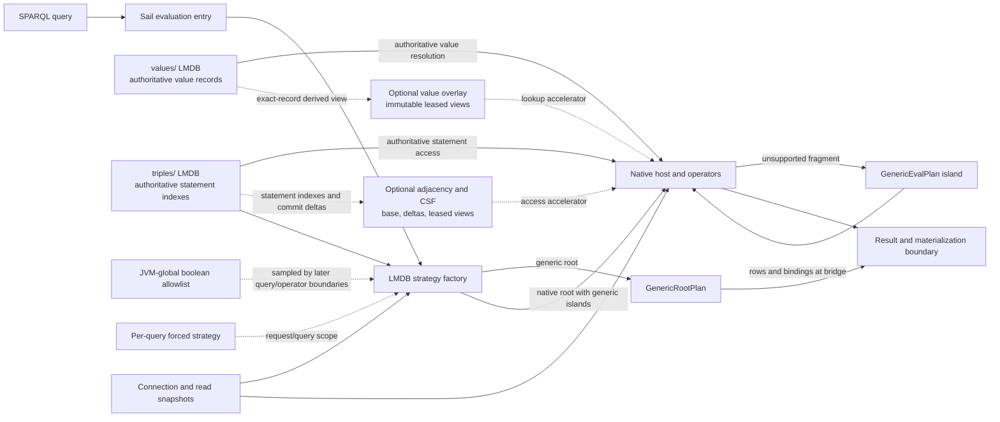

# `optimize-lmdb` developer guide

This guide set explains the changes in the pinned `optimize-lmdb` branch
snapshot and the unchanged contracts those changes rely on. Its source boundary
is merge base `4aec7e9a2223d873b1c1a7703aad4c87bf8354df` through pinned `HEAD`
`a869fe298dc4700ce956bcaf9fece3745c57fe05`. The supplied local
`origin/develop` ref was `5eee576f5ad74725852feae859a0f9010dae10ff`; the range
was computed from the explicit merge base, not inferred from the local ref
name.

The exact changed-path ledger is [changed-paths.tsv](changed-paths.tsv), with
the path-family ownership and feature audit in
[integration-inventory.md](integration-inventory.md). The comparison has
1,786 changed-path records: 1,481 added, 302 modified, one deleted, and two
renamed; Git reports 2,381,547 insertions and 9,346 deletions. These are path
and diff totals, **not a feature count**. Generated parser output, tests,
fixtures, dated measurements, experiments, and developer workflow assets are
included. The guides distinguish those supporting surfaces from runtime
features.

This is source documentation, not a test or benchmark report. No application,
build, test, benchmark, custom script, validator, browser, or documentation page
was executed for this work. Source test names point to coverage contracts, not
to passing evidence. Throughput and memory improvements are not claimed unless
a dated report itself supports the specific workload and snapshot.

## Architecture at a glance

The diagram's arrows show ownership and data/control flow only. The
`values/` and `triples/` environments are separate LMDB environments, so their
ordered commit path is not one cross-environment native transaction. Value
overlays and adjacency/CSF are derived accelerators that can be unavailable or
rebuilding while the authoritative store remains usable. Native and generic
evaluation can coexist in one host through supported fragments and row/binding
bridges. A whole-plan decline can select another proposal or generic path
before result output when that call path allows it; an error after streaming
begins is not transparently retried as a fresh plan. Bulk generation recovery
is a separate staged promotion protocol, not the live-store adjacency publish
mechanism.

Accessible text equivalent: a query enters through the Sail and LMDB strategy
factory, which can host supported work natively and retain generic tuple
evaluation for unsupported islands, exchanging rows/bindings at the bridge.
The generic-root candidate (`GenericRootPlan`) and a generic island inside a
native-root candidate (`GenericEvalPlan`) are separate paths.
Query execution reads connection-scoped snapshots from authoritative value
and statement stores and can borrow derived value-overlay and adjacency views.
Allowlisted booleans are JVM-global and sampled at their individual read
boundaries; a forced strategy belongs to a query. These relationships do not
make commit, fallback, or result streaming atomic across the boxes.

## Choose a reading path

| Reader goal | Start here |
|---|---|
| Understand query strategy eligibility, generic/native hosting, and fallback | [Routing and hosts](query-routing-and-hosts.md#entry-point-and-native-source-requirements), then [strategy families](query-strategy-families.md#dispatch-points) and [arbitration](query-arbitration-and-explanation.md#candidate-admission-selection-and-opening). |
| Change join ordering or factorized execution | [Join families](query-joins-and-factors.md#join-planning-starts-with-algebra-boundaries), [packed factorized trees](query-joins-and-factors.md#packed-factorized-trees), and [optimizer/statistics](query-optimizer-and-statistics.md#which-optimizer-pipeline-is-active); compare shared generic safeguards in [evaluator semantics](integration-query-evaluation.md#join-evaluation-when-bind-joins-are-an-as-if-optimization). |
| Change an access method, path, expression, or code generator | [Physical access](query-physical-access.md), [paths and special operators](query-paths-and-special-operators.md), [expression semantics](query-expression-semantics.md), and [IR/code generation](query-ir-and-codegen.md). |
| Diagnose cache retention or first-row latency/memory | [Cache ownership and invalidation](query-plan-caches-and-invalidation.md#cache-inventory), [query memory/result lifecycle](query-memory-and-result-lifecycle.md#explicit-query-memory-accounting), and [storage leases](storage-adjacency-lifecycle.md#commit-capture-and-immutable-publication). |
| Operate LMDB properties, choose a strategy, or use Workbench explain | [Runtime controls and Workbench](integration-runtime-controls-and-workbench.md), then [query configuration](query-configuration.md#runtime-property-registry) and [plan explanation](integration-plan-explanation-and-telemetry.md). |
| Change persistent encodings, commits, recovery, or derived indexes | [Storage overview](storage-overview.md#read-and-write-boundaries), [value records](storage-values-and-records.md), [transactions](storage-transactions-and-async-writes.md), and [adjacency lifecycle](storage-adjacency-lifecycle.md). |
| Use or extend the bulk-load command | [Bulk CLI and distribution](integration-bulk-loading.md), then [storage ingestion and recovery](storage-bulk-ingestion-recovery.md). |
| Trace SPARQL or shared repository behavior | [Language/parser](integration-sparql-language.md), [shared query structures](integration-shared-query-structures.md), [federation](integration-federation-semantics.md), [Sail lifecycle](integration-sail-source-lifecycle.md), and [query lifecycle](integration-query-lifecycle.md). |
| Find the test map, benchmarks, or developer workflow | [Query test map](query-test-map.md), [compliance/regressions](integration-compliance-and-regression-map.md), [performance evidence](integration-performance-evidence.md), and [developer tooling/build](integration-developer-tooling.md). |

## Native-query feature catalog

The following rows enumerate the query-engine feature areas and point to the
guide sections that describe their implementation, boundaries, costs, and
source coverage. “Native” means an available LMDB-specific path for documented
shapes; it does not mean all SPARQL algebra is compiled to native execution.

| Feature area | What changed or is covered | Developer guide |
|---|---|---|
| Routing, capability, and plan hosts | Factory route, candidate/host distinction, algebra census versus actual lowering, root compilation, generic roots/islands and pre-output fallback boundaries. | [Routing and hosts](query-routing-and-hosts.md#entry-point-and-native-source-requirements) |
| Native operator families | Row scans, joins, ordering, grouping, aggregates, structural versus forceable strategy names, gates, decline reasons, and resource lifecycle. | [Strategy families](query-strategy-families.md#dispatch-points) |
| Joins and factorization | Join-family eligibility, row/factor representations, packed f-trees, aggregate/tail consumers, ownership and memory costs. | [Joins and factors](query-joins-and-factors.md#join-planning-starts-with-algebra-boundaries), including [packed factorized trees](query-joins-and-factors.md#packed-factorized-trees) |
| Physical statement access | Native query sources, source identity and composite datasets, exact scan/probe arbitration, seek, adjacency-domain routes, and fallback/error boundary. | [Physical access](query-physical-access.md) |
| Paths and special operators | Arbitrary and zero-length paths, memo/frontier routing, triple/reified/annotation refs, EXISTS, tuple functions, and correlated LATERAL. | [Paths and special operators](query-paths-and-special-operators.md) |
| Expression execution | SPARQL value/error outcomes, native function families, exact fallback boundaries, value decoding and memory implications. | [Expression semantics](query-expression-semantics.md) |
| IR, Janino, and specialization | Shape-only IR, whole-stage Janino versus hidden-class batch specialization, separate gates, compilation and resource-failure boundaries. | [IR and code generation](query-ir-and-codegen.md) |
| Optimizer and statistics | Pipeline selection, semantic rewrite guards, join enumeration, store estimates, node-domain summaries and learned selectivity. | [Optimizer and statistics](query-optimizer-and-statistics.md#which-optimizer-pipeline-is-active) |
| Strategy arbitration and explanations | Candidate admission, cost/preferences, open/decline/retry states, forceable names, explain records and telemetry. | [Arbitration and explanation](query-arbitration-and-explanation.md#candidate-admission-selection-and-opening) |
| Cost learning and adaptation | Regimes/posteriors, calibration, best-observed state, probes, hedges, censoring, persistence and per-query/process/store ownership. | [Cost learning and adaptation](query-cost-learning-and-adaptation.md#bounded-probes-censoring-and-hedges) |
| Plan/runtime caches | Compiled plans, kernels, paths, prefix runs, WCOJ and generic-island caches, identity certificates, invalidation, owners and retained memory. | [Cache ownership and invalidation](query-plan-caches-and-invalidation.md#cache-inventory) |
| Query memory and result lifetime | Query budgets, batch/row representations, native value resolution, first-result boundary, close/cancel ownership and detached results. | [Query memory and result lifecycle](query-memory-and-result-lifecycle.md#explicit-query-memory-accounting) |
| Runtime property reference | Allowlisted gates, declared defaults and parser modes, sampling points, active-query caveats, and excluded construction/layout controls. | [Query configuration](query-configuration.md#runtime-property-registry); wider HTTP/UI scope in [runtime controls](integration-runtime-controls-and-workbench.md#runtime-property-registry) |
| Test and fixture map | Focused source tests grouped by route, optimizer, operator, cache, cancellation, semantics, and compliance. | [Query test map](query-test-map.md) |

Query-specific source inventory and ownership are in
[query-inventory.md](query-inventory.md#feature-groups-and-guide-destinations).
Cross-cutting contracts for function determinism, join/replay safety, generic
ordering, and query-fatal errors are in
[shared evaluator semantics](integration-query-evaluation.md).

## Storage feature catalog

Storage docs distinguish durable facts from rebuildable accelerators, native
mapped memory from heap metadata, and source-observed limits from measurements.
Cross-environment commit and bulk-generation publication details must be read
in the guides before describing a change as atomic.

| Feature area | What changed or is covered | Developer guide |
|---|---|---|
| Store architecture and query access boundary | `values/` and `triples/` authorities, connection/read views, transaction boundary, compatibility layers, estimator overview. | [Storage overview](storage-overview.md#component-map) |
| Value IDs and persistent records | Inline/reference ID fields and ordering, record codec, namespace/triple-term records, refcounts, retired IDs and layout/version compatibility. | [Values and records](storage-values-and-records.md#value-ids-bit-fields-and-ordering) |
| Transaction, resize, prepared import and async index writes | LMDB transaction ownership, map/read coordination, value-before-triple ordering, fresh-value sessions, revision/cache invalidation and failure recovery. | [Transactions and async writes](storage-transactions-and-async-writes.md#ordinary-sail-transaction-sequence) |
| Compressed value overlay | Exact-record parsing, packed pages/runs, snapshot publication, unknown/miss fallback, lease retention, memory admission and compaction. | [Value overlay](storage-value-overlay.md) |
| Paged CSF encoding | Four adjacency planes, page header/version, payload vectors, IDs, page ownership, shard layout and lookup costs. | [CSF format](storage-csf-format.md#four-logical-planes) |
| Direct adjacency lifecycle | Empty/populated-store build, delta capture, revision continuity, immutable base+overlay state, gap/failure recovery, read-view leases and budgets. | [Adjacency lifecycle](storage-adjacency-lifecycle.md#build-catch-up-and-cutover) |
| B-tree page cardinality estimates | Pinned mapping/read-transaction lifetime, bounded page walk, resize-generation protocol, fallback estimator and estimator consumers. | [Storage estimate mechanism](storage-overview.md#page-walking-cardinality-estimates); [query consumers](query-optimizer-and-statistics.md#statistics-available-to-query-planning) |
| Bulk staging and generation recovery | Input contract, partitioning, dependency analysis, external sorting/spooling, resource controls, durable workspace and recoverable promotion. | [Bulk ingestion/recovery](storage-bulk-ingestion-recovery.md) and [CLI contract](integration-bulk-loading.md) |

Storage implementation and path ownership are cataloged in
[storage-inventory.md](storage-inventory.md#feature-groups-and-source-anchors).
The 173 storage-owned and 294 query-owned production Java paths under the
changed LMDB tree are listed with their root-package boundary there and in the
[query inventory](query-inventory.md#query-and-storage-ownership-boundary).

## Shared RDF4J, integration, and developer feature catalog

These features extend beyond `core/sail/lmdb`. Some are runtime changes; other
changed files are tests, packaging, research, or maintenance support. The
[path-family map](integration-inventory.md#path-family-coverage-map) maps every
changed family/count to its guide, including generated and non-production
surfaces.

| Feature area | What changed or is covered | Developer guide |
|---|---|---|
| Shared query evaluation semantics | Repeatability/determinism contract, pinned function implementations, safe join reordering/injection, replay join, VALUES placement and strict ORDER BY handling. | [Shared evaluator semantics](integration-query-evaluation.md) |
| Shared mappings and model contracts | Binding compatibility index, possible versus assured names, model/datatype lookup, reified references and transient explanation metadata. | [Shared query structures](integration-shared-query-structures.md) |
| Parser and query rendering | Prefix escaping, expression-valued triple components, parser AST generation, `STABLE_INDEX` syntax boundary, renderer coverage, and a reusable generated test-query stream exported as a test JAR to LMDB coverage and benchmark consumers. | [SPARQL language](integration-sparql-language.md); [generated query corpus and evidence boundaries](integration-performance-evidence.md#shared-generated-query-corpus) |
| Federation contract | One logical `SERVICE` invocation by default, explicit row correlation/partition opt-in, local compatible join and atomic `SERVICE SILENT` failure behavior. | [Federation semantics](integration-federation-semantics.md) |
| Sail branch/source lifecycle | Snapshot leases, changeset compact-add path, listener semantics, transaction-local mutation barriers and ordered source access. | [Sail source lifecycle](integration-sail-source-lifecycle.md) |
| Iteration timeout and operation cancellation | Optional ordered seek, cooperative timeout checks, exact iterator cleanup, existing server/client query/explain IDs and Workbench cancel routes. | [Query lifecycle](integration-query-lifecycle.md) |
| LMDB runtime controls and Workbench | 99-name JVM-global property protocol, per-query forced strategy, JSON/auth/error contracts, Workbench wrappers/explain and query-duration scope. | [Runtime controls and Workbench](integration-runtime-controls-and-workbench.md); [property reference](query-configuration.md) |
| Plan explanation and telemetry | Generic plan metadata, decision records, source/query timing scopes, Workbench and developer explanation surfaces. | [Plan explanation and telemetry](integration-plan-explanation-and-telemetry.md) |
| Repository/server resilience | Per-repository listing exception isolation and servlet handling of `OutOfMemoryError` cleanup/rethrow. | [Repository and server runtime](integration-repository-and-server-runtime.md) |
| Bulk-loader CLI and distribution | Standalone Java command, repo launcher, SDK shell/batch entry points, inputs/options, low-disk halt behavior and exits. | [Bulk CLI and packaging](integration-bulk-loading.md) |
| Build and isolated workspace changes | Java/Janino/runtime dependency context, test output/temp properties, isolated Maven build roots, assembly inputs and CI parser-patch check. | [Build and packaging](integration-build-and-packaging.md) |
| Developer tooling | AST patch manager, Maven/report helper workflows, changed `.agent`/`.codex` support, and pathname-only `.claude` classification. | [Developer tooling](integration-developer-tooling.md) |
| Benchmarks and research tools | Benchmark query sets, microbenchmarks, plan snapshot workflow, standalone experiments and 135 dated report/artifact paths. | [Performance evidence](integration-performance-evidence.md) |
| Compliance and cross-store regression suites | Stable dynamic test identities, frozen LMDB baseline handling, federation semantics and Memory/Native store test-only changes. | [Compliance and regression map](integration-compliance-and-regression-map.md) |
| Published LMDB docs and tutorial | Operator docs plus standalone adjacency tutorial data/format boundaries and browser harness source. | [Docs and tutorial assets](integration-doc-assets-and-tutorial.md) |

## Evidence method and compatibility notes

Current source at the pinned commit is authoritative for mechanism, default,
unit, scope, lifetime, failure behavior, and property read time. The guides
link to changed tests and fixtures as source coverage but do not say those
tests passed here. Benchmark reports under `benchmark-results/` are historical
observations tied to their recorded code, host, dataset, query, JVM and command;
they are not transferred to current source without a matching provenance.

This index labels branch changes separately from supporting tests,
experiments, reports, and unchanged prerequisites; individual guides state
their comparison boundary and identify unchanged contracts where needed.
Rationale is stated as
the concrete tradeoff implied by code, not as undocumented author intent.
Asymptotic work, allocations, retained state, and result boundaries are
described where code establishes them. The guides do not infer a universal
speedup, full native-SPARQL coverage, or measured memory reduction.

Configuration is scoped explicitly: the runtime-property allowlist is
JVM-wide; a repository selected in Workbench is not a repository-local
property scope; forced strategy is per query (with an HTTP client session
convenience setter applying to subsequent queries on that session); store
construction/layout and size/budget settings are not live boolean controls.
Individual consumers sample flags at different boundaries, so a write is not
a blanket refresh of plans and active queries. The query configuration page
lists source-backed parser conventions/defaults and notes any source
discrepancy rather than silently choosing one.

The branch comparison and family totals are documented in
[integration-inventory.md](integration-inventory.md). `CLAUDE.md` appears in
the path ledger only as a changed pathname; its contents were not read.
