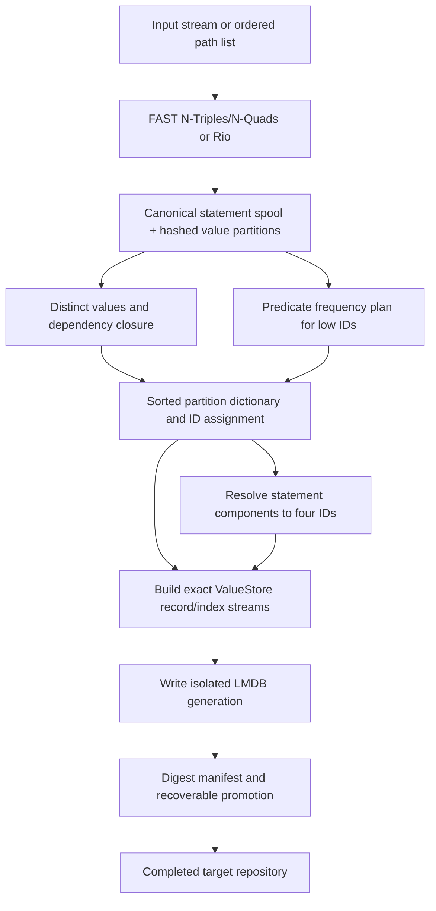

# LMDB bulk ingestion and recovery

This guide records the source contract at pinned branch `a869fe298dc4700ce956bcaf9fece3745c57fe05`. It covers the storage-side loader pipeline and filesystem recovery. Command-line and Workbench entry points are covered by [integration bulk loading](integration-bulk-loading.md). The loader builds a fresh repository generation; it is not the live-store fresh-value session described in [transaction and async writes](storage-transactions-and-async-writes.md).

**Branch delta and prerequisites:** the branch adds a staged, spill-backed bulk-load pipeline, Fast N-Triples/N-Quads parser, resumable control workspace, and recoverable fresh-target promotion. It reuses the established value-ID rules and persistent store codecs rather than defining a parallel on-disk dictionary; the live Sail fresh-value session is a separate transaction path with different ownership and failure boundaries.

## Input and ownership contract

`LmdbBulkLoader.builder(target, config)` accepts an absent or empty target directory. The generation writer rejects symlink targets and refuses existing target content other than its own lock during a new load. `load(Path, RDFFormat)` owns and closes the input file stream. `load(InputStream, baseUri, RDFFormat)` does not close the caller's stream. Multi-file `load(List<PathInput>)` copies the input list, rejects an empty list, and opens/closes the files in list order. That order feeds the same staged stream and therefore matters for repeated namespace declarations and statement ordinals, although the resulting statement indexes are sorted by their configured key order.

`ParserMode.AUTO` selects the byte parser for N-Triples and N-Quads and Rio for other formats. `FAST` rejects a format outside those two; `RIO` always uses Rio. The fast parser delivers canonical byte terms into the stager instead of allocating a model object and Java string for every term on its hot path. Its input path auto-detects gzip by the `1f 8b` header. It uses a 4 MiB read buffer, starts its line buffer at 1 KiB, grows it as needed up to a 128 MiB line limit, and rejects RDF-star nesting deeper than 64. These are parser boundaries, not recommended sizing targets. See [`FastNTriplesParser`](../../../core/sail/lmdb/src/main/java/org/eclipse/rdf4j/sail/lmdb/bulk/FastNTriplesParser.java), [`LmdbBulkLoader`](../../../core/sail/lmdb/src/main/java/org/eclipse/rdf4j/sail/lmdb/bulk/LmdbBulkLoader.java), and [`LmdbBulkLoaderEngine`](../../../core/sail/lmdb/src/main/java/org/eclipse/rdf4j/sail/lmdb/bulk/LmdbBulkLoaderEngine.java).

## Pipeline and why the order matters

The staged representation is deliberately not `ValueStore`'s physical record format. [`CanonicalTermCodec`](../../../core/sail/lmdb/src/main/java/org/eclipse/rdf4j/sail/lmdb/bulk/CanonicalTermCodec.java) supplies an unambiguous typed byte key for RDF values and embedded triple terms. It is used for equality-preserving partition and sort keys; a later writer encodes the exact [`ValueStoreRecordCodec`](../../../core/sail/lmdb/src/main/java/org/eclipse/rdf4j/sail/lmdb/ValueStoreRecordCodec.java) bytes. Keep these layers separate when modifying either format.

During staging, each statement gets an input ordinal and writes canonical subject, predicate, object and optional context bytes. Every non-inline value occurrence is routed by a 64-bit hash into `hash & (partitionCount - 1)`. Because the partition count must be a power of two, the low bits select the partition. A front cache merges repeated roles for keys it retains; later distinct/dependency passes must still perform equality checks rather than trusting the hash alone. The stager records nested triple-term components, literal datatypes, IRI namespace strings, namespaces, predicate counts and inline-literal occurrences. Predicate frequency is also counted inside embedded triple terms. If configured literal inlining can round-trip a literal under the value-ID rules, the stager records it as inline and does not reserve a dictionary record for it.

After staging, the loader computes a dependency closure so every persisted IRI namespace, datatype and triple-term component has an ID before its dependent record is built. It ranks predicates from occurrence counts and reserves the low IDs according to the predicate plan. It then sorts/deduplicates the partitioned canonical keys, chooses persisted versus inline values, and builds a mapped partition dictionary with IDs. The resolver translates each statement component through that dictionary and emits an ID-quad spool; absent context is the default context ID. A later record pass constructs value main records, reverse/reference rows, optional value-hash rows, RDF-star term rows, statement-index rows and context counts using the same storage codecs as the live store. The exact-byte dictionary records are built before opening the new LMDB generation. See [`ValueDependencyCollector`](../../../core/sail/lmdb/src/main/java/org/eclipse/rdf4j/sail/lmdb/bulk/ValueDependencyCollector.java), [`PartitionValueDictionaryBuilder`](../../../core/sail/lmdb/src/main/java/org/eclipse/rdf4j/sail/lmdb/bulk/PartitionValueDictionaryBuilder.java), [`ResolvedIdQuadSpool`](../../../core/sail/lmdb/src/main/java/org/eclipse/rdf4j/sail/lmdb/bulk/ResolvedIdQuadSpool.java), [`ValueStoreBulkRecords`](../../../core/sail/lmdb/src/main/java/org/eclipse/rdf4j/sail/lmdb/bulk/ValueStoreBulkRecords.java), and [`NativeStoreWriter`](../../../core/sail/lmdb/src/main/java/org/eclipse/rdf4j/sail/lmdb/bulk/NativeStoreWriter.java).

The phase enum names the durable work frontiers: `PREFLIGHT`, `STAGE_INPUTS`, `DISTINCT_AND_ANALYZE_VALUES`, `PLAN_VALUE_IDS`, `BUILD_MAPPED_DICTIONARY`, `RESOLVE_IDS`, `BUILD_NATIVE_RUNS`, `WRITE_GENERATION`, `VALIDATE_GENERATION`, and `PUBLISH_AND_CLEAN`. The current engine explicitly marks the phases it executes; `VALIDATE_GENERATION` is present in the phase enum and cleanup switch but is not separately started/completed in `LmdbBulkLoaderEngine`. Artifact digest validation is part of generation promotion/recovery, not a separate live phase marker. Do not infer a persistent “complete” validation phase merely from the enum.

## Resource limits and disk/heap tradeoffs

The builder defaults are captured when the loader is built. `memoryBudgetBytes` is a positive working-memory budget supplied to sorters, dictionary construction and staging caches; it is a coordination input to those algorithms, not a process-wide heap cap or a promise that total live allocations never exceed it. `partitionCount` controls the number of value partitions and must be a positive power of two. `maxOpenFiles` bounds the bucket/sorter output limiter. The builder exposes `workers` and `queueBatches` with zero queue batches meaning `2 × workers`, and records both in workspace/progress metadata; the current `LmdbBulkLoaderEngine` passes them only to `BulkLoadProgress`, so they do not change loader scheduling or allocate a bounded action queue in this pinned implementation. Do not infer active parallelism from the option names or defaults. Writer transaction limits cap both record count and bytes per LMDB append transaction.

| Builder option | Default | Units / effect |
| --- | --- | --- |
| `parserMode` | `AUTO` | Enum: `AUTO`, `FAST`, `RIO`. |
| `memoryBudgetBytes` | `max(32 MiB, min(1,024 MiB, maxHeap / 4))` | Bytes used as the staged-work working budget. |
| `partitionCount` | 256 | Positive power-of-two partitions. |
| `maxOpenFiles` | 1,024 | Maximum bounded bucket/sort output handles. |
| `workers` | `processors − 1` when processors ≥ 4, otherwise processors, clamped to 1–32 | Captured in workspace/progress; not used to schedule loader work in the current engine. |
| `queueBatches` | `2 × workers` | Captured in workspace/progress; the current engine does not create a corresponding batch queue. |
| `writeTransactionRecords` | 100,000 | Maximum records per writer transaction. |
| `writeTransactionBytes` | 64 MiB | Maximum bytes per writer transaction. |
| `compression` | `FASTEST` | Per-artifact codec selection. |
| `progressListener` | `ProgressListener.NONE` | Optional callback; callback failures are logged and ignored. |
| `temporaryDirectory` | unset | Recorded as spill-directory metadata; the current workspace and phase artifacts are created under the target's sibling control directory. Do not assume this setting relocates all current work files. |

Under `FASTEST`, staged inputs use LZ4 high-ratio level 9; busy bucket, sorter, spool and index files use the fast codec; the small predicate-count and predicate-ID-plan files stay raw. `NONE` uses raw files; `level(n)` applies one LZ4 high-ratio level to every artifact, where `n` is 1–17; the `key=codec` grammar can override artifact/group choices. LZ4-compressed artifacts can be read independent of compression level, but switching an artifact to or from raw changes its framing. Resume therefore honors the workspace's recorded compression rather than the caller's newer request. This preserves compatibility with staged/spool bytes already on disk. See [`BulkCompression`](../../../core/sail/lmdb/src/main/java/org/eclipse/rdf4j/sail/lmdb/bulk/BulkCompression.java), [`BulkArtifact`](../../../core/sail/lmdb/src/main/java/org/eclipse/rdf4j/sail/lmdb/bulk/BulkArtifact.java), and [`BulkCodec`](../../../core/sail/lmdb/src/main/java/org/eclipse/rdf4j/sail/lmdb/bulk/BulkCodec.java).

Peak disk demand is input-dependent and can include staged statements and value buckets, dependency buckets, external sort runs, resolved ID quads, encoded native record streams, and the target-generation LMDB files at once. Completed frontiers are reclaimed as soon as later phases no longer need them; an interrupted incomplete phase has its known partial outputs deleted and is rerun. A resumable workspace intentionally retains its completed artifacts. The temporary-byte result measures workspace files counted at the implementation's result boundary; it is not a guaranteed total including filesystem metadata, LMDB map reservation, OS page cache or files retained outside the control directory.

## Durable workspace and resume semantics

The control workspace is a sibling named `.<target-name>.lmdb-bulk-load`. It stores `state.properties`, a previous valid state copy, live `progress.properties`, and phase artifacts. State records have a version, monotonically advanced revision, and SHA-256 checksum; the newest valid current/previous revision wins on reopen. Progress is sampled separately once per second, while phase transitions persist durable state. This separation lets a stale or torn progress snapshot remain telemetry rather than authoritative phase state.

At a failure, cancellation, or process interruption before completion, the workspace is retained. `UnfinishedBulkLoad.find(target)` reads that workspace without locking it; `discover(root, maxDepth)` scans shallowly, does not follow symbolic links, and skips directories it cannot list. Discovery does not make the state exclusive or resume it. `resume()` opens the workspace and the target lock before continuing. If staging is complete, it reuses staged records without asking for inputs; if staging is incomplete, a path load can replay its recorded ordered file list, but a caller-owned stream cannot be reopened. A workspace produced by an older loader may not have recorded input paths or `BulkLoadSettings`; the `UnfinishedBulkLoad` API reports these absences instead of inventing a replay source.

Structural settings are triple indexes, triple-term indexes, inline literals, ordered numeric IDs, value-hash-cache setting and partition count. A recorded configuration with a mismatch is rejected because the files and ID assignments already depend on it. Memory, maximum open files, worker/queue sizes and transaction thresholds are resource controls and may change on resume. Compression is read separately and the recorded value wins; old two-tier workspace metadata forces the historically raw predicate-count and predicate-plan artifacts to `NONE` during restore. See [`BulkLoadSettings`](../../../core/sail/lmdb/src/main/java/org/eclipse/rdf4j/sail/lmdb/bulk/BulkLoadSettings.java), [`BulkLoadWorkspace`](../../../core/sail/lmdb/src/main/java/org/eclipse/rdf4j/sail/lmdb/bulk/BulkLoadWorkspace.java), and [`UnfinishedBulkLoad`](../../../core/sail/lmdb/src/main/java/org/eclipse/rdf4j/sail/lmdb/bulk/UnfinishedBulkLoad.java).

## Target generation and interrupted promotion

The loader writes a new isolated LMDB generation rather than modifying a live target. The target directory receives a `.lmdb-bulk-load.lock` while a generation is being prepared; the marker `.lmdb-bulk-load.incomplete` names a sibling child directory `.lmdb-bulk-generation-<uuid>`. After the store files and their exact LMDB records are built, the promotion path describes every generated artifact and writes `.lmdb-bulk-load.manifest` with format version 2, names, file/directory types, sizes and SHA-256 digests. It then moves each artifact into the target, forces files and target directory where supported, removes marker/manifest and releases the lock.

Each move tries `ATOMIC_MOVE`, but falls back to a regular move when the filesystem does not support it. Therefore this is a recoverable multi-artifact promotion protocol, not a guarantee that every filesystem exposes a single all-or-nothing directory rename to unrelated readers. The manifest and marker let a later loader finish a valid partially promoted generation: it refuses unexpected target entries, checks that each artifact exists in exactly one of staged or promoted locations and matches its recorded digest, then moves the remainder and forces the target. If listed artifacts mismatch, it deletes only the manifest-listed owned children and generation before discarding the marker. If the marker has no manifest, it deletes the owned unfinished generation only after refusing unexpected entries. It does not broadly clean unrelated target contents. The generated repository becomes a completed loader result after this process and the workspace is marked complete; those steps are distinct from an atomic LMDB transaction spanning the live `values` and `triples` environments.

The loader lock prevents another bulk loader from owning the same target concurrently; it does not establish a query/read contract for an application that opens the directory during promotion. Applications should wait for the loader operation to complete before opening the target. Source: [`LmdbBulkLoadGeneration`](../../../core/sail/lmdb/src/main/java/org/eclipse/rdf4j/sail/lmdb/bulk/LmdbBulkLoadGeneration.java), [`LmdbNativeBulkStore`](../../../core/sail/lmdb/src/main/java/org/eclipse/rdf4j/sail/lmdb/LmdbNativeBulkStore.java), and [`LmdbBulkLoaderEngine`](../../../core/sail/lmdb/src/main/java/org/eclipse/rdf4j/sail/lmdb/bulk/LmdbBulkLoaderEngine.java).

## Operational questions and change guidance

**Can a caller stream be closed by the loader?** No. `load(InputStream, ...)` leaves it caller-owned. File and `PathInput` methods close the file streams they open.

**Can a resumed run use a different partition count or inline-ID rule?** Not after the workspace recorded structural settings. Resume must use the saved structure; its public inspection object exposes the recorded settings and staged input paths.

**Does resume always need the original RDF input?** No. A complete staging frontier is sufficient. Before staging completion, only recorded path inputs can be opened again; a prior caller-owned stream cannot be replayed.

**Is the bulk workspace in the target directory?** Publication controls and the generation directory are under the target. Intermediate phase files use the sibling control workspace. Keep free space available on the filesystems containing both the control workspace and target; the generation and control directory may coexist during writing/promotion.

**Can interrupted promotion be mistaken for completed data?** A later loader consults the marker/manifest and validates artifacts before finishing a partial promotion. The source does not promise that an unrelated reader that ignores the loader protocol will never observe intermediate target entries.

When extending this pipeline, preserve canonical equality and recursive term closure before ID assignment, use the authoritative live-store codec when producing durable records, bound both memory and open-output resources, make every phase output either replayable or removable, and name which configuration changes invalidate persisted workspace files. For new promotion artifacts, include safe child-name validation, a stable digest description, and recovery behavior for source present/target absent, source absent/target present, both, and neither.

Useful intended-contract references are [`FastNTriplesParserTest`](../../../core/sail/lmdb/src/test/java/org/eclipse/rdf4j/sail/lmdb/bulk/FastNTriplesParserTest.java), [`LmdbBulkLoaderContractTest`](../../../core/sail/lmdb/src/test/java/org/eclipse/rdf4j/sail/lmdb/bulk/LmdbBulkLoaderContractTest.java), [`UnfinishedBulkLoadTest`](../../../core/sail/lmdb/src/test/java/org/eclipse/rdf4j/sail/lmdb/bulk/UnfinishedBulkLoadTest.java), [`BulkLoadProgressTest`](../../../core/sail/lmdb/src/test/java/org/eclipse/rdf4j/sail/lmdb/bulk/BulkLoadProgressTest.java), [`StatementIndexBulkRecordsTest`](../../../core/sail/lmdb/src/test/java/org/eclipse/rdf4j/sail/lmdb/bulk/StatementIndexBulkRecordsTest.java), and [`TripleTermIndexBulkRecordsTest`](../../../core/sail/lmdb/src/test/java/org/eclipse/rdf4j/sail/lmdb/bulk/TripleTermIndexBulkRecordsTest.java). These are source-level contract references; no test or loader was executed for this documentation task.

Related storage guides: [overview](storage-overview.md), [value IDs and record formats](storage-values-and-records.md), [transactions and fresh-value ingestion](storage-transactions-and-async-writes.md), and [adjacency lifecycle](storage-adjacency-lifecycle.md). See also [integration entry points](integration-bulk-loading.md) and the existing [LMDB store documentation](../../../site/content/documentation/programming/lmdb-store.md).
