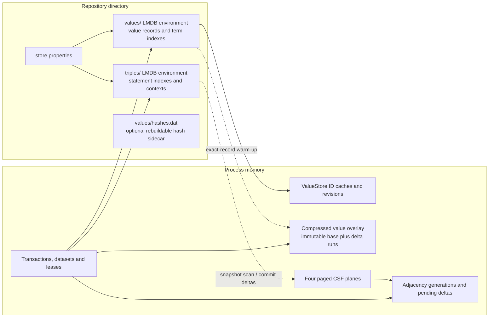
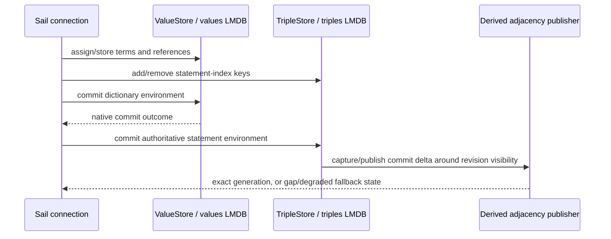

# LMDB storage architecture

This guide describes storage behavior checked against current source revision
`a678d9a369deded63520cd86b6c30152485b7f6d`. The historical feature inventory
covers merge base `4aec7e9a2223d873b1c1a7703aad4c87bf8354df` through inventory
snapshot `a869fe298dc4700ce956bcaf9fece3745c57fe05`; the branch README records
these revision roles. This architecture guide is aimed at developers changing
the LMDB Sail and is not a benchmark report.

The central design rule is that LMDB statements and the value dictionary are authoritative. The direct-adjacency index, value overlay, planner statistics and small hash caches are accelerators with explicit ownership and fallback rules. A declined or incomplete accelerator must not change the result produced from the authoritative LMDB transaction.

**Branch delta and prerequisites:** this branch adds the compressed value-record overlay, generation-published direct adjacency over paged CSF, fresh-value/prepared-index ingestion work, value-ID retirement/recovery, and mapping-safe page-walk estimation. The repository's two LMDB environments, ordered statement indexes, dictionary records, and ordinary Sail commit path are the persistence baseline these features extend; the guides below distinguish changes to those paths from rebuildable accelerators.

## Component map

`LmdbSailStore` creates two LMDB environments under `values/` and `triples/`. The value environment stores dictionary records, allocator/reference-count/retirement metadata and RDF-star term indexes. The triple environment stores the statement indexes and contexts. `store.properties` records index selections and writer capabilities. `ValueStoreHashFile` optionally maintains a separate mapped `hashes.dat` plus an integrity file; it is a cache, not the dictionary's source of truth. See [`LmdbSailStore`](../../../core/sail/lmdb/src/main/java/org/eclipse/rdf4j/sail/lmdb/LmdbSailStore.java#L867), [`ValueStore`](../../../core/sail/lmdb/src/main/java/org/eclipse/rdf4j/sail/lmdb/ValueStore.java#L1980), [`TripleStore`](../../../core/sail/lmdb/src/main/java/org/eclipse/rdf4j/sail/lmdb/TripleStore.java#L270), and [`ValueStoreHashFile`](../../../core/sail/lmdb/src/main/java/org/eclipse/rdf4j/sail/lmdb/ValueStoreHashFile.java).

There are four classes of memory to keep separate when reasoning about capacity:

| Resource | Examples | What its limit/accounting means |
| --- | --- | --- |
| Java heap | maps, small caches, cursor metadata, temporary arrays | Collected by the JVM; accounting is often a conservative model, not an RSS measurement. |
| Native/off-heap memory | CSF pages, adjacency run arenas, overlay slabs | Released by the owning allocator/arena after its references and leases end. |
| LMDB mapping and resident pages | mapped `data.mdb` pages, optional mapped hash-file pages | Map size reserves address space; resident mapped pages and OS page cache vary with access and the OS. They are not the same as heap or index-ledger bytes. |
| Durable and temporary disk | LMDB environment files, `store.properties`, bulk workspaces | Persists across process lifetime according to the relevant store or import protocol. Derived in-memory adjacency/CSF pages are not serialized to the LMDB repository. |

The LMDB environments use `MDB_NOTLS`; when `forceSync` is false, the source enables `MDB_NOSYNC`, `MDB_NOMETASYNC`, and `MDB_WRITEMAP`. `noReadahead` adds `MDB_NORDAHEAD`. These flags express durability and access-pattern tradeoffs; they do not change the logical record contract. Both normal store constructors derive their initial map capacity from the config, align it to the LMDB page size, and only enlarge an existing environment when the configured map is larger. When auto-grow is enabled (the `LmdbStoreConfig` default), the write path checkpoints as needed, grows the map by at least doubling or the computed required reservation, and resumes. A larger map is not itself a promise that the same amount of physical RAM is resident. See [`LmdbStoreConfig`](../../../core/sail/lmdb/src/main/java/org/eclipse/rdf4j/sail/lmdb/config/LmdbStoreConfig.java#L85), [`LmdbUtil`](../../../core/sail/lmdb/src/main/java/org/eclipse/rdf4j/sail/lmdb/LmdbUtil.java#L273), and resize handling in [`ValueStore`](../../../core/sail/lmdb/src/main/java/org/eclipse/rdf4j/sail/lmdb/ValueStore.java#L3222) and [`TripleStore`](../../../core/sail/lmdb/src/main/java/org/eclipse/rdf4j/sail/lmdb/TripleStore.java#L3555).

## Read and write boundaries

These are distinct LMDB environments, so the complete repository write is not one native atomic transaction spanning both files. The Sail commits dictionary changes first, records whether that native commit succeeded, then commits the statement environment. A later failure does not undo a completed dictionary commit; cleanup preserves committed ID assignments instead of allowing those identifiers to be reused. Derived adjacency publication happens at the triple store's revision boundary and can be unavailable or fail after authoritative data has advanced. In those cases the index records a gap and the query side falls back to LMDB or schedules a rebuild. Details and boundaries are in [transactions and async writes](storage-transactions-and-async-writes.md) and [adjacency lifecycle](storage-adjacency-lifecycle.md).

Normal reads pin LMDB transaction views and, where applicable, separate value-overlay and adjacency leases. A read can use an accelerator only while its snapshot falls within that accelerator's published revision range and coverage. A miss in the value overlay means “unknown here,” not “absent in the dictionary.” A direct-adjacency decline means “ask the LMDB statement indexes.” Do not collapse either into a semantic negative lookup.

## Compatibility layers

There are several independently versioned or marked formats. Their shared numeric version does not make them one format:

| Layer | Current marker | Meaning |
| --- | --- | --- |
| Store metadata | `LmdbStore.VERSION = 4` in `store.properties` | Persistent repository compatibility and startup migration. Version 4 adds a writer capability for tagged core-datatype literal references; upgrading an existing store's version marker does not retroactively enable that writer encoding. |
| Writer capability flags | `numeric-id-encoding`, `literal-reference-encoding`, `inline-literals`, `canonical-language-tags` | Per-store rules for newly minted IDs or identities, independent of the top-level version. The inline-literal setting affects identity and cannot be switched at reopen. |
| Compact CSF page | `CompactCsfPageFormat.VERSION = 4` | In-memory derived page representation. It is not a persistent LMDB schema or a repository migration marker. |
| Adjacency run | `LmdbAdjacencyRunCodec.PERSISTENT_COMPOSITE_VERSION = 2` | Version for run-graph encoding retained between in-memory generations. “Persistent” here does not mean that adjacency bytes are written into the repository files. |
| Bulk promotion marker | `LmdbBulkLoadGeneration.VERSION = 2` | Durable import-workspace and target-promotion recovery metadata. This is independent of the repository's store version. |

See [value IDs and record formats](storage-values-and-records.md), [CSF format](storage-csf-format.md), and [bulk ingestion and recovery](storage-bulk-ingestion-recovery.md) for the field layouts and upgrade behavior.

## Page-walking cardinality estimates

The page estimator is part of the storage/index layer because it inspects LMDB B-tree pages and is tied to the lifetime of their mapping. Production calls borrow an already-pinned read-only transaction and database handle; a managed mapping view must not outlive the caller's transaction/map generation. Disabling the config option `setPageCardinalityEstimator(false)` or setting `org.eclipse.rdf4j.sail.lmdb.disablePageWalkingEstimator=true` when the store opens selects the RDF4J 5.3.2 cursor sampler. A missing estimator or an `IOException`/`RuntimeException` during the primary page estimate also selects that sampler; failure of only the secondary estimate keeps the primary estimate. These are estimate-path fallbacks, not changes to statement results. Page inspection is bounded by its estimate/sampling policy and may pay native page-inspection and short-lived metadata costs; it can benefit from OS page cache, but this does not make the whole index resident in Java heap. The page-mapping lifecycle contract is covered by source such as [`TripleStore.cardinality`](../../../core/sail/lmdb/src/main/java/org/eclipse/rdf4j/sail/lmdb/TripleStore.java#L3211), [`LmdbBtreeRangeCounter`](../../../core/sail/lmdb/src/main/java/org/eclipse/rdf4j/sail/lmdb/estimate/LmdbBtreeRangeCounter.java), [`LmdbPageCardinalityEstimator`](../../../core/sail/lmdb/src/main/java/org/eclipse/rdf4j/sail/lmdb/estimate/LmdbPageCardinalityEstimator.java), and [`LmdbPageMappingLifecycleTest`](../../../core/sail/lmdb/src/test/java/org/eclipse/rdf4j/sail/lmdb/estimate/LmdbPageMappingLifecycleTest.java). Planner consumers are described in the query guide.

## Extension rules

When adding a storage accelerator or changing a persistent layout:

1. Identify the authoritative LMDB rows and the exact transaction/revision that makes them visible.
2. State whether the new bytes are durable, rebuildable, or only retained for live snapshots. Name their owner and the close/release condition.
3. Make an accelerator miss, capacity refusal, missing coverage, stale revision, and degraded recovery route back to the authoritative implementation.
4. Keep compatibility markers scoped to the layout they version. Add upgrade logic only for durable formats; an in-memory representation change normally requires rebuildability and lifecycle proof instead.
5. Document the full memory quantity: exact native reservation, estimated retained heap, temporary workspace, LMDB map capacity, and disk are different measures.
6. For failure handling, distinguish “native LMDB commit failed” from “native commit succeeded but derived publication or cleanup failed.” The latter must not trigger identifier reuse or claim rollback.

See [the storage feature inventory](storage-inventory.md) for changed-path ownership and the cross-boundary guide links. Existing end-user operational notes live in [`lmdb-store.md`](../../../site/content/documentation/programming/lmdb-store.md); that page is not a substitute for source contracts or current measurements.
