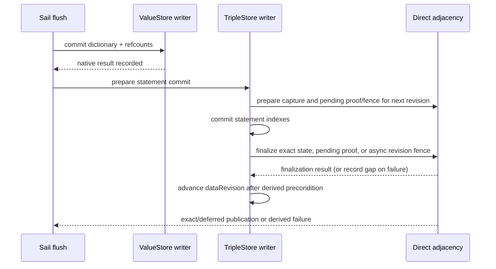

# Transactions, map growth, and asynchronous writes

The Sail spans two native LMDB environments, so transaction ownership and native commit outcomes matter more than method names such as `flush` or `commit`. The lifecycle descriptions were checked against current source revision
`a678d9a369deded63520cd86b6c30152485b7f6d`; relevant sources include [`LmdbSailStore`](../../../core/sail/lmdb/src/main/java/org/eclipse/rdf4j/sail/lmdb/LmdbSailStore.java), [`ValueStore`](../../../core/sail/lmdb/src/main/java/org/eclipse/rdf4j/sail/lmdb/ValueStore.java), [`TripleStore`](../../../core/sail/lmdb/src/main/java/org/eclipse/rdf4j/sail/lmdb/TripleStore.java), and [`TxnManager`](../../../core/sail/lmdb/src/main/java/org/eclipse/rdf4j/sail/lmdb/TxnManager.java).

**Branch delta and prerequisites:** the modified Sail/store path adds prepared statement/index work, a narrowly eligible provisional fresh-value session, post-commit ID safety, revision-bound derived adjacency handoff, and resize-aware mapping lifetimes. The two separate LMDB environment model and native transaction semantics are the prerequisite contract; asynchronous preparation does not turn the value and triple databases into one atomic transaction.

## Environment and map configuration

`LmdbSailStore` opens `dataDir/values` as the value environment and `dataDir/triples` as the statement environment. Each contains its own LMDB `data.mdb` and has its own native transaction IDs, map size and writer. `store.properties` at `dataDir` records store-wide format and index choices. A dictionary transaction ID is therefore not the same clock as the triple store's logical `dataRevision`.

| `LmdbStoreConfig` option | Default | Source-level effect |
| --- | ---: | --- |
| `tripleDBSize` | 10 MiB | Initial/configured map size for `triples/`; page-aligned when opened. |
| `valueDBSize` | 10 MiB | Initial/configured map size for `values/`; page-aligned, with an empty map raised to at least six LMDB pages. |
| `autoGrow` | `true` | Enables map-full reservation/checkpoint and map growth paths. |
| `forceSync` | `false` | When false, both environments use `MDB_NOSYNC | MDB_NOMETASYNC | MDB_WRITEMAP` in addition to `MDB_NOTLS`. When true, those fast-write flags are omitted. |
| `noReadahead` | `false` | When true, opens both environments with `MDB_NORDAHEAD`. |

The values above are config defaults; flags are applied when each environment opens. Initial map size is virtual mapping capacity and does not mean all mapped pages are resident. Existing environments are enlarged if the configured size exceeds the stored current map; startup code does not shrink an existing larger mapping. `LmdbUtil.requiresResize` triggers when the transaction is beyond the configured percent-full threshold (80% in this branch) or its remaining map space is below the larger of the requested reservation and 512 KiB. Growth picks the greater of twice the current size, required capacity, and minimum free space, then aligns upward to the LMDB page size. See [`LmdbStoreConfig`](../../../core/sail/lmdb/src/main/java/org/eclipse/rdf4j/sail/lmdb/config/LmdbStoreConfig.java#L40), [`LmdbUtil`](../../../core/sail/lmdb/src/main/java/org/eclipse/rdf4j/sail/lmdb/LmdbUtil.java#L45), and environment open in [`ValueStore`](../../../core/sail/lmdb/src/main/java/org/eclipse/rdf4j/sail/lmdb/ValueStore.java#L1980) and [`TripleStore`](../../../core/sail/lmdb/src/main/java/org/eclipse/rdf4j/sail/lmdb/TripleStore.java#L270).

Both environments use `MDB_NOTLS`. The value environment allows 256 native readers; `TxnManager` separately admits at most 128 managed read transaction leases, with 127 ordinary slots and one reserved priority slot. An idle reset-mode reader can remain pooled without holding an admission permit. Managed readers are tracked so commits can reset them and map changes can deactivate and reactivate them. Closing a managed reader returns its permit. Untracked pinned readers survive ordinary write resets and renew lazily if reused; they still participate in map deactivation. A map resize invalidates a pinned `SNAPSHOT` transaction rather than silently changing its snapshot, and the caller receives a retryable invalidation failure. Do not keep a mapping-backed view beyond its read transaction or map generation.

When the value environment needs to grow during an active write, `ValueStore.resizeMap` first finishes the active native writer with its pending next-ID and refcount updates accounted for, acquires the resize/write coordination lock, deactivates tracked readers, changes the LMDB map size, starts the replacement writer if needed, then reactivates readers. This can split one logical store-side mutation across an internal checkpoint plus subsequent writer; required allocator/refcount metadata must be included before that checkpoint. Triple-store bulk/record-cache paths similarly reserve capacity before replaying writes. A failed reservation or resize must not be treated as though all prior native writer state is still an open handle: LMDB consumes a transaction handle on commit, including error outcomes. Related sources: [`ValueStore.resizeMap`](../../../core/sail/lmdb/src/main/java/org/eclipse/rdf4j/sail/lmdb/ValueStore.java#L3222), [`TxnManager`](../../../core/sail/lmdb/src/main/java/org/eclipse/rdf4j/sail/lmdb/TxnManager.java#L140), and [`TripleStore` capacity paths](../../../core/sail/lmdb/src/main/java/org/eclipse/rdf4j/sail/lmdb/TripleStore.java#L3555).

For memory accounting, report map capacity, resident mapped pages/page cache, Java heap, file-backed sidecars, and direct-adjacency/overlay native allocations separately. `hashes.dat` has its own mapping; LMDB's maps and the OS page cache are not charged to the adjacency or overlay ledgers.

## Ordinary Sail transaction sequence

`LmdbSailStore.flush()` flushes buffered additions and namespaces, sends any pending async prepare barrier, commits the value dictionary environment first, then asks the triple environment to commit. The statement environment's native commit is authoritative for visibility of statement edits and advances its logical `dataRevision`. Derived direct adjacency participates in that revision boundary but is not another persistent transaction.

The important failure matrix is:

| Failure point | Durable state that may exist | Safe interpretation/action in source |
| --- | --- | --- |
| Before value-store native commit | No committed dictionary update from the active writer. | Roll back writer, clear refcount/cache mutation state and rotate the value revision so IDs from the aborted suffix cannot leak through caches. |
| After value-store native commit, before/during triple-store commit | Dictionary records, allocator state, term-index rows, and reference updates may already be committed; statement changes may still be uncommitted. | `lastNativeCommitSucceeded` is recorded immediately after native success. Sail rollback skips aborting the consumed value transaction and retains fresh-ID session bookkeeping rather than reusing committed IDs. No cross-environment atomic rollback is promised. |
| Triple-store native commit fails before authoritative revision advances | Value environment might already have committed, statement edits have not been confirmed durable. | The value-side assignments are not made reusable by the Sail cleanup path. Orphaned dictionary rows/over-counts are safer than reusing a persisted ID; the source does not claim a two-file atomic commit. |
| Triple-store native commit succeeds, optional adjacency publication fails before revision bump | Statement data is committed, but derived state may not represent it. | The listener marks a revision gap and recovery/rebuild is scheduled; the logical revision advances after the gap so reads can route to authoritative LMDB. |
| Adjacency maintenance/refusal/rebuild failure | Authoritative statement/value state remains usable. | In strict mode the configured maintenance failure policy may report failure; optional projection or derived publication can be unavailable while LMDB fallback remains available. |
| Value GC/recovery drain fails after statement commit | Live dictionary rows remain authoritative for resolution; some now-dead values may remain allocated. | GC is post-commit maintenance. It filters candidate IDs against live triples before deletion, favoring retention/leak over deleting an in-use value. |

`LmdbSailStore.commitDictionaryBeforeTriple`, `flush`, rollback cleanup, `TripleStore` commit failure recovery and `ValueStore.lastNativeCommitSucceeded` are the source of truth. Avoid describing this as XA, a distributed transaction, or atomic across the `values/` and `triples/` directories.

## Async prepared statements and fresh-value sessions

Two independent forms of asynchrony exist and have different lifetimes.

### Prepared triple/index operations

When prepared batches are enabled (`bulkOperationSize > 0`, default 256) and the explicit write path is eligible, the Sail accumulates `PreparedStatementBatch` values/quad references. `startTransaction(preferThreading, ...)` may create a dedicated triple-store worker and a bounded operation queue. Primitive statement arrays and sorted/index-ready work are submitted to the worker while the caller continues preparation. `flush()` sends a prepare barrier, waits for all queued operations to finish against that transaction's triple-store writer, then sends commit or rollback and waits for the transaction-completion latch. The latch exists before the worker starts so an early worker failure cannot leave `flush()` waiting on a replacement latch. If the worker fails, queued work is cancelled, the error is published, and the caller completes abort cleanup after the worker has stopped.

This is a prepared/queued index insertion path. It does **not** mean that the independent value dictionary environment is committed asynchronously with the triple environment. The value writer is coordinated separately by the Sail and its native commit remains first.

### Provisional fresh-value/import session

`FreshValueSession` is a narrower ID-assignment optimization. It is considered only for explicit `NONE` or `READ_COMMITTED` writes, only while no inferred statements have been added, and only while the backing triple store is empty; `ValueStore.startFreshValueSessionIfEmpty()` also refuses if there are reusable free IDs or any existing ID records. It assigns per-type provisional IDs and provisional dependency-reference deltas in memory. Predicate IRIs may use a reserved ID window when the session is still at its initial URI ordinal. The session is discarded if the write path becomes ineligible.

For one prepared batch, the caller assigns IDs, constructs bounded primitive quad arrays, creates/submits the prepared triple operations, and asks `FreshValueEncoder` for batches of namespace/value/refcount records. `persistPreparedValues` writes these records and RDF-star term keys to the value environment's active write transaction; the record batches are bounded, and their persistence-only byte arrays are released after the write. At Sail flush, the dictionary native commit happens before the triple native commit. Only after native success are prepared value-batch cache publications and fresh session bookkeeping promoted. On abort before native commit, the session and pending batches are rolled back/discarded. If native dictionary commit did succeed but a later cleanup/publication failed, Sail preserves the session and IDs because those records now exist durably.

This path is not a general-purpose concurrent dictionary allocator and should not be described as all value writes being asynchronous. Its eligibility is intentionally narrow. See [`FreshValueSession` and `persistPreparedValues`](../../../core/sail/lmdb/src/main/java/org/eclipse/rdf4j/sail/lmdb/ValueStore.java#L442), [`freshImportEligible`](../../../core/sail/lmdb/src/main/java/org/eclipse/rdf4j/sail/lmdb/LmdbSailStore.java#L2050), [`storeFreshPreparedStatements`](../../../core/sail/lmdb/src/main/java/org/eclipse/rdf4j/sail/lmdb/LmdbSailStore.java#L2994), and [`commitDictionaryBeforeTriple`](../../../core/sail/lmdb/src/main/java/org/eclipse/rdf4j/sail/lmdb/LmdbSailStore.java#L1240).

## Revision and cache lifetimes

The dictionary has a `ValueStoreRevision` that invalidates `LmdbValue` object IDs and shared caches after writes/aborts. An ordinary aborted writer clears refcount deltas, overlay mutation, pending hash writes and cached IDs, then installs a new revision. On commit, the value cache revision rotates after a native transaction was consumed where needed. The direct adjacency index uses the triple store's `dataRevision`, not a dictionary transaction ID; its publication uses delta/capture metadata around the triple store commit.

`TxnManager` offers tracked readers reset on commits and untracked readers whose snapshot is retained until they are closed or reused. The reader manager registers all live handles, including idle pooled readers, so resize/deactivate does not miss one. Pinned snapshot revisions feed the value-ID reclamation horizon; idle pooled transactions do not pin a derived generation. An iterator/dataset must close the transaction and its separate derived-state lease. Delayed close can therefore retain LMDB reader capacity, mapped pages, historical overlay runs, or adjacency arenas even after a newer state is published.

## Failure and operational checks

* If a write reports an error after dictionary native commit, inspect the native commit boundary and whether triple-store revision advanced; do not infer rollback from a thrown post-commit exception.
* If a fresh import operation fails, its queued triple work must finish cancellation/rollback before the backing transaction flags are cleared; the writer thread must not race ahead using a stale operation queue.
* If the native value transaction ID differs from the expected consecutive writer ID, startup/runtime integrity logic refuses to trust it and invalidates its refcount marker state. Do not invent a timestamp to correlate the environments.
* If a map resize invalidates a `SNAPSHOT`, retry the transaction rather than reusing a borrowed page pointer or continuing on an invalid mapping.
* If a cache or derived overlay refuses due to memory or revision gaps, use the authoritative LMDB reads; optional accelerators do not grant permission to return partial rows.
* `forceSync=false` chooses LMDB's configured fast-write flags and has different durability characteristics from `forceSync=true`; do not describe a logical commit as equivalent to a device-level fsync without checking LMDB's documented semantics and platform behavior.

Tests that specify these contracts include [`LmdbCommitAtomicityTest`](../../../core/sail/lmdb/src/test/java/org/eclipse/rdf4j/sail/lmdb/LmdbCommitAtomicityTest.java), [`LmdbSailStorePostCommitFailureTest`](../../../core/sail/lmdb/src/test/java/org/eclipse/rdf4j/sail/lmdb/LmdbSailStorePostCommitFailureTest.java), [`ValueStoreCheckpointAtomicityTest`](../../../core/sail/lmdb/src/test/java/org/eclipse/rdf4j/sail/lmdb/ValueStoreCheckpointAtomicityTest.java), and [`LmdbPageMappingLifecycleTest`](../../../core/sail/lmdb/src/test/java/org/eclipse/rdf4j/sail/lmdb/estimate/LmdbPageMappingLifecycleTest.java), covering commit failure boundaries, map checkpoints and mapping lifetimes.
