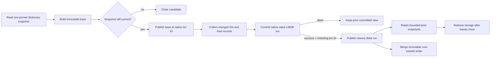

# Compressed ValueStore overlay

The `valueoverlay` package is a **memory-only lookup accelerator** over the exact serialized dictionary records in the value LMDB environment. It neither owns RDF model values nor allocates dictionary IDs. Its miss value is `UNKNOWN`: a miss must continue to the authoritative LMDB transaction and is never proof that a value is absent. The main contracts are in [`CompressedValueOverlay`](../../../core/sail/lmdb/src/main/java/org/eclipse/rdf4j/sail/lmdb/valueoverlay/CompressedValueOverlay.java), [`ValueOverlayRegistry`](../../../core/sail/lmdb/src/main/java/org/eclipse/rdf4j/sail/lmdb/valueoverlay/ValueOverlayRegistry.java), and the call sites in [`ValueStore`](../../../core/sail/lmdb/src/main/java/org/eclipse/rdf4j/sail/lmdb/ValueStore.java).

**Branch delta and prerequisites:** this branch adds the 21-class overlay subsystem and hooks it into `ValueStore` warm-up and commit publication. The pre-existing value-record codec and LMDB key/value rows remain authoritative; the overlay copies their exact bytes into a derived native-memory layout and may omit entries without changing dictionary semantics.

## What is in the 21-class subsystem

| Responsibility | Changed classes |
| --- | --- |
| Building bytes and native allocation | `ByteArrayBuilder`, `ByteCursor`, `FfmAccess`, `NativeLongList`, `NativeSlabAllocator`, `PackedVector` |
| Serialized value record interpretation | `PhysicalRecord`, `RecordByteAccess`, `RecordFamily`, `TokenParse`, `ValueStoreRecordLayout`, `ValueStoreRecordView`, `ValueStoreRecordVisitor` |
| Page compression and decoding | `PageCodec`, `VectorPageCodec` |
| Base index and ownership/budget | `CompressedValueOverlay`, `OverlayMemoryBudget`, `OverlayCapacityException` |
| Commit deltas, tombstones and registry | `ValueOverlayChanges`, `ValueOverlayDelta`, `ValueOverlayRegistry` |

The overlay stores source record bytes and primitive routing metadata. Query/expression code that needs a record header or lexical bytes must use the callback-scoped visitor or ask `ValueStore` for a fully materialized value; it must not retain a native address or borrowed record view past its lease.

## Base layout and lookup

The base builder requires input IDs in strictly increasing **unsigned** order. It groups exact record bytes into type/family/affinity pages, with 256 records per logical ID page. Front-coding checkpoints, token dictionaries, prefix pages, and vector forms are selected only when they reduce the representation under the codec's configured saving threshold. A rank/fence narrows an exact unsigned search; it does not prove a hit. Optional reverse lookup uses a native open-addressed hash/fingerprint table with rank routing, then exact record comparison. A hash equality alone is not membership. The reverse structure includes only IDs independently verified as still visible from value record back to ID; a retained forward record alone may be a retired ID.

The `FVC1` page header is 32 bytes. It identifies codec and record-family flags, the base/rank information, count/length and any restart/checkpoint settings. The page decoder handles:

| Code | Mode | Representation |
| ---: | --- | --- |
| 0 | RAW | Exact uncompressed record bytes. |
| 1 | FRONT | Lexicographic front-coding with a power-of-two restart group; random access restarts at the nearest checkpoint. |
| 2 | TOKEN | A fixed byte dictionary and token stream. |
| 3 | VECTOR | Packed record-length/offset vector with payload bytes. |
| 8 | PREFIX | Shared exact prefix plus separately addressed suffixes; not used with the large-object flag. |

The builder compares candidate lengths and requires at least `minimumSaving` bytes before replacing the best representation. Vector compression has its own minimum-saving floor. Oversized records above `maxRecordBytes` are skipped without copying; they remain an authoritative-store fallback. This is why a complete warmed base can still legitimately omit a very large value.

The records are parsed lazily. `ValueStoreRecordVisitor.Record` grants access only during the visitor callback and rejects access after return; the callback must not retain it or close the source lease. A copied primitive `Header` can outlive the callback. Header inspection can obtain kind, referenced datatype/namespace ID, language byte length and direction without materializing the lexical label. An IRI record contains its local name, not a full reconstructed IRI. The visitor does not apply Unicode normalization, numeric coercion, or SPARQL value-equality rules. See [`PageCodec`](../../../core/sail/lmdb/src/main/java/org/eclipse/rdf4j/sail/lmdb/valueoverlay/PageCodec.java#L28) and [`ValueStoreRecordVisitor`](../../../core/sail/lmdb/src/main/java/org/eclipse/rdf4j/sail/lmdb/valueoverlay/ValueStoreRecordVisitor.java#L17).

## Snapshot publication and writes

Warm-up scans the value environment in a pinned native read transaction, building the candidate while ordinary reads/writes continue against LMDB. The candidate becomes visible only if the generation remains the same and its native transaction ID is not older than the current publication. Starting a write can invalidate/cancel the in-flight warm-up; a capacity refusal or ordinary warm-up failure leaves LMDB usable.

For an active overlay, `ValueStore` starts a `Mutation` against the exact predecessor native transaction ID. It records changed IDs, prepares the delta from final state in the writer snapshot, commits the LMDB write transaction, then reads native metadata and calls `complete(prepared, committedTransactionId)`. The registry refuses a missing, future, mismatched or invalid transaction identity rather than inventing a commit generation. A no-op commit can retain the old logical overlay identity only if native metadata still identifies the anchor. A deleted, newly oversized, or reverse-invisible record becomes a tombstone/missing entry so an older base/run cannot incorrectly shadow the LMDB answer.

On abort, prepared mutation storage closes and the old exact committed state remains available. After a successful native commit, delta-capacity refusal or completion failure invalidates/refuses only the accelerator; it must not be reported as though the authoritative commit rolled back. On a gap or refusal, base/history are retired from acquisition, while existing leases keep their physical owners alive until release.

Each committed state is an immutable base plus newest-first delta runs. Snapshot acquisition matches the requested LMDB transaction ID against the current state or one of the bounded retained historical states. It never substitutes “the closest older state.” Old snapshots are trimmed according to `retainedSnapshots`; leases can keep their native storage and budget charge alive after the state is no longer discoverable for new readers. Compaction pairs equal-level adjacent runs where possible; under run pressure it may merge the last pair. It builds from pinned immutable runs outside the registry monitor and does not touch the live LMDB environment. A publication racing a replacement is discarded. The automatic compactor is a lazily created daemon single-thread executor named `rdf4j-value-overlay-compaction` and is enabled for configured production registries by default.

## Configuration and memory

These are source defaults, not an estimate of memory needed for a particular repository. The system properties are read at store/registry or builder initialization; changing them after construction does not resize an existing base or registry.

| Property or API default | Default | Scope and meaning |
| --- | ---: | --- |
| `rdf4j.lmdb.valueOverlay.maxBytes` | `0` | Startup base warm-up; zero disables automatic base construction. Positive value is the base's native-byte budget. Read by `ValueStore` while opening. |
| `rdf4j.lmdb.valueOverlay.reverseSlots` | `1,048,576` | Base reverse-index slots when warm-up is enabled. Each slot reserves 8 native bytes; zero can disable reverse slots. Read with the warm-up options. |
| `rdf4j.lmdb.valueOverlay.retained.maxBytes` | `2,147,483,648` bytes (2 GiB) | Shared configured retained-memory budget for base/delta native storage, estimated retained heap, and workspace reservations. Initialized lazily when the configured singleton is first requested. |
| `rdf4j.lmdb.valueOverlay.delta.maxBytes` | `67,108,864` bytes (64 MiB) | Per-registry native bytes retained by current delta runs. |
| `rdf4j.lmdb.valueOverlay.delta.maxChangedIds` | `65,536` | Changed IDs admitted to one prepared mutation. |
| `rdf4j.lmdb.valueOverlay.delta.retainedSnapshots` | `4` | Bounded historical snapshot states retained for future acquisition. The current state is additional. |
| `rdf4j.lmdb.valueOverlay.delta.maxLevels` | `20` | Run-level target used by compaction/backlog limits. |
| `rdf4j.lmdb.valueOverlay.delta.asyncCompaction` | `true` | Enables background run compaction for configured registries. |
| `CompressedValueOverlay.Options.defaults(budget)` | 32 active pages; 64 KiB/page; 1 MiB/record; adaptive tokens and vector compression on | Public API defaults; production warm-up creates these fixed values plus its configured base budget/reverse slots. |
| `rdf4j.lmdb.valueOverlay.sharedPrefixes` | `true` | Builder prefix representation option. |
| `rdf4j.lmdb.valueOverlay.vectorMinSavingPercent` | `8` | Builder refuses vector form unless the configured saving floor is met; valid range is 0–100. |

`OverlayMemoryBudget` charges physical owners rather than view publications. Native capacity is exact; retained-heap/workspace estimates are conservative models (the helper's primitive/reference-array estimate uses a 24-byte header, 8-byte references, and alignment), not a JVM heap/RSS counter. Reservations are acquired before the corresponding allocation and stay charged while a retired base/delta remains lease-owned. `Stats` breaks out `NATIVE`, `RETAINED_HEAP`, and `WORKSPACE` under the shared limit. The direct-adjacency budget is separate. LMDB map address space, its resident pages, file-backed hash cache, and OS page cache are outside this overlay budget.

Budget and option sources: [`OverlayMemoryBudget`](../../../core/sail/lmdb/src/main/java/org/eclipse/rdf4j/sail/lmdb/valueoverlay/OverlayMemoryBudget.java#L17), [`CompressedValueOverlay.Options`](../../../core/sail/lmdb/src/main/java/org/eclipse/rdf4j/sail/lmdb/valueoverlay/CompressedValueOverlay.java#L27), and configured warm-up in [`ValueStore`](../../../core/sail/lmdb/src/main/java/org/eclipse/rdf4j/sail/lmdb/ValueStore.java#L2660).

## Failure modes and operational interpretation

* **No base present:** base warming may be disabled by default, still running, cancelled by a concurrent writer/close, refused for memory, or failed. Treat this as ordinary LMDB mode.
* **Unknown ID or value lookup:** query the same authoritative LMDB snapshot. A reverse-index miss does not prove that a value is missing.
* **Overlay capacity exception:** do not fail the store commit solely because an optional overlay reservation failed. The normal reader can bypass it.
* **Record omitted as large:** perform exact lookup/materialization from ValueStore. The overlay's record-size cap is an accelerator boundary, not a persistent value-size limit.
* **Old snapshot no longer acquirable:** a new reader cannot acquire a retired publication. Existing reader leases may still retain its physical bytes until close.
* **Delta transaction gap or native transaction-ID mismatch:** refuse the overlay publication and return to LMDB; never attach a delta to a guessed timestamp.
* **Compaction exception or cancellation:** keep the current committed logical view; discard the incomplete compacted candidate. Releasing job/view ownership returns its charge.

`ValueStoreAsyncOverlayWarmupTest`, `ValueStoreCompressedOverlayTest`, `ValueOverlayPageAccessTest`, and `CompressedValueOverlayOptionsTest` are relevant contract sources. They were not executed as part of this documentation work.
