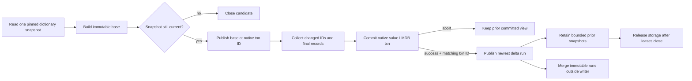

# Compressed ValueStore overlay

The `valueoverlay` package is a **memory-only lookup accelerator** over the exact serialized dictionary records in the value LMDB environment. It neither owns RDF model values nor allocates dictionary IDs. Its miss value is `UNKNOWN`: a miss must continue to the authoritative LMDB transaction and is never proof that a value is absent. The main contracts are in [`CompressedValueOverlay`](../../../core/sail/lmdb/src/main/java/org/eclipse/rdf4j/sail/lmdb/valueoverlay/CompressedValueOverlay.java), [`ValueOverlayRegistry`](../../../core/sail/lmdb/src/main/java/org/eclipse/rdf4j/sail/lmdb/valueoverlay/ValueOverlayRegistry.java), and the call sites in [`ValueStore`](../../../core/sail/lmdb/src/main/java/org/eclipse/rdf4j/sail/lmdb/ValueStore.java).

**Branch delta and prerequisites:** this branch adds the 21-class overlay subsystem and hooks it into `ValueStore` warm-up and commit publication. The pre-existing value-record codec and LMDB key/value rows remain authoritative; the overlay copies their exact bytes into a derived native-memory layout and may omit entries without changing dictionary semantics.

## What is in the 21-class subsystem

| Responsibility | Changed classes |
| --- | --- |
| Building bytes and native allocation | `ByteArrayBuilder`, `ByteCursor`, `FfmAccess`, `NativeLongList`, `NativeSlabAllocator`, `PackedVector` |
| Serialized value record interpretation | `PhysicalRecord`, `RecordByteAccess`, `RecordFamily`, `TokenParse`, `ValueStoreRecordLayout`, `ValueStoreRecordView`, `ValueStoreRecordVisitor` |
| Page compression and decoding | `PageCodec`, `VectorPageCodec` |
| Base index and ownership/budget | `CompressedValueOverlay`, `OverlayMemoryBudget`, `OverlayCapacityException` |
| Commit deltas, tombstones and registry | `ValueOverlayChanges`, `ValueOverlayDelta`, `ValueOverlayRegistry` |

The overlay stores source record bytes and primitive routing metadata. Query/expression code that needs a record header or lexical bytes must use the callback-scoped visitor or ask `ValueStore` for a fully materialized value; it must not retain a native address or borrowed record view past its lease.

## Base layout and lookup

The base builder requires input IDs in strictly increasing **unsigned** order. It groups exact record bytes into type/family/affinity pages, with 256 IDs per logical index block. Front-coding checkpoints, token dictionaries, prefix pages, and vector forms are selected only when they reduce the representation under the codec's configured saving threshold. A rank/fence narrows an exact unsigned search; it does not prove a hit. Optional reverse lookup uses a native open-addressed hash/fingerprint table with rank routing, then exact record comparison. A hash equality alone is not membership. The reverse structure includes only IDs independently verified as still visible from value record back to ID; a retained forward record alone may be a retired ID.

For an ID-to-record lookup, [`CompressedValueOverlay.rank`](../../../core/sail/lmdb/src/main/java/org/eclipse/rdf4j/sail/lmdb/valueoverlay/CompressedValueOverlay.java) first checks the unsigned ID range. An affine base can derive rank from its stride; otherwise a verified high-bit fence or a small radix directory narrows the block search, and `PackedVector.indexOf` checks exact membership within the selected block. The rank is `(block << 8) + slot`. For an illustrative rank of 257, the ID is in block 1, slot 1. `blockRoutes[1][1]` might contain locator `0x305` (decimal 773), meaning compressed-record page 3, slot 5; the page handle then goes to `PageCodec` to read that record. This routing example is illustrative: the ID-index block and compressed-record page are separate layouts, and an ID block's records can point to different pages. Reverse entries store the fingerprint's high 32 bits and `rank + 1` in the low 32 bits. Lookup linearly probes on the slot bits, recovers the rank, then compares the complete record bytes before returning the corresponding ID.

The `FVC1` page header is 32 bytes: count at `+4`, packed-length bit width at `+6`, codec/LOB/LENGTH_FOR flags at `+7`, restart at `+8`, dictionary bytes at `+10`, and packed offset, payload offset, payload bytes, and total bytes at `+16`, `+20`, `+24`, and `+28`. The word at `+12` is the length base when LENGTH_FOR is set, otherwise the checkpoint count. This header carries no value IDs/ranks or record-family metadata. `PageCodec.Mode` codes are:

| Code | Mode | Representation |
| ---: | --- | --- |
| 0 | RAW | Exact uncompressed record bytes. |
| 1 | FRONT | Prefix differences against the preceding record, with restart entries stored independently; page order follows insertion from the ID stream, not lexical sorting. Random access restarts at the nearest checkpoint. |
| 2 | TOKEN | A fixed byte dictionary and token stream. |
| 3 | VECTOR | `PageCodec.Mode.VECTOR` is the builder's enum result, not an FVC1 vector body. The decoder checks magic first; vector pages use separate `CVP2` magic and [`VectorPageCodec`](../../../core/sail/lmdb/src/main/java/org/eclipse/rdf4j/sail/lmdb/valueoverlay/VectorPageCodec.java): a 20-byte header, record template, 20-byte field descriptors, and packed byte/digit/alphabet fields. An FVC1 page carrying mode 3 is rejected. |
| 8 | PREFIX | Shared exact prefix plus separately addressed suffixes; not used with the large-object flag. |

The builder compares candidate lengths and requires at least `minimumSaving` bytes before replacing the best representation. Vector compression has its own minimum-saving floor. Oversized records above `maxRecordBytes` are skipped without copying; they remain an authoritative-store fallback. This is why a complete warmed base can still legitimately omit a very large value.

The records are parsed lazily. `ValueStoreRecordVisitor.Record` grants access only during the visitor callback and rejects access after return; the callback must not retain it or close the source lease. A copied primitive `Header` can outlive the callback. Header inspection can obtain kind, referenced datatype/namespace ID, language byte length and direction without materializing the lexical label. An IRI record contains its local name, not a full reconstructed IRI. The visitor does not apply Unicode normalization, numeric coercion, or SPARQL value-equality rules. See [`PageCodec`](../../../core/sail/lmdb/src/main/java/org/eclipse/rdf4j/sail/lmdb/valueoverlay/PageCodec.java) and [`ValueStoreRecordVisitor`](../../../core/sail/lmdb/src/main/java/org/eclipse/rdf4j/sail/lmdb/valueoverlay/ValueStoreRecordVisitor.java).

## Worked lookup and native-join example

Use `:` for `urn:example:` and consider this dataset sketch:

```text
Default graph
  :alice :knows :bob .
  :alice :knows :carol .
  :bob :label "Bob" .
  :carol :label "Carol" .
  :bob :bio "Bob has a longer record-backed description." .
  :carol :bio "Carol has a longer record-backed description." .

Named graph :team
  :alice :knows :bob .
```

The named-graph statement is queried with `GRAPH :team { :alice :knows :bob }`. The IDs below are symbolic names, not literal numeric IDs: `a = ID(:alice)`, `b = ID(:bob)`, `c = ID(:carol)`, `k = ID(:knows)`, `l = ID(:label)`, `p = ID(:bio)`, and `t = ID(:team)`. When this store format enables literal inlining and the exact round-trip succeeds, the short labels use self-contained inline IDs `B = ID("Bob")` and `C = ID("Carol")`; they have no dictionary records for the overlay to serve. The longer `:bio` values are record-backed as `L_B = ID("Bob has a longer record-backed description.")` and `L_C = ID("Carol has a longer record-backed description.")`. The query dataset decides which graph statements a pattern scans; the example makes no claim about row counts across default and named graphs. See [query joins and factors](query-joins-and-factors.md) for graph selection and join behavior.

### RDF term to value ID

Suppose a native plan needs `:alice` as the bound subject of `:alice :knows ?friend`. The query source asks [`ValueStore.getId`](../../../core/sail/lmdb/src/main/java/org/eclipse/rdf4j/sail/lmdb/ValueStore.java). A current same-store `LmdbValue` ID, transaction-local ID, or positive value/common-vocabulary cache can answer first. Literal inlining and triple-term lookup are also handled before ordinary dictionary lookup; they do not use this overlay path. For an ordinary IRI such as `:alice`, `ValueStore` first resolves the namespace ID (from its cache or the same dictionary lookup path), then `uri2data` forms the exact record bytes via [`ValueStoreRecordCodec.iriData`](../../../core/sail/lmdb/src/main/java/org/eclipse/rdf4j/sail/lmdb/ValueStoreRecordCodec.java): the IRI type byte, namespace-ID varint, and UTF-8 local name `alice`.

On a lookup-only call (`create == false`), [`ValueStore.findId`](../../../core/sail/lmdb/src/main/java/org/eclipse/rdf4j/sail/lmdb/ValueStore.java) borrows an overlay snapshot only when the feature is enabled and the registry has a publication for the exact native read-transaction ID. [`SnapshotLease.findId`](../../../core/sail/lmdb/src/main/java/org/eclipse/rdf4j/sail/lmdb/valueoverlay/ValueOverlayRegistry.java) searches delta runs newest first and then the base. Each reverse-index candidate is selected by its fingerprint and accepted only after comparing the complete serialized record bytes; a candidate ID shadowed by a newer delta is skipped. If there is no visible exact candidate, `findIdInTransaction` checks the authoritative LMDB transaction: a short record uses its direct value-to-ID key, while a large record follows the hash locator and compares the complete record, scanning the hash-collision keys when needed. A miss remains `UNKNOWN_ID`. Calls that may create a value bypass the overlay and let the LMDB transaction decide whether to find or allocate the ID.

The same route applies to an ordinary `:bio` literal after its datatype ID has been resolved. Namespace and datatype dependencies can therefore use the overlay too. The page stores the record bytes, not the RDF object. For a concrete encoding example, let two adjacent unsigned IDs in one page refer to `:alice` and `:alicia`, in that order, and let both IRIs use namespace ID `N`. Their records are `URI_VALUE || varint(N) || "alice"` and `URI_VALUE || varint(N) || "alicia"`; their common local-name prefix is `"alic"`, followed by suffixes `"e"` and `"ia"`. If the second record is not at a FRONT restart boundary and FRONT wins the saving threshold, it stores the prefix length and suffix against the previous record. The actual page may instead be RAW, TOKEN, VECTOR, or PREFIX. A reverse lookup still verifies the candidate against the exact record bytes after locating its page/rank; a matching hash or prefix alone never establishes identity.

### Value ID to record or RDF term

For `b`, [`ValueStore.getValue`](../../../core/sail/lmdb/src/main/java/org/eclipse/rdf4j/sail/lmdb/ValueStore.java) first checks its value cache. An inline ID is decoded from its packed bits, and a triple-term ID uses the dedicated triple-term index. On a cache miss for a record-backed value, [`ValueStore.getData`](../../../core/sail/lmdb/src/main/java/org/eclipse/rdf4j/sail/lmdb/ValueStore.java) asks the overlay snapshot matching that read transaction for the newest delta entry, then the base entry. If no overlay record is available, it reads the ID-keyed row from that same LMDB transaction. A delta tombstone shadows older overlay bytes; LMDB then decides whether the ID still exists in the requested snapshot. `data2value` turns record bytes into an RDF4J value and caches it. An IRI record supplies a namespace ID and local name, while a literal's datatype ID is resolved separately.

Native expression evaluation can avoid constructing that RDF4J value. [`LmdbNativeValueCodec`](../../../core/sail/lmdb/src/main/java/org/eclipse/rdf4j/sail/lmdb/evaluation/LmdbNativeValueCodec.java) reads stored payloads through [`ValueStore.withData`](../../../core/sail/lmdb/src/main/java/org/eclipse/rdf4j/sail/lmdb/ValueStore.java): a covered ID is decoded with the typed overlay visitor, and an uncovered ID is read from LMDB in the same transaction. The codec keeps owned text and primitive metadata after the callback; datatype and namespace records use the same reader path. This is a record-level optimization, separate from the lazy RDF values exposed at the query boundary.

### What the overlay contributes to a native join

For a query such as `:alice :knows ?friend . ?friend :bio ?bio`, the native plan resolves its constants to IDs for the read view. Where the per-evaluation [`NativeValueResolver`](../../../core/sail/lmdb/src/main/java/org/eclipse/rdf4j/sail/lmdb/evaluation/NativeValueResolver.java) is used, its lookup calls the source's store lookup and scopes cached hits or misses to the value-store view; the LMDB dataset's `idOf` delegates to `ValueStore.getId`. The first pattern binds `?friend` to `b` or `c`; the second pattern carries that same ID in its bound slot. [`PatternPlan`](../../../core/sail/lmdb/src/main/java/org/eclipse/rdf4j/sail/lmdb/evaluation/LmdbNativePatternPlan.java) reads constants and slots as IDs, and the ordinary [`JoinCursor`](../../../core/sail/lmdb/src/main/java/org/eclipse/rdf4j/sail/lmdb/evaluation/LmdbNativeJoinPlans.java) uses a reusable native probe for the correlated second pattern, binding the current friend ID in its subject slot. The join does not need to materialize `:bob` or `:carol` into RDF objects to pass the join key between patterns. Some eligible cyclic-core plans can use [`LmdbNativeLeapfrogJoin`](../../../core/sail/lmdb/src/main/java/org/eclipse/rdf4j/sail/lmdb/evaluation/LmdbNativeLeapfrogJoin.java), a separate strategy that also works over ID frontiers.

The value overlay helps at the term-dictionary boundary: it can resolve a record-backed constant from exact record bytes and can supply the selected ID's record if an expression or result consumer later needs its lexical value. The statement rows and join frontiers come from the statement indexes or the separate direct-adjacency structures. This value overlay contains no statement edges and is not the adjacency statement-delta overlay. Short inline labels such as `"Bob"` can travel as self-contained IDs; they do not need an overlay page. If a consumer asks for a label that was stored as a record, the codec can read it lazily through `withData`.

### Misses, collisions, and snapshot visibility

* With `valueOverlayEnabled` false, before warm-up publishes a base, or when the registry has no publication for the exact `mdb_txn_id`, `borrowValueOverlay` returns no lease and the operation uses the authoritative LMDB transaction. It never waits for a warm-up or substitutes the closest older overlay snapshot. A thread that owns the active ValueStore write transaction also bypasses the overlay so it reads its own uncommitted LMDB changes.
* A disabled or full reverse table, a large record skipped by `maxRecordBytes`, or a record not covered by the selected page can leave no overlay hit. Fingerprint collisions are probed and checked against the complete bytes; a collision alone never returns an ID. An overlay miss leaves existence to the LMDB path. Large LMDB-key hash collisions are also resolved by comparing full record bytes.
* For example, if the base contains `b -> record(:bob)` and a later commit deletes `b`, the new delta's missing entry stops `get(b)` from falling through to the base. A reverse search may find the old base candidate for `:bob`, but the newer delta shadows `b`, so it too falls through to the matching LMDB snapshot. If the ID row remains but its bytes no longer map back to that ID, the forward record may remain readable while its reverse mapping is marked invisible, so term-to-ID lookup cannot revive a retired mapping.
* The overlay compares the store's encoded representation, not SPARQL value equality. It preserves the bytes produced by `ValueStoreRecordCodec`; the page visitor does not normalize language tags or Unicode or apply datatype/value coercions. The store's format rules, such as canonicalizing language tags when writing, determine the record bytes before the overlay sees them.

## Snapshot publication and writes


```mermaid
flowchart LR
  scan[Read one pinned dictionary snapshot] --> base[Build immutable base]
  base --> publish{Snapshot still current?}
  publish -- no --> discard[Close candidate]
  publish -- yes --> view[Publish base at native txn ID]
  view --> prepare[Collect changed IDs and final records]
  prepare --> commit[Commit native value LMDB txn]
  commit -- abort --> old[Keep prior committed view]
  commit -- success + matching txn ID --> delta[Publish newest delta run]
  delta --> history[Retain bounded prior snapshots]
  delta --> compact[Merge immutable runs outside writer]
  history --> leases[Release storage after leases close]
```

Warm-up scans the value environment in a pinned native read transaction, building the candidate while ordinary reads/writes continue against LMDB. The candidate becomes visible only if the generation remains the same and its native transaction ID is not older than the current publication. Starting a write can invalidate/cancel the in-flight warm-up; a capacity refusal or ordinary warm-up failure leaves LMDB usable.

For an active overlay, `ValueStore` starts a `Mutation` against the exact predecessor native transaction ID. It records changed IDs, prepares the delta from final state in the writer snapshot, commits the LMDB write transaction, then reads native metadata and calls `complete(prepared, committedTransactionId)`. The registry refuses a missing, future, mismatched or invalid transaction identity rather than inventing a commit generation. A no-op commit can retain the old logical overlay identity only if native metadata still identifies the anchor. A deleted, newly oversized, or reverse-invisible record becomes a tombstone/missing entry so an older base/run cannot incorrectly shadow the LMDB answer.

On abort, prepared mutation storage closes and the old exact committed state remains available. After a successful native commit, delta-capacity refusal or completion failure invalidates/refuses only the accelerator; it must not be reported as though the authoritative commit rolled back. On a gap or refusal, base/history are retired from acquisition, while existing leases keep their physical owners alive until release.

Each committed state is an immutable base plus newest-first delta runs. Snapshot acquisition matches the requested LMDB transaction ID against the current state or one of the bounded retained historical states. It never substitutes “the closest older state.” Old snapshots are trimmed according to `retainedSnapshots`; leases can keep their native storage and budget charge alive after the state is no longer discoverable for new readers. Compaction pairs equal-level adjacent runs where possible; under run pressure it may merge the last pair. It builds from pinned immutable runs outside the registry monitor and does not touch the live LMDB environment. A publication racing a replacement is discarded. The automatic compactor is a lazily created daemon single-thread executor named `rdf4j-value-overlay-compaction` and is enabled for configured production registries by default.

## Configuration and memory

These are source defaults, not an estimate of memory needed for a particular repository. The persisted `LmdbStoreConfig.valueOverlayEnabled` startup setting defaults to `false`; value-overlay tuning properties never enable it by themselves. When enabled with no `rdf4j.lmdb.valueOverlay.maxBytes` property, startup warming uses the configured shared retained-memory limit as its base-build cap (2 GiB by default). An explicit positive `maxBytes` replaces that cap, and an explicit zero retains its meaning of disabling automatic warm-up. Changing startup settings after construction does not reconfigure an existing registry.

| Property or API default | Default | Scope and meaning |
| --- | ---: | --- |
| `LmdbStoreConfig.valueOverlayEnabled` | `false` | Store startup gate; when false, no registry, warm-up, mutation, compaction, or shutdown work is performed. |
| `rdf4j.lmdb.valueOverlay.maxBytes` | absent | When enabled, absence uses the shared retained-memory limit as the base-build cap; explicit zero disables automatic warm-up, and a positive value overrides the cap with the base's native-byte budget. Read by `ValueStore` while opening. |
| `rdf4j.lmdb.valueOverlay.reverseSlots` | `1,048,576` | Base reverse-index slots when warm-up is enabled. Each slot reserves 8 native bytes; zero can disable reverse slots. Read with the warm-up options. |
| `rdf4j.lmdb.valueOverlay.retained.maxBytes` | `2,147,483,648` bytes (2 GiB) | Shared configured retained-memory budget for base/delta native storage, estimated retained heap, and workspace reservations. Initialized lazily when the configured singleton is first requested. |
| `rdf4j.lmdb.valueOverlay.delta.maxBytes` | `67,108,864` bytes (64 MiB) | Per-registry native bytes retained by current delta runs. |
| `rdf4j.lmdb.valueOverlay.delta.maxChangedIds` | `65,536` | Changed IDs admitted to one prepared mutation. |
| `rdf4j.lmdb.valueOverlay.delta.retainedSnapshots` | `4` | Bounded historical snapshot states retained for future acquisition. The current state is additional. |
| `rdf4j.lmdb.valueOverlay.delta.maxLevels` | `20` | Run-level target used by compaction/backlog limits. |
| `rdf4j.lmdb.valueOverlay.delta.asyncCompaction` | `true` | Enables background run compaction for configured registries. |
| `CompressedValueOverlay.Options.defaults(budget)` | 32 active pages; 64 KiB/page; 1 MiB/record; adaptive tokens and vector compression on | Public API defaults; production warm-up creates these fixed values plus its configured base budget/reverse slots. |
| `rdf4j.lmdb.valueOverlay.sharedPrefixes` | `true` | Builder prefix representation option. |
| `rdf4j.lmdb.valueOverlay.vectorMinSavingPercent` | `8` | Builder refuses vector form unless the configured saving floor is met; valid range is 0–100. |

`OverlayMemoryBudget` charges physical owners rather than view publications. Native capacity is exact; retained-heap/workspace estimates are conservative models (the helper's primitive/reference-array estimate uses a 24-byte header, 8-byte references, and alignment), not a JVM heap/RSS counter. Reservations are acquired before the corresponding allocation and stay charged while a retired base/delta remains lease-owned. `Stats` breaks out `NATIVE`, `RETAINED_HEAP`, and `WORKSPACE` under the shared limit. The direct-adjacency budget is separate. LMDB map address space, its resident pages, file-backed hash cache, and OS page cache are outside this overlay budget.

Budget and option sources: [`OverlayMemoryBudget`](../../../core/sail/lmdb/src/main/java/org/eclipse/rdf4j/sail/lmdb/valueoverlay/OverlayMemoryBudget.java), [`CompressedValueOverlay.Options`](../../../core/sail/lmdb/src/main/java/org/eclipse/rdf4j/sail/lmdb/valueoverlay/CompressedValueOverlay.java), and configured warm-up in [`ValueStore`](../../../core/sail/lmdb/src/main/java/org/eclipse/rdf4j/sail/lmdb/ValueStore.java).

For repository configuration, set `lmdb:valueOverlayEnabled true` to opt in. Calling `ValueStore.warmCompressedValueOverlay(...)` directly while the feature is disabled throws `IllegalStateException`; setting `maxBytes` alone does not activate it.

## Failure modes and operational interpretation

* **No base present:** the feature may be disabled (the default), auto-warming may be explicitly suppressed with `maxBytes=0`, may still be running, may be cancelled by a concurrent writer/close, may be refused for memory, or may have failed. Treat this as ordinary LMDB mode.
* **Unknown ID or value lookup:** query the same authoritative LMDB snapshot. A reverse-index miss does not prove that a value is missing.
* **Overlay capacity exception:** do not fail the store commit solely because an optional overlay reservation failed. The normal reader can bypass it.
* **Record omitted as large:** perform exact lookup/materialization from ValueStore. The overlay's record-size cap is an accelerator boundary, not a persistent value-size limit.
* **Old snapshot no longer acquirable:** a new reader cannot acquire a retired publication. Existing reader leases may still retain its physical bytes until close.
* **Delta transaction gap or native transaction-ID mismatch:** refuse the overlay publication and return to LMDB; never attach a delta to a guessed timestamp.
* **Compaction exception or cancellation:** keep the current committed logical view; discard the incomplete compacted candidate. Releasing job/view ownership returns its charge.

Tests that specify these contracts include [`ValueStoreAsyncOverlayWarmupTest`](../../../core/sail/lmdb/src/test/java/org/eclipse/rdf4j/sail/lmdb/ValueStoreAsyncOverlayWarmupTest.java), [`ValueStoreCompressedOverlayTest`](../../../core/sail/lmdb/src/test/java/org/eclipse/rdf4j/sail/lmdb/ValueStoreCompressedOverlayTest.java), [`ValueOverlayPageAccessTest`](../../../core/sail/lmdb/src/test/java/org/eclipse/rdf4j/sail/lmdb/valueoverlay/ValueOverlayPageAccessTest.java), and [`CompressedValueOverlayOptionsTest`](../../../core/sail/lmdb/src/test/java/org/eclipse/rdf4j/sail/lmdb/valueoverlay/CompressedValueOverlayOptionsTest.java).
