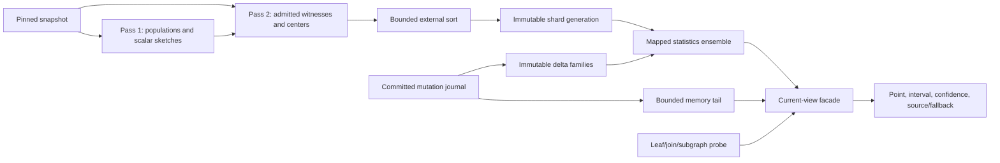

# Frontier Omni v2 implementation analysis

Status: source-grounded implementation analysis with focused test, JMH, and JFR validation

Date: 2026-08-16

Related design: [Frontier OmniSketch V2 technical design](frontier-omnisketch-v2-technical-design.md)

## 1. Purpose and evidence boundary

This document explains what the current Omni v2 implementation actually stores and executes. It is written for a
reviewer who needs enough detail to reason independently about correctness, complexity, resource use, statistical
quality, and operational failure modes.

The analysis began as a source-only audit and was then revised after focused implementation validation. The Java
sources remain the authority for data layout and algorithms; retained verification currently adds these facts:

- dimensions, branches, schemas, and asymptotic costs below are source facts;
- statistical-bias, locality, and HotSpot observations are reasoned hypotheses unless explicitly described as an
  invariant enforced by code or backed by a cited test/profile;
- all 1,433 query-evaluation tests, 92 packed-search tests, 19 V2 session tests, and 139 LMDB Frontier planning
  integrations passed during this implementation campaign; and
- a mapped 60,000-quad microbenchmark measured 3.827 ms/op for a three-pattern star and 10.614 ms/op for a
  three-pattern path. A 101-second JFR path run measured 10.771 ms/op and reduced sampled allocations from 895 to
  150 after primitive sampling lineage and immutable column-ID indexing.

Those focused and warm-average results do not verify physical builder throughput, p95 latency, held-out q-error,
interval coverage, background interference, cold-NVMe behavior, or the 20-billion-statement projection. The
100M/250M/500M/1B qualification campaign remains required.

The existing technical-design document mixes implemented mechanisms with intended promotion criteria. This document
uses four labels to keep those categories separate:

- **Implemented:** directly represented by current code.
- **Derived:** follows from the implemented loops, data layout, or invariants.
- **Risk:** a property that can weaken correctness, performance, or operability.
- **Unverified:** requires tests, measurements, or a statistical proof not supplied by the source itself.

## 2. What “Omni v2” contains

Omni v2 is not one sketch. It is an ensemble with four cooperating layers:

1. **Exact and scalar summaries.** Exact plane totals, all 15 nonempty S/P/O/C Count-Min masks, heavy-predicate
   exact counts, global and predicate-conditioned HLLs, and predicate-conditioned Fast-AGMS counters.
2. **Coordinated Omni witnesses.** A dense cell directory plus sparse exact-quad dictionaries and per-cell posting
   lists. A lane gives the same RDF statement one priority in every cell it reaches, making intersections possible.
3. **Optional center samples.** Coordinated samples of term centers and independently sampled incident rows for
   many-to-many joins and center-shaped subgraphs.
4. **Freshness overlays.** A bounded in-memory journal tail followed by immutable signed CountSketch, Fast-AGMS,
   mutation-summary, and Omni insertion/tombstone layers.

`FrontierMappedStatistics` is the ensemble selector. `FrontierOmniIndex` is the coordinated witness engine. Treating
the latter as the complete statistics service would miss important exact paths, fallbacks, and mutation rules.

The high-level runtime flow is:



## 3. Terms and cost notation

The rest of the document uses:

| Symbol | Meaning |
| --- | --- |
| `N` | statements across the explicit and inferred planes |
| `P` | statement planes; fixed at 2 |
| `D` | design lanes; normally 4 |
| `A` | audit lanes; normally 2 |
| `L = D + A` | persisted Omni lanes; normally 6 |
| `C` | RDF components S/P/O/C; fixed at 4 |
| `d` | Omni depth; normally 3 |
| `w` | power-of-two Omni width; at most `2^14` in the default selector |
| `cells` | `P * L * C * d * w` |
| `K_c` | authoritative witness target for cell `c` |
| `R_c` | retained rows for `c`, including deletion reserve |
| `E` | pass-two events admitted to the external sorter |
| `M` | events fitting in the in-memory sort buffer |
| `B` | number of bound components in a leaf probe |
| `S = B * d` | selected cell slices per plane and lane |
| `Q` | live candidate witnesses scanned from the chosen cell |
| `Delta` | immutable mutation layers visible to a generation |
| `J` | distinct sampled join keys or composite bindings |
| `T` | statement patterns in a subgraph program; 2 through 64 |
| `V` | compact query-variable classes in a subgraph program |

For the default maximum width, the dense Omni matrix is:

```text
2 planes * 6 lanes * 4 components * 3 rows * 16,384 buckets
= 2,359,296 cells
```

This count is independent of `N`. It controls dense metadata cost, while retained tuple and posting counts control
sparse data cost.

## 4. Query contracts and exact identity

### 4.1 Leaf probes

`FrontierLeafProbe` is the implemented leaf contract. It contains:

- a plane mask for explicit, inferred, or both;
- a four-bit bound mask for S/P/O/C;
- exact term IDs for bound components;
- a six-bit repeated-component equality mask covering every pair among S/P/O/C; and
- `namedContextsOnly`, which excludes context ID zero.

Subject, predicate, and object IDs must be positive. Context ID may be zero. The constructor validates bound IDs and
the probe can prove a contradiction when two bound positions are also declared equal but hold different values.

The repeated-component mask is important: `?x :p ?x` is represented directly. Hash equality never proves it. Every
surviving witness is dereferenced and its exact term IDs are compared.

### 4.2 Binary joins

`FrontierJoinProbe` contains two leaf probes and a 16-bit cross-component equality mask. Bit `(l,r)` means component
`l` of the left statement equals component `r` of the right statement. The common case has one bit; composite joins
may have several bits and may map several left positions into one right position.

### 4.3 Multi-pattern programs

`FrontierJoinProgram` contains 2 to 64 leaf probes and a flat `int[]` of length `T * 4`:

```text
variableClasses[pattern * 4 + component]
```

Class zero means “not a shared query-variable class.” Positive classes must form a compact ordinal domain. A bound
component cannot also carry a variable class. The constructor recomputes each pattern's repeated-component mask and
requires it to equal the leaf probe's mask, preventing disagreement between the leaf and subgraph representations.

The flat representation is compact and cache-friendly. It also means a particle row uses `maximumClass + 1` longs,
not merely the number of currently live variables.

### 4.4 Estimate result types

Leaves and joins return immutable scalar records with point, lower, upper, confidence, source, and a typed fallback
reason. Projected distinct returns a `double` and uses `NaN` for unavailable evidence; it does not retain the same
typed diagnostic detail as leaf and join estimates.

## 5. Persisted identity and shard format

### 5.1 Manifest identity

Manifest-store version 6 persists:

```text
generationId, previousGenerationId
baseEpoch, coveredEpoch, coveredSequence, createdAtMillis
maximumTermId
formatRevision, capabilityMask
hashSchemaId, bucketSchemaId
depth, width, designLaneCount, auditLaneCount
termBitWidth, tupleOrdinalWidth
shard descriptors
```

The current shard format is revision 3, tuple ordinals are 32-bit, hash schema is 2, and bucket schema is 1. A
generation is rejected when those algorithm identities disagree with the running code.

The mandatory query capabilities are exact totals, the Omni cell directory, at least one tuple dictionary, matching
postings, all-context projected distinct, and named-context projected distinct. Count-Min, heavy-key, center, and
Fast-AGMS descriptors are not part of the capability enum even though the normal builder writes them.

### 5.2 Generic shard encoding

Every `.fs2s` file is at most 1 GiB and begins with a 128-byte big-endian header. Revision 3 columns are encoded as
independently checksummed blocks with at most 1 MiB of packed data each. A column uses one of four codecs:

- term-width bit packing;
- delta-from-column-base bit packing;
- unsigned bit packing; or
- signed ZigZag bit packing.

The writer emits column data, then that column's 48-byte-per-block directory, then the final 64-byte-per-column
directory. It writes the header last, calls `FileChannel.force(true)`, closes the temporary file, and callers rename
it atomically. The writer does **not** reopen and read-validate the file before rename.

The reader maps and checks the header, column directory, and every block directory at open. Data blocks remain
unmapped until first access. First access maps the block, validates CRC32C, stores the `ByteBuffer` in the block
reader, and reuses it thereafter. It never calls `MappedByteBuffer.load()`.

One scalar `ColumnReader.value(row)` performs:

1. bounds checking;
2. binary search over the column's block array;
3. a first-access synchronized mapping/checksum path when needed; and
4. byte-wise LSB-first bit extraction.

`shard.column(id)` separately binary-searches the column array. Current query code frequently performs these lookups
inside higher-level loops rather than retaining all hot column handles.

### 5.3 What READY validates

Opening a generation validates manifest identity, required shard presence, file length, header and directory
checksums, column matrices, and top-level layout dimensions. The Omni constructor also requires matching tuple and
posting domain-ID sets.

It deliberately does not read every data block or scan every dense directory row. Therefore READY means the mapped
query structure passed eager structural checks; it does not mean every data-block checksum, posting ordinal, or
directory-to-domain reference has already been visited. Those failures become `SHARD_CORRUPT` when the affected
query first touches them.

## 6. Omni cell and witness data structures

### 6.1 Dense address space

`FrontierOmniLayout` uses checked `int` arithmetic to precompute strides. A cell is:

```text
plane * planeStride
+ lane * laneStride
+ component * componentStride
+ row * width
+ bucket(lane, component, row, exactTermId)
```

The width is a power of two. Bucketing uses double hashing:

```text
valueHash = mix64(value xor componentSeed xor laneSeed)
delta     = mix64(valueHash xor deltaSeed) OR 1
bucket    = lowBits(valueHash + row * delta) AND (width - 1)
```

The odd delta avoids a short even stride in the power-of-two bucket domain. Lane and component domain separation
prevents accidental reuse of the same cell map across roles.

### 6.2 Coordinated row priorities

One statement priority is derived from the exact five-part physical identity:

```text
(plane, subject, predicate, object, context, lane)
```

The same lane priority is inserted into every S/P/O/C cell and every depth row reached by that statement. This is the
coordination that permits intersection. Priority collisions are ordered and later disambiguated by plane plus all
four exact term IDs.

The mixer is a SplitMix-style non-cryptographic 64-bit finalizer. Its role is deterministic pseudo-random sampling,
not collision-free identity or adversarial protection.

### 6.3 Dense directory schema

The mandatory `OMNI_CELL_DIRECTORY` has exactly one row per physical cell and seven columns:

| Column | Encoding | Meaning |
| ---: | --- | --- |
| 0 | unsigned long | base population |
| 1 | unsigned int | tuple/posting domain ID |
| 2 | unsigned int | posting start within the domain |
| 3 | unsigned int | retained posting count |
| 4 | unsigned byte | state flags |
| 5 | unsigned int | sampling numerator |
| 6 | signed long | raw cutoff-priority bits preserved through ZigZag |

The state flags are:

| Flag | Meaning |
| --- | --- |
| `COMPLETE` | every row in the cell is retained |
| `BOTTOM_K` | retained rows are the lowest priorities after sufficient emission |
| `THRESHOLD_SAMPLE` | fewer than the target arrived; inclusion follows the emission threshold |
| `DELETE_RESERVE_PRESENT` | retention exceeds the authoritative query target |
| `AUTHORITATIVE` | the cell has usable base support, subject to live authority-floor checks |

An empty cell is `COMPLETE | AUTHORITATIVE` with zero population and postings. A populated cell with no retained row
is not authoritative.

### 6.4 Tuple and posting domains

Each `OMNI_TUPLES` domain has six columns:

```text
priority, plane, subject, predicate, object, context
```

The corresponding `OMNI_POSTINGS` shard contains one unsigned local tuple ordinal per posting. Posting order is cell
order followed by unsigned priority and exact tuple order; it is not a separately delta-coded skip-list structure.
The generic block codec bit-packs the ordinals.

`DomainBuffer` groups consecutive cells until its posting array would overflow. Its capacity is:

```text
max(maximum deletion-protected retention,
    min(4,000,000, max(1,024, sortMemoryBytes / 18)))
```

Within a domain, an open-addressed `int[]` table at no more than 50% load deduplicates exact
`(priority, plane, S, P, O, C)` tuples. Deduplication does not cross a domain boundary, so the same quad may be stored
again after a flush. Domains are partitioned by posting capacity, not by a stable hash prefix.

This is a structure-of-arrays design: five `long[]` term/priority columns, one `byte[]` plane column, one `int[]`
posting array, and an `int[]` hash table. It avoids per-tuple objects and gives predictable heap use.

The core Omni build does not need a separate bottom-K heap: external sort has already put one cell's events in
priority order, so `CellBuffer` retains the first `R_c` rows with `O(1)` append. This keeps the retained
representation bounded without a second row-selection implementation.

## 7. Build algorithm

### 7.1 Configuration selection

`FrontierStatisticsBuildConfig.forDiskBudget` divides persistent capacity as follows:

| Tier | Fraction |
| --- | ---: |
| exact and linear summaries | `1/8` |
| leaf witnesses | `1/4` |
| join samples | `1/4` |
| adaptive | `5/16` |
| deltas and manifests | remainder, normally `1/16` |

The default dimensions are four design lanes, two audit lanes, depth three, witness floor 256, witness ceiling 8192,
delete fraction 0.25, Count-Min depth four, and HLL precision ten at budgets of at least 1 GiB. Omni width is selected
up to `2^14` by checking whether the dense directory plus at least one deletion-protected witness per cell fits the
leaf tier.

Sort memory is bounded to 1–64 MiB. If estimated builder heap does not fit the governor, `forBudgets` reduces in this
order:

```text
sort memory
Count-Min width
heavy-predicate capacity
HLL precision
Omni witness ceiling
Omni width
```

The adaptive tier is used for bounded heavy-object count refinements. There is no separate edge-sample or adaptive
refinement shard family outside the active V2 resource tier.

### 7.2 Snapshot and pass-one invariants

The builder takes one heap-governor lease for its statically estimated workspace and holds one snapshot identity over
both passes. It records snapshot epoch, covered sequence, and exact explicit/inferred row counts.

For every statement in pass one it:

1. validates primitive RDF IDs;
2. increments all 15 nonempty S/P/O/C Count-Min masks at every Count-Min row;
3. increments `L * C * d` Omni populations;
4. updates the four global projected-distinct HLLs for the plane;
5. updates the named-context HLLs when context is nonzero;
6. updates a bounded Space-Saving-like heavy-predicate tracker; and
7. tracks maximum term ID.

With six lanes and depth three, the Omni part alone performs 72 dense counter increments per statement. At Count-Min
depth four, the scalar matrix adds 60 more counter increments. These constants dominate any simple “two scans”
description of builder CPU cost.

Pass one rejects a mismatch between the source's reported scan count, delivered callbacks, expected plane row count,
and Count-Min total.

### 7.3 Per-cell capacity allocation

After pass one, `FrontierOmniBuilder.allocateSamples` computes a disk envelope before admitting witnesses.

First it reserves a conservative 40 bytes per dense directory row. Its witness-byte estimate is:

```text
max(24, ceil(4 * termBitWidth / 8) + 21)
```

It then counts populated cells and tries to assign the configured floor. If the requested floor does not fit but one
witness per populated cell does, all populated cells receive the same reduced effective floor:

```text
floorEffective = max(1, retainedRecordBudget / populatedCells)
```

Remaining authority capacity is distributed once in proportion to `sqrt(cellPopulation)`, capped by population and
the configured ceiling. Rounding and capped cells can leave part of the budget unused because the implementation
does not redistribute fractional leftovers in another pass.

For each authoritative target `K_c`, `FrontierDeleteReserveSizing` calculates retained capacity `R_c` using a
KL/Chernoff union bound. If all reserves do not fit, a 48-iteration binary search scales every nonempty cell's
authority target, never below one, and recomputes reserves.

For retained rows `n`, random deletion probability `r`, and first failure at `n - K_c + 1` deleted rows, the code
requires:

```text
a = (n - K_c + 1) / n
n * D_KL(a || r) >= ln(populatedCells / 10^-6)
```

It binary-searches the smallest satisfying `n`; the inverse routine binary-searches the largest authoritative `K_c`
represented by a persisted retained count.

The deletion guarantee is conditional on the configured random-deletion model. It is not protection against an
adversary or workload that preferentially deletes sampled rows.

### 7.4 Temporary-event fit

The pass-two event budget is also fitted before the scan. For a retained target `R_c`, the nominal emission target is:

```text
E_c = min(population_c, R_c + ceil(6 * sqrt(R_c)))
```

The available temporary-record count is reduced by the greater of 2% and an eight-standard-deviation aggregate
headroom. If projected events still do not fit, another 48-iteration binary search scales authority capacities and
therefore retention/emission targets.

For statement priority `h`, cell population `n`, and emission target `e`, admission is implemented without floating
division:

```text
emit when e >= n or unsignedMultiplyHigh(h, n) < e
```

This is equivalent to a fixed unsigned priority threshold of approximately `e/n`.

### 7.5 Pass two

Pass two updates heavy-predicate exact/HLL/AGMS accumulators, Omni witness events, and optional center events. The
Omni loop is:

```text
for statement
  for every persisted lane
    priority = omniPriority(statement, lane)
    for each of S/P/O/C
      for each depth row
        cell = bucket(component value)
        if admitted(cell, priority)
          emit(cell, priority, S, P, O, C)
```

Each event is six longs, exactly 48 bytes. The scan creates no per-event Java object; it appends to six parallel
`long[]` arrays.

After both planes, the builder checks that snapshot epoch and sequence have not changed. It also checks pass-two
callback counts. This catches a moving or internally inconsistent snapshot source.

### 7.6 External sort

`FrontierOmniExternalSorter` fills a structure-of-arrays buffer of `floor(sortMemory/48)` events. Each full buffer is
sorted by:

```text
cell, unsigned priority, subject, predicate, object, context
```

The in-memory sort is an iterative-tail hybrid quicksort with insertion sort for partitions of 24 or fewer records.
Sorted runs are fixed-width files. At most 512 runs are merged at once with a `PriorityQueue<RunCursor>`, one 8 KiB
input buffer per run, and a 64 KiB output buffer.

If there are more than 512 runs, intermediate merge passes replace groups of old runs with equal-sized merged runs.
The disk check accounts for all resident runs plus the one group-sized output overlap. Final merge streams directly
to the consumer.

The sorter has two different APIs. The collector used by the builders stores only runs, so it does not duplicate a
full input spool. The older static `sort` path checks spool plus run overlap.

### 7.7 Cell finalization

Because events arrive in cell/priority order, `CellBuffer` retains only the first `R_c` rows for the current cell.
Final state is:

- `COMPLETE` when population is at most retention and every row was observed;
- `BOTTOM_K` when at least `R_c` events arrived;
- `THRESHOLD_SAMPLE` when fewer than `R_c` events arrived; or
- nonauthoritative when no row was retained for a populated cell.

For a threshold sample, column 5 records the emission target. Otherwise it records actual retained rows. Column 6
records the last retained priority. The retained rows are then appended to the current tuple/posting domain.

### 7.8 Center build

Centers are optional and use design lanes only. There are `P * D * C` domains. For each domain the builder chooses:

```text
q = min(1, 8192 / estimatedDistinctCenters)
p = min(1, expectedRowsPerDomain / (planeRows * q))
```

`q` controls coordinated center selection; `p` independently controls incident-row selection. This two-stage law
prevents a selected hub from automatically retaining all of its edges.

The total event ceiling is `joinSampleBudget/48`. If the global collector reaches it, all center evidence is disabled
for the generation. During output, one domain is dropped if its selected rows exceed the bounded domain buffer. A
surviving center shard stores four term columns plus a predicate-sorted value/row-ordinal pair used as a secondary
access path.

### 7.9 Build complexity

Ignoring fixed scalar sketches, the coordinated layer has:

```text
time:  Theta(N * L * C * d) for each of the two Omni passes
heap:  Theta(cells + sortMemory + domainCapacity + max R_c)
disk:  Theta(cells + sum retained postings + unique tuples per domain)
sort:  Theta(E log M) run creation plus merge-pass costs
I/O:   one write/read of each admitted event per run level, then final shard writes
```

`N` affects scan time and emitted events; it does not size a Java array. `cells`, configured capacities, and the
bounded 16,384-row delta batch do size arrays.

## 8. Mapped cell slices and mutation merge

### 8.1 Base slice resolution

A query resolves a cell by reading all seven directory columns. The domain ID selects an immutable tuple/posting
pair from a `Map<Integer, Domain>`. Start and count identify the cell's posting interval.

`CellSlice` is mutable query scratch. Besides base metadata it caches one sparse-directory row per delta layer and
parallel cursor/end/heap arrays for a multiway merge. These arrays grow to the largest layer count seen by the lease
and are reused.

### 8.2 Overlay metadata

For each immutable delta layer, `FrontierOmniDeltaIndex.findCell` binary-searches that layer's sparse cell column.
When present, the slice adds:

- signed population delta;
- signed retained-sample delta; and
- an authority floor.

The resulting population must be nonnegative, retained count must be between zero and population, and a `COMPLETE`
base cell must still retain exactly its live population. Conflicting nonzero authority floors across layers are
corruption.

A mutated `BOTTOM_K` cell is no longer treated as a fresh bottom-K sample of the current population. New rows can
only be admitted under the immutable base cutoff, so query code converts it to a fixed-threshold sample using the
persisted cutoff fraction. This is conservative about the actual maintenance mechanism, but it also means sample
support can only shrink until a base rebuild.

### 8.3 Exact set-transition merge

Candidate enumeration merges `Delta + 1` sorted posting sources with a binary min-heap. Order is unsigned priority,
plane, S, P, O, C. All equal exact identities are grouped and evaluated as:

```text
present = (base tuple exists ? 1 : 0) + sum(signed transitions)
```

Only zero and one are legal. Any other result means the persisted journal is not an effective RDF set-transition
history and the query fails closed as corruption.

The merge therefore preserves exact tuple identity even when priorities collide. Its cost for a cell is
`O((base postings + overlay postings) * log(Delta + 1))`.

## 9. Leaf estimation

### 9.1 Routing before Omni

`FrontierMappedStatistics` handles several cases before or alongside `FrontierOmniIndex`:

- an unbound leaf uses exact plane totals;
- a heavy predicate may use an exact persisted count;
- other ordinary bound masks have a Count-Min estimate and collision interval;
- named-context-only cardinality is derived as all-context minus default-context intervals; and
- repeated-component equality requires Omni witnesses unless an exact contradiction is already known.

Without signed deltas, a usable positive Omni result generally wins over Count-Min. With deltas, mapped Omni and a
base-plus-signed-CountSketch estimate are both attempted and the exact or narrower interval wins. This selector is a
source-level width comparison, not held-out calibration.

### 9.2 One plane and lane

For one selected plane and design lane, `scanLane` performs:

```text
selected = every (bound component, depth row) cell

for selected cell
  resolve base and delta slice
  if live population == 0: return exact zero
  if not authoritative: return unavailable
  track minimum population
  track most restrictive sampling reference
  track smallest posting count
  separately track smallest COMPLETE posting count

candidate = smallest COMPLETE cell if one exists, otherwise smallest cell

for each live exact tuple in candidate's base/delta merge
  reject if exact constants, named-context rule, or repeated equalities fail
  if candidate is not COMPLETE
    require membership/admission in every other selected cell
  count and optionally emit the tuple
```

Choosing a complete candidate has a useful property: enumerating that complete superset and applying every exact
probe condition produces an exact leaf count even if the other hashed cells are sampled. It is safe to skip their
membership tests because the exact tuple predicate, not hash membership, determines qualification.

For a sampled candidate, base-tuple membership in another selected cell is a binary search by priority followed by
an exact collision scan. An overlay-only tuple is checked against the other cell's immutable admission threshold.

### 9.3 Point and interval

If a complete candidate exists, or all selected cells are complete, the matched count is exact. Otherwise:

```text
p      = row inclusion probability of the selected sampling reference
point  = min(minimum selected-cell population, matched / p)
error  = minimum population                         when matched == 0
         max(1, 4 * point / sqrt(matched))          otherwise
lower  = max(0, point - error)
upper  = min(minimum population, point + error)
conf   = 1 - exp(-max(1, matched) / 2)
```

Across design lanes, the point is the median, lower is the minimum lane lower bound, upper is the maximum lane upper
bound, and confidence is the minimum. Plane results are added.

These interval and confidence formulas are implemented heuristics. They are not a binomial, minwise, or
multi-cell-intersection coverage proof. In particular, a sampled zero returns point zero but the full
`[0, minimumPopulation]` interval, correctly avoiding an exact-zero claim.

For bottom-K cells the most restrictive reference is chosen by realized cutoff fraction, while cardinality scaling
uses that reference's marginal `sampleSize/population`. Whether this combination remains calibrated after choosing
the minimum realized cutoff among several correlated cells is **unverified**.

### 9.4 Leaf complexity

For a plane and lane, directory selection is `S = B*d` cell slices. Each scalar column read includes column/block
search and bit decode. Candidate work is approximately:

```text
O(S * (directory decode + Delta sparse searches)
  + Q * log(Delta + 1)
  + Q * (S - 1) * log(postings per compared base cell))
```

Exact-priority collisions add a short linear scan. With fixed `B <= 4`, `d`, lane count, retention ceilings, and
delta-layer cap, this is independent of store cardinality. The constants can still be substantial because one tuple
comparison may decode priority, plane, and four term columns several times.

## 10. Projected distinct

### 10.1 Unconditioned paths

An unbound probe reads a mandatory HLL matrix. The matrix contains one register vector per plane and component. Plane
union takes the register-wise maximum because component hashing is plane-independent. Named-context-only queries use
a separately persisted matrix that excludes context zero.

The estimator implements standard raw HLL plus small-range linear counting. It does not implement a large-range
correction or a modern bias-correction table. Precision is normally ten and may be reduced as low as four by heap
profile selection.

A predicate-only probe can use a persisted 13-column heavy-predicate row: predicate ID plus four projected roles for
explicit, inferred, and union planes.

### 10.2 Conditioned distinct

For arbitrary bound conjunctions, each design lane:

1. scans qualifying Omni witnesses and inserts projected exact term IDs into a primitive open-addressed set;
2. returns exact set size if the sampling reference is complete;
3. otherwise probes each observed term in the next design lane to estimate its qualifying frequency; and
4. sums inverse value-inclusion probabilities.

For a fixed threshold with row probability `p` and estimated value frequency `f`:

```text
pi(value observed) = 1 - (1 - p)^f
```

For bottom-K population `N` and sample `K`, it uses the without-replacement probability:

```text
1 - choose(N - f, K) / choose(N, K)
```

Small cases use direct log products; larger cases use a Lanczos log-gamma approximation. The lane estimate is at
least the number of observed values. Design-lane results are combined by median and capped by the leaf upper bound.

The set has a hard limit of 32,768 keys and a load factor no greater than 0.5; zero has a dedicated flag because
zero is the table sentinel. Overflow returns `NaN` and lets the caller degrade.

### 10.3 Distinct-analysis risks

- `LongHashSet` is newly allocated for every lane invocation rather than retained in `Scratch`, so this path is not
  allocation-free.
- Frequency is cross-fit to another design lane, but audit lanes do not validate or calibrate the resulting
  Horvitz-Thompson estimate.
- The frequency estimate itself may be noisy and is forced to at least one before computing inclusion probability.
- The same restrictive-reference selection issue as leaf scaling applies to intersections of several bottom-K
  cells.
- A single scalar `NaN` communicates all unavailable cases to callers.

## 11. Binary join algorithms

All join paths preserve SPARQL bag multiplicity. For one shared value `x`, the target is:

```text
sum_x degreeLeft(x) * degreeRight(x)
```

### 11.1 Bound join key

If the sampled join component is already bound, the other leaf is bound to the same exact ID. Conflicting constants
produce exact zero. Otherwise the two conditioned leaf cardinalities are multiplied. This is correct bag semantics:
all left rows and all right rows already share the one key.

### 11.2 Single-component bridge

For each design lane and selected plane:

1. scan sampled-side witnesses;
2. group exact join keys in a reusable primitive `LongCountMap`;
3. use the next design lane to estimate the probed-side degree for each key;
4. add `sampleCount(key) / inclusion * estimatedDegree(key)`; and
5. combine lane points by median.

The key map holds at most 4,096 distinct keys, uses open addressing at at most 50% load, and handles key zero
separately. Overflow or a sampled empty lane that is not exact makes that lane unavailable. The method then retries
with left and right reversed.

The returned interval is normally `[0, leftUpper * rightUpper]`; confidence is `1-exp(-availableLanes/2)`. That upper
bound is safe but often too wide to distinguish close plans.

### 11.3 Composite bridge

For several cross-component equalities, `BindingCountMap` constructs the target-side component tuple implied by each
sampled row. If two left components map to one right component but carry different IDs, that row conflicts and is
discarded. Existing right constants are also checked.

The map stores an `int[]` hash table plus parallel S/P/O/C/count arrays and is capped at 4,096 entries. Unlike
`LongCountMap`, it is allocated anew inside every plane/lane attempt. Each distinct binding triggers a conditional
leaf estimate in a rotated lane.

### 11.4 Bridge cost

Let `J <= 4096` be sampled keys and `leafProbeCost` the conditioned leaf cost from section 9. Then a bridge is roughly:

```text
O(D * (sampled leaf scan + J * leafProbeCost))
```

The hard cap prevents unbounded planner work but creates a sharp evidence cliff: 4,096 keys can succeed and 4,097
keys can make a lane unusable. There is no query-local memoization inside `FrontierOmniIndex` for repeated
conditioned-degree probes.

## 12. Center samples

`FrontierCenterIndex` maps optional domains by plane, design lane, and center component. A domain stores selected
full quads and a predicate-sorted secondary posting order.

For a binary join, it evaluates coordinated selected centers and estimates the two degrees at each center. The
center contribution is their product, scaled by center inclusion probability. When both sides use the same incident
row domain, the estimator subtracts an overlap covariance term; independent domains need no correction. It combines
second-stage edge-sampling variance with first-stage center-selection variance.

The predicate posting order can drive only rows with a requested predicate rather than scanning every retained
incident row. Exactness requires universal center selection and universal participating edge selection.

For a multi-pattern center subgraph, the index propagates bounded particles. It caps parents at 512, rows per parent
at 256, and total work at 262,144. When a domain exceeds a cap, a deterministic coprime-stride systematic sample is
used and weights are scaled.

Center evidence has two important lifecycle limits:

- it is optional, and a global event overflow can disable the whole center build while a per-domain overflow drops
  only that domain; and
- it has no mutation overlay. `FrontierMappedStatistics` disables center joins and center subgraphs as soon as
  signed deltas are present.

## 13. Stars, paths, trees, and cycles

### 13.1 Shape recognition

Omni star routing requires exactly one variable class to occur in every pattern and no other class to connect
patterns. It chooses the leaf with the smallest point estimate as anchor.

Other connected programs use a greedy path order. Starting from the smallest supported anchor, the algorithm
repeatedly chooses the smallest estimated remaining pattern sharing at least one already-known variable class. If a
new pattern shares more than one known class, the topology is labeled cyclic and all known equalities are verified
when rows are added.

The order is a local greedy heuristic. It does not search alternative estimator orders for minimum expected work or
variance.

### 13.2 Star estimator

For each design lane, the anchor emits exact center values and sampling weights. Every other pattern is bound to the
same center in a rotated lane. Conditional degrees are multiplied into the anchor contribution. The lane point is
the total weighted contribution; lane points are combined by median.

If every participating scan is complete, the result is exact. Otherwise the interval is `[0, product of leaf upper
bounds]`.

### 13.3 Path/cycle particle propagation

Scratch owns two alternating `ParticleBuffer`s and one `TupleBuffer`:

| Buffer | Bound |
| --- | ---: |
| particles per side | 4,096 ceiling |
| bytes per particle side | 1,500,000 |
| candidate tuples | 8,192 |
| total path work | 262,144 |

Particle row width is `V + 1`, and actual capacity is the lesser of 4,096 and the 1.5 MB value array divided by that
row width. Each row stores known variable-class values plus a weight. The anchor weight is inverse row-inclusion
probability. At each step, known variables bind the next leaf, retained tuples extend the particle, and mismatched
known classes are rejected. This naturally closes cycles when the relevant endpoints remain in the particle row.

When candidates exceed particle capacity, reservoir sampling uses a deterministic hash of `seen` and tuple
priority. At the end, retained weights are multiplied by `seen/retained`. `System.arraycopy` copies the full
`V + 1` row for every retained extension.

This keeps memory bounded and preserves a Horvitz-Thompson-style total under uniform reservoir inclusion. Variance
can nevertheless be high when particle weights or fan-outs are skewed. The returned confidence depends only on the
number of available lanes, not effective sample size or measured weight dispersion.

### 13.4 Edge-tree fallback

If direct Omni and center subgraph paths do not produce a positive usable result, `FrontierMappedStatistics` may
factor a graph that is structurally a tree:

```text
point = product(edge join estimates)
        / product(internal leaf cardinality^(degree - 1))
```

It evaluates this in log space, caps by the product of leaf upper bounds, and decays confidence with edge count.
This is a junction-tree-style independence factorization. It is not exact for arbitrary higher-order RDF
correlation even when the pattern graph is a tree.

## 14. Ensemble selection and supporting sketches

### 14.1 Count-Min

There is one Count-Min table for every nonempty bound mask and plane. A lookup takes the minimum counter over rows.
The lower bound subtracts `ceil(e * planeTotal / width)` and confidence is `1-exp(-depth)`. Heavy-predicate exact
counts override the predicate-only table when present.

### 14.2 Fast-AGMS

Fast-AGMS is built only for tracked heavy predicates, every RDF role, and all persisted lanes, with width
`min(128, countMinWidth)`. A supported single-equality predicate/predicate join computes the signed frequency-vector
dot product per lane and takes the median. Signed AGMS delta layers are added coordinate-wise.

The output lower bound is zero and the upper bound is a heuristic multiple of the largest lane result, capped by the
leaf-product bound. Fast-AGMS does not retain bindings and cannot propagate a correlated multi-pattern frontier.

### 14.3 Current selector behavior

The implemented selector uses exactness, positive support, source labels, and interval width. Notably:

- a positive direct Omni path/cycle is accepted before center comparison;
- a star or binary join may prefer a narrower center interval;
- exact evidence wins;
- mapped Omni mutation evidence may compete with signed scalar evidence; and
- Fast-AGMS is a late, shape-restricted fallback.

Audit lanes are persisted by the Omni builder and by delta layers, but current query estimators iterate only design
lanes. There is no current held-out audit selector, adaptive-refinement writer, or promotion/calibration loop in
these classes.

## 15. Updates and freshness

### 15.1 In-memory mutation tail

`LmdbStatisticsService` can retain at most 16,384 committed mutations not yet covered by a mapped generation.
`FrontierMutationTail` stores:

- one `byte[]` of insertion/explicit flags;
- four component `long[]` columns;
- first sequence and volatile row count; and
- lazily built component-sorted `int[]` orders.

Mutation sequences must be contiguous. Append reuses fixed storage and invalidates sorted orders. Queries only use
the tail when it exactly covers `baseCoveredSequence + 1` through the latest store sequence; an incomplete tail is
discarded and the current view degrades.

Leaf adjustment scans the entire live tail, exact-matches the probe, sums directions, and shifts base point/lower/
upper without widening confidence. Its cost is `O(U)` for `U <= 16,384` tail rows.

Projected distinct through the tail is exact only when the mapped base leaf is empty. In that case it lazily sorts
all four component orders, groups values, and counts positive net balances. When the base leaf is nonempty and the
projected component is unbound, it returns `NaN` rather than trying to merge an exact tail with a sampled base
distinct estimate.

Binary and multi-pattern joins are evaluated exactly from the tail only when all involved mapped base leaves are
empty. Otherwise the service returns `CONFIDENCE_TOO_WIDE`. This narrow rule prevents mixing a sampled base frontier
with an uncoordinated exact tail.

Tail estimate, append, and slicing entry points are synchronized; subgraph helper reads execute under the synchronized
estimate entry. This is simple and safe for the small bound, but current-view query and append work can serialize on
the same tail instance.

### 15.2 Persisted delta family

One raw publication accepts at most 16,384 mutations and writes six mandatory shards:

| Kind | Rows and columns |
| --- | --- |
| `SIGNED_DELTA` | sparse CountSketch coordinate, signed value |
| `SIGNED_AGMS_DELTA` | predicate, coordinate, signed value |
| `MUTATION_SUMMARY` | two planes with insertion and deletion totals |
| `OMNI_DELTA_DIRECTORY` | cell, population delta, sample delta, start, count, authority floor |
| `OMNI_DELTA_TUPLES` | direction, plane, S, P, O, C |
| `OMNI_DELTA_POSTINGS` | local tuple ordinals |

Before writing Omni tuples, mutations are sorted by exact statement identity and coalesced. Net zero transitions
disappear; a remaining net value must be exactly `-1` or `+1`.

The builder materializes one event for every coalesced mutation, persisted lane, component, and depth row. With the
default dimensions this is again 72 events per mutation. Parallel primitive arrays hold cell, tuple ordinal,
eligibility, priority, sort order, sparse output, and postings. Memory is bounded by the raw mutation cap, not store
size.

Eligibility is evaluated against the immutable base directory:

- a complete cell accepts every mutation;
- a bottom-K cell accepts priority at or below its base cutoff; and
- a threshold cell reapplies its base population/numerator threshold.

Thus insertions and tombstones live in the same witness domain as the base. The authority floor is recovered from
retained count and the configured random-delete reserve law.

### 15.3 Delta-index readiness

`FrontierOmniDeltaIndex` groups directory, tuple, and posting descriptors by exact inclusive sequence range and
requires a structurally matching three-shard family. It compares those ranges with signed scalar ranges. If an older
generation has a signed-only migration prefix, it disables all Omni overlays rather than partially applying witness
history.

Within a query, each selected cell performs one binary search per layer. Query work therefore grows with layer count
even when most layers do not touch that cell.

### 15.4 Size-tiered compaction

`FrontierStatisticsDeltaCompactor` finds adjacent complete six-shard families whose sequence-span floor-log2 size
class is equal. It acquires a 4 MiB compactor lease and repeatedly merges eligible pairs.

Sparse CountSketch and AGMS rows are merge-joined by key, signed values are added with saturation, and zeros are
removed. Mutation summaries add insertion and deletion counts independently.

For Omni data:

- sparse directory rows are merge-joined by cell;
- population and sample deltas are added;
- authority floors must agree when both are nonzero;
- tuple dictionaries are concatenated, not deduplicated; and
- each cell's two posting lists are merge-sorted by recomputed lane priority and exact tuple identity.

Consequently a delete in one layer and reinsert in another remains as two signed tuple transitions after compaction.
Query merge cancels them logically, but compaction does not reclaim that tuple/posting churn.

Compaction is streaming in the sense that it avoids mutation-sized output arrays. It is not a single pass over each
input. `FrontierStatisticsShardWriter` first scans an `IndexedLongValues` column to determine width/minimum and then
scans it again to pack blocks. Each output directory column creates a fresh merge cursor, so the six-column Omni
directory is reconstructed many times. Tuple columns and postings are similarly reread per output column. The
asymptotic cost remains linear in input rows, but the scalar-decode and mapped-read constant is high.

Equal size class is necessary but adjacency alone does not guarantee a logarithmic layer count for arbitrary batch
sizes. Alternating publication spans from different size classes can remain unmerged. A hard limit of 64 signed
delta layers eventually requires a base rebuild.

### 15.5 Deletion debt and rebuild

Deletion debt is total persisted deletions divided by base rows. It becomes zero or one when base rows are zero, but
is not clamped when base rows are positive, so it can exceed one under long churn. Compaction sums debt; it does not
cancel insertion/deletion pairs and does not replenish witnesses.

An Omni cell remains authoritative only if it is complete or its live retained count is at least the persisted
authority floor. Targeted or heavy deletion can therefore disable witness evidence well before scalar signed
sketches become unusable. Only a new two-pass snapshot generation can select replacement priorities beyond the
immutable base cutoff.

## 16. Generation lifecycle, concurrency, and failure semantics

### 16.1 Publication

A manifest is published only after a candidate generation opens successfully. Generation IDs increase, lineage must
name the current generation, and total descriptor bytes must fit the service disk budget. The manifest is written
and the `CURRENT` pointer switched atomically by the manifest store.

Adjacent generations can share immutable shard handles. One generation reserves 64 KiB plus 4 KiB per descriptor;
one shared shard handle reserves 252 KiB. Logical admission still charges 256 KiB per shard and rejects a generation
whose logical mapped metadata exceeds 256 MiB.

### 16.2 Leases and views

A `FrontierStatisticsLease` retains one generation and owns one lazily allocated `FrontierOmniIndex.Scratch`. Its
estimate methods are synchronized, so sharing a lease is safe but serializes leaf, distinct, join, and subgraph
calls.

A `FrontierStatisticsView` additionally owns a query-governor reservation. Opening a normal view reserves 4 MiB;
service scalar facades request 64 KiB for a leaf, 1 MiB for projected distinct, or 4 MiB for a join/subgraph. No one
session may request more than 16 MiB.

These reservations are accounting leases, not arenas that intercept every allocation. Query code can still allocate
ordinary arrays and objects within or beyond the nominal reservation; correctness depends on the static bounds and
heap estimate being accurate.

### 16.3 Scratch contents

One reusable scratch can grow to contain:

- `B*d` mutable `CellSlice` objects, each with arrays proportional to delta layers;
- two 1.5 MB particle value/weight buffers;
- five `long[8192]` tuple columns;
- one `boolean[]` for known variable classes; and
- one 4,096-entry primitive key/count map.

Composite binding maps, per-call lane arrays, and projected-distinct sets are not all part of scratch and may allocate
per estimate.

### 16.4 Mapping lifetime

Closing a shard closes its `FileChannel`; it does not explicitly unmap the mapped byte buffers. Leases prevent the
Java objects from being dropped while a query is active, but physical unmapping is left to JVM buffer-cleaner/GC
behavior. This matters for predictable file deletion and address-space release, especially across operating systems.

### 16.5 Fail-closed behavior

Public view methods catch I/O/runtime failures and return `SHARD_CORRUPT`, `NaN`, or another typed unavailable result.
Memory-governor refusal widens/degrades evidence. Missing current mutation coverage yields stale/confidence fallback;
it never authorizes a statement-store replay inside these classes.

Optional shard open failures are recorded and the core generation may remain READY. Mandatory shard failure rejects
the candidate, and service startup attempts rollback to the previous manifest.

### 16.6 LMDB planner integration and typed finite predicates

`LmdbFrontierStatisticsCostSession` retains one mapped generation across a packed planning session. Statement leaves,
projected distincts, connected prefixes, and semi/anti right-hand sides are therefore estimated against one epoch;
none of these V2 routes prepares a replayable statement source or enumerates an LMDB statement index.

Finite predicates have two semantic classes. A proof-safe rewrite produced by `FilterValuesAnchorSupport` has
complete RDF-term semantics and can be costed directly. A convenient scalar equality or `IN` anchor may instead use
SPARQL value equality, under which distinct RDF lexical forms or numeric datatypes compare equal. For that second
class, `LmdbTypedValueProbeSupport` produces no more than 16 deterministic candidates per input value. Calendar,
Boolean, integer, decimal, float, and double candidates are admitted only when
`QueryEvaluationUtility.compare(candidate, original, EQ)` accepts them. The Cartesian expansion is rejected above
1,024 binding combinations.

`LmdbMappedFilterEvidence` applies those candidates to a single leaf. `LmdbPackedCostModel.refineMappedFiniteFilter`
applies them to the connected statement component both without bindings and once per distinct candidate, then scales
the actual packed-prefix rows by that component ratio. Missing term IDs are skipped; no value dictionary or statement
row enumeration is performed. A positive match supplies a useful point estimate, but incomplete term semantics keeps
the interval at `[0,1]`, caps confidence at 0.5 on the leaf route, and uses a non-exact source label. A miss cannot
prove an empty result.

`LmdbMappedSemiAntiCosting` independently compares streaming-correlated, memoized-correlated, and
materialized-hash implementations using mapped outer rows, mapped RHS rows, and Omni projected distincts. A finite
anchor may legally precede `NOT EXISTS` when the selected anti implementation builds its RHS once or memoizes
distinct probe keys. The physical invariant is bounded anti work, not a fixed textual join order.

## 17. Complexity and resource summary

### 17.1 Build and maintenance

| Operation | Time | Governed heap or transient state | Persistent/temporary I/O |
| --- | --- | --- | --- |
| pass one | `Theta(N * (15*countMinDepth + L*C*d))` plus HLL/heavy work | dense sketch arrays | snapshot read |
| pass two | `Theta(N * (L*C*d + D*C))` plus heavy work | sort and center buffers | snapshot read plus events |
| run sort | `O(E log M)` | six SoA event arrays | one fixed-width run write per event |
| merge | `O(E log min(runs,512))` per merge level | run cursors/PQ/buffers | read/write each intermediate level |
| domain encoding | `O(retained postings)` expected hash-table work | bounded tuple/posting/hash arrays | bit-packed tuple and posting shards |
| raw delta | `O(U * L*C*d log(U*L*C*d))` due indexed sort | bounded by `U <= 16384` | six new shards |
| pair compaction | linear merge-joins with repeated per-column scans | 4 MiB lease plus mapped readers/writer blocks | two families read, one written |

### 17.2 Query operations

| Operation | Principal bound |
| --- | --- |
| base exact/scalar leaf | constant number of Count-Min/HLL/heavy block reads; signed history adds one sparse lookup per layer |
| Omni leaf | `D * Pselected * [S*Delta searches + Q log(Delta+1) + Q(S-1) log R]` |
| conditioned distinct | Omni leaf plus at most 32,768 cross-lane conditional probes per lane |
| binary bridge | sampled leaf plus at most 4,096 conditional probes per lane |
| star | anchor witnesses times remaining-pattern conditional probes, bounded by retained samples |
| path/cycle | at most 262,144 work units, 8,192 tuples, and 4,096 particles |
| center subgraph | at most 512 parents, 256 rows/parent, and 262,144 work units |
| memory-tail leaf | at most 16,384 exact mutation comparisons |

The caps make store-size-independent planner work plausible. They do not imply low latency: a cap can multiply a
nontrivial mapped leaf probe thousands of times.

### 17.3 Dense and sparse storage

Base storage decomposes into:

```text
dense directory: Theta(P * L * C * d * w)
sparse postings: Theta(sum_c R_c)
tuple dictionaries: at most postings, reduced by within-domain deduplication
scalar sketches: Theta(planes * masks * depth * width and configured heavy/HLL/AGMS dimensions)
centers: bounded by join tier and per-domain buffers
deltas: bounded per publication, cumulative until compaction/rebuild
```

The dense term is attractive for predictable lookup but can dominate small or highly sparse stores. Sparse terms can
dominate skewed large stores when many cells receive high witness targets.

## 18. Strengths

### 18.1 Correct identity after probabilistic selection

Hashes choose cells and priorities, but exact plane/S/P/O/C values decide membership, repeated equality, join
bindings, and delta cancellation. Hash collision changes sampling, not RDF equality.

### 18.2 Correlation-aware witness domain

The same statement priority reaches every selected attribute cell in a lane. This preserves same-row correlation
that independent Count-Min selectivities cannot. Weighted key bridges and particles preserve bag multiplicity rather
than reducing joins to distinct-key overlap.

### 18.3 Bounded data structures

The implementation uses primitive structure-of-arrays buffers, open-addressed maps, local 32-bit ordinals, fixed
query caps, a raw-delta cap, and checked dimension arithmetic. No base-build or query array is sized directly from
`N` or a Cartesian cardinality estimate.

### 18.4 Exact fast paths

Exact totals, heavy-predicate counts, contradictory bindings, zero populations, complete candidate cells, fixed
bound join keys, and complete star/path witnesses can produce exact estimates. The complete-candidate leaf rule is
particularly effective because one complete hashed superset plus exact tuple filtering is enough.

### 18.5 Lazy mapped format

Header and directory validation is eager while data mapping/checksum is block-local and lazy. This avoids whole-file
prefault and whole-column checksums on a point query. Independent block checksums localize corruption.

### 18.6 Mutation safety

Contiguous sequence ranges, exact net transitions, scalar/Omni range agreement, 0-or-1 presence validation, and
authority floors make partially covered or inconsistent mutation history fail closed. A signed-only prefix disables
witness overlays instead of silently mixing epochs.

### 18.7 Operational isolation

Immutable generations, atomic manifest publication, rollback, reference-counted shard reuse, and query-local scratch
separate readers from builders. An old view remains generation-consistent after publication.

## 19. Weaknesses and analysis risks

The table distinguishes demonstrated source facts from hypotheses requiring measurement or statistical validation.

The final in-repository LMDB verification on 2026-08-16 passed 2,247 unit and integration tests with zero failures or
errors (114 skipped). This includes all 139 Frontier planner integrations, typed finite-value aliases, repeated-
variable self-loop probes under finite bindings, V2 storage-access guards, and the complete theme-query regression
set. It is broad implementation evidence, not a substitute for the physical scale and statistical gates below.

| Area | Observation | Consequence |
| --- | --- | --- |
| qualification | the complete 2,247-test LMDB gate plus focused suites and warm JMH/JFR are green; p95, cold-NVMe, held-out accuracy, background interference, and physical 100M-1B runs remain open | the bounded architecture, planner integration, and warm hot path are demonstrated, but 20B promotion is still unverified |
| audit lanes | Audit witnesses are built and persisted but query code iterates only design lanes | storage/build cost is paid without current calibration or promotion benefit |
| adaptive tier | `adaptiveBudgetBytes` reserves 5/16 of disk for bounded heavy-object count refinements | the active tier remains separate from mandatory leaf and Omni evidence |
| intervals | leaf error, lane confidence, bridge/path/star bounds, and AGMS upper bounds are heuristic | numerical confidence is not a demonstrated coverage probability |
| sampled zero | leaf handling is conservative, but bridge/conditioned-degree paths reject nonexact zero support | sparse true joins may degrade rather than contribute a zero-valued lane |
| bottom-K reference | reference selection uses realized cutoff but cardinality scaling uses `K/N` | calibration under multi-cell cutoff selection needs proof or simulation |
| dense directory | every plane/lane/component/row/bucket exists even when empty | metadata and page-fault footprint can be wasteful on sparse data |
| build CPU | default Omni performs 72 cell operations per statement in each pass; Count-Min adds 60 in pass one | two sequential scans can still have very high per-row CPU |
| event amplification | one statement can emit to 72 Omni cells and up to 16 center domains under default dimensions | temporary I/O depends on sampling thresholds and correlation, not merely retained tuple bytes |
| one-pass capacity extras | square-root allocation does not redistribute rounding/cap leftovers | leaf disk budget can remain unused while other cells are below ceiling |
| local dedup | tuples deduplicate only inside one posting-capacity domain | domain boundaries repeat quads and reduce compression |
| scalar decoder | immutable column IDs are indexed once at open, but every scalar value still resolves a block and byte-decodes packed bits | JFR reduced column lookup from 22.97% to 0.04% of execution samples; the packed-bit decoder is now the dominant measured path |
| merge buffers | up to 512 separate 8 KiB input buffers and PQ/cursor objects are additional to the configured event buffer | static builder heap accounting does not visibly include roughly 4 MiB of merge input arrays |
| builder heap estimate | during Omni output there are two long and seven per-cell int arrays plus flags, while `estimatedHeapBytes` budgets two long and six int arrays plus flags | at default width the cell-array estimate is short by roughly one `int[cells]`, before compensating overestimates elsewhere |
| disk accounting | base and delta shard files are atomically moved before tier/total budget checks; no enclosing failed-build cleanup is visible | a failed unpublished build can leave orphan generation files |
| writer validation | writer forces but does not reopen/validate before rename; generation open validates directories but data blocks lazily | latent data corruption appears on first query, not publication |
| READY scope | dense directory references and all posting ordinals are not exhaustively traversed at open | READY is structural/lazy, not full referential-integrity validation |
| query allocations | sampling lineage is scratch-owned and primitive, but lane arrays, projected-distinct sets, and composite binding maps can still allocate per call | JFR sampled allocations fell from 895 to 150, but “allocation-free query path” would still be inaccurate |
| primitive-map clearing | the reusable single-key map clears its full key and count tables even after a tiny probe | small bridges still pay a fixed array-fill cost per plane/lane |
| lease synchronization | all estimates through one lease are synchronized | a shared planning view is serialized even though the generation is immutable |
| cap cliffs | 32,768 distinct keys, 4,096 join keys/particles, 8,192 tuples, 262,144 work, and 64 patterns are hard boundaries | one additional key/work unit can change an estimate to unavailable or a wider fallback |
| path order | greedy smallest connected leaf, not a cost/variance search | avoidable particle explosion or poor weight variance is possible |
| particle variance | reservoir weights are scaled by seen/retained, but confidence ignores weight dispersion/ESS | point may be unbiased under assumptions while uncertainty is understated |
| center availability | global overflow disables every center; one oversized domain is dropped; no delta overlay exists | skew or any signed delta removes a major many-to-many evidence path |
| edge-tree factorization | pairwise joins divided by internal leaf counts assumes conditional factorization | higher-order correlation can bias even an acyclic pattern graph |
| HLL | raw estimator plus small-range correction only; precision can fall to four | large-range/bias behavior needs qualification for RDF ID distributions |
| delta fan-in | per-cell lookup binary-searches every layer; equal-class adjacent compaction is not a general logarithmic guarantee | irregular batch spans can grow query fan-in until the hard 64-layer boundary |
| delta churn | compaction concatenates tuple dictionaries and retains cancelling transitions | update-heavy workloads can consume delta disk without improving live evidence |
| delete model | KL reserve assumes random deletion and immutable cutoffs cannot replenish | targeted deletes can exhaust authority quickly; rebuild is the only repair |
| memory tail | leaf adjustment scans the tail and operations are synchronized; joins work only over an empty base | freshness is bounded and safe, but current joins can become unavailable between publications |
| mapped unmap | closing channels does not explicitly unmap buffers | deterministic file deletion/address-space release depends on JVM/OS behavior |
| diagnostics | projected distinct collapses failure to `NaN`; estimates expose source strings but not cells/blocks/work counters | field diagnosis and empirical calibration have limited observability |

The heap-accounting observations above are static arithmetic findings, not measured out-of-memory failures. The
star/path decoder and allocation consequences have been profiled; builder peaks, the other estimator shapes, and C2
code generation remain open measurements.

## 20. Questions an independent reviewer can now answer

This implementation description supports the following concrete review exercises:

1. **Storage model:** calculate dense directory, expected retained postings, within-domain tuple reuse, and delta
   growth for a proposed width/lane/depth profile.
2. **Build model:** calculate per-row hash/counter/admission operations and external-sort levels from measured `E` and
   sort memory.
3. **Leaf correctness:** trace exactness from a zero/complete cell or derive the sampled point and heuristic interval
   from cell populations, flags, numerator, cutoff, and matched tuples.
4. **Join multiplicity:** verify that repeated sampled keys contribute their counts and that composite conflicts are
   rejected before conditional probing.
5. **Mutation correctness:** sum base presence and exact transitions, then check population/sample deltas and
   authority floors independently.
6. **Worst-case planner work:** combine hard key/tuple/particle/work caps with the cost of one mapped conditional leaf
   probe and the number of delta layers.
7. **Failure boundary:** determine whether missing evidence produces exact zero, a scalar fallback, `NaN`,
   `CONFIDENCE_TOO_WIDE`, or `SHARD_CORRUPT`.
8. **Promotion readiness:** identify which conclusions require held-out q-error/coverage, cold/warm latency,
   allocation/JIT, builder-throughput, update-churn, and restart/rollback evidence.

## 21. Evidence still needed before authoritative promotion

The most valuable next evidence, when execution is permitted, would be:

- persisted fixture inspection proving every schema/flag/cutoff transition in this document;
- statistical simulation of multi-cell bottom-K reference selection and the implemented intervals;
- held-out design-versus-audit lane q-error and interval coverage by leaf/join/subgraph shape;
- JMH for one-cell reads, candidate intersection, delta fan-in, conditioned distinct, composite bridge, cycle, and
  cold mapped access; the ordinary star/path averages are already retained as warm microqualification;
- allocation/JFR evidence for projected distinct, composite bridges, delta merge, and external merge; star/path
  shard decoding has an initial retained profile;
- compiler/inlining evidence for `ColumnReader.value`, bit decoding, hash/bucket math, and cell merge;
- builder measurements that report pass-one/pass-two operations, admitted events, merge levels, and encoded bytes;
- adversarial and random deletion traces measuring authority exhaustion;
- irregular delta batch-size traces measuring actual layer-count evolution and compaction I/O; and
- 100M, 250M, 500M, and 1B scale runs before extrapolating to 20B.

Until those exist, the defensible conclusion is: the implementation has a coherent bounded architecture, strong
exactness/fail-closed invariants, focused integration coverage, and a warm mapped path below the 20 ms average target.
Its statistical calibration, p95/cold behavior, full resource accounting, and 20B scale target remain open
engineering claims.

## 22. Source map

The primary implementation homes inspected for this analysis are:

| Concern | Source |
| --- | --- |
| build orchestration and scalar shards | [`FrontierStatisticsBuilder`](../../core/sail/lmdb/src/main/java/org/eclipse/rdf4j/sail/lmdb/frontier/FrontierStatisticsBuilder.java) |
| build profile and degradation order | [`FrontierStatisticsBuildConfig`](../../core/sail/lmdb/src/main/java/org/eclipse/rdf4j/sail/lmdb/frontier/FrontierStatisticsBuildConfig.java) |
| dense layout | [`FrontierOmniLayout`](../../core/sail/lmdb/src/main/java/org/eclipse/rdf4j/sail/lmdb/frontier/FrontierOmniLayout.java) |
| hashes and threshold arithmetic | [`FrontierStatisticsHash`](../../core/sail/lmdb/src/main/java/org/eclipse/rdf4j/sail/lmdb/frontier/FrontierStatisticsHash.java) |
| population, sample allocation, domains | [`FrontierOmniBuilder`](../../core/sail/lmdb/src/main/java/org/eclipse/rdf4j/sail/lmdb/frontier/FrontierOmniBuilder.java) |
| external event sort | [`FrontierOmniExternalSorter`](../../core/sail/lmdb/src/main/java/org/eclipse/rdf4j/sail/lmdb/frontier/FrontierOmniExternalSorter.java) |
| deletion reserve | [`FrontierDeleteReserveSizing`](../../core/sail/lmdb/src/main/java/org/eclipse/rdf4j/sail/lmdb/frontier/FrontierDeleteReserveSizing.java) |
| mapped leaf/distinct/join/path engine | [`FrontierOmniIndex`](../../core/sail/lmdb/src/main/java/org/eclipse/rdf4j/sail/lmdb/frontier/FrontierOmniIndex.java) |
| optional center build/query | [`FrontierCenterBuilder`](../../core/sail/lmdb/src/main/java/org/eclipse/rdf4j/sail/lmdb/frontier/FrontierCenterBuilder.java), [`FrontierCenterIndex`](../../core/sail/lmdb/src/main/java/org/eclipse/rdf4j/sail/lmdb/frontier/FrontierCenterIndex.java) |
| ensemble and fallback selection | [`FrontierMappedStatistics`](../../core/sail/lmdb/src/main/java/org/eclipse/rdf4j/sail/lmdb/frontier/FrontierMappedStatistics.java) |
| probes and programs | [`LmdbFrontierProbeFactory`](../../core/sail/lmdb/src/main/java/org/eclipse/rdf4j/sail/lmdb/LmdbFrontierProbeFactory.java), [`FrontierLeafProbe`](../../core/sail/lmdb/src/main/java/org/eclipse/rdf4j/sail/lmdb/frontier/FrontierLeafProbe.java), [`FrontierJoinProbe`](../../core/sail/lmdb/src/main/java/org/eclipse/rdf4j/sail/lmdb/frontier/FrontierJoinProbe.java), [`FrontierJoinProgram`](../../core/sail/lmdb/src/main/java/org/eclipse/rdf4j/sail/lmdb/frontier/FrontierJoinProgram.java) |
| shard writer/reader | [`FrontierStatisticsShardWriter`](../../core/sail/lmdb/src/main/java/org/eclipse/rdf4j/sail/lmdb/frontier/FrontierStatisticsShardWriter.java), [`FrontierStatisticsShard`](../../core/sail/lmdb/src/main/java/org/eclipse/rdf4j/sail/lmdb/frontier/FrontierStatisticsShard.java) |
| manifest and generation leases | [`FrontierStatisticsManifest`](../../core/sail/lmdb/src/main/java/org/eclipse/rdf4j/sail/lmdb/frontier/FrontierStatisticsManifest.java), [`FrontierStatisticsGeneration`](../../core/sail/lmdb/src/main/java/org/eclipse/rdf4j/sail/lmdb/frontier/FrontierStatisticsGeneration.java) |
| memory tail and public lifecycle | [`FrontierMutationTail`](../../core/sail/lmdb/src/main/java/org/eclipse/rdf4j/sail/lmdb/frontier/FrontierMutationTail.java), [`LmdbStatisticsService`](../../core/sail/lmdb/src/main/java/org/eclipse/rdf4j/sail/lmdb/frontier/LmdbStatisticsService.java) |
| immutable delta creation/query | [`FrontierStatisticsDeltaBuilder`](../../core/sail/lmdb/src/main/java/org/eclipse/rdf4j/sail/lmdb/frontier/FrontierStatisticsDeltaBuilder.java), [`FrontierOmniDeltaBuilder`](../../core/sail/lmdb/src/main/java/org/eclipse/rdf4j/sail/lmdb/frontier/FrontierOmniDeltaBuilder.java), [`FrontierOmniDeltaIndex`](../../core/sail/lmdb/src/main/java/org/eclipse/rdf4j/sail/lmdb/frontier/FrontierOmniDeltaIndex.java) |
| size-tiered compaction | [`FrontierStatisticsDeltaCompactor`](../../core/sail/lmdb/src/main/java/org/eclipse/rdf4j/sail/lmdb/frontier/FrontierStatisticsDeltaCompactor.java) |
| query-owned view/scratch lifetime | [`FrontierStatisticsView`](../../core/sail/lmdb/src/main/java/org/eclipse/rdf4j/sail/lmdb/frontier/FrontierStatisticsView.java), [`FrontierStatisticsLease`](../../core/sail/lmdb/src/main/java/org/eclipse/rdf4j/sail/lmdb/frontier/FrontierStatisticsLease.java) |
| packed mapped-cost bridge | [`LmdbFrontierStatisticsCostSession`](../../core/sail/lmdb/src/main/java/org/eclipse/rdf4j/sail/lmdb/LmdbFrontierStatisticsCostSession.java), [`LmdbPackedCostModel`](../../core/sail/lmdb/src/main/java/org/eclipse/rdf4j/sail/lmdb/LmdbPackedCostModel.java) |
| finite-filter and typed-alias evidence | [`LmdbMappedFilterEvidence`](../../core/sail/lmdb/src/main/java/org/eclipse/rdf4j/sail/lmdb/LmdbMappedFilterEvidence.java), [`LmdbTypedValueProbeSupport`](../../core/sail/lmdb/src/main/java/org/eclipse/rdf4j/sail/lmdb/LmdbTypedValueProbeSupport.java) |
| mapped semi/anti alternatives | [`LmdbMappedSemiAntiCosting`](../../core/sail/lmdb/src/main/java/org/eclipse/rdf4j/sail/lmdb/LmdbMappedSemiAntiCosting.java) |
