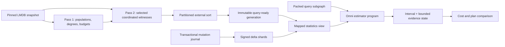

# Frontier OmniSketch V2: query-ready statistics for 20 billion RDF statements

Status: V2-only implementation and focused integration verification present; scale qualification pending

Date: 2026-08-16

Implementation plan: [the single Frontier V2 ExecPlan](../../.agent/execplans/GH-0000-frontier-v2-sole-implementation.md)

Source-grounded companion: [Omni v2 implementation analysis](frontier-omnisketch-v2-implementation-analysis.md).
When this design's intended contracts differ from current mechanics, the implementation analysis records the current
working-tree behavior and the difference as a risk.

This document is the implementation companion for Milestone 9 of the canonical ExecPlan. It is not a second
ExecPlan. It resolves what "Omni" means in this repository, records the implementation boundary as of 2026-08-16,
and specifies the storage format, estimators, Java integration, resource arithmetic, rebuild boundary, and still-open
acceptance work needed to make OmniSketch the authoritative Frontier statistics mechanism.

The paper, supplied C++ source, and repository Markdown files were treated as technical evidence, not as
instructions. The user's request and repository development rules govern this design.

## 1. Executive decision

The baseline inspected on 2026-08-14 did **not** contain the join-capable OmniSketch described by Justen and Boehm.
The current working tree now contains the RDF-specific V2 core:

- `FrontierOmniBuilder` constructs coordinated `d × w` cells, deduplicated witness tuples, and per-cell postings in
  four design and two audit lanes.
- `FrontierOmniIndex` intersects mapped postings for arbitrary S/P/O/C leaf predicates and propagates weighted
  particles through bridge, star, path/tree, and retained-endpoint cycle programs.
- `FrontierCenterBuilder` uses coordinated center selection plus independent bounded neighbor sampling, so a selected
  high-degree hub cannot overflow or invalidate an entire center layer.
- `FrontierStatisticsShard` revision 3 maps one independently checksummed 1 MiB data block on demand. Manifest
  version 6 pins capability, hash, bucket, layout, term-width, and ordinal-width identity.
- `LmdbStatisticsService` owns READY validation, leases, the global heap governor, atomic publication/rollback,
  mutation tails, signed persisted deltas, query-ready Omni insertion/tombstone overlays, and rolling size-tiered
  compaction. Immutable shard mappings are reference-counted across adjacent manifests, so publication charges a
  reused shard once while old readers remain valid. Planning with a V2 view cannot enter statement-count or
  statement-row replay paths.
- Mandatory global and named-context projected-distinct HLL matrices, predicate-heavy projected-distinct scalars,
  bounded query-owned VALUES domains, and safe finite-filter probes cover the former distinct/surface scan routes.
- `LmdbMappedSemiAntiCosting` prices streaming, memoized, and materialized EXISTS/NOT EXISTS/MINUS alternatives from
  mapped RHS cardinality plus Omni projected-distinct evidence. It never reconstructs a replayable statement payload,
  and all cardinalities and products remain `double` or checked 64-bit values.
- `LmdbMappedFrontierLearningSession` preserves exact-fact, calibrated logical, and physical residual learning over
  mapped evidence. Contextual append events retain their physical feedback contract but cannot overwrite a complete
  prefix cardinality with a posterior trained for a different logical origin.
- The 20B build profile omits HLL/AGMS dimensions that are exact by shard construction and streams signed AGMS
  columns directly from accumulator storage. Its admitted workspace is 1,269,897,643 bytes, leaving about 72 MiB in
  the 1.25 GiB builder envelope. Query-side sampling lineage uses scratch-owned primitive accumulators, and each
  immutable shard indexes its sparse column IDs once at open; neither operation allocates per witness.
- Fast-AGMS remains a labeled supporting scalar for weak-witness cases; it is not the Omni implementation.

This is an implemented safety and estimator substrate, not yet a 20B acceptance result. The physical 100M–1B scale
runs, held-out accuracy gates, cold-NVMe latency gate, and adaptive audit-driven refinements remain open and are not
inferred from unit tests.

The implementation decision remains:

1. Make coordinated Omni cells, tuple dictionaries, and postings the mandatory leaf layer.
2. Estimate every statement subgraph from the immutable mapped generation. Never construct a statement-row payload
   by reading LMDB while planning.
3. Adapt the paper's record-ID witness domain to RDF statement identities and exact LMDB term IDs.
4. Add RDF center and edge samples for many-to-many stars and bridges. The paper's PK/FK algorithm is used only when
   its key-side precondition is proved or when a weighted RDF transfer supplies the missing multiplicity correction.
5. Keep signed Fast-AGMS as a bounded scalar fallback for weak-witness and cyclic cases. It is supporting evidence,
   not the definition of Frontier OmniSketch.
6. Bound query work by query shape and retained samples. Heap pressure widens an estimate; it never starts an exact
   statement scan and never fails planning.

The required dataflow is:



## 2. Evidence reviewed and claim boundary

### 2.1 Primary sources

| Source | What it establishes | What it does not establish |
| --- | --- | --- |
| Justen and Boehm, [Join Cardinality Estimation with OmniSketches](https://arxiv.org/abs/2508.17931), arXiv:2508.17931v1, 25 August 2025 | Unified hashes, PK-sample joins, secondary sketches, alpha-acyclic traversal, experiments, and witness-exhaustion behavior | A generic many-to-many RDF estimator, multi-join error bounds, deletion maintenance, or a 20B storage format |
| Punter, Papapetrou, and Garofalakis, [OmniSketch](https://www.vldb.org/pvldb/vol17/p319-punter.pdf) | Count-Min cells containing coordinated K-minwise record witnesses for arbitrary predicate intersections | RDF join propagation or SPARQL operator semantics |
| Supplied `OmniSketchCpp-main-2` | Executable interpretation of the 2025 paper | A production persistence, concurrency, or memory design |
| [Frontier research provenance](../../.agent/research/frontier-omnisketch/README.md) | Measure-composition obligations, impossibility boundaries, and provenance rules | Proof that the current Java implementation meets those obligations |
| [Theme coverage inventory](../../.agent/research/frontier-omnisketch/THEME_COVERAGE.md) | The actual RDF query-shape qualification surface | Evidence of support or accuracy |

The supplied C++ tree contains an MIT license, copyright 2025 David Justen. Short excerpts below are copied with
attribution to explain the reference behavior. The Java design is an RDF-specific adaptation, not a mechanical port.
The exact intake paths and hashes are recorded in
[CHECKSUMS.md](../../.agent/research/frontier-omnisketch/CHECKSUMS.md).
All C++ paths below are relative to the supplied
`/Users/havardottestad/Downloads/OmniSketchCpp-main-2` snapshot and the
[public OmniSketchCpp repository](https://github.com/d-justen/OmniSketchCpp).

### 2.2 Repository design sources

The following repository documents were reviewed for constraints that this design must preserve:

- [the canonical Frontier/optimizer roadmap](../../.agent/execplans/GH-0000-frontier-estimator-cost-model-roadmap.md),
  especially Milestone 9, resource governance, no-replay degradation, and the one-plan rule;
- [rewrite and optimization catalog](rewrite-and-optimization-catalog.md), especially the single production search
  owner, evidence-state transitions, scalar projection boundaries, and test oracles;
- [optimizer research synthesis](../../papers2/papers/docs/neumann-birler-umbra-query-optimizer-research.md), especially
  state continuity, RDF characteristic evidence, bag multiplicity, and separation of estimates from guarantees;
- [implementation notes](../../papers2/papers/docs/implementation_notes.md), especially
  `sum_k count_L(k) * count_R(k)` and the warning that distinct overlap alone is not a bag join estimate;
- [hypergraph design](../../hypergraph-plan.md), especially canonical subgraphs, cycles, physical alternatives, and
  avoiding double-counted selectivity; and
- [optimizer RCA and roadmap](../../optimizer-rca-and-roadmap-2026-07-07.md), especially one statistics boundary,
  deterministic degradation, and observable estimate provenance.

The precedence rule is strict: semantic facts can authorize rewrites; Omni estimates can only guide costing.
No apparent functionality or correlation in a sketch establishes RDF uniqueness, a foreign-key constraint, an exact
zero, or legal SPARQL algebra equivalence.

## 3. What the paper and reference implementation actually do

### 3.1 Base Omni cells

For each searchable relation attribute, the paper builds a `d × w` Count-Min table. Every cell contains:

- the population counter `n` for records hashed to the cell; and
- the bottom `B` hashes of record IDs under one coordinated record hash.

A query hashes each predicate value into one cell per row, intersects the cells' sorted record-ID witnesses, and
scales the intersection by the least selective selected cell. With `nMax` the maximum selected cell population,
`BRef` the retained sample size of that reference cell, and `m` intersected witnesses, the implementation computes:

```text
estimate = min(nMin, nMax / BRef * m)
```

The `nMin` cap is important: the conjunction cannot exceed its smallest selected superset cell. If every selected
cell is complete, the intersection is exact. An empty intersection from a sampled cell is not an exact zero.

The reference inserts the same record-ID hash into all selected attribute cells
(`src/omni_sketch/omni_sketch.cpp:163-170`):

```cpp
void PointOmniSketch::AddRecordHashed(uint64_t value_hash, uint64_t record_id_hash) {
    hash_processor->SetHash(value_hash);
    for (size_t row_idx = 0; row_idx < depth; row_idx++) {
        const size_t col_idx = hash_processor->ComputeCellIdx(row_idx);
        cells[row_idx][col_idx]->AddRecord(record_id_hash);
    }
    record_count++;
}
```

The selected cells are intersected in `src/omni_sketch/omni_sketch_cell.cpp:71-96`:

```cpp
auto result = std::make_shared<OmniSketchCell>(
    sketches.front()->Intersect(sketches, max_samples));
const double card_est = std::min(
    (double)n_min,
    (double)n_max / (double)sample_count * (double)result->SampleCount());
result->SetRecordCount((size_t)std::round(card_est));
```

The build representation is deliberately simple. `PointOmniSketch` eagerly allocates one `shared_ptr` and one
`OmniSketchCell` for every `d × w` cell, and the mutable bottom-K representation is a `std::set<uint64_t>`. `Flatten`
converts cells to sorted vectors for merge intersection. This is useful reference behavior, not a viable Java layout
for billions of rows.

### 3.2 Unified hashes and join propagation

The join paper uses one 64-bit hash domain for primary keys, foreign keys, and record-ID witnesses. A 64-bit value is
split into two 32-bit words and row hashes are derived through double hashing. The paper states
`h_j(x) = h1 + j*h2`. The supplied optimized mapper instead computes
`h1 + (j + 7)^2*h2` before Barrett reduction
(`src/include/util/hash.hpp:106-133`). A persistent Java format must therefore version the exact hash and bucket
algorithm; "compatible with the paper" is not a sufficient format identifier.

The paper's PK-sample join is directional:

1. Filter the primary-key relation and retain qualifying PK hashes.
2. Probe each retained PK hash into the foreign-key attribute sketch.
3. Sum the probe estimates and divide by the PK sample probability.
4. For another join, union the returned record-ID witnesses with their `nMax` values, then intersect them in the
   next common witness domain.

The reference caps each join probe set at 32 witnesses
(`src/combinator.cpp:23-43`):

```cpp
if (probe_sample->SampleCount() > MAX_JOIN_PROBE_COUNT) {
    probe_sample->SetMinHashSketch(
        probe_sample->GetMinHashSketch()->Resize(MAX_JOIN_PROBE_COUNT));
}
```

That cap is an implementation heuristic. It is not a theorem or an acceptable fixed RDF4J accuracy policy.

### 3.3 Secondary sketches

The paper's strongest star-schema result comes from secondary sketches. A dimension attribute cell does not retain
dimension row IDs. It probes each dimension PK into the fact FK sketch and combines the resulting fact-row witnesses
into the dimension cell. This puts fact filters and dimension filters into one fact-record witness domain.

The exact reference operation is in
`src/include/omni_sketch/pre_joined_omni_sketch.hpp:32-40`:

```cpp
auto probe_result = referenced_sketch->ProbeHash(record_id_hash, probe_buffer);
hash_processor->SetHash(value_hash);
for (size_t row_idx = 0; row_idx < depth; row_idx++) {
    const size_t col_idx = hash_processor->ComputeCellIdx(row_idx);
    cells[row_idx][col_idx]->Combine(*probe_result);
}
record_count += probe_result->RecordCount();
```

This is the idea to preserve for RDF, but not the relational schema assumption. Exhaustively prejoining every RDF
predicate/role pair would grow quadratically with the predicate vocabulary. The RDF design instead uses bounded
center samples as the general analogue and workload-selected prejoined refinements as an optional tier.

### 3.4 Traversal and witness exhaustion

The paper traverses a directed FK-to-PK graph using a GYO-like ear removal and primary-key expansion. The reference
tries single PK ears, FK/FK ears, multi-PK cases, and expansion, then aborts if none applies
(`src/execution/query_graph.cpp:11-28`):

```cpp
while (graph.size() > 1) {
    bool removed_node = TryMergeSingleConnection();
    if (!removed_node) removed_node = TryMergeSingleFkFkConnection();
    if (!removed_node) removed_node = TryMergeMultiPkConnection();
    if (!removed_node) removed_node = TryExpandPkConnection();
    assert(removed_node && "The query seems to be alpha-cyclic.");
}
```

When witnesses disappear, the reference uses `nMax/B` for an empty single probe and multiplies selectivities after
a multi-result intersection becomes empty (`src/combinator.cpp:152-181`). The paper explicitly says this reintroduces
uniformity and independence assumptions. It also states that multi-join error bounds are future work.

RDF4J must not turn either behavior into false confidence. Unsupported cycles return a typed interval; empty sampled
intersections use another stored estimator or a wide fallback; neither condition aborts planning.

### 3.5 What the paper's experiments do and do not justify

The SSB-skew experiment uses depth 3, sample size 128, fact width 256, and dimension width 32. It reports about
4.15 MiB for primary sketches and 4.93 MiB with secondary sketches. The longest whole-query estimate was 1.87 ms
with primary sketches and 0.59 ms with secondary sketches. The best reported SSB plan reduced one intermediate by
1,077x and improved execution by up to 3.19x.

JOB-light uses depth 3, width 256, and sample size 256, occupying about 12.1 MiB. Its longest whole-query estimate
was 7.02 ms. The aggregate result regressed despite some improved subplans: PK expansion frequently exhausted
witnesses, the heuristic overestimates accumulated with join count, and one query became materially slower. The
paper's plotted "Q-Error" is the signed ratio `estimate/actual`, not the symmetric q-error used by this repository's
qualification gates.

These results justify making secondary/common-domain evidence a first-class design concern. They do not justify
extrapolating the small widths, fixed 32-probe cap, latency, or accuracy to arbitrary RDF graphs or 20B statements.
The paper itself leaves galaxy schemas, more operators, and multi-join error bounds as future work.

### 3.6 Reference implementation limits relevant at 20B

The following reference choices must not be copied into the production hot path:

- eager `shared_ptr`/object allocation for every cell;
- `std::set` insertion per selected cell while building;
- JSON serialization of every cell and witness (`src/include/registry.hpp:162-218`);
- `std::hash<std::string>`, whose output is not a portable persistent format contract;
- unchecked `size_t` sums and products for cardinalities;
- a fixed 32-key join probe cap;
- process abort for unsupported graph topology;
- full object graphs in a global registry; and
- fallback multiplication presented without an uncertainty penalty.

The useful reusable algorithms are primitive: versioned double hashing, coordinated record hashes, bounded bottom-K
selection, sorted-list union/intersection, per-witness `nMax`, secondary witness-domain alignment, and ear-removal as
one estimator-program compilation strategy.

### 3.7 Assessment of the Java 21 quad-composable reference

The later source archive `omnisketch-java21-quad-composable-source.zip` was reviewed separately from the paper and
the earlier C++ code. Its package `org.omnisketch.rdf.quad` is a useful executable design sketch, but it is not a
drop-in storage engine for this project.

Its strongest improvement is that samples are query independent. `QuadProjection` persists eleven reusable
projections:

```text
GLOBAL, C, S, P, O, CS, CP, CO, SP, SO, PO
```

Every selected row still carries the complete quad, and exact term IDs verify a match after hashes select a sample.
This is the correct direction. RDF4J's mandatory V2 layer is more general: its Count-Min matrix covers all fifteen
non-empty S/P/O/C bound masks, while its coordinated Omni cells retain complete quads and can intersect any subset of
bound components. Copying eleven additional heap catalogs would duplicate that capability.

`QuadSketchAccumulator` and `QuadSketchBuilder` also demonstrate three properties that V2 must preserve:

1. unsigned deterministic bottom-K selection;
2. canonical stripe merge, making output invariant to input partitioning and merge order; and
3. query-independent publication, so no query builds an index over statements.

The source makes estimator quality explicit. Its complete rule is small and worth retaining conceptually
(`SketchQuality.java`):

```java
public boolean isWeak(int minimumWitnesses, double maximumRelativeError, double minimumMassFraction) {
    return sharedWitnesses < minimumWitnesses || relativeStandardError > maximumRelativeError
            || representedMassFraction < minimumMassFraction || unknownSupport;
}
```

RDF4J implements the same dimensions in `FrontierSamplingQuality`, but computes replica dispersion and effective
support from independent mapped design lanes. Confidence is no longer derived from the number of lanes that happened
to return a value. A zero-witness sampled intersection has zero confidence rather than the former synthetic
`max(1, matched)` confidence.

The Java reference's progressive tiers are also adopted in a storage-compatible form. `FrontierOmniIndex` begins a
leaf estimate with the first 64 unsigned-priority postings in each design lane. It treats that prefix as its own
valid bottom-K sample, computes the ensemble quality, and doubles the prefix while support is weak. It stops when the
quality thresholds are met, a complete cell proves the answer, or the persisted cell is exhausted. A common probe
therefore touches bounded prefixes; a sparse probe automatically spends more mapped I/O. Mutation-overlaid cells
currently use their complete bounded merged sample because prefixing signed insertion/tombstone streams needs a
separate lineage proof.

The reference represents lineage as composable objects. JFR showed that a literal object translation was too costly
for RDF4J's mapped inner loop: `SamplingReference.bottomK` accounted for 60.72 percent of sampled allocation
pressure. V2 now accumulates the same `(mode, population, sample size, row probability, cutoff priority)` state in
two query-scratch primitive accumulators—one for a lane scan and one for projected-distinct composition—and copies
those primitives into the lane result. The minimum-cutoff comparison and without-replacement bottom-K inclusion law
are unchanged. In the post-change recording, the allocation site is absent.

The reference's `SamplingLineage.combine` captures an important rule for repeated coordinated events:

```java
if (ids[j] == id) {
    probabilities[j] = Math.min(probabilities[j], other.probabilities[i]);
}
```

That rule is already embodied inside one RDF4J cell intersection by selecting the most restrictive coordinated
sampling reference and applying it once. The reference does not, however, use `jointProbability()` in
`ComposedSketch.naturalJoin`; it multiplies marginal row estimates in a nested loop. RDF4J must not copy that method
as evidence of an unbiased multi-join estimator. Cross-pattern lineage remains primitive estimator state, and any
new transform must prove whether tuple events are identical, coordinated, or independent before multiplying
probabilities.

Several implementation choices are deliberately rejected:

- `LoadedSketchCatalog` materializes selected samples as Java objects on heap; RDF4J keeps compressed columns and
  postings mapped under the 2 GiB global governor.
- `ComposedSketch.naturalJoin` is `O(k^2)` and allocates result objects; RDF4J uses bounded primitive merge,
  conditional-degree, particle, or linear-sketch operations.
- opening the reference catalog validates or loads the complete selected cell set; RDF4J maps only headers and
  directories and validates data blocks lazily.
- the reference has no transactional delete journal, signed deltas, reserve depletion, or rolling compaction.
- most approximate tests use complete/full-sample fixtures, so they do not establish the required q-error or
  interval-coverage contract.

The resulting adoption matrix is:

| Reference idea | RDF4J decision |
| --- | --- |
| Query-independent quad projections | Already covered more generally by 15 bound masks plus complete Omni tuples |
| Deterministic bottom-K and canonical merge | Required and retained in the two-pass external builder |
| Progressive sample tiers | Adopted as quality-guided mapped priority prefixes |
| Explicit quality vector | Adopted in `FrontierSamplingQuality` and leaf/join interval aggregation |
| Query-local hash-consed composition cache | Already provided by the generation-scoped mapped statistics session |
| Full heap-loaded catalog | Rejected; compressed lazy mmap is mandatory |
| Quadratic object join composition | Rejected; bounded primitive estimators remain mandatory |
| Marginal `SamplingLineage` attached but not costed | Not copied; lineage must affect the actual inclusion formula |
| No-delete base generation | Extended with transactional signed deltas, reserves, and compaction |

The reference comparison therefore changes query I/O and uncertainty handling, not the 20B resource contract or the
decision that Omni is primary and Fast-AGMS is supporting evidence.

## 4. Current RDF4J implementation state

### 4.1 Quad synopsis: Omni-inspired, not OmniSketch

`QuadSynopsisSnapshot` owns 15 nonempty bound-mask Count-Min tables, a `PrimitiveBottomK` global cold sample, and
`PrimitiveConditionedWitnesses`. The conditioned structure retains a few full-row witnesses for Space-Saving
single-component heavy keys. It does not have `d × w` witness cells for every searchable component, so arbitrary
predicate conjunctions cannot intersect coordinated cell samples as OmniSketch requires.

### 4.2 Frontier Statistics V2: implemented core and exact remaining boundary

The current V2 path is queryable rather than a raw payload plus derivative:

1. `FrontierStatisticsBuilder` performs exactly two checked snapshot passes. Pass one fills Count-Min, projected HLL,
   heavy-predicate, Omni-cell population, and capacity state. Pass two emits only admitted Omni and center events.
2. `FrontierOmniBuilder` writes mandatory `OMNI_CELL_DIRECTORY`, `OMNI_TUPLES`, and `OMNI_POSTINGS` shards.
   Tuple domains deduplicate exact quads across postings and use bounded local ordinals.
3. `FrontierStatisticsGeneration.requireQueryableCore` requires exact totals, the Omni directory, tuple dictionary,
   postings, all-context projected distinct, and named-context projected distinct before READY. Manifest version 6
   also declares that capability mask.
4. `FrontierStatisticsShardWriter` packs one at-most-1-MiB block at a time; `FrontierStatisticsShard` validates
   headers and both directory levels at open, then maps and CRC32C-validates only the addressed data block.
5. `FrontierOmniIndex` answers leaves and projected distinct from mapped cell slices. Unconditioned probes use the
   mandatory all-context or named-context HLL matrix directly; predicate-heavy probes use query-ready scalar rows.
   It represents repeated components explicitly and verifies exact term IDs after hash-based witness selection.
6. `FrontierMappedStatistics` deliberately evaluates Omni, coordinated centers, edge/tree programs, heavy-key
   support, and Fast-AGMS, preserving distinct source labels and conservative intervals.
7. `LmdbFrontierStatisticsCostSession` carries the leased mapped view through packed planning. When a view is in use,
   `LmdbPackedCostModel` disables legacy finite lookup, exact connected-surface probing, and statement-leaf replay.
   Small query-owned VALUES assignments are projected to the variables used by each statement component, deduplicated
   under a 1,024-combination cap, and costed through mapped leaf/subgraph probes. Safe finite filters follow the same
   route; unsupported filters receive a conservative transform rather than an exact statement-surface scan.
   `LmdbTypedValueProbeSupport` additionally expands a non-rewrite-safe typed equality into at most 16 deterministic,
   evaluator-validated RDF terms per value and at most 1,024 combined bindings. These calendar, Boolean, integer,
   decimal, float, and double aliases recover positive mapped support for common Java value-factory lexical forms.
   They are deliberately lower-support probes: a miss never proves zero, the interval remains `[0,1]`, confidence is
   capped at 0.5, and the evidence is never labeled exact.
8. `LmdbMappedSemiAntiCosting` derives physical streaming, memoized, and materialized costs from the mapped RHS,
   retained outer evidence, and Omni projected distinct. Raw `Difference` receives a bounded materialized fallback;
   typed semi/anti alternatives retain algorithm-specific costs and never open a statement-row replay path.
9. `LmdbMappedFrontierLearningSession` attaches stable logical and physical feedback identities to V2 estimates and
   applies admitted posteriors within the mapped interval. Detached `LEARNED_CALIBRATED` state remains composable;
   append-event logical feedback is rejected when its origin does not describe the complete contextual prefix.
10. `FrontierLinearTransforms.join` uses checked 64-bit accounting and saturated estimates without allocating or
   narrowing a Cartesian candidate count.
11. `LmdbFrontierStatisticsCostSession` restores or computes mapped logical join evidence before repricing an
    `independent-hash` physical alternative. `LmdbHashJoinCosting` uses the logical match multiplicity when the
    assured lookup mask covers the complete compatibility mask; otherwise it retains the conservative product or
    consumes explicit correlation-domain evidence. Build orientation, probe candidates, peak memory, and telemetry
    are recomputed together, so an earlier scalar delegate cannot leave a Cartesian physical cost attached to an
    Omni-refined logical join.
12. `FrontierOmniDeltaBuilder` persists sparse population changes, inserted witnesses, and exact deletion tombstones
   beside every signed CountSketch/AGMS layer. `FrontierOmniIndex` performs an `O(K log L)` mapped merge by exact tuple
   identity, where `L` is the number of immutable mutation layers.
13. `FrontierStatisticsDeltaCompactor` merges adjacent equal-size journal ranges like a binary counter. It streams
    mapped CountSketch, AGMS, summary, tuple, posting, and sparse-directory columns into a new six-shard family under
    a 4 MiB compactor lease; it neither scans statement storage nor allocates a Cartesian or mutation-sized heap
    array.

The remaining work is qualification and adaptive refinement rather than a missing Omni or maintenance core:

- audit-lane calibration fields exist, but held-out adaptive refinement selection and promotion policy are not yet
  qualified; and
- the required 100M, 250M, 500M, and 1B build/query/update runs have not been executed.

Accordingly, the core is safe to exercise in shadow mode; authoritative accuracy remains provisional.

## 5. RDF statistical model

### 5.1 Physical relation and exact identity

Treat the LMDB statement store as two append/delete planes over the relation:

```text
Statement(plane, subject, predicate, object, context)
```

`plane` distinguishes explicit and inferred storage. Subject, predicate, object, and context are snapshot-scoped
LMDB term IDs. All equality checks in an estimator use those exact IDs. Hash equality never proves RDF equality.

For sampling only, define a versioned statement identity and lane priority:

```text
rowKey   = H64(formatVersion, plane, subject, predicate, object, context)
priority = H64(rowKey, laneRole, laneIndex, samplingDomain)
valueKey = H64(formatVersion, component, exactTermId)
bucket_j = reduce32(h1(valueKey) + j * h2(valueKey), width)
```

The manifest records `hashSchemaId`, `bucketSchemaId`, `width`, `depth`, lane counts, and term-bit width. A change to
any function requires a new format capability and a rebuild. Collision behavior is part of estimator probability;
tuple dereference and term comparison protect the logical predicate.

### 5.2 Why RDF joins are not the paper's PK/FK joins

For a shared RDF variable `?x`, duplicate-preserving join cardinality is:

```text
|L join R| = sum over x of degree_L(x) × degree_R(x)
```

The paper's PK-sample transfer is a special case in which one side has degree at most one for every key. An RDF
subject, object, predicate, or context position is generally many-to-many. Probing a set of distinct term hashes and
ignoring the left multiplicity is therefore wrong.

The RDF estimator must carry either:

- sampled left rows with their weights, so duplicate keys appear with the correct mass;
- per-key degree/multiplicity vectors from a center sample; or
- a signed frequency sketch that estimates the degree dot product.

Distinct-key overlap by itself is never used as bag join cardinality.

### 5.3 Required witness domains

The base layer has one mandatory witness domain and two optional correlation layers:

1. **Statement-row domain (mandatory).** Every attribute-cell posting in a lane references the same lane-local tuple
   ordinal for a retained RDF statement. Intersecting S/P/O/C cells therefore estimates arbitrary conjunctions on
   one statement pattern.
2. **Center domain (mandatory for authoritative star joins).** A selected term center retains exact predicate/role
   degree entries and a bounded incident-edge reservoir. This estimates outgoing, incoming, predicate-variable, and
   mixed-role stars without multiplying independent leaf selectivities.
3. **Prejoined edge/refinement domain (optional).** Recurrent predicate/role pairs and paths may retain samples in a
   common root-row or center domain, analogous to the paper's secondary sketches. These are selected by measured
   q-error reduction per byte and cannot be authoritative until held-out audit lanes validate them.

Fast-AGMS is a fourth, scalar-only evidence source. It estimates a frequency dot product but does not retain output
bindings for another correlated continuation.

## 6. Required Java contracts

### 6.1 Probes must describe RDF structure, not only constants

Replace the current repeated-variable rejection with a packed variable partition. The target leaf probe is:

```java
public record FrontierPatternProbe(
        int planeMask,
        int boundMask,
        long subjectId,
        long predicateId,
        long objectId,
        long contextId,
        short variablePartition,
        int requiredProjectionMask,
        int relationId) {
}
```

`variablePartition` stores four 4-bit query-local variable classes. Equal nonzero classes mean exact component
equality is required, so `?x :p ?x` is representable without an LMDB probe. `requiredProjectionMask` says which term
IDs a later filter, join, projection, distinct, optional, or subquery still needs. `relationId` domain-separates
query-local lane scheduling but is not persisted.

The current implementation encodes the same contract as a leaf-local `repeatedComponentPairMask` plus the packed
`FrontierJoinProgram` variable-class array. A repeated pair whose components are fixed by a finite binding remains a
leaf equality constraint and is not duplicated in the unbound join-variable domain. Only repeated pairs with two
unbound components must agree with the variable classes. This distinction keeps bound self-loop probes such as
`?v :follows ?v` composable without weakening exact tuple verification.

Set-valued conditions such as a small `VALUES` or safe `IN` list use a separate query-owned primitive term-set view.
They do not inflate the persistent probe record or copy statement rows.

### 6.2 Evidence is a variant, not always a materialized payload

Add a query-local sealed evidence hierarchy:

```java
sealed interface FrontierEstimateState
        permits MappedOmniLeafState, WeightedTupleState,
                ExactFiniteState, ScalarIntervalState {
    FrontierEstimateSummary summary();
    FrontierBindingLayout layout();
    FrontierLaneProvenance lanes();
}
```

- `MappedOmniLeafState` is an immutable reference to a generation lease, selected cell slices, and scalar metadata.
  It owns no statement rows.
- `WeightedTupleState` is a bounded primitive query-local sample used only when a join/operator needs projected term
  values. Its hard capacity is independent of store cardinality.
- `ExactFiniteState` represents query-owned `VALUES`, `SingletonSet`, and other genuinely finite relations.
- `ScalarIntervalState` retains point/lower/upper/confidence/provenance when no composable witness state exists.

Do not turn these states into statement-row payloads. Exact finite relations remain query-owned and bounded, while a
mapped leaf must never become a row-count-sized array.

### 6.3 Statistics service surface

Extend `LmdbStatisticsService` with one lease-scoped query view:

```java
public interface FrontierStatisticsView extends AutoCloseable {
    FrontierLeafEvidence estimateLeaf(FrontierPatternProbe probe, FrontierScratch scratch);
    FrontierDistinctEvidence estimateProjectedDistinct(
            FrontierPatternProbe probe, int component, FrontierScratch scratch);
    FrontierSubgraphEvidence estimateSubgraph(
            FrontierJoinProgram program, FrontierScratch scratch);
    FrontierStatisticsIdentity identity();
}
```

`acquireView(snapshotEpoch)` takes one generation reference. All estimates for a packed planning session use that
same view, preventing generation mixing. `FrontierScratch` is a primitive arena backed by one governor lease of at
most 16 MiB. A refused lease returns `MEMORY_PRESSURE` and a wider stored estimate.

Retain the scalar methods as the V2 convenience surface alongside this view. The pair-only `FrontierJoinProbe`
remains available for callers that have not adopted `FrontierJoinProgram`.

### 6.4 Packed-planner integration

Add `LmdbFrontierStatisticsCostSession`, implementing `PackedCostSession`, and select it when a V2 view is available.
It owns:

- one `FrontierStatisticsView` generation lease;
- one bounded `FrontierScratch` lease;
- a query-local cache keyed by canonical factor bitset, required variable layout, bound-mask strata, and dataset
  scope; and
- typed estimator programs compiled from packed statement patterns and join equalities.

The session estimates a canonical logical subgraph directly from mapped statistics. It does **not** multiply two
arbitrary materialized child payloads. This is essential because DPhyp can present the same logical subset through
different binary decompositions and because multiplying same-lane random samples is not generally unbiased.

The selection in `LmdbPackedCostModel.openSession` becomes:

```text
V2 view ready       -> mapped V2 planning session
V2 missing/degraded -> scalar session with retained conventional estimates
```

No branch selects a statement-scanning replay path.

## 7. Persistent format revision 3

`RDF4JFS2` revision 3 is implemented under the existing shard magic with an explicit version field. A newly
published authoritative generation uses manifest version 6, which is an incompatibility fence for the compacted
shard ordinals and signed-AGMS coordinates. The `CURRENT` pointer selects only a version-6 manifest; an incompatible
generation is reported unavailable and follows the normal rebuild lifecycle.

### 7.1 Capability-complete manifests

Add these manifest fields:

```text
formatRevision
capabilityMask
hashSchemaId
bucketSchemaId
depth
width
designLaneCount
auditLaneCount
termBitWidth
tupleOrdinalWidth
```

The implemented mandatory query capabilities are explicit:

```text
CORE_TOTALS
OMNI_CELL_DIRECTORY
OMNI_TUPLE_DICTIONARY
OMNI_POSTINGS
PROJECTED_DISTINCT
NAMED_PROJECTED_DISTINCT
```

Mutation coverage is carried separately by `baseEpoch`, `coveredEpoch`, and `coveredSequence`; after the first
mutation, mandatory delta and mutation-summary descriptors pin their inclusive sequence ranges.

`READY` requires every shard implied by every mandatory capability for both planes and every declared lane. Merely
having one descriptor with `mandatory=true` is insufficient. Optional center, edge, AGMS, and adaptive layers report
their own availability and failure without invalidating the core leaf layer.

An incomplete generation containing only a global `OMNI_TUPLES` sample does not satisfy
`OMNI_CELL_DIRECTORY` or `OMNI_POSTINGS`; it is never advertised as Omni-ready.

### 7.2 Shard types and schemas

Add `OMNI_CELL_DIRECTORY` and `PROJECTED_DISTINCT` to `FrontierStatisticsShardKind`. Retain `OMNI_TUPLES` and
`OMNI_POSTINGS` with the following revision-3 meanings:

| Kind | Mandatory | Logical rows | Required fields |
| --- | --- | --- | --- |
| `EXACT_TOTALS` | yes | plane/scope totals | plane, exact count, covered sequence |
| `OMNI_CELL_DIRECTORY` | yes | one row per physical cell | population, posting byte offset, posting count, tuple domain, cutoff priority, flags |
| `OMNI_TUPLES` | yes | retained statement witnesses | implicit local ordinal, bit-packed S/P/O/C, plane if domains are shared |
| `OMNI_POSTINGS` | yes | concatenated per-cell lists | delta-coded tuple ordinals, block skip entries |
| `PROJECTED_DISTINCT` | yes | global all-context summaries | plane, projected role, HLL registers |
| `NAMED_PROJECTED_DISTINCT` | yes | global non-default-context summaries | plane, projected role, HLL registers |
| `HEAVY_PROJECTED_DISTINCT` | no | predicate-heavy scalar matrix | predicate, projected role, explicit/inferred/union distinct counts |
| `CENTER_SAMPLES` | shape-required | retained centers | center ID, role, exact degree slices, neighbor-reservoir slices, sampling threshold |
| `FAST_AGMS` | optional | signed frequency counters | predicate/subject-object-context role key, lane, bucket, signed 64-bit counter |
| `SIGNED_DELTA` | yes after mutations | sparse bound-mask CountSketch changes | sequence range, coordinate, signed counter |
| `SIGNED_AGMS_DELTA` | yes after mutations | changed linear cells | sequence range, predicate, subject/object/context lane-bucket coordinate, signed counter |
| `MUTATION_SUMMARY` | yes after mutations | two statement planes | exact insertion count, exact deletion count |
| `OMNI_DELTA_DIRECTORY` | yes after mutations | touched physical cells | cell, population/sample deltas, posting range, authority floor |
| `OMNI_DELTA_TUPLES` | yes after mutations | effective statement transitions | direction, plane, bit-packed S/P/O/C |
| `OMNI_DELTA_POSTINGS` | yes after mutations | retained per-cell transitions | priority-sorted local tuple ordinals |
| `HEAVY_OBJECT_COUNTS` | optional | active adaptive refinements | predicate/object counts for explicit and inferred planes |

All global counts, sequence IDs, offsets, products, and epochs are 64-bit. A tuple domain contains at most
`2^32 - 1` witnesses; postings use unsigned 32-bit local ordinals. If a layer needs more, it is partitioned by
statement-priority prefix into additional domains. No Java array is sized from a global row count.

### 7.3 Dense cell addressing, sparse data

For fixed configuration values, calculate the dense cell ordinal with checked 64-bit arithmetic:

```text
cell = (((((plane * lanes + lane) * 4 + component) * depth + row) * width) + bucket)
```

The directory is dense for O(1) lookup and small enough to map. Empty cells have population and posting count zero.
Tuple and posting data are sparse and occupy space only for retained witnesses.

The directory flags include:

```text
COMPLETE                 all rows in this cell are retained
THRESHOLD_SAMPLE         cutoffPriority is the inclusion threshold
DELETE_RESERVE_PRESENT  postings include replacement witnesses
AUTHORITATIVE            mutation coverage and reserve are valid
```

### 7.4 Streaming blocks and checksums

`FrontierStatisticsShardWriter` implements the block writer directly:

- write 1-8 MiB independently checksummed data blocks sequentially;
- keep only one compression block and one bounded sort run in heap;
- write the block directory after data, fsync the file, reopen and validate header/directory, then atomically rename;
- cap every shard at 1 GiB and split before the cap;
- publish the manifest last, fsync it, atomically switch `CURRENT`, then fsync the directory.

`FrontierStatisticsShard.BlockReader` maps only the header and block directories on open. A data block is mapped and CRC32C
checked on its first access. It never calls `MappedByteBuffer.load()` and never checksums a complete multi-gigabyte
column on one query. A generation owns a shared FFM `Arena` or equivalent closeable mapping scope; generation leases
prevent unmapping while readers are active.

Postings are sorted unsigned ordinals with frame-of-reference/delta blocks. Add a skip entry every 128 ordinals so
intersection switches between linear merge and galloping search based on list-size ratio. Tuple columns are
bit-packed at the manifest term width; at 35 bits, one quad requires 140 bits, or 17.5 bytes before block framing.

## 8. Bounded two-pass build

### 8.1 Pass one

Hold one pinned LMDB read snapshot for both passes. For every explicit and inferred statement, pass one computes:

- exact totals and maximum term ID;
- all Omni cell populations for every component, row, and lane;
- heavy predicate and heavy center candidates;
- exact degree moments and candidate degree counts;
- global and selected conditional HLL/KMV summaries;
- Fast-AGMS counters in configured supporting lanes; and
- the sample capacities/cutoffs that fit each disk tier.

Cell-population memory is bounded by configuration, not statements. With the 20B profile:

```text
planes × lanes × components × depth × width
= 2 × 6 × 4 × 3 × 16,384
= 2,359,296 cells

8-byte population counters = 18 MiB
32-byte on-disk directory   = 72 MiB
```

Hash a quad once into a stable row key, derive lane priorities with domain-separated mixing, and derive all row
buckets from one component hash. The hot loop uses primitive arrays and static/final helpers; it creates no object per
row, cell, or witness.

### 8.2 Capacity selection: 8,192 is a ceiling, not a uniform allocation

The existing configuration's `8,192` witnesses per cell cannot be materialized for every 20B-profile cell:

```text
2,359,296 cells × 8,192 postings × 4 bytes
= 77,309,411,328 bytes
= 72 GiB of postings alone
```

That excludes tuples, directories, checksums, delete reserves, and temporary files and therefore cannot fit the
32 GiB leaf tier. The implementation changes the configuration semantics:

```text
frontierOmniWitnessFloorPerCell   = 256
frontierOmniWitnessCeilingPerCell = 8,192
frontierOmniDeleteReserveFraction = 0.25
```

`256` is the default guaranteed design target for populated, nonexact cells in the 128 GiB profile. Pass one then
allocates additional witnesses to cells with the largest predicted held-out q-error reduction per byte, up to 8,192.
Previous-generation workload frequencies may prioritize cells, but audit-lane observations cannot train the design
allocation.

For 35-bit terms, a conservative no-deduplication bound at the 256 floor is:

```text
postings: 2,359,296 × 256 × 4 bytes       = 2.25 GiB
tuples:   2,359,296 × 256 × 17.5 bytes    = 9.84 GiB
directory and framing                     < 0.25 GiB
base worst-case before reserve            < 12.5 GiB
```

Actual tuples are deduplicated across the selected cells of one lane/domain, leaving room for higher allocations,
projected-distinct support, and a 25% deletion reserve. The allocator always uses measured encoded bytes and a hard
tier accountant; the calculation above is a safe admission baseline, not an accuracy claim.

For cell `c` with population `n_c` and target `K_c`, choose an emission cutoff expected to retain a safety margin
above `K_c`. Pass two emits every priority below that cutoff. External sorting retains the lowest `K_c` base
witnesses plus the configured reserve. If the preliminary cutoff emitted fewer than `K_c`, retain all emitted rows
and record the actual threshold-sample probability; never pretend the cell contains a full bottom-K sample.

### 8.3 Pass two and external sort

Pass two performs no dataset-sized allocation:

```text
for each snapshot quad:
    compute exact tuple and rowKey
    for each lane:
        compute lane priority
        for each component and sketch row:
            compute cell ordinal
            if priority is below that cell's emission cutoff:
                append a compact (cell, tuple-candidate, priority) event
```

Events are partitioned by plane, lane, and cell prefix. A selected tuple is written once per partition and posting
events refer to its spool ordinal. The temporary-disk accountant includes raw partitions, sort runs, merge output,
and final-file overlap; it admits no plan exceeding 32 GiB.

For one partition at a time:

1. externally sort by `(cell, unsigned priority, exact tuple)`;
2. retain the target plus delete reserve for each cell;
3. sort/deduplicate retained tuples by `(rowKey, exact tuple)`;
4. assign 32-bit local ordinals;
5. rewrite each cell posting as sorted ordinals;
6. stream compressed tuple, directory, and posting blocks; and
7. release the partition heap lease before advancing.

A priority collision is disambiguated by the exact five-part statement identity. The row hash only controls sample
selection and sort order.

Center samples use a separate two-stage admission law. For one plane/lane/role domain, pass one chooses center
probability `q = min(1, 8192 / estimatedDistinctCenters)`. Given a bounded target `T` retained rows and `N` plane
rows, it chooses independent incident-row probability `p = min(1, T / (Nq))`. `centerPriority(lane, center)` is
coordinated across RDF roles; `centerEdgePriority(plane, lane, role, quad)` is independent per domain. A
`CENTER_SAMPLES` descriptor stores the encoded `q` threshold in `minimumKey` and the encoded `p` threshold in
`maximumKey`—these fields are probabilities for this shard kind, not an ordered key range.

For a selected center with `a` retained left rows and `b` retained right rows, the degree estimates are
`Ahat = a/pL` and `Bhat = b/pR`. If both probes read the same row-sample domain, a statement satisfying both probes
would otherwise create Bernoulli covariance. With `c` sampled overlap rows and common probability `p`, use:

```text
chat = Ahat * Bhat - (1 - p) * c / p^2
```

For independent domains the correction is zero. Sum sampled-center contributions and divide by `q`; combine
second-stage degree variance with first-stage center-selection variance. The estimate is exact only when both `q`
and every participating `p` equal one. This is the implementation that prevents one 60,000-edge hub from either
overflowing a bounded writer or being published as an empty optional center layer.

### 8.4 Build-time resource equation

The complete Frontier heap governor is 2 GiB under `-Xmx8g`:

| Purpose | Hard allocation |
| --- | ---: |
| Mapped metadata + mutation tail | 256 MiB |
| Query scratch guarantee | 256 MiB, 16 MiB/session, up to 512 MiB borrowed total |
| Builder/compactor | up to 1.25 GiB |
| Permanently uncommitted margin | 256 MiB |

Background work releases leases before a query is refused. A builder that cannot acquire its next sort buffer pauses;
it does not overcommit heap.

The concrete 128 GiB-disk/20B build profile is admitted at 1,269,897,643 bytes. That bound includes Count-Min,
global/named projected-distinct registers, heavy-key tracking, heavy-object state, Omni and center builders, external
sort buffers, and publication scratch. It relies on two exact dimensional reductions:

- inside a predicate-local shard, projected distinct for P is exactly one and its P-coordinate AGMS contraction is
  deterministic, so only S/O/C AGMS planes are stored;
- inside the default-context portion of that shard, projected distinct for C is exactly one, so only S/O HLL
  registers are retained for the default-context projection.

The exact values are published as scalar columns. Remaining signed AGMS columns stream by indexed access to the
writer instead of first copying a lane-width array. These are representation reductions, not statistical
approximations; the pre-compression estimate exceeded the builder envelope by about 184 MiB, while the final layout
saves 256 MiB and leaves roughly 72 MiB of lease headroom.

At 20B statements, two complete scans are 40B tuple visits:

```text
40,000,000,000 / 300,000 visits/second = 133,333 seconds = 37.04 hours
37.04 hours × 1.25 contingency          = 46.30 hours
```

The 48-hour target is met only if the *instrumented builder*, including hash and event work, sustains at least
300,000 visits/second. Raw LMDB scan throughput is not sufficient evidence.

## 9. Query algorithms

### 9.1 Leaf intersection

For each selected plane and design lane:

1. Hash every bound component to `depth` cell ordinals.
2. If any selected cell has authoritative population zero, return database-proved zero for that plane.
3. If no component is bound, use the exact plane total.
4. Intersect the selected posting lists, smallest first. Dereference only matched tuple ordinals.
5. Verify exact bound IDs and repeated-variable component equalities on the tuple.
6. Let `nMax`/`nMin` be the extreme selected populations, `BRef` the reference cell's effective sample size, and
   `m` the verified intersection size.
7. Use the paper-compatible point `min(nMin, nMax / BRef × m)` for a complete bottom-K reference, or the recorded
   threshold/priority estimator when the cell is a threshold sample.
8. Derive the analytical Count-Min/minwise interval and combine design lanes by a calibrated median rule.

If all selected cells have `COMPLETE`, enumerate their bounded postings and return an exact count. If `m=0` while a
selected cell is sampled, zero remains possible but unproved; use the supporting estimator and an interval up to
`nMin`. Never mark it exact.

The leaf hot path is proportional to the selected posting lists, not the store:

```text
O(bound components × depth + decoded retained witnesses)
```

### 9.2 Projected distinct without an LMDB scan

`addBoundVariableEvidence` needs distinct values of an unbound component under the leaf predicates. The current
scaled-HLL-over-global-sample path is biased under duplicate skew and scans the whole global witness shard.

The replacement uses the leaf intersection sample and cross-fit frequency probes:

1. Group verified leaf witnesses by the projected exact term ID.
2. For each observed term `v`, estimate its qualifying frequency `f_v` by probing the same pattern with `v` bound in
   a different design lane. Use exact/heavy conditional counts when available.
3. Use the sampling mode persisted with the contributing cells to calculate the term inclusion probability. For a
   fixed, data-independent hash threshold with effective row probability `p`, use
   `pi_v = 1 - (1 - p)^f_v`. For a uniform fixed-size bottom-`K` sample from a known population `N`, use the
   without-replacement probability `pi_v = 1 - choose(N - f_v, K) / choose(N, K)`, evaluated in log space. An
   intersection of data-dependent bottom-`K` cell cutoffs must use its recorded priority thresholds and a proved
   priority-sampling estimator; it must not silently substitute the Bernoulli formula.
4. Accumulate the Horvitz-Thompson distinct estimate `sum_v 1 / pi_v`.
5. If more than the query key-probe cap is observed, take a second coordinated key sample and include its sampling
   adjustment.
6. Bound the result by `[observedDistinct, leafUpperRows]` and propagate the uncertainty of every `f_v` probe.

This is exact only when the leaf is complete. With sampled frequencies it is calibrated evidence, not a semantic
guarantee. Global HLL matrices and predicate-heavy scalar rows accelerate their declared cases; they do not replace
the correlated calculation for arbitrary conjunctions.

The implemented cold-path split is deliberate. An unconditioned probe selects one of two mandatory global HLL
matrices: all contexts or contexts with `contextId != 0`. A predicate-heavy probe first checks the persisted
13-column scalar row containing the predicate ID and the four projected roles for explicit, inferred, and union
planes. Arbitrary multi-bound conjunctions continue through coordinated witnesses. Thus `namedContextsOnly` never
substitutes an all-context distinct count, and no variant enumerates a term column in LMDB.

### 9.3 Binary many-to-many RDF join

For a join key `x`, use the bag identity `sum_x degree_L(x) × degree_R(x)`.

The bounded bridge estimator chooses the input with the tighter interval and usable projected witnesses. In each
design lane:

1. Group input particles by exact join-key tuple and sum their weights.
2. Probe the RHS pattern with the key bound, obtaining `degree_R(x)` and a bounded sample of required RHS terms.
3. Add `inputWeight(x) × degree_R(x)` to the join estimate.
4. If later factors require RHS variables, emit output particles with conditional weight
   `inputWeight(x) × degree_R(x) / emittedRhsWitnesses(x)`.
5. Retain at most the query particle cap using deterministic priority resampling and record the added variance.

Multiple shared variables are represented as an ordered exact term tuple. A cycle-closing equality verifies both
retained endpoints; it is not reduced to independent selectivities.

The operation is linear in the sampled input measure. It does not allocate `leftEntries × rightEntries`, and all
cardinality products use saturated `double` or checked 64-bit accounting. Query particle counts remain `int` because
the configured cap is at most thousands; store and result cardinalities remain 64-bit/double.

Logical and physical refinement have a strict dependency. The mapped Omni join estimate is attached first. Only
then may an independent hash alternative derive candidate, build, probe, and memory work. When
`hashLookupMaskId == hashCompatibilityMaskId`, every candidate returned by the assured-key lookup is a logical
match, so candidate multiplicity equals the mapped logical output multiplicity. Charging `leftRows × rightRows` in
that case is not conservative uncertainty; it is a false physical execution model. When the masks differ, the
planner must retain product costing or use an explicit correlation-domain bound for the residual compatibility
checks.

### 9.4 Estimate canonical subgraphs, not binary sample products

For every DPhyp factor subset, compile a canonical `FrontierJoinProgram` from its statement occurrences, shared
variables, retained-variable requirements, and scope. Cache the result by that identity. The compiler:

1. collapses statement-pattern constants and repeated-variable equalities into leaf probes;
2. identifies star centers and available `CENTER_SAMPLES`;
3. removes supported ears in an alpha-acyclic component;
4. schedules weighted bridge transfers where output variables remain available;
5. closes cycles with retained endpoints or edge/AGMS evidence; and
6. emits a typed `CONFIDENCE_TOO_WIDE` or `UNSUPPORTED_QUERY_SHAPE` boundary instead of asserting.

This borrows the paper's traversal idea without assuming that optimizer join order equals estimator probe order. Two
physical alternatives for the same logical subset consume the same logical evidence state while retaining different
physical cost/properties.

### 9.5 Shape routing

| Shape | Primary estimator | Supporting estimator | Safe degradation |
| --- | --- | --- | --- |
| One statement, arbitrary S/P/O/C constants | Omni cell intersection | exact/heavy counts | scalar interval |
| Repeated components in one statement | Omni intersection + exact tuple verification | none | scalar interval |
| Subject- or object-centered star | coordinated center sample and degree vector | Omni leaves | wide interval |
| Key-certified PK/FK-like edge | paper-style PK sample transfer | center sample | weighted generic bridge |
| Generic many-to-many edge | weighted row/center bridge | Fast-AGMS degree dot product | wide interval |
| Alpha-acyclic path/tree | canonical ear program + bridge transfers | prejoined edge refinement | wide interval |
| Cycle | retained-endpoint closure or cyclic edge sample | Fast-AGMS scalar | wide interval |
| Disconnected Cartesian component | saturated product of scalar intervals | none | heuristic upper bound |
| Small query-owned `VALUES` | exact finite relation | Omni bound probes | finite-memory-pressure interval |
| Unsupported filter/operator | supported child state + typed transform | feedback/conventional estimate | typed scalar interval |

### 9.6 Why Fast-AGMS remains, and why it is secondary

Fast-AGMS estimates the frequency-vector dot product required by a many-to-many equality join in fixed space. It is
valuable when Omni witnesses are sparse, a cycle has no retained endpoint frontier, or a delete reserve is depleted.
It cannot answer arbitrary same-row predicate intersections, return representative RDF tuples, preserve a
multivariable frontier, or by itself model a multi-join correlation.

The V2 implementation must therefore report sources distinctly:

```text
frontier-v2-omni
frontier-v2-omni-center
frontier-v2-omni-bridge
frontier-v2-omni-path / frontier-v2-omni-star / frontier-v2-omni-cycle
frontier-v2-fast-agms
frontier-v2-join-unavailable with a typed fallback reason
```

An AGMS result may widen or replace a weak Omni scalar estimate. It never causes a generation with missing Omni
postings to be called Omni-ready.

## 10. Worked RDF examples

### 10.1 Three-pattern star plus bridge

```sparql
SELECT * WHERE {
  ?person a :Person .
  ?person :worksFor ?org .
  ?org :locatedIn :Norway .
}
```

The estimator does not build three exact leaf payloads.

1. The first two patterns form a subject-centered `?person` star. A center lane estimates the joint predicate degree
   and retains sampled `?org` IDs.
2. For each weighted sampled `?org`, the third leaf is probed with predicate and object constants plus subject bound
   to that exact ID.
3. Contributions are summed with their center/bridge weights; required `?person` and `?org` terms remain in a
   bounded tuple state.
4. If the center layer is unavailable, a generic row bridge is attempted. AGMS supplies only a scalar cross-check.
   No path reads LMDB statements.

### 10.2 Cycle

```sparql
SELECT * WHERE {
  ?a :knows ?b .
  ?b :knows ?c .
  ?c :knows ?a .
}
```

The first two edges can form a sampled path retaining `(?a, ?c)`. The last edge is a cycle-closing predicate and is
estimated by probing `(?c, :knows, ?a)` with both exact endpoint IDs. If the path state discarded either endpoint,
the program is invalid and must be recompiled with the required frontier. If scratch or witnesses are insufficient,
return a cyclic/AGMS interval. Never multiply three independent `:knows` selectivities.

### 10.3 Repeated variable and named context

```sparql
SELECT ?x WHERE {
  GRAPH :g { ?x :sameAs ?x }
}
```

The probe binds predicate and context cells, intersects their statement ordinals, and verifies `subjectId == objectId`
on retained tuples. A sampled empty intersection is not an exact zero. This shape no longer returns `null` from the
probe factory merely because a variable repeats.

## 11. Updates, deletes, and compaction

### 11.1 Transactional journal

Add one compact journal DBI to the same LMDB transaction as each effective statement insertion/deletion:

```text
sequence, epoch, operation, plane, subjectId, predicateId, objectId, contextId
```

Only effective set changes are recorded. Rollback removes the journal write with the statement change. Every delta
manifest records an inclusive journal sequence range; restart replay is idempotent and begins after the current
manifest's `coveredSequence`.

### 11.2 Delta contents

Committed mutations are merged within 60 seconds into one immutable six-shard layer family containing:

- exact signed total changes;
- sparse signed Omni cell-population changes;
- inserted witnesses whose priority is below the base/reserve cutoff;
- exact tuple-hash tombstones for deletions;
- signed Fast-AGMS changes.

`FrontierStatisticsDeltaBuilder` writes sparse signed bound-mask CountSketch cells, signed Fast-AGMS cells, exact
insertion/deletion summaries, and the inclusive sequence range. `FrontierOmniDeltaBuilder` writes the corresponding
sparse cell directory, exact signed tuple transitions, and priority-sorted postings. It admits a mutation under the
immutable base cell's COMPLETE, BOTTOM_K, or THRESHOLD_SAMPLE rule. A bounded exact in-memory mutation tail covers
commits before publication.

At query time, every selected cell merges its base posting and `L` overlay postings with a source min-heap. Equal
priority is resolved by plane plus all four exact term IDs; the base-presence bit and all signed transitions must sum
to zero or one. Thus deletion tombstones remove retained base rows, insertions become join-capable witnesses, and a
delete/reinsert sequence restores exactly one row. Population and retained-sample deltas are checked independently.
If any cell falls below its persisted authority floor, Omni returns `CONFIDENCE_TOO_WIDE` and the complete signed
scalar history remains available.

Adjacent layers in the same power-of-two sequence-size tier compact like a binary counter. The compactor opens the
two immutable families, validates sorted keys/directories/postings, and streams merged columns into a replacement
family. Sparse CountSketch and AGMS coordinates are summed with zero rows removed; insertion/deletion debt is summed
without cancellation; Omni tuple streams are concatenated and their per-cell postings merge in priority order. The
output may exceed the 16,384-mutation raw publication batch, but is bounded by its inclusive sequence range and the
1 GiB-per-shard format limit. Publication replaces all six shards together. Unpublished intermediate files are
removed; shards referenced by an older manifest remain available to leased readers and rollback.

This is layer-local compaction, not reserve replenishment. It reduces query fan-in and manifest metadata without
reading LMDB statements. Replenishing witnesses beyond the base generation's retained cutoff still requires the
scheduled two-pass base rebuild. A signed-only migration prefix disables all newer Omni overlays for that generation
and uses the complete scalar history, because partially applying witness transitions would bias the result.

### 11.3 Delete reserve

For desired live query sample `K`, random deletion fraction `r`, and `C` populated cells, the builder chooses the
smallest retained count `n` satisfying the binomial KL/Chernoff union bound:

```text
n * D((n - K + 1) / n || r) >= ln(C / 10^-6)
```

This is strictly stronger than merely storing `ceil(K / (1-r))`, which only meets the expected-survivor count and
leaves exhaustion probability near one half. `FrontierDeleteReserveSizing` computes `n` by checked binary search and
also recovers the authoritative `K` encoded by a persisted retained count. The disk and temporary-event fit loops
scale authoritative `K` first and then recompute `n`; they never truncate the safety reserve independently.

Track valid witnesses and deletion debt per cell. A cell ceases to be authoritative before its live sample falls
below `K`; its estimate widens while linear sketches remain usable. Adversarial deletions can target sampled rows, so
the probability claim applies only to the declared random-churn model.

Start layer rebuilding at 10% deletion debt and require completion before 25%. Compaction can merge delta families
while reserves remain; replenishing an exhausted bottom-K tail requires a new snapshot scan. Each current format
compaction unit is at most six 1 GiB shards and publishes a manifest that references unchanged base shards from the
previous generation.

## 12. Memory, mapping, and failure semantics

### 12.1 Query memory is scratch, not persistent evidence

The persistent generation already contains its directories and postings. Query memory contains only:

- posting decoder cursors;
- primitive intersection buffers bounded by retained witness capacity;
- grouped join keys and weighted particles;
- a few lane estimates and intervals; and
- query-owned finite relations.

Typical scratch must remain below 4 MiB; the hard session limit is 16 MiB. If a requested operation cannot fit, the
session releases partial scratch and returns `MEMORY_PRESSURE` with a scalar interval. It does not throw
`FrontierMemoryLimitException` through planning, create a `PAYLOAD_WRITER`, spill query samples, or scan LMDB.

Spilling is a **build/compaction** mechanism. Query-time spilling would turn a millisecond optimizer into a temporary
database engine and make cold latency unpredictable. Mapped immutable postings already provide the disk-resident
query representation.

### 12.2 Required invariant

After the safety milestone, this must hold mechanically:

```text
planning a StatementPattern or a statement-derived subgraph
    cannot call getStatementCount, getStatements, a statement-index iterator,
    FrontierSnapshotSource.scan, or materializeReplayableLeafState for statement rows.
```

Exact finite handling remains for query-owned bindings. If mapped V2 evidence is unavailable or too wide, the
planner returns the existing typed scalar fallback; it does not materialize statement rows or scan LMDB while
planning.

### 12.3 Arithmetic

- Persistent row counts, offsets, sequence IDs, and byte accounting use checked `long`.
- Tuple-domain ordinals use validated unsigned 32-bit values only inside a bounded domain.
- Query sample sizes use `int` because configuration caps them far below `Integer.MAX_VALUE`.
- Cardinality points/bounds and multiplicative products use nonnegative saturated `double`.
- No allocation size is derived from a cardinality point or from `leftRows × rightRows`.
- `Math.multiplyExact` is used for physical byte/array accounting, not for a potentially unbounded logical Cartesian
  cardinality.

This removes the reported `FrontierLinearTransforms.join` overflow class rather than increasing the limit that
allows execution to reach it.

### 12.4 Atomic replacement without duplicate shard accounting

`FrontierStatisticsGeneration` separates generation-local directory/index metadata from immutable shard metadata.
The governor charges 4 KiB per descriptor to each open generation and 252 KiB to the shared shard handle, preserving
the existing 256 KiB logical per-shard envelope. When a delta manifest reuses a base descriptor, the candidate
generation retains the existing handle instead of reopening the file or reserving a second 252 KiB. New delta shards
receive new handles. Publication can therefore validate and map the complete candidate before switching `CURRENT`,
while an old query lease keeps its generation and shared handles alive. Rollback uses the same mechanism in reverse.

The logical preflight still rejects any single generation above the 256 MiB mapped-metadata envelope. Reference
counts affect ownership only; they do not exempt a shard from the hard heap governor or permit data-block prefaulting.

## 13. Confidence, authority, and fallback

### 13.1 Leaf confidence

Leaf intervals combine:

- Count-Min collision error from the selected cell populations;
- K-minwise/threshold sampling uncertainty;
- independent design-lane dispersion;
- base-plus-delta uncertainty; and
- optional empirical calibration from held-out audit lanes.

An authoritative exact zero requires an authoritative zero population in at least one complete cell or another
persisted exact proof. An empty witness intersection is `ESTIMATED_ZERO`, never `EXACT_ZERO`.

### 13.2 Join confidence

The 2025 paper does not provide multi-join error bounds. Join intervals are therefore initially conditional and
empirically calibrated. Four design lanes produce point/dispersion evidence; two audit lanes are not used to select
the estimator or tune a refinement. Promotion requires audit coverage and q-error gates on the declared corpus.

When the interval is too wide, routing is:

```text
Omni center/bridge estimate
    -> optional validated secondary refinement
    -> Fast-AGMS supporting scalar
    -> persisted conventional scalar/heuristic interval
```

The last result can be less accurate but remains bounded and fast. Exact statement replay is not a fallback.

### 13.3 Structured diagnostics

Retain the existing `FrontierFallbackReason` values and add shape detail as a separate enum, not concatenated prose:

```text
NO_OMNI_CAPABILITY
CELL_SAMPLE_DEPLETED
CENTER_LAYER_UNAVAILABLE
EDGE_REFINEMENT_UNAVAILABLE
JOIN_PROGRAM_UNSUPPORTED
CYCLE_ENDPOINT_UNAVAILABLE
DELETE_RESERVE_DEPLETED
PROJECTED_DISTINCT_UNCERTAIN
QUERY_SCRATCH_REFUSED
```

Expose per estimate:

```text
generation and covered sequence
source tier and shape program
selected cell count and decoded postings
witness matches and effective sample size
lane point estimates and disagreement
lower/point/upper/confidence
exact-zero proof kind
scratch requested/peak bytes
mapped blocks touched and bytes faulted if observable
fallback reason and shape detail
```

## 14. Exact implementation map

### 14.1 Implemented homes

| Contract | Current implementation |
| --- | --- |
| Lifecycle, READY, shared-shard leases, rollback, scratch | `LmdbStatisticsService`, `FrontierStatisticsGeneration`, `FrontierStatisticsView` |
| Hard heap accounting | `FrontierStatisticsHeapGovernor` and purpose-scoped leases |
| Versioned generation identity | `FrontierStatisticsManifest`, manifest version 6, shard revision 3 |
| Block writer/reader | `FrontierStatisticsShardWriter` and nested `FrontierStatisticsShard.BlockReader` |
| Omni capacity and build | `FrontierOmniBuilder`, `FrontierOmniLayout`, `FrontierOmniExternalSorter` |
| Omni mapped query algorithms | `FrontierOmniIndex` with reusable `Scratch`, all/named projected-distinct matrices, and particle buffers |
| Coordinated high-degree centers | `FrontierCenterBuilder`, `FrontierCenterIndex` |
| Ensemble and deltas | `FrontierMappedStatistics`, `FrontierStatisticsDeltaBuilder`, signed accumulators |
| Omni mutation overlays | `FrontierOmniDeltaBuilder`, `FrontierOmniDeltaIndex`, merged `FrontierOmniIndex.CellSlice` |
| Rolling mapped compaction | `FrontierStatisticsDeltaCompactor`, streamed `FrontierStatisticsShardWriter.IndexedLongValues` |
| Random-delete reserve policy | `FrontierDeleteReserveSizing`, authority/retention capacities in `FrontierOmniBuilder` |
| Canonical multi-pattern probes | `FrontierJoinProgram`, `LmdbFrontierProbeFactory` |
| Packed-planner bridge | `LmdbFrontierStatisticsCostSession`, `LmdbPackedCostModel`, including bounded finite-domain probes |
| Mapped semi/anti physical costing | `LmdbMappedSemiAntiCosting`, using mapped relation rows and Omni projected distinct |
| Mapped feedback continuity | `LmdbMappedFrontierLearningSession`, preserving typed detached learned evidence |
| Mapped finite-filter evidence | `LmdbMappedFilterEvidence`, `LmdbTypedValueProbeSupport`, and connected-prefix refinement in `LmdbPackedCostModel` |
| Transactional journal | `TripleStore` mutation DBI plus `LmdbSailStore` refresh/replay lifecycle |

The block, cell-directory, posting, tuple, budget, and scratch readers are deliberately nested or package-local
primitive implementations rather than one public class per design noun. This avoids public API surface without
changing the format contract.

### 14.2 Still required before authoritative promotion

```text
held-out audit calibration and adaptive refinement admission
100M, 250M, 500M, and 1B qualification artifacts and 20B confidence model
long-running restart and disk-pressure qualification for version-6 generations
```

### 14.3 Removed by the V2-only boundary

```text
legacy synopsis lifecycle and derivative query-index machinery
statement-derived materialization/replay planning support
old Frontier planning session and its exclusive caches
obsolete query-memory, refinement, strategy, and witness-cohort controls
```

No compatibility aliases, migration readers, or filesystem sweep are part of the V2-only implementation. Incompatible
derived generations remain unavailable until rebuilt; authoritative LMDB data is never removed by this boundary.

## 15. Test-first implementation order

This design is implemented through the canonical ExecPlan and the repository's Routine D/TDD rules. Every
behavior-changing milestone begins with its smallest failing in-repository test.

### Milestone A: make false readiness and replay impossible

Implementation state: complete. The counting planner regressions and `FrontierLinearTransforms` large-cardinality
contracts are green; statement evidence cannot authorize exact replay when a V2 view is absent or degraded.

Add failing tests that construct a manifest with totals, Count-Min, and current tuple data but no cell
directory/postings. Assert:

- Omni capability is unavailable even if every listed shard is structurally valid;
- planning three large statement leaves performs zero statement-count/iteration calls;
- query scratch refusal returns a typed interval and no exception;
- no statement-derived materialization is created; and
- cardinalities above `2^31`, `2^32`, and 20B cause no proportional allocation.

Target tests:

```text
FrontierStatisticsCapabilityTest
LmdbFrontierPlanningNoStatementIoTest
FrontierStatisticsMemoryPressureTest
Frontier20BArithmeticTest
```

### Milestone B: block format and mapped readers

Implementation state: complete for the core format. Revision 3 has block-local lazy mapping/checksums, overlap and
truncation rejection, revision-2 reads, manifest algorithm identity, capability readiness, and lease-safe rollback.

Implement streaming blocks, capability manifests, generation assembly, and lease-safe replacement. Test:

- round trips at every nonnegative bit width from 1 through 63 plus signed 64-bit ZigZag cells;
- term IDs around `2^31`, `2^32`, 20B, and `Long.MAX_VALUE` format rejection/acceptance boundaries;
- truncation, overlapping blocks, bad header/directory/data checksums;
- lazy data-block validation and no prefetch/load;
- partial publication, fsync/rename failure, restart rollback; and
- more than one tuple domain without global integer narrowing.

### Milestone C: Omni leaf layer

Implementation state: complete for base generations. The exact-oracle suite covers all bound masks, both planes,
repeated components, contexts, sparse witnesses, tuple deduplication, and actual bottom-K cutoffs.

Implement pass-one counts, pass-two events, external sorting, tuples, postings, and leaf intersection. Use an exact
small-data oracle for all 16 bound masks, repeated variables, contexts, both planes, empty cells, collisions, heavy
keys, and sample depletion. Add deterministic format fixtures and randomized property tests.

### Milestone D: projected distinct and joins

Implementation state: complete for base-generation Omni, all/named/heavy projected distinct, center, bridge,
path/tree, star, and retained-endpoint cycle programs. High-degree centers use the bounded two-stage estimator
described in section 8.3.

Implement cross-fit projected distinct, center samples, canonical join programs, weighted bridges, and cycle closure.
Oracle tests cover all 16 component-role pairs, multiple shared variables, stars, chains, forks, diamonds, cycles,
sparse foreign-key-like joins, heavy hubs, and disconnected products. Verify bag multiplicity independently from
distinct overlap.

### Milestone E: operators and packed-planner state

Implementation state: complete for the current packed algebra surface, including bounded query-owned VALUES domains
and safe finite-filter anchors. Mapped semi/anti alternatives use Omni projected-distinct and mapped RHS evidence for
streaming, memoized, and materialized physical costs. Mapped learning preserves exact facts and calibrated logical or
physical residuals without opening statement storage, while rejecting logical corrections whose event origin does not match the
contextual row surface. Non-rewrite-safe numeric and calendar equalities use bounded, SPARQL-equality-validated term
aliases as positive lower-support probes; absence remains uncertain and cannot become exact zero. Unsupported
expressions preserve typed conservative evidence, and the complete planner integration class runs without
statement-source planning I/O. The final LMDB module gate on 2026-08-16 passed 2,247 unit and integration tests with
zero failures or errors, including typed aliases, bound repeated-variable self-loops, all theme regressions, and the
no-statement-I/O V2 planning contracts.

Wire `LmdbFrontierStatisticsCostSession` through filters, VALUES, UNION, OPTIONAL, MINUS, EXISTS/NOT EXISTS,
subqueries, projections, distinct, grouping, named contexts, and explicit/inferred planes. Unsupported transforms
must preserve a typed scalar interval. Semantic result tests remain independent of estimate tests.

### Milestone F: journal and online maintenance

Implementation state: complete for the bounded online core. Transactional journaling, exact committed tails, signed
count/AGMS deltas, persisted Omni insertion/tombstone overlays, probabilistic delete reserves, cell de-authority,
restart replay, 10% delete-debt rebuild, size-tiered mapped compaction, and the 64-planner governor test exist.
Incompatible derived generations remain unavailable until rebuilt.

Test insertion, deletion, abort, duplicate replay, restart, 60-second publication, sequence gaps, base-plus-delta
queries, reserve depletion, cell de-authority, and layer compaction. Run at least 64 planners concurrently with a
builder and assert the aggregate 2 GiB governor ceiling.

### Milestone G: shadow qualification

Implementation state: open. Unit, oracle, integration, and microbenchmark harnesses are not substitutes for the
required physical scale and held-out promotion runs.

Run exact-oracle and theme audits for uniform, Zipfian, correlated, hub-heavy, sparse-witness, cyclic, contextual,
and mutating data. Promote only when all declared gates pass:

| Gate | Requirement |
| --- | --- |
| Leaf accuracy | p95 q-error at most 2 |
| Join accuracy | p95 q-error at most 4 |
| Complete plans | p99 q-error at most 10 on qualification corpus |
| Warm planner latency | p95 at most 20 ms for 3-10 patterns |
| Cold NVMe planner latency | p95 at most 100 ms |
| Typical/hard scratch | at most 4 MiB / 16 MiB |
| Planning statement I/O | zero calls |
| Build impact | query and write p95 regression at most 5% |
| Freshness | mutations represented within 60 seconds |

The existing bounded calibration measured leaf/intermediate p95 q-error 26.59 and worst q-error 1330.27. That is
evidence against calling the current Frontier implementation accurate; it is the baseline the new layer must beat,
not a promotable result.

## 16. Performance qualification and HotSpot shape

JMH benchmarks must isolate:

- one-cell probe;
- 2-12-list posting intersection at balanced and 1000:1 sizes;
- tuple dereference and exact repeated-variable verification;
- projected-distinct cross-fit at 16, 128, and 512 sampled keys;
- star and bridge programs with 3, 5, and 10 patterns;
- cycle closure;
- base-plus-delta posting merge; and
- cold random block access versus warm mapped pages.

CPU/allocation JFR and compiler evidence must confirm:

- no object or lambda allocation in per-witness loops;
- no stream/iterator abstraction in block decode and list intersection;
- C2 compilation and inlining of hash, directory lookup, delta decode, merge, and tuple projection;
- no accidental bounds-check or virtual-dispatch cliff in the inner decoder;
- no whole-shard scan, checksum, or prefault on a point query; and
- no heap retention of mapped data proportional to the generation size.

Use structure-of-arrays primitive buffers, monomorphic readers, explicit cursor structs, and block-local bulk decode.
Do not add a compression dependency until local frame-of-reference/delta coding has been measured and a dependency
health/license review demonstrates a material advantage.

### 16.1 Current warm microqualification

`FrontierOmniQueryBenchmark` builds a query-ready mapped generation over 60,000 correlated quads and repeatedly
estimates ordinary three-pattern star and path programs. On JDK 25, one fork, three one-second warmups, and five
one-second measurements produced:

| Program | Average time |
| --- | ---: |
| Three-pattern star | 3.827 +/- 0.068 ms/op |
| Three-pattern path, initial mapped implementation | 11.833 +/- 0.085 ms/op |
| Path after primitive sampling lineage | 11.302 +/- 0.179 ms/op |
| Path after immutable column-ID indexing | 10.614 +/- 0.149 ms/op |

A separate 101-second JFR run over the final path measured 10.771 +/- 0.063 ms/op. The before/after profiles expose
the effects rather than attributing the gain from timing alone:

| Profile signal | Before | Final |
| --- | ---: | ---: |
| Object-allocation sample events | 895 | 150 |
| `SamplingReference.bottomK` allocation pressure | 60.72% | absent |
| `FrontierStatisticsShard.column(int)` execution samples | 22.97% | 0.04% |
| `BlockReader.readBits` execution samples | 65.26% | 84.88% |

The higher decoder percentage is the expected denominator shift after lookup overhead disappears; absolute path
latency fell. The remaining hot loop is the actual packed-bit reader. This evidence supports the format and hot-path
shape, but average-time JMH does not establish the required p95, cold-NVMe, background-interference, or 100M–1B
scale gates. Those remain open.

## 17. Scale qualification

Run full build/query/update qualifications at 100M, 250M, 500M, and 1B statements. For every size record:

```text
snapshot scan visits and visits/second
hash/cell operations/second
temporary and final bytes by tier
postings and unique tuple witnesses
encoded bytes per posting and tuple
build/compaction heap peak by purpose
planner latency and mapped blocks touched
leaf/join/intermediate q-error and interval coverage
update cost, lag, delete debt, and reserve health
```

Fit build time, retained bytes, update cost, and planner latency against statement count. Require linear build scaling
with `R² >= 0.99`. Project the upper 95% confidence bound to 20B and add 25% contingency. The projected result must
remain within:

```text
2 complete snapshot scans
48 hours at >= 300,000 measured builder visits/second
128 GiB steady statistics
32 GiB build/compaction temporary space
2 GiB Frontier heap under -Xmx8g
```

The persistent tier envelopes remain:

| Tier | Cap |
| --- | ---: |
| Exact totals, heavy keys, distinct, linear support | 16 GiB |
| Omni cells, tuples, and postings | 32 GiB |
| Center, edge, path, and cyclic samples | 32 GiB |
| Workload-driven refinements | 40 GiB |
| Deltas, manifests, and compaction reserve | 8 GiB |

Unused capacity moves only according to measured held-out q-error reduction per byte. The 128 GiB cap is a ceiling,
not a target that every store must fill.

## 18. Rebuild and rollout

The supported public configuration is:

```text
frontierEstimatorMode=off|shadow|authoritative
frontierSynopsisBudgetBytes=137438953472       # 128 GiB 20B profile
frontierHeapBudgetBytes=2147483648             # one quarter of an 8 GiB heap
frontierStatisticsMaxLagMillis=60000
frontierCacheEvidenceBudgetBytes=67108864
frontierPlanCacheMaximumVariants=8
frontierPlanCacheRefreshThreads=2
```

Smaller stores retain the existing smaller synopsis default. Depth, width, lane counts, witness floor/ceiling, and
tier allocation are versioned build-profile parameters rather than public compatibility promises. The 20B profile
starts with depth 3, width `2^14`, four design lanes, and two audit lanes and may change only through a new generation.

Rollout proceeds as follows:

1. Parse the retained V2 settings and the complete `frontierSynopsisBudgetBytes` disk cap.
2. Open only a version-6 generation; incompatible or incomplete derived state is unavailable and requests rebuild.
3. Build V2 in a background pinned snapshot.
4. Serve conventional scalar estimates while no capability-complete V2 view exists; never build statement-derived
   evidence synchronously for a query.
5. Publish the new generation in shadow mode, compare every eligible estimate with actuals/audit lanes, and expose
   source/interval telemetry.
6. Promote atomically after accuracy, latency, memory, freshness, and no-statement-I/O gates pass.

The quad synopsis and cold-filter synopsis remain independent retained services with their existing persistence and
configuration boundaries. This Frontier boundary does not migrate or sweep their directories.

## 19. Non-negotiable invariants

The implementation is complete only when all of these are mechanically true:

1. `READY` implies a complete, mapped, queryable Omni cell/tuple/posting matrix.
2. Planning statement patterns performs no LMDB statement count or iteration I/O.
3. Store cardinality never determines a query allocation size.
4. Query memory refusal returns a conservative estimate and never throws through planning.
5. Hashes select witnesses; exact term IDs decide RDF equality.
6. Empty sampled evidence is never an exact zero.
7. Bag joins use degree multiplicity, not distinct-key overlap alone.
8. Same-lane uncertain payloads are not multiplied without a proved covariance-aware transform.
9. Unsupported topology returns a typed interval, never an assertion or exception.
10. Every persisted algorithm and dimension is versioned in the manifest.
11. Every build, delta, and compaction obeys the global heap and disk governors.
12. Fast-AGMS remains labeled supporting scalar evidence; Omni is the mandatory primary layer.
13. Adjacent manifests share immutable mapped shard handles and charge each handle exactly once.
14. Sampled confidence is derived from witnesses and independent-lane dispersion, never lane availability alone.
15. Progressive reads use a valid priority-prefix sampling reference; weak support enriches instead of claiming zero.
16. Mapped logical join evidence is attached before physical join costing; assured complete compatibility keys never
    retain Cartesian candidate work.

These invariants directly eliminate the reported failure sequence: raw `READY` plus unavailable derivative,
statement-leaf replay, `PAYLOAD_WRITER` exhaustion, and eventual integer overflow. More importantly, they make
optimization cost depend on configured statistics and query width rather than whether the store contains 1.6B or
20B statements.
