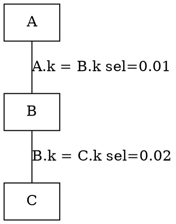
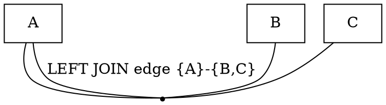

I treated the uploaded archive as the source of truth and read the core hypergraph optimizer path under `sql/join_optimizer/`. The short version of the architecture is:

```text
SQL query block
  ↓
RelationalExpression tree
  ↓  predicate normalization + safe pushdown
JoinHypergraph
  nodes = base relations
  hyperedges = legal join boundaries / semantic constraints
  predicates = filters, delayed filters, sargable predicates
  ↓
DPhyp connected-partition enumeration
  ↓
CostingReceiver dynamic programming
  base access paths → join paths → Pareto-pruned path sets
  ↓
post-join operators
  GROUP BY, HAVING, WINDOW, DISTINCT, ORDER BY, LIMIT, UPDATE/DELETE wrappers
  ↓
best AccessPath tree
```

The main entry point is `FindBestQueryPlan()`. The header describes the optimizer’s own five-step flow: build the hypergraph, enumerate legal subplans and cost them, add non-pushable predicates, add post-join operations, then expand filter bitmaps into actual filter paths (`sql/join_optimizer/join_optimizer.h:62-81`). The real work is split across `make_join_hypergraph.cc`, `subgraph_enumeration.h`, and `join_optimizer.cc`.

---

# 1. Source map: where the important pieces live

| Area                         | Files                                                                          | What they do                                                                                                                                                                 |
| ---------------------------- | ------------------------------------------------------------------------------ | ---------------------------------------------------------------------------------------------------------------------------------------------------------------------------- |
| Overall optimizer entry      | `join_optimizer.h`, `join_optimizer.cc`                                        | Creates `JoinHypergraph`, runs DPhyp, costs base scans and joins, keeps candidate physical plans, applies post-join operations.                                              |
| Hypergraph data structure    | `hypergraph.h`, `hypergraph.cc`, `node_map.h`                                  | Defines nodes, hyperedges, duplicated directed edge storage, simple/complex edge lists, and bitset node maps.                                                                |
| Query → hypergraph           | `make_join_hypergraph.h`, `make_join_hypergraph.cc`                            | Converts MySQL join trees into `RelationalExpression`, pushes predicates, builds semantic hyperedges, adds conflict rules, handles cycles, multiple equalities, sargability. |
| DPhyp enumeration            | `subgraph_enumeration.h`                                                       | Enumerates connected subgraphs and connected complements. Calls the receiver for every legal `csg-cmp` pair.                                                                 |
| Physical plan representation | `access_path.h`, `access_path.cc`                                              | Defines physical access paths: scans, filters, hash joins, nested loops, sort, aggregate, window, materialization, etc.                                                      |
| Costing                      | `cost_model.h`, `cost_model.cc`, `cost_constants.h`, `estimate_selectivity.cc` | Estimates rows and cost for scans, filters, joins, materialization, aggregation, hash-join spilling, selectivity.                                                            |
| Interesting orders           | `interesting_orders.h`, `interesting_orders.cc`, `build_interesting_orders.cc` | Tracks ordering properties, functional dependencies, order-preserving paths, sort-ahead candidates.                                                                          |
| Search-space fallback        | `graph_simplification.h`, `graph_simplification.cc`                            | Greedy search-space reduction when there are too many subgraph pairs.                                                                                                        |
| Tests                        | `unittest/gunit/hypergraph_optimizer-t.cc`                                     | Tests hypergraph construction, cycles, outer joins, semijoins, sargability, path enumeration, etc.                                                                           |

A key implementation detail: `NodeMap` is a `uint64_t`, and the code assumes at most 61 tables for compact bitset operations (`sql/join_optimizer/node_map.h:31-40`). That choice matters. Almost every hot path in DPhyp uses `AND`, `OR`, subset checks, and bit scans.

---

# 2. The mental model

The optimizer does **not** primarily enumerate table permutations. It enumerates **connected partitions of a join hypergraph**.

A normal join graph can say:

```text
A -- B -- C
```

But a hypergraph can say:

```text
{A, C} -- {B}
```

or:

```text
{A} -- {B, C}
```

That is the core trick. A hyperedge endpoint can be a *set* of relations, not just one relation. This lets the optimizer encode constraints such as:

* “You may join `A` to `B` only after `B` has already been joined with `C`.”
* “This predicate references `A`, `B`, and `C`, so it cannot become useful until several relations are present.”
* “This outer join may not be reassociated in that direction.”
* “This semijoin/antijoin has an invisible inner side.”
* “This lateral or parameterized access path must stay on the inner side of a nested loop until its parameters are bound.”

The underlying `Hypergraph` is intentionally payload-free: it only stores nodes and edges. `JoinHypergraph` wraps it with MySQL-specific payloads: table pointers, join predicates, selectivities, row widths, sargable predicate lists, lateral dependencies, and filter predicates (`sql/join_optimizer/make_join_hypergraph.h:89-120`, `:122-218`, `:220-268`).

A rough visualization:

```text
                    ┌──────────────────────────────┐
                    │ Query block / join tree       │
                    └──────────────┬───────────────┘
                                   │
                                   ▼
                    ┌──────────────────────────────┐
                    │ RelationalExpression tree     │
                    │ - join type                   │
                    │ - left/right children         │
                    │ - join predicates             │
                    │ - equijoin predicates         │
                    │ - conflict rules              │
                    └──────────────┬───────────────┘
                                   │
                         push predicates safely
                                   │
                                   ▼
                    ┌──────────────────────────────┐
                    │ JoinHypergraph                │
                    │                              │
                    │ nodes: A, B, C, ...           │
                    │ edges: {A}-{B}, {B,C}-{D}     │
                    │ predicates: WHERE/table/cycle │
                    │ sargable predicates           │
                    └──────────────┬───────────────┘
                                   │
                          DPhyp enumeration
                                   │
                                   ▼
                    ┌──────────────────────────────┐
                    │ CostingReceiver               │
                    │ DP map: NodeSet → PathSet     │
                    │                              │
                    │ {A}: scan/index/ref paths     │
                    │ {B}: scan/index/ref paths     │
                    │ {A,B}: hash/nl joins          │
                    │ {A,B,C}: bushy joins          │
                    └──────────────┬───────────────┘
                                   │
                          root candidate paths
                                   │
                                   ▼
                    ┌──────────────────────────────┐
                    │ GROUP / HAVING / WINDOW /     │
                    │ DISTINCT / ORDER / LIMIT      │
                    └──────────────┬───────────────┘
                                   │
                                   ▼
                           final AccessPath tree
```

---

# 3. The hypergraph representation

The raw hypergraph is defined in `hypergraph.h`.

A node is a relation. A hyperedge has two non-overlapping, non-empty node sets:

```cpp
struct Hyperedge {
  NodeMap left;
  NodeMap right;
};
```

The comment explicitly defines MySQL’s join hypergraph model: an undirected graph where hyperedges can contain multiple nodes on either side, e.g. `({A,C}, B)` (`sql/join_optimizer/hypergraph.h:27-38`, `:81-90`).

The implementation stores every undirected edge twice, as two directed arcs:

```text
AddEdge({A}, {B,C})
stores:
  {A}   → {B,C}
  {B,C} → {A}
```

The reason is performance. For any node touched by an edge, the node can treat itself as being on the left side, avoiding branchy “am I left or right?” code. The code comment says this gives 10–30% microbenchmark improvement (`sql/join_optimizer/hypergraph.cc:34-45`). Simple edges and complex edges are stored separately: simple one-node-to-one-node edges go into `simple_edges` and `simple_neighborhood`; all other hyperedges go into `complex_edges` (`sql/join_optimizer/hypergraph.h:52-70`, `sql/join_optimizer/hypergraph.cc:117-137`).

That split is important because most SQL join graphs are mostly simple edges. DPhyp spends a large fraction of its time asking “what neighbors can I grow to next?” If simple edges can be handled by a single bitmap, the hot path becomes much faster.

---

# 4. Building the hypergraph

The build phase is the most semantic part of the optimizer. It has to answer:

> Which join reorderings are legal?

For pure inner joins, most reorderings are legal. For outer joins, semijoins, antijoins, lateral dependencies, nondeterministic predicates, and null-complemented rows, many reorderings are wrong.

MySQL solves this by first creating a logical `RelationalExpression` tree and then converting that tree into a hypergraph.

`RelationalExpression` is a logical precursor to the hypergraph. It stores the join type, subtree tables, child expressions, join conditions, equijoin conditions, companion sets, and conflict rules (`sql/join_optimizer/relational_expression.h:140-186`, `:196-216`).

The build pipeline in `MakeJoinHypergraph()` is roughly:

```text
MySQL Table_ref / join structures
  ↓
MakeRelationalExpressionFromJoinList()
  ↓
FlattenInnerJoins()
  ↓
PushDownJoinConditions()
PushDownAsMuchAsPossible()
UnflattenInnerJoins()
LateConcretizeMultipleEqualities()
PushDownJoinConditionsForSargable()
CanonicalizeJoinConditions()
FindConditionsUsedTables()
MakeHashJoinConditions()
  ↓
MakeJoinGraphFromRelationalExpression()
  ↓
FindLateralDependencies()
AddCycleEdges()
CompleteFullMeshForMultipleEqualities()
PromoteCycleJoinPredicates()
  ↓
Add remaining WHERE/table predicates
EstimateJoinConditionSelectivities()
SortPredicates()
```

This sequence is visible in `MakeJoinHypergraph()` around `sql/join_optimizer/make_join_hypergraph.cc:3826-4108`.

## 4.1 Predicate pushdown

Predicate pushdown is conservative. The code does not simply push every predicate to the lowest syntactic table reference. It checks whether moving the predicate changes outer join semantics.

The key function is `PushDownCondition()` (`sql/join_optimizer/make_join_hypergraph.cc:1540-1665` and following). It distinguishes:

* predicates that touch only the left child,
* predicates that touch only the right child,
* predicates that touch both sides,
* predicates that came from the current join condition,
* predicates that came from `WHERE`,
* nondeterministic predicates,
* multiple equalities,
* predicates blocked by outer/anti joins,
* predicates that induce cycles.

The core rule is:

```text
Inner join:
  predicates can usually move freely.

Left outer join:
  WHERE predicate on inner/right side cannot be pushed below the left join,
  because it would fail to filter NULL-complemented rows correctly.

Left outer join ON predicate on inner/right side can be pushed into the right input,
  because it controls matching, not final row preservation.

Antijoin:
  similar care: repeating the antijoin condition as a post-filter can turn
  the result into zero rows.

Semijoin:
  special because MySQL creates semijoins from subquery rewrites; some conditions
  must be pushed back through them for correctness.
```

The code comments are very explicit about this. A join condition for an outer join or antijoin cannot always be pushed into the left side because it could remove rows that should later be emitted as NULL-complemented rows (`make_join_hypergraph.cc:1588-1612`). Conversely, a condition can be pushed into the right side of an outer join only if it came directly from that join’s condition (`make_join_hypergraph.cc:1614-1643`).

A useful example:

```sql
SELECT *
FROM A
LEFT JOIN B ON A.id = B.a_id AND B.status = 'active';
```

`B.status = 'active'` can be pushed to `B` as a table filter because it is part of the `ON` condition. It changes which `B` rows match, but unmatched `A` rows still survive.

Now compare:

```sql
SELECT *
FROM A
LEFT JOIN B ON A.id = B.a_id
WHERE B.status = 'active';
```

This cannot be pushed below the left join as a simple `B` table filter, because the `WHERE` predicate must also remove NULL-complemented rows. Pushing it too far would preserve `A` rows that should be filtered out.

That distinction is one reason the optimizer needs a proper logical join tree before it creates the hypergraph.

## 4.2 SES versus TES

MySQL distinguishes the **Syntactic Eligibility Set** from the **Total Eligibility Set**.

The SES is the set of tables a predicate explicitly mentions. The TES is the set of tables that must be available before the predicate can be evaluated without changing semantics.

The code explains this with the classic outer-join example (`sql/join_optimizer/make_join_hypergraph.cc:2551-2568`):

```text
(a LEFT JOIN b)
predicate: b.x IS NULL

SES = {b}
TES = {a,b}
```

Even though the predicate syntactically mentions only `b`, evaluating it before the left join is wrong, because the left join can synthesize NULL `b` rows. The predicate is only semantically meaningful after the join has happened.

This is one of the most important ideas to copy if you implement this in another database. “What tables does this predicate mention?” is not enough. You need “what tables must be present before this predicate has its SQL meaning?”

## 4.3 Conflict rules

Conflict rules are the mechanism that turns “outer joins are not freely reorderable” into precise hypergraph constraints.

A conflict rule has this shape:

```text
A → B
```

Meaning:

> If any table from A is present in a join, then all tables from B are required too.

The structure is defined in `relational_expression.h` (`sql/join_optimizer/relational_expression.h:68-76`).

The main function is `FindHyperedgeAndJoinConflicts()` (`sql/join_optimizer/make_join_hypergraph.cc:2811-2962`). Its comment says it is essentially the CD-C algorithm from Moerkotte et al. It compares every join operator with operators below it in the original join tree and uses associativity and left/right asscom rules to generate only the conflict rules needed to block invalid rewrites.

The canonical example in the comments is:

```sql
t1 LEFT JOIN (t2 JOIN t3 USING (y)) ON t1.x = t2.x
```

A naïve edge from the root join predicate would be:

```text
{t1} -- {t2}
```

But that would allow:

```sql
(t1 LEFT JOIN t2 ON t1.x = t2.x) JOIN t3 USING (y)
```

which is illegal. It moved `t3` outside the inner side too late. The optimizer therefore creates a conflict rule:

```text
{t2} → {t3}
```

That means “do not let `t2` participate in this left join until `t3` is also present.” This folds into the hyperedge, effectively turning the root edge into:

```text
{t1} -- {t2,t3}
```

The code explains this exact example and rule at `make_join_hypergraph.cc:2835-2865`.

The conflict rules are usually absorbed into the hyperedge’s TES by `AbsorbConflictRulesIntoTES()` (`make_join_hypergraph.cc:2765-2809`). If a rule’s trigger side overlaps the TES, the required side is added to the TES. If the required side is already in the TES, the rule is obsolete. Any residual conflict rules remain attached to the relational expression and are checked during costing (`join_optimizer.cc:4931-4934`).

This is the “why hypergraph?” moment. With normal graph edges, you cannot naturally express “B must come with C before joining to A.” With hyperedges, you can.

## 4.4 Operator associativity and asscom

The optimizer decides which rewrites are legal with three functions:

* `OperatorsAreAssociative()`
* `OperatorsAreLeftAsscom()`
* `OperatorsAreRightAsscom()`

They are in `make_join_hypergraph.cc:782-882`.

Some important behavior:

* Inner joins are broadly associative and reorderable.
* `STRAIGHT_JOIN` is deliberately treated as non-associative/non-asscom in these checks, because the user requested order constraints (`make_join_hypergraph.cc:802-807`, `:824-842`).
* Some left/full outer join rewrites are allowed only when the relevant predicate is null-rejecting (`make_join_hypergraph.cc:786-800`, `:846-863`, `:873-881`).
* Semijoins are treated specially. The comments note that if the inner side is known duplicate-free, semijoin can become equivalent to inner join, but the conflict-rule stage does not need to model all of that because semijoin attributes are not visible after the semijoin (`make_join_hypergraph.cc:765-781`).

For a database-agnostic implementation, do not hard-code MySQL’s exact operator table blindly. Define a rewrite legality matrix for your algebra. For a simple relational engine with only inner joins, this table is trivial. For SQL outer joins, it is not.

## 4.5 Cycles

A join graph cycle creates a subtle problem.

Example:

```text
A -- B
|    |
C ---
```

Suppose the predicates are:

```sql
A.k = B.k
B.k = C.k
A.k = C.k
```

A binary join plan only needs two edges to connect three tables. If the plan joins along `A-B` and `A-C`, the `B-C` predicate might never be seen as a join edge. That would be wrong.

MySQL handles this by promoting cycle join predicates into filter predicates. The code comment says: in a cycle `A-B-C-A`, if the join completes using `A-B` and `C-A`, it would miss `B-C`; therefore predicates involved in cycles are also represented as WHERE-like predicates and then ignored when their corresponding edge was actually used, to avoid double application (`make_join_hypergraph.cc:3281-3302`).

This is not just a costing hack. It is a correctness issue: every predicate must be applied exactly once.

The later function `ApplyDelayedPredicatesAfterJoin()` carries this idea into costing. It tracks which delayed predicates become legal after joining two subgraphs and carefully avoids applying multiple-equality predicates redundantly (`join_optimizer.cc:5534-5690`).

---

# 5. DPhyp enumeration: how legal subplans are found

The enumeration algorithm is in `subgraph_enumeration.h`. The file says it implements DPhyp: relations are nodes, join predicates are hyperedges, and all legal join orders without Cartesian products can be found by enumerating connected subpartitions of the hypergraph (`sql/join_optimizer/subgraph_enumeration.h:30-42`).

The high-level algorithm in the comments is:

1. Pick a seed node.
2. Grow that seed along hyperedges without generating disconnected graphs or duplicates.
3. For every connected subgraph, enumerate a connected complement.
4. When a connected subgraph and connected complement can be joined, call the receiver with the pair (`subgraph_enumeration.h:53-63`).

In MySQL, the receiver is `CostingReceiver`.

Here is the conceptual shape:

```text
For every connected subgraph S:
  For every connected complement C:
    If S and C are connected by a hyperedge:
       receiver.FoundSubgraphPair(S, C, edge)
```

But the real algorithm is careful to avoid duplicates. It uses:

* a seed order,
* forbidden node sets,
* neighborhood sets,
* connectedness checks through `receiver->HasSeen()`,
* representative nodes for hyperedge endpoints,
* special handling for simple versus complex edges.

## 5.1 Neighborhoods

DPhyp repeatedly asks:

```text
N(S, X) = which nodes can I grow to from subgraph S,
          without touching forbidden set X?
```

`FindNeighborhood()` implements this and has a long comment because this is one of the tricky parts of the paper (`subgraph_enumeration.h:207-284`). The simplified definition is:

1. Find hyperedge destinations where one side is entirely inside `S`, the other side is outside `S`, and neither side touches forbidden set `X`.
2. Remove subsumed hypernodes.
3. Pick one representative node from each remaining hypernode.

For example, if `S = {A}` and there is a hyperedge:

```text
{A} -- {B,C}
```

then the hypernode `{B,C}` is reachable, but DPhyp’s subset enumerator works on normal nodes, not hypernodes. So it picks a representative, say `B`, and later grows the complement/subgraph until the full hypernode is satisfied.

The code notes that adding extra nodes to the neighborhood does not break correctness; it only hurts speed (`subgraph_enumeration.h:230-237`). This is a valuable engineering principle: implement the correct conservative version first, then optimize minimization later.

## 5.2 Main enumeration loop

The entry point is `EnumerateAllConnectedPartitions()` (`subgraph_enumeration.h:649-691`).

It iterates seed nodes in descending order, calls:

```cpp
receiver->FoundSingleNode(seed_idx)
```

then computes the seed’s neighborhood, enumerates complements, and recursively expands the subgraph.

This descending seed order is not cosmetic. The comments say it is critical for enumerating smaller subsets before larger ones (`subgraph_enumeration.h:361-364`, `:649-660`). That property is what makes the dynamic programming receiver possible: when the receiver gets a pair `{A,B}` and `{C}`, it has already seen and costed `{A,B}` and `{C}`.

## 5.3 The receiver API

The receiver needs only three conceptual callbacks:

```cpp
bool HasSeen(NodeMap subgraph);
bool FoundSingleNode(int node_idx);
bool FoundSubgraphPair(NodeMap left, NodeMap right, int edge_idx);
```

MySQL’s `CostingReceiver` implements those (`join_optimizer.cc`, class starts around `:309`; receiver API described around `:366-377`).

This separation is elegant. `subgraph_enumeration.h` knows nothing about SQL costing, access paths, indexes, hash joins, or sort orders. It only knows how to enumerate legal connected partitions. The receiver turns those partitions into physical plans.

---

# 6. CostingReceiver: dynamic programming over hypergraph subsets

`CostingReceiver` stores a map:

```text
NodeMap → AccessPathSet
```

Each `NodeMap` is a set of tables. Each `AccessPathSet` contains candidate physical plans that produce exactly that set of tables.

The map is declared as `m_access_paths`, keyed by `NodeMap` (`join_optimizer.cc:484-494`). The access path set stores:

* candidate paths,
* active functional dependencies,
* obsolete orderings,
* reachable nodes,
* whether the subplan is always empty (`join_optimizer.cc:441-482`).

## 6.1 Base tables: `FoundSingleNode`

When DPhyp announces a single table, `CostingReceiver::FoundSingleNode()` proposes base access paths:

* table scan,
* index scan,
* ref access,
* range access,
* spatial access,
* fulltext access,
* materialization/table-function variants,
* zero-row paths if known empty.

The function comment says it creates and costs table scan and ref access paths for tables before they are joined with others (`join_optimizer.cc:1793-1801`). The implementation then consults the range optimizer, table statistics, indexes, recursive references, materialized derived tables, and so on (`join_optimizer.cc:1802-1959`).

After a base path is created, `ApplyPredicatesForBaseTable()` decides which predicates can be applied immediately and which must be delayed (`join_optimizer.cc:4395-4520`).

A predicate whose TES equals this one table is applied now:

```text
path rows *= predicate selectivity
path cost += filter evaluation cost
path.filter_predicates includes this predicate
```

A deterministic predicate whose TES overlaps this table but also needs other tables is put in `delayed_predicates`. It will be reconsidered after joins (`join_optimizer.cc:4431-4482`).

## 6.2 Sargable predicates

Sargable predicates are predicates that can be pushed into index access.

The detection function is `FindSargablePredicates()` (`join_optimizer.cc:8930-8961`). It scans filter predicates and pushable join conditions. A helper, `PossiblyAddSargableCondition()`, recognizes simple equality and null predicates against indexed fields, checks type compatibility, checks that the field side and other side do not overlap tables, rejects nondeterministic other sides, and records the predicate on the relevant table node (`join_optimizer.cc:8780-8928`).

Example:

```sql
SELECT *
FROM A
JOIN B ON A.k = B.k
WHERE A.x = 10;
```

If `A.x` is indexed, `A.x = 10` can become an index lookup on `A`.

If `B.k` is indexed, `A.k = B.k` can become a parameterized ref access to `B` when `A` is on the outer side of a nested loop:

```text
outer path: A
inner path: B index lookup where B.k = A.k
inner path parameter_tables = {A}
```

This is why `AccessPath` carries `parameter_tables` (`access_path.h:521-542`). Parameterized paths are powerful but can explode the search space, so MySQL has extra pruning to avoid bushy parameterized plans when a more direct left-deep resolution is available (`join_optimizer.cc:4614-4695`).

## 6.3 Joining subgraphs: `FoundSubgraphPair`

When DPhyp finds a valid connected partition, it calls:

```cpp
FoundSubgraphPair(left, right, edge_idx)
```

This is where the dynamic programming composition happens (`join_optimizer.cc:4900-5140`).

The function:

1. checks the subgraph-pair limit,
2. checks residual conflict rules,
3. handles semijoin/antijoin invariants,
4. determines whether the operator is commutative,
5. checks whether a semijoin can be rewritten to an inner join by deduplicating the inner side,
6. enforces recursive CTE leftmost-table constraints,
7. looks up all candidate paths for `left` and `right`,
8. combines every compatible pair,
9. proposes hash joins and nested-loop joins,
10. applies delayed predicates that become legal after this join,
11. inserts resulting paths into the DP map for `left | right`.

The important loop is:

```text
for each right_path in paths[right]:
  for each left_path in paths[left]:
    if parameterization is allowed:
       propose hash join(s)
       propose nested-loop join(s)
```

For inner joins, both physical directions can be proposed. For non-commutative operators, only legal directions are proposed. For semijoins, it may propose both the original semijoin and a deduplicated-inner rewrite (`join_optimizer.cc:4943-4968`, `:5062-5110`).

## 6.4 Hash join proposal

`ProposeHashJoin()` builds an `AccessPath::HASH_JOIN` path (`join_optimizer.cc:5328-5532`).

It first checks `AllowHashJoin()`:

* engine must support hash join,
* parameterizations cannot require the build/probe side to depend on the wrong side,
* fulltext searched tables are rejected conservatively,
* recursive references cannot be put in the hash table,
* certain secondary-engine semijoin/outer-join patterns are rejected (`join_optimizer.cc:5221-5318`).

Then it computes output rows with `FindOutputRowsForJoin()`, builds a hash join cost from build rows, build row size, key size, probe rows, probe row size, and result rows, adds child costs, sets init cost, row count, ordering state, row-id safety, and applies delayed predicates.

A hash join destroys ordering information in MySQL’s model, so the resulting path’s ordering state is reset to “unordered” plus any ordering implications from functional dependencies (`join_optimizer.cc:5519-5524`).

## 6.5 Nested-loop join proposal

`ProposeNestedLoopJoin()` builds an `AccessPath::NESTED_LOOP_JOIN` path (`join_optimizer.cc:5932-6189`).

`AllowNestedLoopJoin()` is intentionally conservative. The comments explain that nested loops are dangerous when row estimates are inaccurate, so MySQL prefers hash joins unless nested loop has a specific reason to be good or necessary (`join_optimizer.cc:5845-5862`).

Nested loop is allowed when:

* the engine supports it,
* the inner path is parameterized by the outer path, usually indicating an index lookup,
* either side is a constant single-row lookup,
* the left side has `LIMIT 1`,
* or no corresponding hash join is possible (`join_optimizer.cc:5863-5929`).

The cost formula is roughly:

```text
cost =
  outer.cost
  + first_inner_scan_cost
  + (outer_rows - 1) * inner_rescan_cost
  + join_filter_costs
```

The code computes:

```cpp
first_loop_cost = inner->cost() + filter_cost;
subsequent_loops_cost =
    (inner->rescan_cost() + filter_cost) * max(0, outer_rows - 1);
join_path.cost = outer->cost() + first_loop_cost + subsequent_loops_cost;
```

(`join_optimizer.cc:6128-6135`)

Nested loop preserves the ordering of the outer side (`join_optimizer.cc:6137-6142`). That is one reason a nested loop path may be kept even if its raw cost is slightly higher than a hash join: it might avoid a later sort.

---

# 7. AccessPath: the physical plan unit

`AccessPath` is the optimizer’s physical plan node. The header says it corresponds roughly one-to-one with executor iterators and is implemented as a fixed-size variant to avoid large allocation overhead when substituting child paths (`sql/join_optimizer/access_path.h:216-237`).

The enum includes scans, joins, filters, sorting, aggregation, materialization, windowing, delete/update wrappers, and more (`access_path.h:239-297`).

The important fields for the hypergraph optimizer are:

```text
cost
init_cost
init_once_cost
rescan_cost
num_output_rows
num_output_rows_before_filter
filter_predicates
delayed_predicates
parameter_tables
ordering_state
safe_for_rowid
```

Costs are around `access_path.h:397-440`; filter and sargable predicate bitmaps are around `:445-520`; parameter tables are around `:521-542`.

This design lets the optimizer defer some work. A path may carry a bitmap saying “these filter predicates are applied here,” and only later does `ExpandFilterAccessPaths()` turn that bitmap into actual `FILTER` access path nodes. That keeps the DP stage lighter.

---

# 8. Pareto pruning: why there is not just one best path per subgraph

The comment in `join_optimizer.h` says the optimizer keeps only the cheapest subplan, but the implementation is more subtle. It keeps a set of non-dominated paths per subgraph.

The comparison function is `CompareAccessPaths()` (`join_optimizer.cc:6272-6393`). A path dominates another only if it is no worse across all important dimensions and better in at least one. Dimensions include:

* parameterization set,
* ordering state,
* row-id safety,
* immediate update/delete ability,
* group skip scan,
* output rows,
* total cost,
* first-row cost when relevant under LIMIT,
* rescan cost.

Numerical dimensions use a 1% fuzz factor (`join_optimizer.cc:6347-6369`).

This matters because a path can be worse in one dimension but better in another:

```text
Path 1: hash join
  cost = 100
  order = none

Path 2: nested loop
  cost = 115
  order = ORDER BY A.created_at
```

If the query has `ORDER BY A.created_at LIMIT 10`, Path 2 may win after avoiding a sort and returning first rows quickly. If the DP kept only the cheapest raw path, it would prune Path 2 too early and miss the best final plan.

`ProposeAccessPath()` implements the tournament. It rejects a new path if an existing path dominates it; it replaces existing paths that it dominates; otherwise it keeps it as another alternative (`join_optimizer.cc:6624-6830`).

This is one of the biggest engineering lessons: dynamic programming over join subsets is only correct for a physical optimizer if the state captures the physical properties that future operators care about.

---

# 9. Interesting orders and functional dependencies

MySQL tracks ordering as a logical state machine. The comments in `interesting_orders.h` describe “interesting orders” as orders that may avoid a future sort, such as `ORDER BY`, `GROUP BY`, semijoin deduplication, or window requirements (`sql/join_optimizer/interesting_orders.h:27-37`).

The clever part is functional dependencies. If a stream is ordered by `(a,b)` and there is an FD `{a} → c`, the stream may also satisfy orderings involving `c`, such as `(a,c,b)` or `(a,b,c)` (`interesting_orders.h:54-85`).

MySQL models this with an NFSM/DFSM. An access path stores a single integer `ordering_state`, and the optimizer can cheaply ask whether this state follows a given interesting order.

This is not required for a minimal implementation, but it is required if you want the optimizer to make good choices around:

* `ORDER BY`,
* `GROUP BY`,
* `DISTINCT`,
* merge joins if added,
* window functions,
* ordered graph traversals,
* top-k queries.

---

# 10. Cost and cardinality model

The cost model is deliberately approximate. `cost_constants.h` says constants are calibrated in microseconds but scaled so that cost `1.0` is the average cost of reading one row from a simple InnoDB table scan with 10 integer columns and 1M rows (`sql/join_optimizer/cost_constants.h:27-62`).

Join cardinality is estimated in `FindOutputRowsForJoin()` (`cost_model.h:269-305`):

```text
Inner join:
  rows = left_rows * right_rows * selectivity

Left join:
  rows = left_rows * max(right_rows * selectivity, 1)

Semijoin:
  rows = left_rows * semijoin_fanout

Antijoin:
  rows = left_rows * max(1 - semijoin_fanout, 0.1)
```

Semijoin fanout is modeled as an inner join against distinct right-side values, capped at 1 (`cost_model.h:223-259`, implementation around `cost_model.cc:1757-1795`).

Selectivity comes from several sources:

* histograms,
* unique key caps,
* index prefix statistics,
* secondary statistics,
* fallback filtering effects.

The equality selectivity logic is in `estimate_selectivity.cc`. For example, unique keys cap selectivity at `1 / table_rows`, and multi-part index statistics can estimate `records_per_key(N) / records_per_key(N-1)` for correlated prefixes (`estimate_selectivity.cc:56-123`, `:190-207`, `:312-385`).

The important architectural point: the hypergraph optimizer does not require a perfect cost model to be correct, but it requires a sufficiently good cost model to pick good plans. The algorithm gives you a search space. Costing decides which plan wins.

---

# 11. Search-space explosion and graph simplification

DPhyp can still explode on large dense graphs. MySQL has a subgraph-pair limit. If the receiver sees too many `csg-cmp` pairs, planning aborts and the caller invokes graph simplification (`join_optimizer.cc:4907-4925`, `:9425-9452`).

`graph_simplification.h` describes the fallback: it greedily finds neighboring joins where one order is obviously worse, then disallows that bad ordering by extending a hyperedge (`sql/join_optimizer/graph_simplification.h:27-66`).

For example, if the heuristic decides join `A` should happen before join `B`, it modifies `B`’s hyperedge so `B` cannot happen until `A`’s nodes are present.

This increases the apparent complexity of the graph but reduces the number of valid enumerated partitions. The comments are honest: it is greedy and can produce a higher-cost plan, but it keeps planning tractable for large queries (`graph_simplification.h:45-59`).

This is the right product tradeoff: exact enumeration for normal queries, graceful degradation for huge queries.

---

# 12. Worked examples

## Example 1: simple inner-join chain

```sql
SELECT *
FROM A
JOIN B ON A.k = B.k
JOIN C ON B.k = C.k
WHERE A.x = 7;
```

The hypergraph is:

```text
A -- B -- C

edge e1: {A} -- {B}, predicate A.k = B.k
edge e2: {B} -- {C}, predicate B.k = C.k

filter p1:
  condition = A.x = 7
  SES = {A}
  TES = {A}
```

Possible DP states:

```text
{A}
{B}
{C}
{A,B}
{B,C}
{A,B,C}
```

Important non-state:

```text
{A,C}
```

`{A,C}` is disconnected, so it is not a legal subplan unless cross products are explicitly allowed or there is another edge. DPhyp avoids it.

The receiver may create:

```text
{A}:
  table scan A + filter A.x=7
  index lookup A.x=7

{B}:
  table scan B
  index scan B.k

{C}:
  table scan C
  index scan C.k

{A,B}:
  hash_join(A, B)
  nested_loop(A → B index lookup on B.k=A.k)
  nested_loop(B → A index lookup on A.k=B.k)

{B,C}:
  similar

{A,B,C}:
  join({A,B}, C)
  join(A, {B,C})
```

Why this is better than left-deep prefix enumeration: it naturally considers bushy alternatives such as joining `{B,C}` first, then joining `A`, without needing to permute all table orders.

## Example 2: hyperpredicate

```sql
SELECT *
FROM A
JOIN B ON A.group_id = B.group_id
JOIN C ON A.x + B.y = C.z;
```

The second join condition cannot be evaluated with only `A` or only `B`. It needs the combined `{A,B}` side before joining to `C`.

The hyperedge is conceptually:

```text
{A,B} -- {C}
```

Visualization:

```text
 A ---- B
  \    /
   \  /
  {A,B} ===== C
```

A normal graph would struggle to express that “C can join only after both A and B are present.” A hyperedge expresses it directly.

## Example 3: outer-join conflict

```sql
SELECT *
FROM A
LEFT JOIN (
  B JOIN C ON B.y = C.y
) ON A.x = B.x;
```

Naïve graph:

```text
A -- B -- C
```

That graph would allow:

```sql
(A LEFT JOIN B ON A.x = B.x)
JOIN C ON B.y = C.y
```

which is not equivalent.

The conflict rule is:

```text
{B} → {C}
```

So the root edge becomes:

```text
{A} -- {B,C}
```

Legal:

```text
B JOIN C first
then A LEFT JOIN {B,C}
```

Illegal:

```text
A LEFT JOIN B first
then join C later
```

That is exactly the example described in `FindHyperedgeAndJoinConflicts()` (`make_join_hypergraph.cc:2835-2865`).

## Example 4: cycle predicates

```sql
SELECT *
FROM A
JOIN B ON A.k = B.k
JOIN C ON B.k = C.k
WHERE A.k = C.k;
```

The graph has a cycle:

```text
      A
     / \
    B---C
```

A binary join tree uses only two edges to connect three nodes. If the chosen spanning tree is `A-B` and `A-C`, the `B-C` predicate would be missed unless handled separately.

MySQL promotes cycle join predicates to filter predicates. Then, after any join where the predicate’s TES is satisfied, the filter is applied unless it has already been applied through the chosen edge. This gives:

```text
Every cycle predicate is applied at least once.
No predicate is double-counted.
```

## Example 5: sargable join predicate

```sql
SELECT *
FROM A
JOIN B ON A.k = B.k
WHERE A.region = 'NO';
```

Assume indexes:

```text
A(region)
B(k)
```

Candidate paths:

```text
A:
  index lookup A.region = 'NO'

B:
  table scan B
  parameterized index lookup B.k = A.k
```

The parameterized `B` path is only usable when `A` is available on the outer side of a nested loop:

```text
NestedLoop(
  outer = A index lookup region='NO',
  inner = B ref lookup k=A.k
)
```

The path for `B` carries:

```text
parameter_tables = {A}
applied_sargable_join_predicates includes A.k = B.k
```

When the join is later costed, the optimizer must not apply `A.k = B.k` selectivity again. `FindAlreadyAppliedSelectivity()` and the sargable predicate bitmap handle that (`join_optimizer.cc:6191-6260`).

This is one of the easy places to get wrong in a reimplementation. If you count selectivity once in the index lookup and again in the join, your row estimates become too low and bad plans look artificially good.

---

# 13. Why the algorithm works

There are three separate “works” here: semantic correctness, search completeness, and cost optimality within the modeled search space.

## 13.1 Semantic correctness

The optimizer is semantically safe because it does not treat joins as arbitrary commutative operations.

It starts from the original relational expression tree, then derives constraints:

```text
outer join constraints
semijoin/antijoin constraints
null-complementation constraints
lateral dependency constraints
nondeterministic predicate constraints
hyperpredicate constraints
cycle predicate constraints
```

These are encoded as:

```text
hyperedges
TES values
conflict rules
delayed predicates
parameterization restrictions
```

DPhyp only proposes connected subgraph/complement pairs that satisfy the hyperedges. Residual conflict rules are checked by `CostingReceiver` before costing a join (`join_optimizer.cc:4931-4934`).

So the optimizer does not prove every plan legal after the fact. It mostly prevents illegal plans from being generated in the first place.

## 13.2 Search completeness within the encoded graph

Given a hypergraph, DPhyp enumerates every connected subgraph/complement pair once, in an order where smaller subgraphs appear before larger ones.

That is enough for dynamic programming:

```text
If plan P joins S and C,
then best candidate paths for S and C have already been generated.
The receiver can combine them and store candidates for S∪C.
```

For inner-join graphs without Cartesian products, this covers all connected bushy join trees. For outer joins and semijoins, the hyperedges restrict the graph so illegal bushy trees are absent.

There is one caveat, and the code comments admit it: degenerate predicates and Cartesian products can lead to overly broad hyperedges, which may disallow otherwise valid plans, but should not allow invalid plans (`make_join_hypergraph.cc:2876-2881`). So the encoded graph may sometimes be conservative.

## 13.3 Cost optimality within tracked physical properties

Classical DP optimality says:

```text
best(S∪C) = min over joins of best(S) + best(C) + join_cost
```

But physical query optimization is more complicated because “best” depends on future needs. A path with higher local cost may preserve order, produce fewer rows before a later filter, be cheaper to rescan, or resolve parameters differently.

MySQL addresses this by keeping a Pareto frontier, not a single path. A path is discarded only when another path dominates it across the tracked dimensions (`join_optimizer.cc:6272-6393`, `:6624-6830`).

So the guarantee is:

> If the cost model is accurate, if all future-relevant physical properties are included in path comparison, and if graph simplification is not invoked, the chosen plan is optimal within the enumerated search space.

In practice:

* cost estimates are approximate,
* pruning tracks many but not all possible physical properties,
* graph simplification may deliberately shrink the search space.

So the optimizer is best understood as **exact enumeration plus cost-based pruning for normal cases, with heuristic degradation for large cases**.

---

# 14. Engineering plan for implementing this in another database

Below is a self-contained implementation plan that an AI coding agent could follow. It is deliberately staged so you get a working optimizer early and then add SQL/graph complexity.

## Phase 0: Define the target optimizer contract

The optimizer should take:

```text
LogicalQuery
Catalog metadata
Statistics
Available physical operators
Planner settings
```

and return:

```text
PhysicalPlan
Estimated cost
Estimated rows
Explain/debug trace
Optional hypergraph DOT visualization
```

For a relational database, `LogicalQuery` contains tables, joins, predicates, grouping, ordering, limits, projections.

For a graph database, `LogicalQuery` contains pattern atoms, vertex/edge labels, property predicates, path expansions, equality constraints between variables, optional/anti patterns, ordering, limits.

The first implementation should support:

```text
inner joins / conjunctive graph patterns
filters
basic table/label scans
index seeks
hash join
nested-loop/index join
```

Then add:

```text
outer joins / optional matches
semijoins / EXISTS
antijoins / NOT EXISTS
lateral/parameterized subqueries
interesting orders
aggregation/windowing
graph simplification
```

Do not begin with full SQL. Begin with an algebra you can reason about.

---

## Phase 1: Implement core data structures

### 1.1 Node sets

For up to 64 relations or pattern variables:

```cpp
using NodeSet = uint64_t;

inline NodeSet bit(int i) { return NodeSet{1} << i; }
inline bool is_subset(NodeSet a, NodeSet b) { return (a & ~b) == 0; }
inline bool overlaps(NodeSet a, NodeSet b) { return (a & b) != 0; }
inline NodeSet isolate_lowest_bit(NodeSet x) { return x & -x; }
```

For more than 64 nodes, use a dynamic bitset, but keep the same API. The optimizer should not care whether `NodeSet` is `u64`, `std::bitset`, Roaring bitmap, or a custom sparse bitset.

### 1.2 Hypergraph

Implement:

```cpp
struct Hyperedge {
    NodeSet left;
    NodeSet right;
};

struct Node {
    vector<int> simple_edges;
    vector<int> complex_edges;
    NodeSet simple_neighborhood;
};

struct Hypergraph {
    vector<Node> nodes;
    vector<Hyperedge> edges; // duplicated directed arcs

    int add_node();
    void add_edge(NodeSet left, NodeSet right);
    void modify_edge(int directed_edge_idx, NodeSet new_left, NodeSet new_right);
};
```

Store every edge twice:

```cpp
add_edge(L, R):
    edges.push_back({L, R})
    edges.push_back({R, L})
```

Attach simple edges to `simple_edges` and `simple_neighborhood`; attach all others to `complex_edges`.

### 1.3 Payload wrapper

Keep the raw hypergraph generic. Wrap database-specific data separately:

```cpp
struct PlanHypergraph {
    Hypergraph graph;
    vector<NodePayload> nodes;
    vector<EdgePayload> edges;       // one per undirected edge
    vector<Predicate> predicates;
    int num_filter_predicates;
};
```

For a relational DB:

```cpp
struct NodePayload {
    TableId table;
    double base_rows;
    double row_width;
    vector<SargablePredicate> sargable_predicates;
    NodeSet lateral_dependencies;
};
```

For a graph DB:

```cpp
struct NodePayload {
    PatternVariable variable; // vertex variable, edge variable, or binding group
    LabelSet labels;
    double base_cardinality;
    vector<SargablePredicate> property_indexes;
};
```

For edges:

```cpp
struct EdgePayload {
    JoinType type;
    PredicateExpr join_condition;
    vector<PredicateExpr> equijoin_conditions;
    vector<PredicateExpr> residual_conditions;
    double selectivity;
    vector<ConflictRule> conflict_rules;
    FunctionalDependencySet fds;
};
```

---

## Phase 2: Define the logical algebra

You need a logical tree before the hypergraph.

```cpp
enum class RelOp {
    Table,
    InnerJoin,
    LeftOuterJoin,
    FullOuterJoin,
    SemiJoin,
    AntiJoin,
    CrossJoin,
    MultiInnerJoin
};

struct RelExpr {
    RelOp op;
    RelExpr* left;
    RelExpr* right;
    vector<RelExpr*> multi_children;

    TableId table; // if Table

    vector<PredicateExpr> join_conditions;
    vector<PredicateExpr> equijoin_conditions;

    NodeSet nodes_in_subtree;
    TableSet tables_in_subtree;
    TableSet visible_tables;
    vector<ConflictRule> conflict_rules;
};
```

For a graph database, you can use the same algebra by treating each pattern atom as a relation over variables.

Example graph atom:

```cypher
(p:Person)-[w:WORKS_AT]->(c:Company)
```

can become a relation with columns:

```text
p, w, c
```

and label/type predicates:

```text
label(p) = Person
type(w) = WORKS_AT
label(c) = Company
```

A multi-atom graph pattern is then a join query over shared variables.

---

## Phase 3: Predicate analysis

Each predicate needs metadata:

```cpp
struct Predicate {
    PredicateExpr expr;
    NodeSet used_nodes;              // SES
    NodeSet total_eligibility_set;   // TES
    double selectivity;
    bool was_join_condition;
    bool deterministic;
    bool possibly_null_complemented_later;
    vector<ContainedSubquery> subqueries;
    FunctionalDependencySet fds;
};
```

Implement:

```cpp
NodeSet syntactic_eligibility_set(predicate);
NodeSet total_eligibility_set(predicate, relational_tree);
double estimate_selectivity(predicate, stats);
```

### TES algorithm

For inner joins:

```text
TES = SES
```

For left joins and antijoins:

```text
If predicate references the null-producing side,
TES must include the preserved side plus the referenced null-producing nodes.
```

Example:

```sql
A LEFT JOIN B ON A.id = B.a_id
WHERE B.x IS NULL
```

```text
SES = {B}
TES = {A,B}
```

For graph databases with no null-introducing optional match, TES is usually SES. For `OPTIONAL MATCH`, use outer-join rules.

---

## Phase 4: Predicate pushdown

Implement safe pushdown over the logical tree.

Pseudocode:

```python
def push_down_condition(cond, expr, is_join_condition_for_expr):
    if expr is Table:
        expr.table_filters.append(cond)
        return

    used = cond.used_tables

    if expr is MultiInnerJoin:
        for child in expr.children:
            if used subset child.tables:
                push_down_condition(cond, child, False)
                return
        unflatten_partially_to_store_condition(cond)
        return

    can_push_left = (
        expr.op in {InnerJoin, CrossJoin, SemiJoin}
        or not is_join_condition_for_expr
    )

    can_push_right = (
        expr.op in {InnerJoin, CrossJoin, SemiJoin}
        or is_join_condition_for_expr
    )

    if used subset expr.left.tables:
        if can_push_left:
            push_down_condition(cond, expr.left, False)
        else:
            keep_at_current_level(cond)
        return

    if used subset expr.right.tables:
        if can_push_right:
            push_down_condition(cond, expr.right, False)
        else:
            keep_at_current_level(cond)
        return

    # touches both sides
    if expr.op in {InnerJoin, SemiJoin}:
        expr.join_conditions.append(cond)
    else:
        keep_at_current_level(cond)
```

Add partial pushdown later. For example:

```sql
WHERE A.x = 5 AND expensive_udf(A.y, B.z)
```

`A.x = 5` can move to `A` even though the full conjunction cannot.

Acceptance tests:

```text
WHERE predicate on inner side of LEFT JOIN must not become table filter.
ON predicate on inner side of LEFT JOIN may become table filter.
Inner join predicates should move as low as possible.
Nondeterministic predicates should not be duplicated or moved unsafely.
```

---

## Phase 5: Build conflict rules and hyperedges

Implement:

```cpp
struct ConflictRule {
    NodeSet needed_to_activate_rule; // A
    NodeSet required_nodes;          // B
};
```

Rule meaning:

```text
A → B:
if any node from A is present, all nodes from B must also be present.
```

### 5.1 Operator legality table

Define:

```cpp
bool associative(RelExpr a, RelExpr b);
bool left_asscom(RelExpr a, RelExpr b);
bool right_asscom(RelExpr a, RelExpr b);
bool commutative(RelExpr op);
```

For MVP inner joins:

```text
inner-inner associative = true
inner-inner commutative = true
```

For SQL outer joins, implement the null-rejecting rules. Start conservative: if unsure, return `false`. Conservative means fewer reorderings, not wrong results.

### 5.2 Hyperedge construction

For each non-table `RelExpr`:

```python
def find_hyperedge_and_conflicts(expr):
    conflict_rules = []

    for child_join in join_operators_under(expr.left):
        if not associative(child_join, expr):
            conflict_rules.append(rule_from_associativity(child_join, expr))
        if not left_asscom(child_join, expr):
            conflict_rules.append(rule_from_left_asscom(child_join, expr))

    for child_join in join_operators_under(expr.right):
        if not associative(expr, child_join):
            conflict_rules.append(mirrored_assoc_rule(expr, child_join))
        if not right_asscom(expr, child_join):
            conflict_rules.append(rule_from_right_asscom(expr, child_join))

    tes = used_nodes_of_join_conditions(expr)
    tes = absorb_conflict_rules_into_tes(tes, conflict_rules)

    if tes does not overlap expr.left.nodes:
        tes |= expr.left.nodes
        tes = absorb_conflict_rules_into_tes(tes, conflict_rules)

    if tes does not overlap expr.right.nodes:
        tes |= expr.right.nodes
        tes = absorb_conflict_rules_into_tes(tes, conflict_rules)

    expr.conflict_rules = conflict_rules

    left = tes & expr.left.nodes
    right = tes & expr.right.nodes
    return Hyperedge(left, right)
```

This mirrors MySQL’s `FindHyperedgeAndJoinConflicts()` and `AbsorbConflictRulesIntoTES()` (`make_join_hypergraph.cc:2765-2962`).

Acceptance tests:

```sql
-- Legal reorderings allowed
A JOIN B ON ...
B JOIN C ON ...

-- Illegal outer join reassociation blocked
A LEFT JOIN (B JOIN C ON B.y=C.y) ON A.x=B.x

Expected hyperedge:
  {A} -- {B,C}
or equivalent residual conflict rule blocking {A}--{B}.
```

---

## Phase 6: Add cycle handling

Detect cycles among inner-join edges. For every join predicate in a cycle:

1. Add it to the global filter predicate list.
2. Record which edge it came from.
3. When the corresponding edge is used, mark the predicate as already applied.
4. When another spanning-tree edge set is used, apply the predicate as a delayed filter once all required tables are present.

Acceptance test:

```sql
A JOIN B ON A.k=B.k
JOIN C ON B.k=C.k
WHERE A.k=C.k
```

Every valid final plan must apply all three equalities exactly once.

---

## Phase 7: Implement DPhyp enumeration

Implement the receiver interface:

```cpp
struct Receiver {
    bool has_seen(NodeSet s);
    bool found_single_node(int node);
    bool found_subgraph_pair(NodeSet left, NodeSet right, int edge_idx);
};
```

Implement these DPhyp helpers:

```cpp
NodeSet find_neighborhood(graph, subgraph, forbidden, just_grown_by);
bool enumerate_complements_to(graph, lowest_node, subgraph, neighborhood, receiver);
bool expand_subgraph(graph, lowest_node, subgraph, neighborhood, forbidden, receiver);
bool expand_complement(graph, lowest_node, subgraph, complement, neighborhood, forbidden, receiver);
bool try_connecting(graph, subgraph, complement, receiver);
bool enumerate_all_connected_partitions(graph, receiver);
```

Start with a simpler, less optimized implementation:

```python
def enumerate_all_connected_partitions(graph, receiver):
    for seed in reversed(nodes):
        receiver.found_single_node(seed)
        expand_connected_subgraphs_from(seed)
```

It is acceptable for the first version to be slower if it is correct. After tests pass, add:

* forbidden sets,
* neighborhood minimization,
* simple/complex edge split,
* representative nodes,
* caching.

Acceptance tests:

```text
Chain A-B-C:
  Must emit {A}|{B}, {B}|{C}, {A,B}|{C}, {A}|{B,C}
  Must not emit {A}|{C}

Star A-B, A-C, A-D:
  Must emit joins through A, not disconnected leaf-leaf joins.

Hyperedge {A,B}-{C}:
  Must not emit {A}|{C}
  May emit {A,B}|{C} once {A,B} is connected.

Outer join conflict:
  Must not emit illegal pair violating residual conflict rule.
```

---

## Phase 8: Implement physical access paths

Define:

```cpp
enum class PathType {
    TableScan,
    IndexScan,
    IndexLookup,
    RangeScan,
    Filter,
    HashJoin,
    NestedLoopJoin,
    Sort,
    Aggregate,
    Limit,
    Materialize,
    GraphExpand
};

struct AccessPath {
    PathType type;

    double cost;
    double init_cost;
    double init_once_cost;
    double rescan_cost;
    double rows;
    double rows_before_filter;

    NodeSet parameter_tables;
    PredicateSet filter_predicates;
    PredicateSet delayed_predicates;
    PredicateSet applied_sargable_predicates;
    PredicateSet subsumed_sargable_predicates;

    OrderingState ordering;
    FunctionalDependencySet fds;

    AccessPath* left;
    AccessPath* right;
    PhysicalProperties properties;
};
```

### Relational base paths

For each table:

```text
table scan
covering index scan
range scan
unique lookup
non-unique ref lookup
```

### Graph base paths

For graph databases:

```text
label scan: all vertices with label Person
property index seek: Person(name='Alice')
edge type scan: all WORKS_AT edges
adjacency expansion: from bound p, expand outgoing WORKS_AT
reverse expansion: from bound c, expand incoming WORKS_AT
```

Graph expansions are often parameterized paths:

```text
Expand(p)-[:WORKS_AT]->(c)
parameter_tables = {p}
produces variables {p, edge, c}
```

This behaves like an index nested loop join.

---

## Phase 9: Implement base-table/base-variable costing

For relational:

```text
table_scan_cost = pages * io_cost + rows * row_cpu_cost
index_lookup_cost = lookup_start_cost + expected_rows * row_cpu_cost
range_cost = index_seek_cost + range_rows * row_cpu_cost
filter_cost = input_rows * predicate_cpu_cost
```

For graph:

```text
label_scan_cost = label_cardinality * vertex_read_cost
property_seek_cost = index_probe + expected_matches * vertex_read_cost
expand_cost = bound_rows * avg_degree(label,type,direction) * edge_read_cost
```

Maintain statistics:

```text
table rows
column NDV
histograms
index cardinality
unique constraints
foreign-key-ish constraints
graph label cardinality
edge type cardinality
degree distributions by label/type/direction
property histograms
correlation stats if available
```

Start simple. Use NDV-based selectivity:

```text
selectivity(a = constant) = 1 / ndv(a)
selectivity(a = b) = 1 / max(ndv(a), ndv(b))
selectivity(conjunction) = product, with caps
```

Then improve.

---

## Phase 10: Implement join costing

### Inner hash join

```python
rows = left.rows * right.rows * selectivity

cost = left.cost + right.cost
     + build_hash_cost(right.rows, right.row_width)
     + probe_cost(left.rows)
     + rows * output_cost
```

Try both build sides for commutative joins.

### Nested loop

```python
cost = outer.cost
     + inner.cost
     + max(outer.rows - 1, 0) * inner.rescan_cost
     + outer.rows * inner.rows_per_outer * join_filter_cost
```

Nested loop is attractive when the inner path is parameterized by the outer path:

```text
outer = A
inner = B index lookup on B.k = A.k
```

### Outer join cardinality

```text
left_join_rows = left.rows * max(right.rows * selectivity, 1)
```

### Semijoin

```text
semijoin_rows = left.rows * min(1, distinct_matching_right_values * selectivity)
```

### Antijoin

```text
antijoin_rows = left.rows * max(1 - semijoin_fanout, lower_bound)
```

Use a lower bound like MySQL’s `0.1` until you have better stats.

---

## Phase 11: Implement delayed predicates

When a base path is created:

```python
for predicate in predicates:
    if predicate.TES == this_node:
        apply_now(predicate)
    elif predicate.TES overlaps this_node and predicate.deterministic:
        path.delayed_predicates.add(predicate)
```

When joining two paths:

```python
ready = left_nodes | right_nodes

new_delayed = symmetric_union(left.delayed, right.delayed)
new_filters = inherited_applied_sargables

for predicate in intersection(left.delayed, right.delayed):
    if predicate.TES subset ready:
        if not already_applied_as_sargable(predicate):
            apply_filter_cost_and_selectivity(predicate)
            mark_filter_applied(predicate)
        add_functional_dependencies(predicate)
    else:
        new_delayed.add(predicate)
```

This mirrors `ApplyPredicatesForBaseTable()` and `ApplyDelayedPredicatesAfterJoin()` (`join_optimizer.cc:4395-4520`, `:5534-5690`).

Acceptance tests:

```text
Predicate touching A and B should not apply on A alone.
Predicate should apply immediately after A and B are joined.
Predicate used by index lookup should not have selectivity counted again.
Cycle/multiple-equality predicate should apply exactly once.
```

---

## Phase 12: Implement `CostingReceiver`

The receiver is the bridge between DPhyp and physical planning.

```cpp
class CostingReceiver {
    PlanHypergraph graph;
    unordered_map<NodeSet, AccessPathSet> dp;

    bool has_seen(NodeSet s) {
        return dp.contains(s);
    }

    bool found_single_node(int node) {
        for path in propose_base_paths(node):
            apply_base_predicates(path)
            propose_access_path(bit(node), path)
        return false;
    }

    bool found_subgraph_pair(NodeSet left, NodeSet right, int edge_idx) {
        edge = graph.edges[edge_idx]

        if violates_conflict_rules(left | right, edge):
            return false

        for left_path in dp[left].paths:
            for right_path in dp[right].paths:
                if parameterization_allowed(left_path, right_path):
                    propose_hash_join(left, right, left_path, right_path, edge)
                    propose_nested_loop(left, right, left_path, right_path, edge)

                    if edge.commutative:
                        propose_hash_join(right, left, right_path, left_path, edge)
                        propose_nested_loop(right, left, right_path, left_path, edge)
        return false;
    }
};
```

---

## Phase 13: Implement Pareto pruning

Define path dominance:

```python
def dominates(a, b):
    return (
        a.parameter_tables subset b.parameter_tables
        and a.ordering >= b.ordering
        and a.rowid_safety >= b.rowid_safety
        and a.rows <= b.rows * fuzz
        and a.cost <= b.cost * fuzz
        and a.rescan_cost <= b.rescan_cost * fuzz
        and if under_limit: a.first_row_cost <= b.first_row_cost * fuzz
        and at least_one_dimension_strictly_better
    )
```

Then:

```python
def propose_access_path(nodes, new_path):
    existing = dp[nodes].paths

    for old in existing:
        if dominates(old, new_path):
            discard new_path
            return

    remove every old where dominates(new_path, old)
    insert new_path
```

Start with fewer dimensions:

```text
parameter_tables
ordering
cost
rows
rescan_cost
```

Then add:

```text
first-row cost
row-id safety
FDs
grouping properties
update/delete constraints
memory footprint
parallelism
```

Acceptance tests:

```text
Cheaper unordered path and more expensive ordered path both kept if order is useful.
Path with same properties and higher cost is discarded.
Parameterized path is not considered equivalent to unparameterized path.
Lower-rescan-cost path is kept when it may be inner side of nested loop.
```

---

## Phase 14: Post-join operators

After the DP has produced candidates for all nodes:

```python
root_candidates = dp[all_nodes].paths
```

Apply logical operators above the join:

```text
aggregation / GROUP BY
HAVING
window functions
QUALIFY
DISTINCT
ORDER BY
LIMIT/OFFSET
DML wrappers
```

For each operation, transform every root candidate into one or more new candidates and run them through the same `propose_access_path()` pruning.

Example:

```python
if order_by_required:
    for path in root_candidates:
        if path.ordering satisfies order_by:
            propose(path)
        else:
            propose(sort(path))
```

This is exactly the shape in `FindBestQueryPlanInner()` after enumeration (`join_optimizer.cc:9530-9805`).

---

# 15. Adapting this to a graph database

A graph query planner can use almost the same optimizer if it represents graph patterns as relations over variables.

Example:

```cypher
MATCH
  (p:Person)-[:WORKS_AT]->(c:Company),
  (q:Person)-[:WORKS_AT]->(c),
  (p)-[:LIVES_IN]->(city:City),
  (q)-[:LIVES_IN]->(city)
WHERE city.name = 'Oslo'
  AND p.age > 30
RETURN p, q, c
```

Represent each pattern atom as a relation:

```text
R1(p, c): p-[:WORKS_AT]->c
R2(q, c): q-[:WORKS_AT]->c
R3(p, city): p-[:LIVES_IN]->city
R4(q, city): q-[:LIVES_IN]->city
```

Predicates:

```text
label(p)=Person
label(q)=Person
label(c)=Company
label(city)=City
city.name='Oslo'
p.age > 30
shared variable c: R1.c = R2.c
shared variable p: R1.p = R3.p
shared variable q: R2.q = R4.q
shared variable city: R3.city = R4.city
```

The hypergraph nodes can be pattern atoms or base variable-binding sources. The edges are shared-variable joins.

A possible hypergraph:

```text
R1 -- R2     shared c
 |     |
R3 -- R4     shared city
```

The optimizer can choose:

```text
Start from city.name='Oslo'
Expand incoming LIVES_IN to p and q
Join/expand WORKS_AT to c
```

instead of blindly following the query text order.

Graph-specific physical paths:

```text
VertexIndexSeek(label=City, property=name, value='Oslo')
ExpandIn(edge_type=LIVES_IN, from=city, to=p)
ExpandIn(edge_type=LIVES_IN, from=city, to=q)
ExpandOut(edge_type=WORKS_AT, from=p, to=c)
ExpandOut(edge_type=WORKS_AT, from=q, to=c)
HashJoin(on c)
```

Graph-specific statistics:

```text
vertex count by label
edge count by type and direction
average/percentile degree by label+edge type
property histogram per label
correlation: city.name='Oslo' → expected residents
uniqueness constraints
```

Graph-specific hyperedges become especially valuable for:

* triangle patterns,
* shared path variables,
* variable-length paths with bound endpoints,
* optional matches,
* anti-patterns,
* predicates involving multiple variables,
* path uniqueness constraints.

Example hyperpredicate in a graph DB:

```cypher
MATCH (a)-[e1]->(b), (b)-[e2]->(c)
WHERE e1.weight + e2.weight > c.threshold
```

The predicate requires `{e1, e2, c}`. It should not be evaluated after only one expansion. Its TES includes all variables required by the expression.

For a graph DB with only mandatory pattern matching, most joins are inner joins and conflict rules are simple. Once you add `OPTIONAL MATCH`, `NOT EXISTS`, path uniqueness, or subquery correlation, you need the same kind of semantic constraints MySQL uses for outer/anti/lateral joins.

---

# 16. Implementation milestones for the AI agent

## Milestone 1: Minimal inner-join hypergraph optimizer

Deliver:

```text
NodeSet
Hypergraph
Logical inner-join tree
Predicate SES/TES where TES=SES
DPhyp enumerator
Base table scans
Hash join
Simple cost model
DP receiver
Best final plan
DOT visualization
```

Acceptance:

```sql
A JOIN B ON ...
B JOIN C ON ...
```

The optimizer must consider both:

```text
(A JOIN B) JOIN C
A JOIN (B JOIN C)
```

and choose by cost.

## Milestone 2: Index and parameterized nested-loop joins

Add:

```text
sargable predicate detection
index lookup paths
parameter_tables
nested-loop costing
selectivity de-duplication for sargable joins
parameterized path pruning
```

Acceptance:

```sql
SELECT *
FROM A
JOIN B ON A.k = B.k
WHERE A.region = 'NO';
```

With index on `B.k`, the optimizer should produce a candidate:

```text
NestedLoop(
  A filtered by region,
  B index lookup by A.k
)
```

and not double-count `A.k = B.k`.

## Milestone 3: Filters and delayed predicates

Add:

```text
Predicate.total_eligibility_set
delayed predicates
filter bitmaps
filter cost
filter selectivity
predicate ordering by selectivity/cost
```

Acceptance:

```sql
SELECT *
FROM A, B, C
WHERE A.x = 1
  AND A.k = B.k
  AND B.y + C.y > 10;
```

`A.x=1` applies at `A`; `B.y+C.y>10` applies only after `B` and `C` are both present.

## Milestone 4: Outer joins and conflict rules

Add:

```text
LeftOuterJoin
SemiJoin
AntiJoin
TES for null-producing sides
operator associativity table
conflict rules
hyperedge generation with conflict-rule absorption
residual conflict-rule checking
```

Acceptance:

```sql
A LEFT JOIN (B JOIN C ON B.y=C.y) ON A.x=B.x
```

The illegal plan:

```text
(A LEFT JOIN B) JOIN C
```

must never be generated.

## Milestone 5: Cycle predicates and multiple equalities

Add:

```text
cycle detection
cycle predicate promotion
multiple equality tracking
apply each equality once
functional dependencies from equalities
```

Acceptance:

```sql
A JOIN B ON A.k=B.k
JOIN C ON B.k=C.k
WHERE A.k=C.k
```

All equality predicates apply exactly once under every join tree.

## Milestone 6: Physical properties and interesting orders

Add:

```text
ordering properties
functional dependencies
sort paths
sort-ahead
first-row cost under LIMIT
rescan cost in dominance comparison
```

Acceptance:

```sql
SELECT *
FROM A
JOIN B ON A.k=B.k
ORDER BY A.created_at
LIMIT 10;
```

The optimizer should keep a slightly more expensive ordered path if it can avoid a final sort or improve first-row latency.

## Milestone 7: Post-join operators

Add:

```text
GROUP BY
HAVING
DISTINCT
ORDER BY
LIMIT/OFFSET
window functions if needed
```

Acceptance:

```sql
SELECT A.region, COUNT(*)
FROM A JOIN B ON A.k=B.k
GROUP BY A.region
HAVING COUNT(*) > 10
ORDER BY A.region;
```

The final plan should be join → aggregate → having filter → order, with sort skipped if ordering is already satisfied.

## Milestone 8: Graph database operators

Add graph-specific access paths:

```text
label scan
property index seek
edge type scan
adjacency expand
bidirectional expand
variable-length expand, initially with strict limits
```

Add graph-specific stats:

```text
degree distributions
label cardinalities
edge type cardinalities
property histograms
```

Acceptance:

```cypher
MATCH (city:City {name:'Oslo'})<-[:LIVES_IN]-(p:Person)-[:WORKS_AT]->(c:Company)
RETURN p, c
```

The optimizer should start from the selective `City(name='Oslo')` index seek, not from all `Person` vertices.

## Milestone 9: Graph simplification

Add:

```text
subgraph-pair budget
greedy simplifier
restart planning on simplified graph
trace showing simplification steps
```

Acceptance:

```text
Dense 20-node join graph should not time out.
Planner should return a valid, if possibly non-optimal, plan.
Trace should say exact enumeration was abandoned and simplification was used.
```

---

# 17. Debugging and observability requirements

Do not implement this without excellent tracing. MySQL has a DOT hypergraph printer (`PrintDottyHypergraph()`, `make_join_hypergraph.cc:2625-2733`) and optimizer tracing throughout the receiver.

Your implementation should expose:

```text
1. Logical expression tree after predicate pushdown.
2. Hypergraph as DOT.
3. Node mapping: R1=A, R2=B, ...
4. Edge list with selectivity and join type.
5. Predicate list with SES, TES, selectivity, delayed/applied status.
6. DPhyp emitted csg-cmp pairs.
7. Candidate access paths per NodeSet.
8. Pruning decisions: kept, discarded, dominated by which path.
9. Final plan with cost, rows, ordering, parameterization.
```

Example DOT output:



Example hyperedge DOT style:



For complex hyperedges, use a virtual node so humans can see the grouping.

---

# 18. Common failure modes

The implementation is likely to fail in these places first.

## Double-counting selectivity

If an index lookup already used `A.k = B.k`, do not multiply join rows by that predicate again.

Symptom:

```text
row estimates collapse unrealistically
nested-loop ref plans look too good
bad join order wins
```

## Unsafe outer-join pushdown

If a `WHERE` predicate on the null-producing side of a left join is pushed below the join, results are wrong.

Symptom:

```text
LEFT JOIN behaves like it preserved rows that WHERE should have removed
```

## Missing cycle predicates

If a cycle edge is not selected in the binary join tree, its predicate may never be applied.

Symptom:

```text
triangle joins return too many rows
```

## Over-pruning physical paths

If you keep only the cheapest path per subgraph, you will miss plans that need ordering, low first-row cost, lower rescan cost, or different parameterization.

Symptom:

```text
ORDER BY/LIMIT plans unexpectedly bad
nested-loop alternatives disappear
```

## Parameterized path explosion

If every index lookup creates a parameterized path and you allow arbitrary bushy joins around it, candidate counts explode.

Symptom:

```text
planner time dominated by access path combinations, not DPhyp itself
```

Use MySQL’s trick: disallow parameterized joins that postpone resolving parameter tables when those tables can be joined directly now (`join_optimizer.cc:4614-4695`).

## Hyperedges too narrow

If conflict rules are not absorbed into hyperedges, DPhyp will generate illegal plans and you will need expensive late rejection. Worse, you may forget the late rejection and return wrong results.

Symptom:

```text
outer join associativity bugs
anti/semi join wrong results
```

## Hyperedges too broad

If you get conservative and make huge hyperedges, correctness is preserved but search quality drops.

Symptom:

```text
optimizer misses good bushy plans
plans become left-deep or original-order biased
```

This is preferable to wrong results, but should be visible in traces.

---

# 19. A compact implementation checklist

For the AI agent, this is the build checklist:

```text
[ ] Implement NodeSet bit operations.
[ ] Implement Hypergraph with duplicated directed edges.
[ ] Implement DOT printer.
[ ] Implement logical RelExpr tree.
[ ] Implement predicate used-node extraction.
[ ] Implement inner-join-only hypergraph builder.
[ ] Implement DPhyp enumerator.
[ ] Implement receiver with base scans and hash joins.
[ ] Implement DP map NodeSet → AccessPathSet.
[ ] Implement Pareto pruning.
[ ] Add simple cost model and row estimates.
[ ] Add sargable predicates and index lookup paths.
[ ] Add parameter_tables and nested-loop joins.
[ ] Add delayed predicates via TES.
[ ] Add outer/semi/anti joins.
[ ] Add conflict rules and hyperedge widening.
[ ] Add cycle predicate promotion.
[ ] Add interesting orders and sort paths.
[ ] Add post-join operators.
[ ] Add graph-specific scans/expansions if targeting graph DB.
[ ] Add graph simplification for large queries.
[ ] Add extensive traces and tests.
```

The invariant to preserve throughout:

```text
Every AccessPath for NodeSet S must:
  produce exactly the bindings/rows for S,
  have applied only predicates whose TES is subset of S,
  carry delayed predicates that overlap S but are not yet legal,
  accurately record parameter tables,
  accurately record physical properties needed by future operators.
```

If that invariant holds, DPhyp plus the receiver gives you a correct cost-based hypergraph optimizer.
