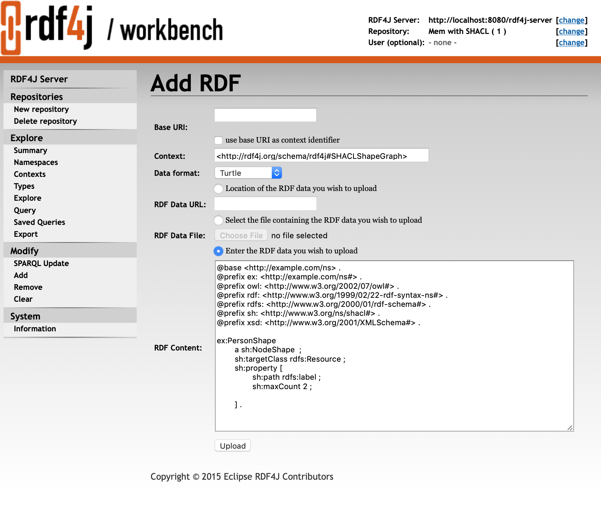
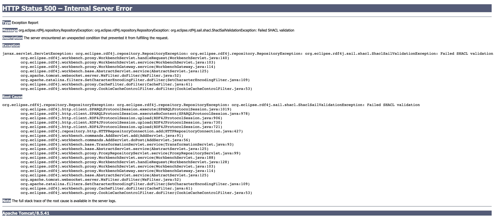

In this chapter, we explain how you can install RDF4J Server (the actual database server and SPARQL endpoint service) and RDF4J Workbench (a web-based client UI for managing databases and executing queries).
<!--more-->

# Required software

RDF4J Server and RDF4J Workbench requires the following software:

- Java 8 Runtime Environment (either [OpenJDK](https://openjdk.java.net/) or [Oracle Java](https://www.oracle.com/technetwork/java/javase/downloads/jdk8-downloads-2133151.html))
- A Java Servlet Container that supports Java Servlet API 3.1 and Java Server Pages (JSP) 2.2, or newer. 

We recommend using a recent, stable version of [Apache Tomcat](https://tomcat.apache.org/) ([version 9.0](https://tomcat.apache.org/download-90.cgi) at the time of writing).

# Deploying Server and Workbench

RDF4J Server is a database management application: it provides HTTP access to RDF4J repositories, exposing them as SPARQL endpoints. RDF4J Server is meant to be accessed by other applications. Apart from some functionality to view the server’s log messages, it doesn’t provide any user oriented functionality. Instead, the user oriented functionality is part of RDF4J Workbench. The Workbench provides a web interface for querying, updating and exploring the repositories of an RDF4J Server.

If you have not done so already, you will first need to [download the RDF4J SDK](/download). Both RDF4J Server and RDF4J Workbench can be found in the `war` directory of the SDK. The war-files in this directory need to be deployed in a Java Servlet Container. The deployment process is container-specific, please consult the documentation for your container on how to deploy a web application. For Apache Tomcat, we recommend using the [Tomcat Manager](https://tomcat.apache.org/tomcat-9.0-doc/manager-howto.html) to make deployment easier.

After you have deployed the RDF4J Workbench webapp, you should be able to access it, by default, at path `http://localhost:8080/rdf4j-workbench`. You can point your browser at this location to verify that the deployment succeeded.

## Configuring RDF4J Workbench for UTF-8 Support

### UTF-8 in the Request URI (GET)

There is a [known issue](https://github.com/eclipse/rdf4j/issues/391) affecting the proper exploring of resources that use an extended character set. Workbench client-side code generates URI’s assuming an ISO-8859-1 character encoding, and often Tomcat comes pre-configured to expect UTF-8 encoded URI’s. It will be necessary to change the HTTP Connector configuration, or to add a separate HTTP Connector that uses ISO-8859-1. For details, see the [Tomcat 8.5](https://tomcat.apache.org/tomcat-8.5-doc/config/http.html) or [Tomcat 9](https://tomcat.apache.org/tomcat-9.0-doc/config/http.html) documentation.

### UTF-8 in the Request Body (POST)

To resolve issues where the request body is not getting properly interpreted as UTF-8, it is necessary to configure Tomcat to use its built-in SetCharacterEncodingFilter. More details are available at the [Tomcat wiki](https://cwiki.apache.org/confluence/display/TOMCAT/Character+Encoding#CharacterEncoding-Q3). Un-commenting the <filter> and <filter-mapping> elements for setCharacterEncodingFilter in `$CATALINA_BASE/conf/web.xml`, and restarting the server, should be the only necessary steps.

# Application directory configuration

The RDF4J Server and Workbench store configuration files and repository data in a single directory (with subdirectories). On Windows machines, this directory is `%APPDATA%\RDF4J\` by default, where `%APPDATA%` is the application data directory of the user that runs the application. For example, in case the application runs under the ‘LocalService’ user account on Windows XP, the directory is `C:\Documents and Settings\LocalService\Application Data\RDF4J\`. On Linux/UNIX, the default location is `$HOME/.RDF4J/`, for example `/home/tomcat/.rdf4j/`. We will refer to this data directory as `[RDF4J_DATA]` in the rest of this manual.

The location of this data directory can be reconfigured using the Java system property `org.eclipse.rdf4j.appdata.basedir`. When you are using Tomcat as the servlet container then you can set this property using the `JAVA_OPTS` parameter, for example:

    set JAVA_OPTS=-Dorg.eclipse.rdf4j.appdata.basedir=\path\to\other\dir\ (on Windows)
    export JAVA_OPTS='-Dorg.eclipse.rdf4j.appdata.basedir=/path/to/other/dir/' (on Linux/UNIX)

If you are using Apache Tomcat as a Windows Service you should use the Windows Services configuration tool to set this property. Other users can either edit the Tomcat startup script or set the property some other way.

One easy way to find out what the directory is in a running instance of the RDF4J Server, is to go to http://localhost:8080/rdf4j-server/home/overview.view in your browser and click on ‘System’ in the navigation menu on the left. The data directory will be listed as one of the configuration settings of the current server.

## Repository Configuration

Each repository in RDF4J Server stores both its configuration and the actual persisted data in the application dir. The location is `[RDF4J_DATA]/server/repositories/[REPOSITORY_ID]`. The configuration is stored as a file `config.ttl` in that directory. The other files in this directory represent stored data, indexes and other files that the database needs to persist its data (in other words: best don't touch).

The easiest way to create and manage repositories on an RDF4J Server to use the [RDF4J Console](/documentation/tools/console) or RDF4J Workbench. Both offer commands to quickly create a new repository and guide you through the various configuration options. 

However, you can also directly edit the `config.ttl` of your repository to change its configuration. For example, you can use this to change the repository name as it is shown in the Workbench, or perhaps to change configuration parameters, or change the repository type. However, proceed with caution: if you make a mistake, your repository may become unreadable until after you've rectified the mistake. Also note that if you change the actual store type (e.g. switching from a memory store to a native store), it _won't_ migrate your existing data to the new store configuration!

More information can be found in the [Repository configuration and templates](/documentation/tools/repository-configuration/) section of the documentation.

## Logging Configuration

Both RDF4J Server and RDF4J Workbench use the Logback logging framework. In its default configuration, all RDF4J Server log messages are sent to the log file `[RDF4J_DATA]/Server/logs/main.log` (and log messages for the Workbench to the same file in `[RDF4J_DATA]/Workbench` ).

The default log level is INFO, indicating that only important status messages, warnings and errors are logged. The log level and -behaviour can be adjusted by modifying the `[RDF4J_DATA]/Server/conf/logback.xml` file. This file will be generated when the server is first run. Please consult the logback manual for configuration instructions.

# Access Rights and Security

It is possible to set up your RDF4J Server to authenticate named users and restrict their permissions.  RDF4J Server is a servlet-based Web application deployed to any standard servlet container (for the remainder of this section it is assumed that Tomcat is being used).

The RDF4J Server exposes its functionality using a [REST API](/documentation/rest-api) that is an extension of the SPARQL protocol for RDF. This protocol defines exactly what operations can be achieved using specific URL patterns and HTTP methods (`GET`, `POST`, `PUT`, `DELETE`). Each combination of URL pattern and HTTP method can be associated with a set of user roles, thus giving very fine-grained control.

In general, read operations are effected using `GET` and write operations using `PUT`, `POST` and `DELETE`. The exception to this is that POST is allowed for SPARQL queries. This is for practical reasons, because some HTTP servers have limits on the length of the parameter values for GET requests.

## Security constraints and roles

The association between operations and security roles is specified using security constraints in RDF4J Server’s _deployment descriptor_ - a file called `web.xml` that can be found in the `.../webapps/rdf4j-server/WEB-INF` directory. `web.xml` becomes available immediately after the installation without any security roles defined.

*Warning*: When redeployed, the `web.xml` file gets overwritten with the default version. Therefore, if you change it, make sure you create a backup. In particular, do not edit `web.xml` while Tomcat is running.

The deployment descriptor defines:

- authentication mechanism/configuration;
- security constraints in terms of operations (URL pattern plus HTTP method);
- security roles associated with security constraints.

To enable authentication, add the following XML element to `web.xml` inside the `<web-app>` element:

```xml
    <login-config>
        <auth-method>BASIC</auth-method>
        <realm-name>rdf4j</realm-name>
    </login-config>
```

Security constraints associate operations (URL pattern plus HTTP method) with security roles. Both security constraints and security roles are nested in the `<web-app>` element.

A security constraint minimally consists of a collection of web resources (defined in terms of URL patterns and HTTP methods) and an authorisation constraint (the role name that has access to the resource collection). Some example security constraints are shown below:

```xml
<security-constraint>
    <web-resource-collection>
        <web-resource-name>SPARQL query access to the 'test' repository</web-resource-name>
        <url-pattern>/repositories/test</url-pattern>
        <http-method>GET</http-method>
        <http-method>POST</http-method>
    </web-resource-collection>
    <auth-constraint>
        <role-name>viewer</role-name>
        <role-name>editor</role-name>
    </auth-constraint>
</security-constraint>

<security-constraint>
    <web-resource-collection>
        <web-resource-name>
        Read access to 'test' repository's namespaces, size, contexts, etc
        </web-resource-name>
        <url-pattern>/repositories/test/*</url-pattern>
        <http-method>GET</http-method>
</web-resource-collection>
    <auth-constraint>
        <role-name>viewer</role-name>
        <role-name>editor</role-name>
    </auth-constraint>
</security-constraint>

<security-constraint>
    <web-resource-collection>
        <web-resource-name>Write access</web-resource-name>
        <url-pattern>/repositories/test/*</url-pattern>
        <http-method>POST</http-method>
        <http-method>PUT</http-method>
        <http-method>DELETE</http-method>
    </web-resource-collection>
    <auth-constraint>
        <role-name>editor</role-name>
    </auth-constraint>
</security-constraint>
```

The ability to create and delete repositories requires access to the SYSTEM repository. An administrator security constraint for this looks like the following:

```xml
<security-constraint>
    <web-resource-collection>
        <web-resource-name>Administrator access to SYSTEM</web-resource-name>
        <url-pattern>/repositories/SYSTEM/</url-pattern>
        <url-pattern>/repositories/SYSTEM/*/</url-pattern>
        <http-method>GET</http-method>
        <http-method>POST</http-method>
        <http-method>PUT</http-method>
        <http-method>DELETE</http-method>
    </web-resource-collection>
    <auth-constraint>
        <role-name>administrator</role-name>
    </auth-constraint>
</security-constraint>
```

Also nested inside the `<web-app>` element are definitions of security roles. The format is shown by the example:

```xml
<security-role>
    <description>
        Read only access to repository data
    </description>
    <role-name>viewer</role-name>
</security-role>

<security-role>
    <description>
        Read/write access to repository data
    </description>
    <role-name>editor</role-name>
</security-role>

<security-role>
    <description>
        Full control over the repository, as well as creating/deleting repositories
    </description>
    <role-name>administrator</role-name>
</security-role>
```

## User accounts

Tomcat has a number of ways to manage user accounts. The different techniques are called 'realms' and the default one is called 'UserDatabaseRealm'. This is the simplest one to manage, but also the least secure, because usernames and passwords are stored in plain text.

For the default security realm, usernames and passwords are stored in the file `tomcat-users.xml` in the Tomcat configuration directory, usually `/etc/tomcat/tomcat-users.xml` on Linux systems. To add user accounts, add `<user>` elements inside the `<tomcat-users>` element, for example:

```xml
<user username="adam" password="secret" roles="viewer" />
<user username="eve" password="password" roles="viewer,editor,administrator" />
```

## Programmatic authentication

To use a remote repository where authentication has been enabled, it is necessary to provide the username and password to the RDF4J API. Remote repositories are usually accessed via the  class. Tell the repository manager what the security credentials are using the following method:

```java
void setUsernameAndPassword(String username, String password)
```

Alternatively, they can be passed in the factory method:

```java
static RemoteRepositoryManager getInstance(String serverURL, String username, String password)
```

# RDF4J Workbench

This chapter describes the RDF4J Workbench, a web application for interacting with RDF4J and/or other SPARQL endpoints.

This chapter will refer to URLs on a local server served from port 8080, which is possibly the most common “out-of-the-box” configuration. That is, Workbench URLs will start with `http://localhost:8080/`.

# Getting Started

To start using Workbench for the first time, point your browser to `http://localhost:8080/rdf4j-workbench`. Your browser will be automatically redirected to `http://localhost:8080/rdf4j-workbench/repositories/NONE/repositories`. This page will display all repositories in the default server, as indicated by the “default-server” property in `WEB-INF/web.xml`. Normally this is set to `/rdf4j-server`. That is, the default server for Workbench is usually the RDF4J Server instance at the path `/rdf4j-server` on the same web server. To view information about the RDF4J Server instance, click on “RDF4J Server” at the top of the side menu.

## Setting the Server, Repository and User Credentials

A “current selection” section sits at the top right in the Workbench, informing you of the URL of the server you are using, the repository you are currently using, and the user name used when accessing the server. Each of these items can be changed by clicking the “change” link immediately to the right of them. Since the Workbench is generally used for prototyping and exploration, “user” is commonly set to “none”. In this case, the Workbench is connecting to the RDF4J Server without authenticating, and below we refer to the user in this mode as the anonymous user.

## Setting the Server and User Credentials

There are two ways to reach the “Change Server” page, which allows you to enter a URL for the server and, optionally, user credentials:

1. Clicking on “change” for either the server or the user.
2. Clicking on “RDF4J Server” on the sidebar menu.

A full URL is expected in the “Change Server” field. You may enter a `file:///` URL to access a local repository on the Workbench server, but need to be sure that the Workbench server process has permission to access the given folder.

## Important Security Consideration

Workbench stores user name and password credentials in plain-text cookies in the browser. You will need to configure your Workbench server for HTTPS to properly
 protect these credentials. See the [Tomcat 8.5](https://tomcat.apache.org/tomcat-8.5-doc/ssl-howto.html) or [Tomcat 9](https://tomcat.apache.org/tomcat-9.0-doc/ssl-howto.html) SSL/TLS documentation for more information.

## Setting the Repository

There are two ways to change the current repsository:

1. Clicking on “change” for the current repository in the “current selection” section.
2. Clicking on “Repositories” in the sidebar menu.

You will be presented with a table listing of all the repositories available on the current server, with the following columns:

- Readable
- Writable
- Id
- Description
- Location

“Location” is the URL of the repository, useful for accessing it via the RDF4J REST API. “Id” is presented as a clickable hyperlink that will open that repository in the Workbench, bringing the user to a summary page for the repository.

##  Creating a Repository

Click on “New repository” in the sidebar menu. This brings up the “New Repository” page. You are presented with a simple form that provides a “Type:” selector with several repository types:

- 1-4 In Memory Stores: Simple, RDF Schema, RDF Schema and Direct Type Inferencing, or Custom Graph Query Inference
- 5-8 Native Stores: Simple, RDF Schema, RDF Schema and Direct Type Inferencing, or Custom Graph Query Inference
- 11 Remote RDF Store:	References a RDF4J repository external to the present server.
- 12 SPARQL Endpoint Proxy: References a SPARQL Endpoint (See SPARQL 1.1 Protocol).
- 1| Federation Store: Presents other stores referenced on the present server as a single federation store for querying purposes.

The “ID:” and “Title:” fields are optional in this form. Clicking “Next” brings up a form with more fields specific to the repository type selected. On that form, it will be necessary to enter something in the “ID:” field before the “Create” button may be clicked. If creation is successful, the new repository is also opened and its “Summary” page is presented.

## Modifying the Data Contents of a Repository

Data may be added to or removed from current repository using any of the sidebar menu items under “Modify”. After all successful operations, the user is presented with the repository “Summary” page.

## Add

The “Add” page allows you to specify a URL with RDF data, a local file on on your client system, or to enter serialized RDF data into its text area for loading into the present repository. It is also possible to specify the Base URI and a Context for the triples. Think of the Context as a 4th element of each RDF statement, specifying a graph within the repository. You may specify one of eight serialization formats, or select “auto-detect” to let the server do a best guess at the format.

### Remove

The “Remove Statements” page presents you with a form where you may enter values for subject, predicate, object or context. Clicking on “Remove” then removes all statements from the repository which match the given values. Leaving an item blank means that any value will match. If all values are left blank, clicking “Remove” will not do anything except present a warning message.

### Clear

The “Clear Repository” page is powerful. Leaving the lone “Context:” field blank and clicking “Clear Context(s)” will remove all statements from all graphs in the repository. It is also possible to enter a resource value corresponding to a context that exists in the repository, and the statements for that graph only will be removed.

### SPARQL Update

The “Execute SPARQL Update on Repository” page gives a text area where you enter a SPARQL 1.1 Update command. SPARQL Update is an extension to the SPARQL query language that provides full CRUD (Create Read Update Delete) capabilities. For more information see the W3C Recommendation for SPARQL 1.1 Update. Clicking “Execute” executes the specified SPARQL Update operation.

## Exploring a Repository

### Summary Page

Click on “Summary” on the sidebar menu. A simple summary is displayed with the repository’s id, description, URL for remote access and the associated server’s URL for remote access. Many operations when repositories are created and updated display this page afterwards.

### Namespaces Page

Namespace-prefix pairings can be defined within a repository, so that URIs can be displayed in shorthand form as a qualified name. To edit them, click on “Namespaces” on the sidebar menu. A page is displayed with a table of all presently defined pairs. Existing namespaces may be edited by selecting them in the drop-down list, which populates the text fields. The text fields may then be edited, and the “Update” button will make the change on the repository. The “Delete” button will remove whichever pair has been selected.

### Contexts Page

“Context” is the RDF4J construct for implementing RDF Named Graphs, which allow a repository to group data into separately addressable graphs. The Explore page always displays the context (always a URI or blank node) with each triple, the combination of which is often referred to as a quad.

To view all the contexts for the present repository, click on “Contexts” on the sidebar menu. Each context is clickable, bringing you to the “Explore” page for that context value.

### Types Page

Click on “Types” on the sidebar menu. A list of types is displayed. These types are the resulting output from this SPARQL query:

   SELECT DISTINCT ?type WHERE { ?subj a ?type }

### Explore Page

Click on “Explore” in the sidebar menu. You are presented with an “Explore” page. Type a resource value into the empty “Resource” field, and hit Enter. You will be presented with a table listing all triples where your given resource is a part of the statement, or is the context (graph) name. Currently allowable resource values are:

- URI’s enclosed in angle brackets, e.g., `<http://www.w3.org/1999/02/22-rdf-syntax-ns#type>`
- Qualified Names (qnames), e.g. rdf:type, where the prefix “rdf” is associated with the namespace “http://www.w3.org/1999/02/22-rdf-syntax-ns#” in the repository.
- Literal values with an explicit datatype or language tag, e.g., `“dog”@en` or `“hund”@de` or `“1”^^xsd:integer` or `“9.99”^^<http://www.w3.org/2001/XMLSchema#decimal>`

Data types expressed with qnames also need to have their namespace defined in the repository.

By using the “Results per page” setting and the “Previous …” and “Next …” buttons, you may page through a long set of results, or display all of the results at once. There is also a “Show data types & language tags” checkbox which, when un-checked, allows a less verbose table view.

## Querying a Repository

Clicking on “Query” on the sidebar menu brings you to Workbench’s querying interface. Here, you may enter queries in the SPARQL or SeRQL query languages, save them for future access, and execute them against your repository.

If you have executed queries previously, the query text area will show the most recently executed query. If not, it will be pre-populated with a prefix header (SPARQL) or footer (SeRQL) containing all the defined namespaces for the repository. The “Clear” button below the text area gives you the option to restore this pre-populated state for the currently selected query language.

The two other action buttons are “Save Query” and “Execute”:

- “Save Query” is only enabled when a name has been entered into the adjacent text field. Once clicked, your query is saved under the given name. An option to back out or overwrite is given if the name already exists. Saved queries are associated with the current repository and user name. If the “Save privately (do not share)” option is checked, then the saved query will only be visible to the current user.
- “Execute” attempts to execute the given query text, and then you are presented with a query results page. Values are clickable, and clicking on a value brings you to its “Explore” page. Similar display options are presented as the “Explore” page, as well.

## Working with Saved Queries

Clicking “Saved queries” on the sidebar menu brings you to the Workbench’s interface for working with previously saved queries. All saved queries accessible to the current user are listed in alphabetical order by

- the user that saved them, then
- the query name

The query name is displayed as a clickable link that will execute the query, followed by 3 buttons:

- `Show`:	Toggles the display of the query metadata and query text. When the “Save Queries” page loads, this information is not showing to conserve screen real estate.
- `Edit`: 	Brings you to the query entry page, pre-populated with the query text.
- `Delete...`: Deletes the saved query, with a confirmation dialog provided for safety. Users may only delete their own queries or queries that were saved anonymously.

The query metadata fields, aside from query name and user, are:

- Query Language: either SPARQL or SeRQL
- Include Inferred Statements: whether to use any inferencing defined on the repository to expand the result set
- Rows per page: How many results to display per page at first
- Shared: whether this query is visible to users other than the one that saved it, restricted to always be true for the “anonymous” user

Note that it is only possible to save queries as the present user. If you edit another user’s query and save it with the same query name, a new saved query will be created associated with your user name.

## Viewing all Triples and Exporting the Data

The “Export” link on the sidebar menu is convenient for bringing up a paged view of all quads in your triple store. As with other result views, resources are displayed as clickable links that bring you to that resource’s “Explore” page. In addition, it is possible to select from a number of serialization formats to download the entire contents of the triple store in:

- TriG
- BinaryRDF
- TriX
- N-Triples
- N-Quads
- N3
- RDF/XML
- RDF/JSON
- Turtle

# SHACL

NOTE: new in RDF4J 3.0

Workbench supports two SHACL wrapped stores.

 * memory-shacl
 * native-shacl

## Loading shapes

Shapes need to be loaded into the following context:

    <http://rdf4j.org/schema/rdf4j#SHACLShapeGraph>



This context is a hidden context that is only available through the following commands:

 * Add
 * Remove
 * Clear

To update your shapes you should first clear the shapes context and then add your shapes again.

## Retrieving shapes

There is no functionality in the user interface to retrieve the loaded shapes. Instead the loaded
shapes can be retrieved through the REST interface.

Assuming you are running the server and workbench locally, and the repository ID you
want to use is `1`, you can use the following URL to download your shapes as RDF-XML:
`http://localhost:8080/rdf4j-server/repositories/1/statements?context=%3Chttp%3A%2F%2Frdf4j.org%2Fschema%2Frdf4j%23SHACLShapeGraph%3E`

## Validation

All transactions are validated before being committed. A validation error when uploading data in
the workbench looks like this:



Your data will only be committed if it passes validation.

## Supported features and more info

For a list of supported features and more info on how to use SHACL - see [Programming with SHACL](/documentation/programming/shacl/).


# Federation

NOTE: new in RDF4J 3.1

RDF4J integrates federation support using the [FedX engine](/documentation/programming/federation/).

A federation can be configured from the RDF4J Workbench UI by picking the federation members. Once configured it can be used to explore or query the data of the federation members as a virtually integrated graph.


See [Federation with FedX](/documentation/programming/federation/) for more information.
