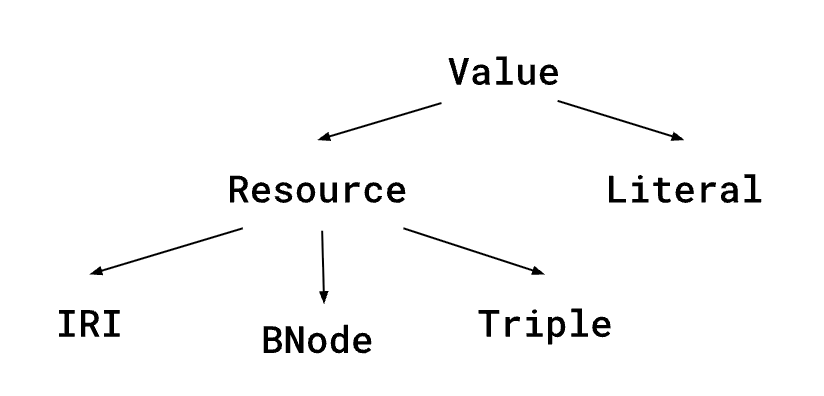
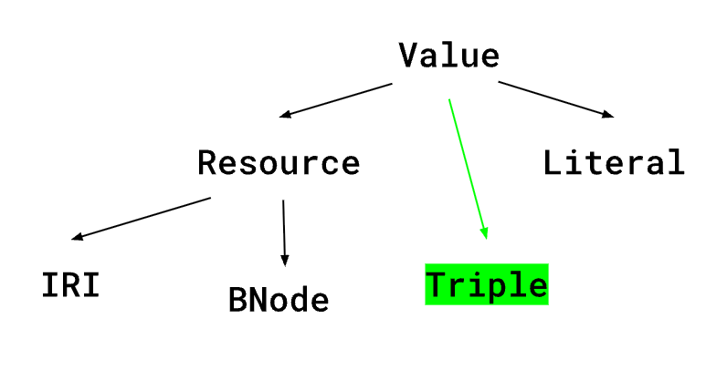
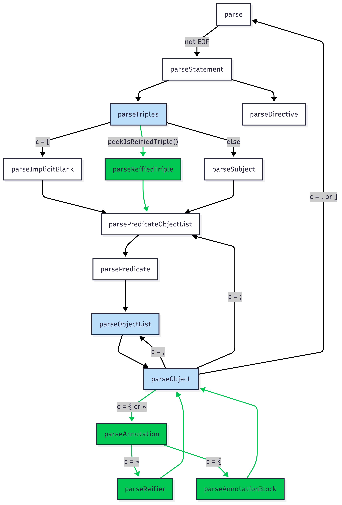
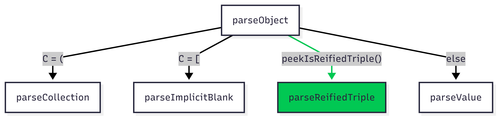

# **RDF1.2 in RDF4J Design**

Jun 27, 2025

## **Goal**

The goal of this document is to detail the approach for updating [RDF4J](https://github.com/eclipse-rdf4j/rdf4j) to handle [RDF1.2](https://www.w3.org/TR/rdf12-concepts/) data in the Turtle parser and MemoryStore.

### **Context**

The main development in RDF 1.2 is an updated data model and vocabulary for reification. Reification refers to the ability to make statements about other statements, in order to annotate a statement with metadata, or to refer to a statement without asserting its truthfulness. The [vocabulary](https://www.w3.org/TR/rdf-schema/#ch_reificationvocab) for reification in RDF1.1 was verbose and not widely adopted.

The RDF-DEV Community Group released the RDF-Star [spec](https://w3c.github.io/rdf-star/cg-spec/editors_draft.html), which provides a much simpler vocabulary for reification by adding the concept of [triple terms](https://w3c.github.io/rdf-star/cg-spec/editors_draft.html#quoted-triples) which can appear in the subject or object position. RDF4J has experimental [support](https://rdf4j.org/documentation/programming/rdfstar/) for RDF-Star. However, RDF-Star is not accepted as a W3C standard.

The RDF Working Group has now released the [Working Draft for RDF1.2](https://www.w3.org/TR/rdf12-concepts/#abstract), the new standard, which formally incorporates [triple terms](https://www.w3.org/TR/rdf12-concepts/#section-triple-terms). In RDF1.2, triple terms can only appear in the [object](https://www.w3.org/TR/rdf12-concepts/#section-triples) position, but can be indirectly referenced in either the subject or object position through the use of [reifiers](https://www.w3.org/TR/rdf12-concepts/#dfn-reifying-triple). RDF1.2 also includes other updates including adding [language direction](https://www.w3.org/TR/rdf12-concepts/#dfn-base-direction), RDF [version announcement](https://www.w3.org/TR/rdf12-concepts/#section-version-announcement), and [new literal types](https://www.w3.org/TR/rdf12-concepts/#section-additional-datatypes) of HTML, XML, and JSON.

The Github discussion on adding RDF1.2 support can be found [here](https://github.com/eclipse-rdf4j/rdf4j/issues/5327).

### **Acceptance Criteria**

* Parse Turtle1.2 data according to the process detailed in the [spec](https://www.w3.org/TR/rdf12-turtle/#sec-parsing)
* Serialize data to Turtle1.2
* Support statements with triple terms in the object position in the MemoryStore
* Support JSON datatype, directed language literals, and version announcement

### **Considered Out of Scope For Now**

* Parsing and serializing [N-Triples](https://www.w3.org/TR/rdf12-n-triples/), [N-Quads](https://www.w3.org/TR/rdf12-n-quads/), [TriG](https://www.w3.org/TR/rdf12-trig/)
* [SPARQL1.2](https://w3c.github.io/sparql-concepts/spec/) query evaluation
* Support for triple terms in NativeStore and LMDBStore

## **MemoryStore Implementation for Triple Terms**

The MemoryStore is built around Lists of Statements, which contain a subject of type Resource, a predicate of type IRI, and an object of type Value.

The Triple interface and its implementations were created to represent RDF-Star triple terms. Similar to Statements, Triples contain a subject of type Resource, a predicate of type IRI, and an object of type Value.

The current inheritance hierarchy for RDF values is as follows:

With this hierarchy, since Triple inherits from Resource, it can appear in the subject or object position of a Statement or Triple.

The only structural change to how triple terms are used in RDF 1.2 versus RDF-Star is that they are restricted to appearing only in the object position, not the subject position. The Triple interface itself, and its implementations, are otherwise accurate to the RDF1.2 data model.

To restrict triple terms to appearing only in the object position, the Triple interface should extend Value and not Resource. Since the subject of a triple or statement is a Resource, and the object a Value, a Triple will only be able to occupy the object position.

## **Language Direction**

RDF1.2 allows for language-tagged string literals to optionally be tagged with a [base direction](https://www.w3.org/TR/rdf12-concepts/#dfn-base-direction), either `rtl` (right to left) or `ltr` (left to right). String literals that specify a language and base direction have datatype `rdf:dirLangString`. The definition of [literal equality](https://www.w3.org/TR/rdf12-concepts/#dfn-literal-term-equality) is also extended to state that two literals are equal if and only if their base directions are both absent, both `ltr`, or both `rtl`.

In Turtle, TriG, N-Triples, and N-Quads, the syntax is as follows:

    ex:NYC ex:localName “New York City”@en--ltr ;
           ex:localName “עיר ניו יורק”@he--rtl .

The `rdf:dirLangString` datatype must be added to the CoreDatatype class under the RDF namespace, and to the RDF vocabulary.

The isLanguageLiteral method in Literals.java should be updated to return true if the input has a datatype of either `rdf:dirLangString` or `rdf:langString`.

The base direction can be stored as an additional attribute in Literal implementations. We can define an enum for `BaseDirection` which can be equal to `LTR`, `RTL`, or `NONE`. Any implementations that store the language attribute should be updated to also store the base direction. Additional constructors and ValueFactory methods for creating literals should be updated to have overloaded forms that accept a `BaseDirection`. Existing constructors or factory methods for language literals that do not accept a base direction should set the `baseDirection` attribute to `BaseDirection.NONE`.

To retrieve the base direction, a new method `getBaseDirection()` should be added to the Literal interface, and implemented in all Literal classes that store a base direction. The default implementation should return `BaseDirection.NONE`, and the implementations that store a base direction should return the stored value.

## **Additional Datatypes**

RDF1.2 defines JSON as a recognized datatype for literals, with IRI:

[http://www.w3.org/1999/02/22-rdf-syntax-ns\#JSON](http://www.w3.org/1999/02/22-rdf-syntax-ns#HTML) `(rdf:JSON)`

The IRI for `rdf:JSON` needs to be added to the RDF vocabulary and to the RDF enum implementation of CoreDatatype. This will make it an assignable datatype in the TypedLiteral and MemLiteral classes, used by the Turtle parser and MemoryStore.

In the RDFDatatypeHandler class, the isRecognizedDatatype must also be updated to recognize `rdf:JSON`.

## **Turtle Parser**

### **Triple Terms & Reification Syntax**

Turtle 1.2 defines new [syntax](https://www.w3.org/TR/rdf12-turtle/#triple-terms) for [triple terms](https://www.w3.org/TR/rdf12-concepts/#section-triple-terms), which can appear only in the object position of a statement. Statements with a triple term as object should only use `rdf:reifies` as predicate.

    _:b rdf:reifies <<( ex:subject ex:predicate ex:object )>> .

A triple with `rdf:reifies` as predicate and a triple term as object is called a “reifying triple.” The subject of such a triple, called the [reifier](https://www.w3.org/TR/rdf12-concepts/#section-triple-terms-reification), can then be used to represent the triple term in other statements:

    _:b ex:accordingTo ex:Alice ;
        ex:certainty 0.9 .

In a graph with these three triples, the statement `ex:subject ex:predicate ex:object .` is not actually asserted in the graph. For it to be asserted, it would have to appear directly as a triple in the document, not just as a triple term.

Turtle 1.2 defines multiple forms of syntactic sugar for reification.

To avoid writing out the reifying triple and referring to the triple term through the reifier, the following [reifiedTriple](https://www.w3.org/TR/rdf12-turtle/#reifying-triples) syntax can be used:

    << ex:subject ex:predicate ex:object >> ex:accordingTo ex:Alice ;
                                            ex:certainty 0.9 .

Internally in the parser, this expands to the three triples written above, using a freshly generated blank node as the reifier.

To both use a triple as a triple term and assert it in the graph, the following [annotation](https://www.w3.org/TR/rdf12-turtle/#annotation-syntax) syntax can be used:

    ex:subject ex:predicate ex:object {| ex:accordingTo ex:Alice ;
                                         ex:certainty 0.9 |} .

Internally, the parser expands this to the three triples written above, plus a fourth triple which directly asserts the triple term `ex:subject ex:predicate ex:object .`

Finally, Turtle 1.2 defines syntax to specify the reifier in the reifiedTriple and annotation syntax, rather than implicitly using an autogenerated blank node. The specified reifier can be either a blank node or IRI:

    ex:Alice ex:knows << ex:subject ex:predicate ex:object ~ ex:sampleIRI >> .
    ex:subject ex:predicate ex:object ~ _:bnodeID {| ex:accordingTo ex:Bob |} .

These statements expand in the same way described above, but using the given reifier rather than a newly generated blank node.

##

### **Parser State**

The current Turtle parser maintains several pieces of state during parsing to keep track of RDF terms, including variables to track the current subject, predicate, and object.

The Turtle 1.2 spec describes additional pieces of [state](https://www.w3.org/TR/rdf12-turtle/#sec-parsing-state) that need to be maintained for processing triple terms:

* currReifier
* currTripleTerm

These variables need to be added as member variables to TurtleParser so that they can be read and modified during parsing.

### **Parser Control Flow**

The following diagram is a simplified view of the control flow for the Turtle 1.2 Parser (implemented in TurtleParser.java). Methods in green are new methods needed to handle Turtle 1.2 reification syntax. Methods in blue are existing parser methods that need modifications to handle Turtle1.2 reification syntax. New methods and modifications are explained in further detail below.

### **Modifications to Existing Methods in TurtleParser.java**

**parseTriples()**

The parseTriples function handles the triples production in the Turtle 1.2 grammar:

    triples ::= (subject predicateObjectList) | (blankNodePropertyList predicateObjectList?) | (reifiedTriple predicateObjectList?)

To handle the new form of `reifiedTriple predicateObjectList?`, a new case needs to be added in parseTriples which checks peekIsReifiedTriple, and calls parseReifiedTriple when it returns true. After parsing the reifiedTriple, parseTriples should then call parsePredicateObjectList if the end of the statement has not yet been reached.

**parseObjectList()**

The parseObjectList method must handle parsing comma-separated objects followed by one or more annotations:

    objectList ::= object annotation (',' object annotation)*
    annotation ::= (reifier | annotationBlock)*

Turtle 1.2 allows two types of annotations: the [reifier](https://www.w3.org/TR/rdf12-turtle/#grammar-production-reifier) production or the [annotationBlock](https://www.w3.org/TR/rdf12-turtle/#grammar-production-annotationBlock) production. The RDF-Star implementation checks only for the annotationBlock production. parseObjectList should check for both `{` and `~`, and call parseAnnotation when either is seen.

**parseObject()**

parseObject handles the object production in the Turtle 1.2 grammar:

    object ::= iri | BlankNode | collection | blankNodePropertyList | literal | tripleTerm | reifiedTriple

The control flow of parseObject should be updated according to the following diagram:

An extra check needs to be added by calling peekIsReifiedTriple to determine if a reifiedTriple production is present, and if so calling parseReifiedTriple.

**parseValue()**

parseValue handles parsing IRIs, blank node identifiers, literals, and triple terms. To update parseValue to handle RDF 1.2 triple terms rather than RDF-Star triples, we need to change the initial check that peeks for an RDF-Star triple to peekIsTripleTerm, and to call parseTripleTerm when an RDF 1.2 triple term is peeked.

##

### **New Methods needed in TurtleParser.java**

**peekIsTripleTerm()**

Looks ahead at next three characters and returns true if they equal `<<(`.

**peekIsReifiedTriple()**

Looks ahead at next three characters and returns true if the first two equal `<<` and the third does not equal `(`.

**parseTripleTerm()**

The implementation of parseTripleTerm should be very similar to the existing parseTripleValue method in the RDF-Star Turtle parser. At the start and end, we need to read in `<<(` and `)>>`, rather than only `<<` and `>>`. Otherwise, the logic for reading in the triple term subject, predicate, and object is already present and handles the appropriate type checking.

**parseReifiedTriple()**

parseReifiedTriple will handle parsing the reifiedTriple production:

    reifiedTriple ::= '<<' rtSubject verb rtObject reifier? '>>'
    rtSubject     ::= iri | BlankNode | reifiedTriple
    rtObject      ::= iri | BlankNode | literal | tripleTerm | reifiedTriple

The Turtle 1.2 spec outlines the [steps](https://www.w3.org/TR/rdf12-turtle/#reifiedTriple):

1. Record the current value of state variable currTripleTerm
2. Parse subject, object, and predicate of the reifiedTriple
    1. For subject and object, call peekIsReifiedTriple and recursively parse the term if it returns true, otherwise parse by calling parseValue
    2. Parse predicate by calling parsePredicate
3. Create a new Triple object with the parsed subject, object, and predicate
4. Assign the new Triple to currTripleTerm
5. Create reifier
    1. If `~` is read next, call parseReifier
    2. Otherwise, generate a fresh blank node
6. Call addReifyingTriple with the reifier from the previous step to add the reifying triple to the model
7. Restore original value of currTripleTerm
8. Return the value of currReifier (which is set in addReifyingTriple)

**parseReifier()**

parseReifier is called either from parseReifiedTriple or parseAnnotation, when `~` is seen inside a reifiedTriple or after an object.

1. Peek ahead to next character to see if it is a valid start char for a blank node or IRI
2. If so, parse using parseValue. Check that the return value is a Resource (blank node or IRI), and return the value if valid, otherwise error
3. Otherwise, create and return a fresh blank node

**addReifyingTriple(Resource reifier)**

addReifyingTriple handles adding a reifying triple for the currTripleTerm to the model. It should first set currReifier to the reifier parameter, then add the triple `currReifier rdf:reifies currTripleTerm` to the model.

**parseAnnotation()**

parseAnnotation is called from parseObjectList and handles one or more annotations following an object, following the steps in the [spec](https://www.w3.org/TR/rdf12-turtle/#annotation). An annotation can either be a reifier, or an annotationBlock which contains a predicateObjectList of annotations on the original triple. Multiple annotations can follow an object, so parseAnnotation parses annotations in a loop while the annotation starting characters `{` or `~` are next.

1. Save the current values of the subject and predicate state variables.

2. Create a TripleTerm object with the current values of subject, predicate, and object, and set currTripleTerm to this object.

3. While the next char is `{` or `~`, call either parseAnnotationBlock or parseReifier/addReifyingTriple.

4. Restore the saved values of subject and predicate.

**parseAnnotationBlock()**

parseAnnotationBlock handles annotation blocks of the form `{| predicateObjectList |}` following a complete triple, according to the steps in the [spec](https://www.w3.org/TR/rdf12-turtle/#annotationBlock).

1. Save the current value of currTripleTerm. If currReifier is null, generate a fresh blank node and call addReifyingTriple.

2. Set the subject state variable to the value of currReifier, and call parsePredicateObjectList (which will parse the annotations and add statements to the model, with the subject being the reifier for the original triple).

3. Set currReifier to null and restore the value of currTripleTerm.

##

### **Language Direction**

Since dashes and letters are valid language tag characters, no changes are needed in the parseQuotedLiteral method in TurtleParser. The existing implementation will read in the base direction, if present, as part of the language tag.

Once parsed, the quoted string and language tag are passed to the createLiteral method in RDFParserHelper, which handles data verification and creating a new Literal object.

Before the language tag is passed to the LanguageHandlers to test if it is a recognized language, it should first be stripped of `--ltr` or `--rtl`, if either is present at the end of the language tag. Then, the language and base direction can be validated and sent to a factory method to construct the literal.

##

### **Additional Literal Datatypes**

Processing the JSON datatype should work the same as processing existing types, once the IRI is added to the CoreDatatype class, the RDF vocabulary, and the RDFDatatypeHandler.

##

### **Version Announcement**

RDF 1.2 encourages Turtle documents using RDF 1.2 syntax to announce their version using the `@version` or `VERSION` directive, so that parsers not supporting RDF 1.2 can fail as early as possible. Documents that use RDF 1.2 triple terms should notate version `“1.2”`, and documents that use RDF 1.2 syntax not including triple terms should notate version `“1.2-basic”`. Our Turtle parser will support all RDF 1.2 syntax, we can safely ignore this directive if seen. Since it is an optional directive, the parser should not throw any error if it is not seen.

Two modifications are needed to the TurtleParser class:

* In the parseStatement method, add “version” to the list of strings matched against to determine if the term is a directive
* In the parseDirective method, add another case for the version directive that takes no action but prevents execution from falling through to the error cases

## **Turtle Writer**

### **Triple Terms**

The only update needed from the Turtle-Star writer is to print triple terms wrapped with `<<( ... )>>` rather than `<< ... >>`.

### **Language Direction**

The `writeLiteral` method in the TurtleWriter should be updated to print the string form of the base direction after the language tag.

### **Additional Literal Datatypes**

No new functionality is needed to update the Turtle writer to handle the JSON datatype. The current behavior already handles printing the datatype IRI for any non-string literals.

### **Version Announcement**

It is impossible to print the version at the top of the document before looking at the contents of the triples to determine if RDF 1.2 features are used, and the statements can only be iterated through once. Version announcement thus needs to happen at the earliest possible moment, even if in the middle of the document (which is legal under the Turtle grammar).

The Turtle Writer has two modes: buffering statements within a certain buffer size then processing the buffer, or writing statements individually.

1. In buffering mode, the writer should check if any triple terms or dirLangStrings are present in the buffered statements before processing the buffer. If any such statements are detected, the writer should output `VERSION "1.2"` before the statements.
2. In non-buffering mode, the writer should check each statement as it is written. If a triple term or dirLangString is detected, the writer should output `VERSION "1.2"` before writing the statements.

## **Testing**

The W3C RDF Working Group provides a comprehensive [Turtle test suite](https://w3c.github.io/rdf-tests/rdf/rdf12/rdf-turtle/) covering RDF 1.2 and RDF 1.1 features.

RDF 1.2 is backwards compatible with RDF 1.1, so the existing tests in RDF4J can be reused. Additionally, since Turtle 1.2 syntax is consistent with RDF-Star (although the internal data model is different), we can reuse the RDF4J RDF-Star tests with some modifications to the testing code.

For end to end testing, while SPARQL 1.2 will not yet be implemented, MemoryStore can still be tested using the getStatements and hasStatements methods.

## **Notes and Further Questions**

* Implementing parsing and serialization of N-Triples, N-Quads, and TriG should follow easily from the implementations described for the Turtle parser and writer

* The proposed implementation of language direction will break the current implementation of the SPARQL LANG function for literals that include a base direction.

* For directed language strings, should the base direction be stored as part of the language tag string, or as a separate variable?

    * If it is stored as a separate variable, retrieval is easier for operations like the SPARQL LANG, LANGDIR, hasLANGDIR functions, but requires concatenation when the literal is cast to string

    * If it is stored in the language tag, there is less overhead when casting to string or evaluating literal equality, but extra string parsing is needed to retrieve the language or base direction separately

* Should we add this under a new package name? If so, what should it be?
    * Should we change the RDFStar package or start a new package?
